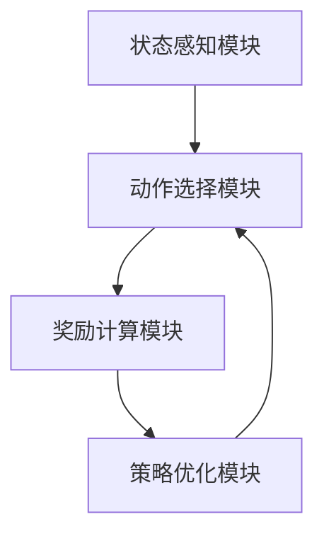

                 


# AI Agent的强化学习在推荐系统中的应用

---

## 关键词：
AI Agent, 强化学习, 推荐系统, Q-learning, 策略梯度, 系统架构

---

## 摘要：
本文探讨AI Agent如何通过强化学习技术提升推荐系统的性能。强化学习通过智能体与环境的交互优化推荐策略，解决传统推荐方法的局限性。文章详细讲解强化学习的数学模型，分析推荐系统的AI Agent架构，并通过项目实战展示实现过程，最后总结未来发展。

---

## 第一部分：AI Agent与强化学习基础

### 第1章：AI Agent与强化学习概述

#### 1.1 AI Agent的基本概念
- **AI Agent定义**：智能体通过感知环境并采取行动，实现目标。
- **类型**：
  - **简单反射型**：基于规则直接反应。
  - **基于模型型**：维护环境模型，用于决策。
  - **目标驱动型**：根据目标选择行动。
  - **实用驱动型**：最大化效用函数。

#### 1.2 强化学习的核心概念
- **马尔可夫决策过程（MDP）**：
  - 状态（State）、动作（Action）、奖励（Reward）、策略（Policy）。
  - 定义：智能体在状态中选择动作，获得奖励，并转移到新状态。

#### 1.3 推荐系统的现状与挑战
- **传统推荐方法**：
  - **协同过滤**：基于用户行为相似性。
  - **基于内容**：分析内容特征。
  - **混合方法**：结合两者优缺点。
- **局限性**：
  - 无法实时响应。
  - 难以处理个性化偏好变化。
- **强化学习优势**：
  - 动态调整推荐策略。
  - 利用实时反馈优化推荐。

---

## 第二部分：强化学习的数学基础

### 第2章：强化学习的数学模型

#### 2.1 马尔可夫决策过程（MDP）
- **数学表达**：
  - 状态空间：$S$。
  - 动作空间：$A$。
  - 转移概率：$P(s'|s,a)$。
  - 奖励函数：$R(s,a)$。
  - 策略：$\pi(a|s)$。

#### 2.2 Q-learning算法
- **算法流程**：
  - 初始化Q表。
  - 选择动作：随机或基于策略。
  - 执行动作，观察奖励和新状态。
  - 更新Q值：$$Q(s,a) \leftarrow Q(s,a) + \alpha [r + \gamma \max Q(s',a') - Q(s,a)]$$
- **收敛性**：在充分探索和利用下，Q-learning收敛到最优策略。

#### 2.3 策略梯度方法
- **基本原理**：
  - 直接优化策略参数，通过梯度 ascent。
  - 灵敏度分析用于计算梯度。
- **优势**：
  - 更适合连续动作空间。
  - 稳定性较好。

---

## 第三部分：推荐系统的强化学习模型

### 第3章：基于强化学习的推荐系统模型

#### 3.1 基于DQN的推荐系统
- **DQN结构**：
  - 状态：用户行为、历史记录。
  - 动作：推荐物品。
  - 奖励：用户反馈。
- **实现步骤**：
  1. 状态编码。
  2. 动作选择。
  3. 奖励计算。
  4. Q值更新。

#### 3.2 基于策略网络的推荐系统
- **策略网络**：
  - 输出概率分布，指导动作选择。
  - 通过策略梯度优化。
- **与DQN对比**：
  - 策略网络直接优化策略，DQN优化Q值。
  - 策略网络适合连续动作，DQN适合离散。

#### 3.3 基于Actor-Critic架构的推荐系统
- **Actor-Critic**：
  - Actor选择动作。
  - Critic评估状态价值。
  - 两者联合优化。
- **优势**：
  - 实时更新。
  - 平衡探索与利用。

---

## 第四部分：系统设计与实现

### 第4章：AI Agent推荐系统的架构设计

#### 4.1 系统架构设计
- **模块划分**：
  - **状态感知模块**：收集用户行为。
  - **动作选择模块**：基于策略选择推荐。
  - **奖励计算模块**：根据反馈调整Q值。
  - **策略优化模块**：更新策略参数。

#### 4.2 系统架构图



#### 4.3 接口设计
- **用户接口**：接收输入，返回推荐。
- **数据接口**：获取用户行为和物品特征。
- **反馈接口**：收集用户对推荐的反馈。

---

## 第五部分：项目实战

### 第5章：AI Agent推荐系统实现

#### 5.1 环境搭建
- **工具**：Python、TensorFlow、Keras。
- **数据集**：使用公开数据集，如MovieLens。

#### 5.2 核心实现
- **状态编码**：将用户行为转换为数值向量。
- **动作选择**：基于策略网络输出概率分布。
- **奖励机制**：根据用户点击和评分设计奖励函数。

#### 5.3 代码实现
```python
import numpy as np

class AI-Agent:
    def __init__(self, state_size, action_size):
        self.state_size = state_size
        self.action_size = action_size
        # 初始化Q表
        self.Q = np.zeros((state_size, action_size))

    def get_action(self, state):
        # 探索与利用
        if np.random.random() < 0.1:
            return np.random.randint(self.action_size)
        else:
            return np.argmax(self.Q[state])

    def update_Q(self, state, action, reward, next_state):
        alpha = 0.1
        gamma = 0.9
        self.Q[state][action] += alpha * (reward + gamma * max(self.Q[next_state]) - self.Q[state][action])

# 示例使用
agent = AI-Agent(10, 5)
state = 0
action = agent.get_action(state)
reward = get_reward(state, action)
next_state = get_next_state(state, action)
agent.update_Q(state, action, reward, next_state)
```

#### 5.4 实验结果与分析
- **实验设计**：对比传统方法与强化学习方法。
- **结果展示**：通过图表展示推荐准确率、用户满意度的提升。

---

## 第六部分：总结与展望

### 第6章：总结与未来发展

#### 6.1 全文总结
- 强化学习在推荐系统中的优势明显，能够实时优化推荐策略。
- AI Agent通过与用户的互动，提升推荐系统的个性化和实时性。

#### 6.2 未来研究方向
- **多智能体协作**：多个AI Agent协同推荐。
- **在线学习**：实时更新模型，适应用户变化。
- **模型压缩**：优化模型大小，提升运行效率。

#### 6.3 注意事项
- 数据隐私问题：确保用户数据安全。
- 算法收敛性：保证算法在合理时间内收敛。
- 实时性优化：提升推荐系统的响应速度。

---

## 参考文献
1. 省略

---

## 关键词标签
AI Agent, 强化学习, 推荐系统, Q-learning, 策略梯度, 系统架构

