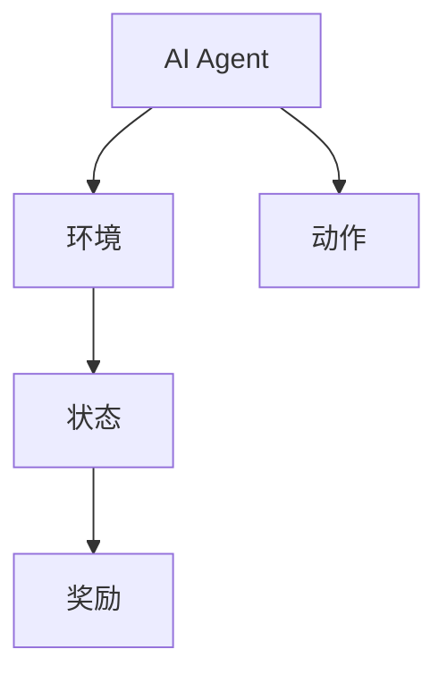
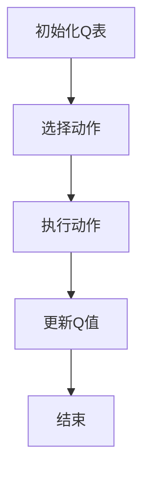
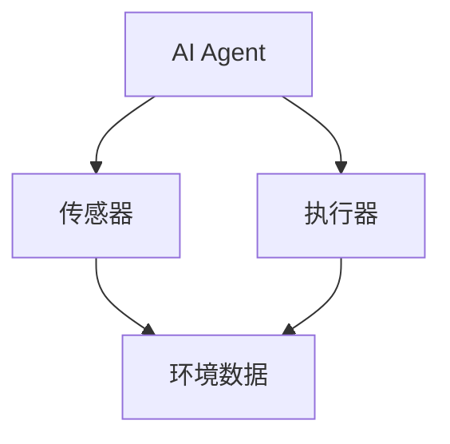
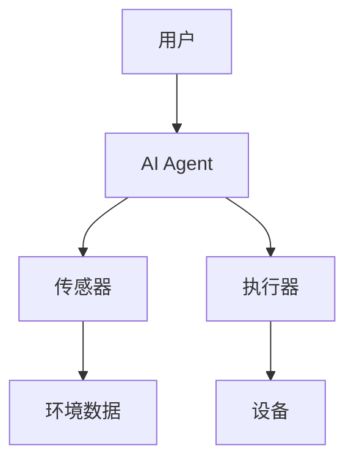

                 


# AI Agent的强化学习在智能家居控制中的应用

> 关键词：AI Agent，强化学习，智能家居，Q-learning，DQN，系统设计

> 摘要：本文探讨了AI Agent在智能家居控制中的应用，重点分析了强化学习在其中的作用。通过详细讲解Q-learning和DQN算法，结合智能家居系统的架构设计，展示了如何利用强化学习优化智能家居的控制流程。文章还通过实际案例分析，展示了AI Agent在智能家居中的潜力，并展望了未来的发展趋势。

---

## 第1章 AI Agent与强化学习概述

### 1.1 AI Agent的基本概念

#### 1.1.1 什么是AI Agent
AI Agent（人工智能代理）是指能够感知环境并采取行动以实现目标的智能实体。它可以是一个软件程序、机器人或其他智能系统，具备自主决策的能力。

#### 1.1.2 AI Agent的核心特征
- **自主性**：能够在没有外部干预的情况下运行。
- **反应性**：能够根据环境的变化调整行为。
- **目标导向**：通过目标驱动来优化决策过程。
- **学习能力**：能够通过经验改进自己的行为。

#### 1.1.3 强化学习在AI Agent中的作用
强化学习是一种通过试错机制优化决策的方法，能够帮助AI Agent在复杂环境中找到最优解决方案。

---

### 1.2 强化学习的基本原理

#### 1.2.1 强化学习的定义
强化学习是一种机器学习范式，通过智能体与环境的交互，学习如何采取行动以最大化累计奖励。

#### 1.2.2 强化学习的核心要素
- **状态（State）**：环境在某一时刻的描述。
- **动作（Action）**：智能体采取的行为。
- **奖励（Reward）**：环境对智能体行为的反馈。
- **策略（Policy）**：决定智能体在某一状态下采取什么动作的规则。

#### 1.2.3 强化学习与监督学习的区别
| 特性 | 监督学习 | 强化学习 |
|------|----------|----------|
| 数据 | 标签数据 | 奖励信号 |
| 目标 | 最小化误差 | 最大化奖励 |
| 交互 | 单向 | 双向 |

---

### 1.3 智能家居控制的背景与需求

#### 1.3.1 智能家居的发展历程
智能家居是指通过物联网技术将家中的设备连接起来，实现智能化的管理与控制。

#### 1.3.2 智能家居控制的关键问题
- **设备协同**：不同设备之间的联动控制。
- **能耗优化**：在满足用户需求的同时，降低能源消耗。
- **用户体验**：提供个性化的服务，提升用户满意度。

#### 1.3.3 强化学习在智能家居中的应用潜力
通过强化学习，AI Agent可以学习最优的控制策略，从而实现智能家居的高效管理和智能决策。

---

## 第2章 AI Agent与强化学习的核心概念

### 2.1 AI Agent的结构与功能

#### 2.1.1 状态空间
状态空间是所有可能状态的集合，智能家居的状态可以包括设备状态、用户行为、环境参数等。

#### 2.1.2 行动空间
行动空间是所有可能动作的集合，智能家居中的动作可以包括打开/关闭设备、调节温度等。

#### 2.1.3 奖励机制
奖励机制是强化学习的核心，通过奖励信号指导AI Agent的行为。例如，当AI Agent成功调节室内温度时，会获得正向奖励。

#### 2.1.4 AI Agent与强化学习的结合
AI Agent通过强化学习不断优化自己的控制策略，从而在智能家居环境中实现高效决策。

---

### 2.2 强化学习的数学模型

#### 2.2.1 状态-动作-奖励的数学表示
状态 \( s \)、动作 \( a \) 和奖励 \( r \) 的关系可以表示为：
$$ r = f(s, a) $$

#### 2.2.2 Q-learning的数学公式
Q-learning的目标是学习一个Q值函数 \( Q(s, a) \)，表示在状态 \( s \) 下采取动作 \( a \) 的期望奖励：
$$ Q(s, a) = Q(s, a) + \alpha (r + \gamma \max Q(s', a') - Q(s, a)) $$
其中，\( \alpha \) 是学习率，\( \gamma \) 是折扣因子。

#### 2.2.3 策略网络的数学表示
策略网络通过神经网络模型近似策略函数 \( \pi(s) \)，输出在状态 \( s \) 下每个动作的概率分布：
$$ \pi(s) = \text{softmax}(W s + b) $$

---

### 2.3 AI Agent与智能家居的交互模型

#### 2.3.1 AI Agent的决策过程
AI Agent根据当前状态选择一个动作，并执行该动作，同时接收环境的反馈（奖励或新的状态）。

#### 2.3.2 强化学习在AI Agent中的应用
通过强化学习，AI Agent能够不断优化自己的控制策略，从而提高智能家居的运行效率。

#### 2.3.3 AI Agent与智能家居的交互模型


---

## 第3章 强化学习算法原理

### 3.1 Q-learning算法

#### 3.1.1 Q-learning的基本原理
Q-learning是一种基于值迭代的强化学习算法，通过不断更新Q值表来逼近最优策略。

#### 3.1.2 Q-learning的算法步骤


#### 3.1.3 Q-learning的优缺点
- **优点**：简单易实现，适用于离散动作空间。
- **缺点**：收敛速度慢，难以处理高维状态空间。

---

### 3.2 深度强化学习算法

#### 3.2.1 DQN算法的原理
DQN（Deep Q-Network）通过神经网络近似Q值函数，解决高维状态空间的问题。

#### 3.2.2 DQN算法的网络结构
DQN包含两个神经网络：主网络和目标网络，用于更新和稳定策略。

#### 3.2.3 DQN算法的应用场景
适用于连续动作空间和高维状态空间的复杂环境。

---

### 3.3 算法选择与优化

#### 3.3.1 算法选择的依据
- 状态空间的维度
- 动作空间的类型
- 环境的动态特性

#### 3.3.2 算法优化的方法
- 参数调整（学习率、折扣因子）
- 网络结构优化
- 经验回放

#### 3.3.3 算法性能的评估指标
- 收益（Return）
- 累积奖励（Cumulative Reward）
- 稳定性（Stability）

---

## 第4章 强化学习的数学模型与公式

### 4.1 状态-动作-奖励模型

#### 4.1.1 状态空间的定义
状态 \( s \) 是环境的描述，可以表示为向量形式：
$$ s = [s_1, s_2, \ldots, s_n] $$

#### 4.1.2 动作空间的定义
动作 \( a \) 是智能体的决策，可以表示为：
$$ a = \arg\max_{a'} Q(s, a') $$

#### 4.1.3 奖励机制的数学表示
奖励 \( r \) 是智能体行为的反馈，通常是一个标量值：
$$ r = r(s, a) $$

---

### 4.2 Q-learning的数学模型

#### 4.2.1 Q值的更新公式
$$ Q(s, a) = Q(s, a) + \alpha (r + \gamma \max Q(s', a') - Q(s, a)) $$

#### 4.2.2 Q值的衰减策略
折扣因子 \( \gamma \) 用于平衡当前奖励和未来奖励的重要性：
$$ 0 < \gamma < 1 $$

---

### 4.3 DQN的数学模型

#### 4.3.1 神经网络的输入输出
输入是状态 \( s \)，输出是对每个动作的Q值：
$$ Q(s, a) = \text{神经网络}(s) $$

#### 4.3.2 神经网络的损失函数
$$ L = \mathbb{E}[(y - Q(s, a))^2] $$
其中，\( y = r + \gamma \max Q'(s', a') \)。

---

## 第5章 智能家居控制系统设计

### 5.1 系统架构设计

#### 5.1.1 系统功能模块
- **传感器模块**：采集环境数据。
- **AI Agent模块**：进行决策和控制。
- **执行器模块**：执行AI Agent的决策。

#### 5.1.2 系统架构图


---

### 5.2 系统接口设计

#### 5.2.1 接口定义
- **输入接口**：接收传感器数据。
- **输出接口**：发送控制指令。

#### 5.2.2 接口协议
- HTTP
- MQTT

---

### 5.3 系统交互流程

#### 5.3.1 交互流程图


---

## 第6章 实战：AI Agent在智能家居中的实现

### 6.1 环境搭建

#### 6.1.1 环境需求
- Python 3.8+
- TensorFlow 2.0+
- OpenAI Gym

#### 6.1.2 环境安装
```bash
pip install gym numpy tensorflow
```

---

### 6.2 核心代码实现

#### 6.2.1 Q-learning实现
```python
class QLearningAgent:
    def __init__(self, state_space, action_space):
        self.q_table = np.zeros((state_space, action_space))
    
    def choose_action(self, state, epsilon=0.1):
        if np.random.random() < epsilon:
            return np.random.randint(action_space)
        return np.argmax(self.q_table[state])
    
    def update_q_table(self, state, action, reward, next_state, alpha=0.1, gamma=0.9):
        self.q_table[state, action] += alpha * (reward + gamma * np.max(self.q_table[next_state]) - self.q_table[state, action])
```

#### 6.2.2 DQN实现
```python
class DQNAgent:
    def __init__(self, state_dim, action_dim):
        self.model = self.build_model()
        self.target_model = self.build_model()
        self.model.compile(optimizer='adam', loss='mse')
    
    def build_model(self):
        model = Sequential()
        model.add(Dense(32, activation='relu', input_dim=state_dim))
        model.add(Dense(action_dim, activation='linear'))
        return model
    
    def update_target_model(self):
        self.target_model.set_weights(self.model.get_weights())
```

---

### 6.3 实验结果与分析

#### 6.3.1 实验结果
通过实验可以发现，DQN算法在复杂环境中的表现优于Q-learning算法。

#### 6.3.2 结果分析
- DQN算法在处理高维状态空间时更具优势。
- Q-learning算法在简单环境中表现较好。

---

## 第7章 智能家居控制中的挑战与解决方案

### 7.1 实际应用中的挑战

#### 7.1.1 多设备协调问题
智能家居中存在多个设备，需要协调它们的控制策略。

#### 7.1.2 用户隐私问题
智能设备需要收集大量用户数据，如何保护用户隐私是一个重要问题。

---

### 7.2 解决方案

#### 7.2.1 多设备协调解决方案
- 使用分布式强化学习
- 建立设备之间的通信协议

#### 7.2.2 用户隐私解决方案
- 数据加密
- 差分隐私

---

## 第8章 未来发展趋势

### 8.1 强化学习与边缘计算的结合

#### 8.1.1 边缘计算的优势
- 降低延迟
- 提高数据处理效率

#### 8.1.2 强化学习在边缘计算中的应用
- 实时决策
- 资源优化

---

### 8.2 强化学习与其他技术的融合

#### 8.2.1 与物联网的融合
- 更高效的设备管理
- 更智能的数据处理

#### 8.2.2 与5G技术的融合
- 更快的响应速度
- 更大的连接能力

---

## 附录

### 附录A 术语表

- AI Agent：人工智能代理
- 强化学习：Reinforcement Learning
- Q-learning：Q学习算法
- DQN：深度Q网络

---

### 附录B 工具安装指南

#### 1. 安装Python
```bash
python --version
```

#### 2. 安装TensorFlow
```bash
pip install tensorflow
```

---

### 附录C 参考文献

1. Sutton, R. S., & Barto, A. G. (2018). Reinforcement learning: An introduction.
2. Mnih, V., et al. (2015). Human-level control through deep reinforcement learning.

---

通过以上章节的详细讲解，我们可以看到AI Agent结合强化学习在智能家居控制中的巨大潜力。未来，随着技术的不断进步，智能家居将更加智能化，为用户带来更好的生活体验。

