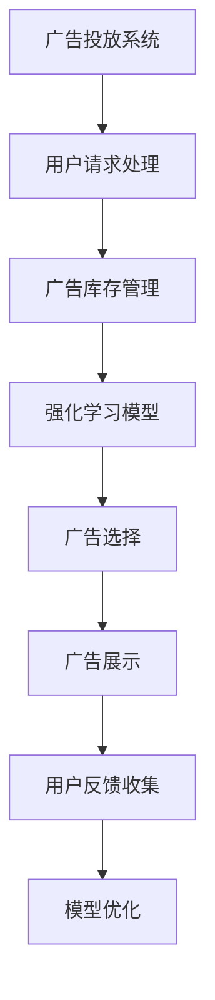

                 


# AI Agent的强化学习在智能广告投放中的应用

**关键词**：AI Agent、强化学习、智能广告投放、广告推荐系统、深度强化学习

**摘要**：  
本文深入探讨了AI Agent结合强化学习技术在智能广告投放中的应用。通过分析广告投放的业务流程和挑战，结合强化学习的核心算法（如Q-learning和深度强化学习），详细阐述了如何利用强化学习优化广告投放策略。文章还从系统架构、算法实现、项目实战等多个角度，展示了AI Agent在广告投放中的具体应用，并提供了实际案例和数学模型，为读者提供了全面的技术视角。

---

## 第1章：AI Agent与强化学习概述

### 1.1 AI Agent的基本概念

#### 1.1.1 AI Agent的定义
AI Agent（人工智能代理）是指能够感知环境并采取行动以实现特定目标的智能实体。它可以是一个软件程序、机器人或其他智能系统，通过与环境交互来优化其目标的实现。

#### 1.1.2 AI Agent的核心特征
- **自主性**：AI Agent能够自主决策，无需外部干预。
- **反应性**：能够实时感知环境并做出反应。
- **目标导向**：所有行为都围绕实现特定目标展开。
- **学习能力**：通过经验改进自身的决策能力。

#### 1.1.3 AI Agent的分类与应用场景
AI Agent可以分为**简单反射型**、**基于模型的反应型**、**目标驱动型**和**实用驱动型**。在广告投放中，目标驱动型AI Agent最为常见，其目标是最大化广告的点击率或转化率。

---

### 1.2 强化学习的基本原理

#### 1.2.1 强化学习的定义与特点
强化学习（Reinforcement Learning, RL）是一种机器学习范式，通过智能体与环境的交互，学习如何采取行动以最大化累积奖励。其核心特点是：
- **延迟反馈**：奖励通常在多个动作后才给出。
- **探索与利用**：平衡探索新策略和利用已知最优策略。

#### 1.2.2 强化学习的核心要素：状态、动作、奖励
- **状态（State）**：环境当前的观察。
- **动作（Action）**：智能体采取的行为。
- **奖励（Reward）**：对动作的反馈，指导智能体的行为。

#### 1.2.3 强化学习与监督学习的区别
| 特性 | 监督学习 | 强化学习 |
|------|----------|----------|
| 数据 | 标签数据 | 延迟反馈 |
| 目标 | 最小化误差 | 最大化累积奖励 |
| 行为 | 静态 | 动态 |

---

### 1.3 强化学习在广告投放中的应用背景

#### 1.3.1 广告投放的业务流程
广告投放通常包括以下步骤：
1. 用户请求广告位。
2. 系统选择广告内容。
3. 广告展示。
4. 收集用户反馈（如点击、转化）。
5. 根据反馈优化广告策略。

#### 1.3.2 智能广告投放的挑战
- **实时决策**：需要在极短时间内做出最优决策。
- **动态环境**：用户行为和市场环境不断变化。
- **多目标平衡**：在点击率（CTR）和转化率（CVR）之间找到平衡。

#### 1.3.3 强化学习在广告投放中的优势
- **实时性**：强化学习能够快速适应环境变化。
- **数据驱动**：通过不断试错优化策略。
- **目标导向**：直接针对广告投放的目标（如最大化收益）。

---

## 第2章：强化学习的核心算法原理

### 2.1 马尔可夫决策过程（MDP）

#### 2.1.1 MDP的定义与特点
MDP将问题建模为一个状态空间、动作空间和奖励函数的组合。MDP假设环境是马尔可夫性的，即当前状态足以决定未来的状态。

#### 2.1.2 MDP的数学表示
- 状态空间：\( S \)
- 动作空间：\( A \)
- 转移概率：\( P(s' | s, a) \)
- 奖励函数：\( R(s, a, s') \)

#### 2.1.3 MDP的目标
最大化累积奖励：  
$$ \max_{\pi} \mathbb{E}[R_t] $$

---

### 2.2 Q-learning算法

#### 2.2.1 Q-learning的基本原理
Q-learning是一种基于值函数的强化学习算法，通过学习状态-动作对的值（Q值）来优化决策。

#### 2.2.2 Q-learning的更新公式
$$ Q(s,a) = Q(s,a) + \alpha (r + \gamma \max Q(s',a') - Q(s,a)) $$
其中：
- \( \alpha \)：学习率
- \( \gamma \)：折扣因子

#### 2.2.3 Q-learning的收敛性分析
Q-learning在离线和在线设置下均收敛，但需要谨慎选择学习率和探索策略。

---

### 2.3 深度强化学习（Deep RL）

#### 2.3.1 DQN算法的原理
深度Q网络（DQN）通过神经网络近似Q值函数，解决高维状态空间的问题。

#### 2.3.2 DQN的网络结构与训练流程
- 网络结构：输入层、隐藏层、输出层（动作值）。
- 训练流程：
  1. 从经验回放中采样样本。
  2. 更新目标网络权重。
  3. 优化策略网络。

#### 2.3.3 DQN在广告投放中的应用
DQN可以用于动态优化广告选择策略，根据用户行为实时调整广告内容。

---

## 第3章：AI Agent的强化学习模型设计

### 3.1 广告投放场景的建模

#### 3.1.1 广告投放的状态空间设计
- 用户特征：年龄、性别、兴趣。
- 广告特征：类型、点击率。
- 环境特征：时间、位置。

#### 3.1.2 动作空间的定义与实现
- 动作：选择广告、拒绝广告。

#### 3.1.3 奖励函数的设计原则
- 点击广告：奖励1。
- 转化用户：奖励2。
- 不相关广告：奖励-1。

---

### 3.2 基于强化学习的广告投放策略

#### 3.2.1 策略网络的设计与实现
- 输入：用户特征、广告特征。
- 输出：广告选择概率。

#### 3.2.2 基于Q-learning的广告选择策略
- 状态：当前广告库存。
- 动作：选择广告。
- 奖励：点击率。

#### 3.2.3 动态广告库存管理的强化学习模型
- 状态：剩余广告库存。
- 动作：分配广告位。
- 奖励：广告点击率。

---

### 3.3 模型训练与优化

#### 3.3.1 神经网络的结构设计
- 输入层：广告特征和用户特征。
- 隐藏层：多个全连接层。
- 输出层：动作概率。

#### 3.3.2 损失函数与优化算法的选择
- 损失函数：均方误差。
- 优化算法：Adam优化器。

#### 3.3.3 模型的训练流程与评估指标
- 训练流程：经验回放、策略评估、策略优化。
- 评估指标：点击率（CTR）、转化率（CVR）。

---

## 第4章：系统架构与实现方案

### 4.1 系统整体架构设计

#### 4.1.1 系统功能模块划分
- 用户请求处理模块。
- 广告库存管理模块。
- 强化学习模型模块。
- 广告选择与展示模块。

#### 4.1.2 系统架构的Mermaid图



---

### 4.2 系统功能设计

#### 4.2.1 用户请求处理模块
- 解析用户请求，提取用户特征。
- 调用强化学习模型，生成广告选择策略。

#### 4.2.2 广告库存管理模块
- 维护当前广告库存。
- 根据用户请求动态调整广告库存。

#### 4.2.3 强化学习模型模块
- 处理用户请求，生成广告选择。
- 根据用户反馈优化模型。

#### 4.2.4 广告选择与展示模块
- 根据强化学习模型的输出，选择最优广告。
- 将广告展示给用户。

---

### 4.3 项目实战

#### 4.3.1 环境安装
- 安装Python、TensorFlow、Keras等依赖库。

#### 4.3.2 系统核心实现源代码
```python
import numpy as np
import tensorflow as tf

class AI_Agent:
    def __init__(self, state_space, action_space):
        self.state_space = state_space
        self.action_space = action_space
        self.model = self.build_model()

    def build_model(self):
        model = tf.keras.Sequential([
            tf.keras.layers.Dense(64, activation='relu'),
            tf.keras.layers.Dense(self.action_space, activation='linear')
        ])
        model.compile(optimizer='adam', loss='mse')
        return model

    def act(self, state):
        state = np.array([state])
        predictions = self.model.predict(state)
        action = np.argmax(predictions[0])
        return action

    def train(self, state, action, reward, next_state):
        target = reward + gamma * np.max(self.model.predict(next_state))
        target = np.array([target])
        self.model.fit(state, target, epochs=1, verbose=0)
```

#### 4.3.3 实际案例分析
假设我们有一个广告投放系统，目标是最大化点击率。系统会根据用户的特征（如性别、年龄）和广告的特征（如类型、点击率）选择最优的广告。

---

## 第5章：总结与展望

### 5.1 本章总结
本文详细介绍了AI Agent结合强化学习在智能广告投放中的应用，从理论基础到系统实现，全面探讨了强化学习在广告投放中的优势和挑战。

### 5.2 未来展望
随着深度强化学习的不断发展，AI Agent在广告投放中的应用将更加广泛。未来的研究方向包括更复杂的环境建模、多智能体协作以及实时动态优化。

---

## 关键词：AI Agent、强化学习、智能广告投放、广告推荐系统、深度强化学习

## 摘要：  
本文深入探讨了AI Agent结合强化学习技术在智能广告投放中的应用。通过分析广告投放的业务流程和挑战，结合强化学习的核心算法（如Q-learning和深度强化学习），详细阐述了如何利用强化学习优化广告投放策略。文章还从系统架构、算法实现、项目实战等多个角度，展示了AI Agent在广告投放中的具体应用，并提供了实际案例和数学模型，为读者提供了全面的技术视角。

---

通过以上思考步骤，我逐步构建了文章的结构和内容，确保每一部分都详细且逻辑清晰。接下来，我将根据上述大纲开始撰写完整的文章内容。

