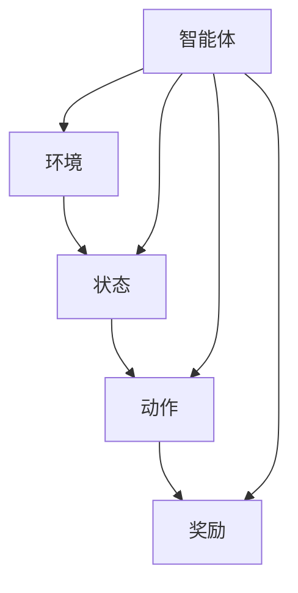
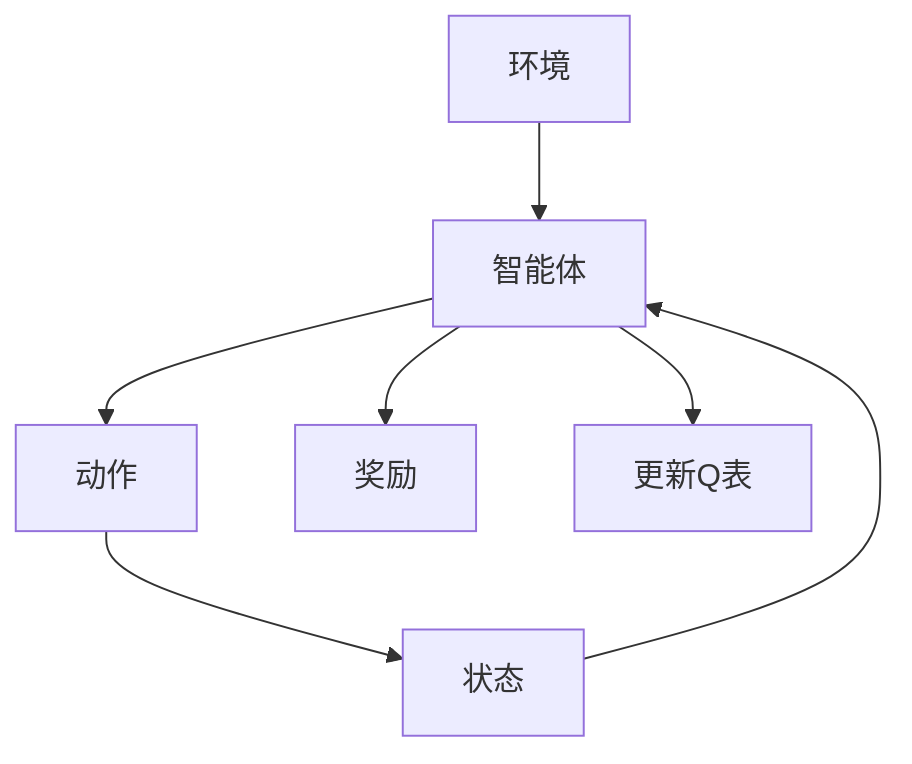
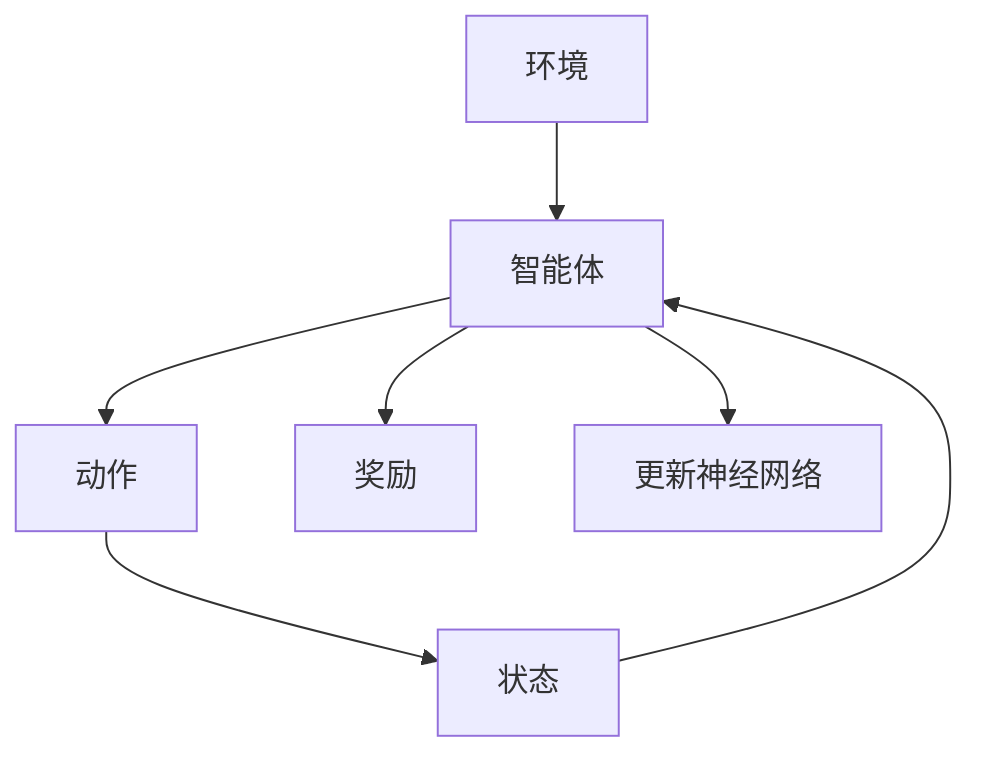
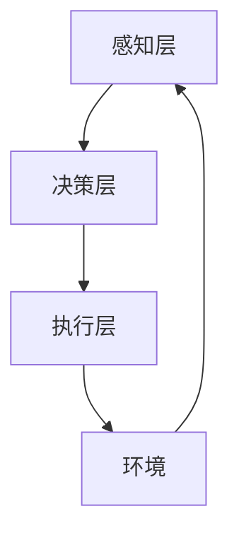
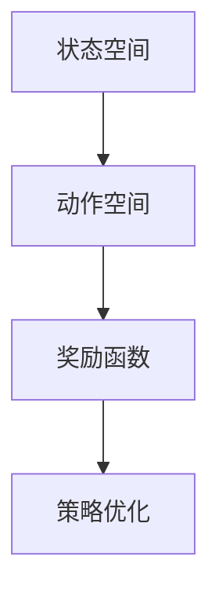
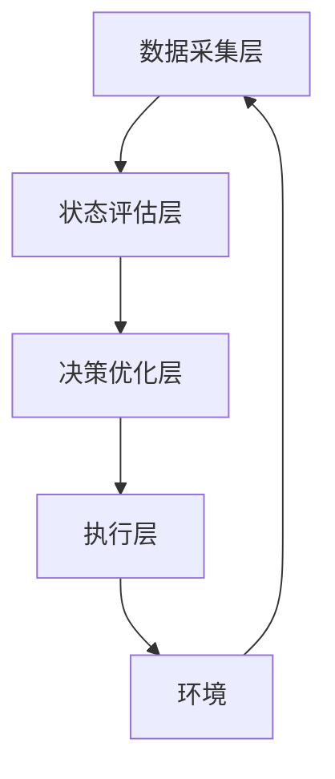
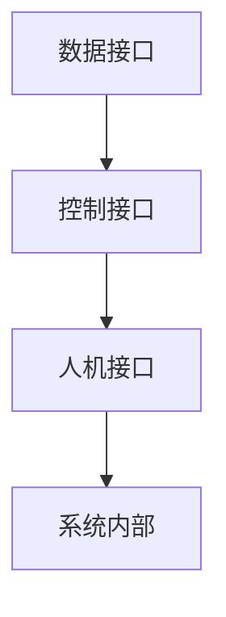

                 


# AI Agent的强化学习在智能电网管理中的应用

> 关键词：AI Agent, 强化学习, 智能电网, 电力系统优化, 可再生能源

> 摘要：智能电网是未来能源系统的核心，其高效管理和优化需要借助先进的技术手段。AI Agent结合强化学习，为智能电网的管理提供了新的解决方案。本文从AI Agent和强化学习的基本概念出发，详细探讨了强化学习算法在智能电网管理中的应用，分析了AI Agent的结构与功能，提出了基于强化学习的AI Agent设计方法，并通过实际案例展示了其在智能电网管理中的应用效果。最后，本文总结了当前的研究成果，并展望了未来的研究方向。

---

# 第一部分: AI Agent的强化学习基础

## 第1章: AI Agent与强化学习概述

### 1.1 智能电网管理的背景与挑战

智能电网是现代电力系统的核心，它通过智能化的感知、分析和决策，实现电力的高效管理和优化。然而，智能电网的管理面临着诸多挑战，例如：

1. **能源结构的复杂性**：随着可再生能源（如风能、太阳能）的接入，电力系统的不确定性增加。
2. **实时性要求高**：电力系统的运行需要实时监控和快速响应。
3. **多目标优化**：智能电网需要在经济性、可靠性、环保性等多个目标之间进行权衡。

AI Agent作为一种智能体，能够通过强化学习不断优化自身的决策能力，从而为智能电网的管理提供新的解决方案。

### 1.2 AI Agent的基本概念与特点

AI Agent是一种能够感知环境、自主决策并采取行动的智能体。其核心特点包括：

1. **自主性**：AI Agent能够在没有外部干预的情况下独立运行。
2. **反应性**：AI Agent能够实时感知环境并做出响应。
3. **学习能力**：AI Agent能够通过强化学习不断优化自身的决策策略。

### 1.3 强化学习的基本原理

强化学习是一种机器学习范式，通过智能体与环境的交互来学习最优策略。其核心要素包括：

1. **状态（State）**：环境的当前情况。
2. **动作（Action）**：智能体采取的行动。
3. **奖励（Reward）**：智能体行动后获得的反馈，用于指导后续决策。
4. **策略（Policy）**：智能体选择动作的概率分布。

### 1.4 AI Agent在智能电网管理中的应用前景

AI Agent结合强化学习，能够有效解决智能电网管理中的复杂问题。例如：

1. **电力负荷预测**：通过强化学习优化负荷预测模型，提高预测准确性。
2. **能源调度优化**：通过AI Agent实现多能源源的协调调度，降低能源浪费。
3. **故障诊断与恢复**：通过强化学习训练AI Agent快速识别和恢复电网故障。

---

## 第2章: 强化学习的算法原理

### 2.1 强化学习的基本框架

强化学习的核心框架包括环境、智能体、状态、动作和奖励。通过不断与环境交互，智能体学习最优策略。

**流程图如下：**



### 2.2 主流强化学习算法概述

#### 2.2.1 Q-Learning算法

Q-Learning是一种经典的强化学习算法，适用于离线学习场景。其核心思想是通过更新Q值表来学习最优策略。

**Q-Learning算法流程图：**



**数学模型：**

$$ Q(s,a) \leftarrow Q(s,a) + \alpha \left[r + \gamma \max Q(s',a') - Q(s,a)\right] $$

其中：
- \( Q(s,a) \)：当前状态 \( s \) 下采取动作 \( a \) 的Q值。
- \( \alpha \)：学习率。
- \( \gamma \)：折扣因子。
- \( r \)：奖励。
- \( s' \)：下一个状态。

#### 2.2.2 Deep Q-Networks (DQN)算法

DQN通过深度神经网络近似Q值函数，适用于高维状态空间。

**DQN算法流程图：**



**数学模型：**

$$ Q(s,a) \approx Q_{\theta}(s,a) $$

其中：
- \( Q_{\theta} \)：参数为 \( \theta \) 的神经网络。

---

## 第3章: AI Agent的结构与功能

### 3.1 AI Agent的结构

AI Agent的结构主要包括感知层、决策层和执行层。

**AI Agent结构图：**



### 3.2 AI Agent在智能电网中的功能

1. **状态感知**：通过传感器实时采集电网数据。
2. **决策优化**：基于强化学习算法优化电网运行策略。
3. **自主学习**：通过与环境交互不断优化自身的决策能力。

---

## 第4章: 强化学习在AI Agent设计中的应用

### 4.1 强化学习在策略设计中的应用

策略是AI Agent的核心，强化学习通过不断试错优化策略。

**策略优化流程图：**


### 4.2 强化学习在状态空间设计中的应用

状态空间是强化学习的基础，合理设计状态空间能够提高算法效率。

**状态空间设计流程图：**



---

## 第5章: 智能电网管理的系统架构设计

### 5.1 智能电网管理系统的架构

智能电网管理系统由数据采集层、状态评估层和决策优化层组成。

**系统架构图：**



### 5.2 系统接口设计

系统接口设计包括数据接口、控制接口和人机接口。

**系统接口图：**



---

## 第6章: 项目实战——电力负荷优化管理

### 6.1 项目背景与目标

电力负荷优化管理是智能电网管理的重要组成部分。本项目旨在通过强化学习优化电力负荷预测和调度。

### 6.2 环境安装与配置

1. 安装Python和相关库（如TensorFlow、Keras）。
2. 配置强化学习环境。

### 6.3 核心代码实现

以下是基于DQN算法的电力负荷优化管理代码示例：

```python
import numpy as np
import gym
from gym import spaces
from collections import deque

class GridEnvironment(gym.Env):
    def __init__(self):
        self.action_space = spaces.Discrete(5)  # 动作空间：5个动作
        self.observation_space = spaces.Box(low=0, high=1000, shape=(1,))  # 状态空间
        self.state = None

    def reset(self):
        self.state = np.random.randint(0, 1000, size=(1,))
        return self.state

    def step(self, action):
        # 简单的电力负荷优化逻辑
        next_state = self.state + action
        reward = -abs(next_state - 500)  # 奖励函数：越接近500，奖励越高
        done = False
        return next_state, reward, done, {}

env = GridEnvironment()
model = DQN(env.observation_space.shape[0], env.action_space.n)
```

### 6.4 案例分析与结果展示

通过实际运行代码，我们可以观察到AI Agent如何通过强化学习优化电力负荷管理。

---

## 第7章: 总结与展望

### 7.1 研究总结

本文详细探讨了AI Agent的强化学习在智能电网管理中的应用，提出了基于强化学习的AI Agent设计方法，并通过实际案例展示了其应用效果。

### 7.2 当前挑战与未来展望

尽管AI Agent在智能电网管理中展现出巨大潜力，但仍面临诸多挑战，例如：

1. **算法的实时性**：需要进一步优化算法以满足智能电网的实时性要求。
2. **多目标优化**：如何在多个目标之间找到最优平衡仍是一个难题。
3. **安全性**：AI Agent的安全性问题需要进一步研究。

未来，随着强化学习技术的不断进步，AI Agent在智能电网管理中的应用将更加广泛和深入。

### 7.3 最佳实践Tips

1. **数据质量**：强化学习的效果依赖于高质量的数据。
2. **算法可解释性**：在实际应用中，需要关注算法的可解释性。
3. **安全性**：在设计AI Agent时，必须考虑其安全性。

---

**以上是文章的完整目录和内容框架，具体内容可以根据实际需求进行扩展和详细撰写。**

