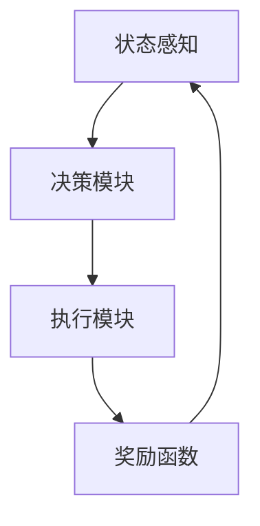
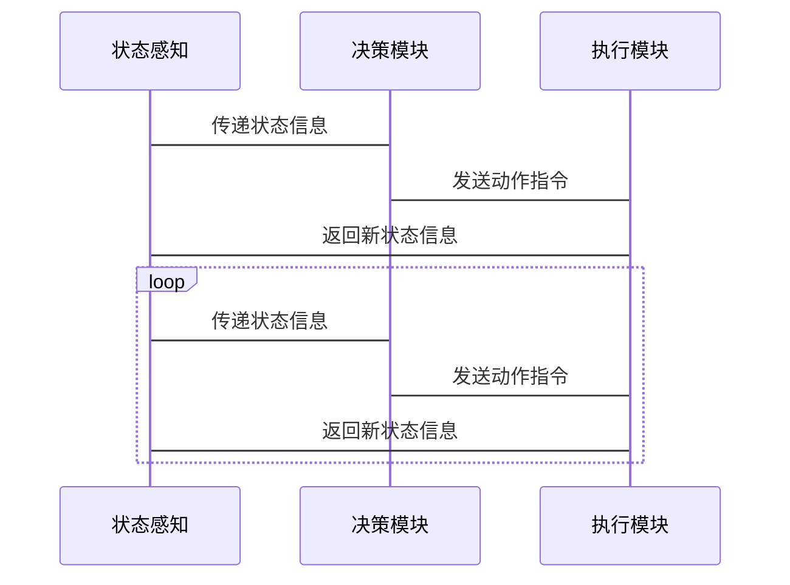

                 


# AI Agent的强化学习在机器人导航中的应用

## 关键词：
- AI Agent
- 强化学习
- 机器人导航
- 算法实现
- 系统架构

## 摘要：
本文深入探讨了AI Agent在机器人导航中的应用，重点分析了强化学习在其中的关键作用。通过详细讲解强化学习的基本原理、经典算法及其在导航系统中的实现，本文为读者提供了一个从理论到实践的完整指南。结合实际项目案例，文章展示了如何设计和优化基于强化学习的AI Agent，以实现高效的机器人导航。本文适合对人工智能和机器人技术感兴趣的读者，帮助他们理解并掌握这一领域的核心技术。

---

# 第1章: AI Agent与强化学习概述

## 1.1 AI Agent的基本概念

### 1.1.1 AI Agent的定义
AI Agent（人工智能代理）是一种能够感知环境、做出决策并执行动作的智能实体。它可以是一个软件程序或物理设备，通过与环境交互，实现特定目标。

### 1.1.2 AI Agent的核心要素
AI Agent的核心要素包括：
1. **感知**：通过传感器或其他输入方式获取环境信息。
2. **决策**：基于感知信息，利用算法做出决策。
3. **执行**：通过执行机构将决策转化为实际动作。

### 1.1.3 AI Agent的分类
AI Agent可以根据智能水平分为：
1. **反应式AI Agent**：基于当前感知做出即时反应。
2. **认知式AI Agent**：具备推理、规划等高级智能能力。
3. **学习型AI Agent**：能够通过经验优化自身的决策能力。

## 1.2 强化学习的基本概念

### 1.2.1 强化学习的定义
强化学习是一种机器学习范式，通过智能体与环境的交互，学习最优策略以最大化累积奖励。

### 1.2.2 强化学习的核心要素
1. **状态（State）**：智能体所处的环境情况。
2. **动作（Action）**：智能体在某一状态下采取的行为。
3. **奖励（Reward）**：智能体执行动作后获得的反馈，用于指导学习方向。

### 1.2.3 强化学习与监督学习的区别
- **监督学习**：基于标记的训练数据进行学习，目标是预测正确输出。
- **强化学习**：通过与环境交互，学习最优策略，强调长期累积奖励的最大化。

## 1.3 AI Agent与强化学习的关系

### 1.3.1 AI Agent的决策机制
AI Agent通过强化学习不断优化决策策略，以提高任务完成效率。

### 1.3.2 强化学习在AI Agent中的应用
强化学习为AI Agent提供了自适应和自优化的决策能力，使其能够应对复杂动态环境。

### 1.3.3 强化学习的优势与挑战
优势：
- 灵活性高，适用于动态变化的环境。
- 无需大量标注数据，适合在线学习。
挑战：
- 算法复杂，计算资源消耗大。
- 需要设计合适的奖励函数和状态表示。

---

# 第2章: 强化学习的理论基础

## 2.1 强化学习的基本原理

### 2.1.1 状态、动作、奖励的定义
- **状态（State）**：环境的当前情况，如机器人的位置和周围障碍物。
- **动作（Action）**：机器人可以执行的操作，如向左转或向前移动。
- **奖励（Reward）**：执行动作后获得的反馈，如到达目标点的奖励。

### 2.1.2 策略与价值函数
- **策略（Policy）**：定义智能体在某一状态下选择动作的概率分布。
- **价值函数（Value Function）**：评估某状态下采取某动作后的预期累积奖励。

### 2.1.3 动作空间与状态空间
- **动作空间**：所有可能动作的集合。
- **状态空间**：所有可能状态的集合。

## 2.2 强化学习的核心算法

### 2.2.1 Q-learning算法
Q-learning是一种经典的强化学习算法，通过更新Q值表来学习最优策略。

#### Q-learning的更新公式
$$ Q(s, a) = Q(s, a) + \alpha (r + \gamma \max Q(s', a') - Q(s, a)) $$
其中：
- \( \alpha \) 是学习率。
- \( \gamma \) 是折扣因子。

### 2.2.2 Deep Q-Network (DQN)
DQN将Q-learning与深度神经网络结合，适用于高维状态空间。

### 2.2.3 Policy Gradient方法
Policy Gradient通过直接优化策略参数，提高学习效率。

## 2.3 强化学习的数学模型

### 2.3.1 Q-learning的数学公式
$$ Q(s, a) = Q(s, a) + \alpha (r + \gamma \max Q(s', a') - Q(s, a)) $$

### 2.3.2 DQN的网络结构
DQN使用两个神经网络：主网络和目标网络，通过经验回放和目标网络更新来稳定学习过程。

---

# 第3章: AI Agent在机器人导航中的应用

## 3.1 机器人导航的基本问题

### 3.1.1 机器人导航的定义
机器人导航是指机器人在环境中从起始点移动到目标点，避开障碍物的过程。

### 3.1.2 机器人导航的核心任务
1. **路径规划**：找到从起点到目标的最优路径。
2. **避障**：动态调整路径以避开障碍物。

### 3.1.3 机器人导航的挑战
- 动态环境中的不确定性。
- 多目标优化问题。
- 计算效率与精度的平衡。

## 3.2 AI Agent在机器人导航中的作用

### 3.2.1 AI Agent的决策能力
AI Agent通过强化学习优化导航策略，提高路径规划的效率和准确性。

### 3.2.2 强化学习在导航中的应用
强化学习通过与环境的交互，学习最优导航策略，适应复杂动态环境。

### 3.2.3 AI Agent与机器人硬件的结合
AI Agent与机器人传感器和执行机构的无缝集成，实现端到端的智能导航。

## 3.3 机器人导航的经典算法

### 3.3.1 A*算法
A*算法是一种基于启发式的最短路径算法，广泛应用于机器人导航。

### 3.3.2 RRT算法
RRT（Rapidly-exploring Random Tree）算法适用于高维配置空间的路径规划。

### 3.3.3 Dijkstra算法
Dijkstra算法用于找到图中节点的最短路径，常用于静态环境中的路径规划。

---

# 第4章: 强化学习在机器人导航中的算法实现

## 4.1 强化学习算法的选择与优化

### 4.1.1 算法选择的原则
根据具体问题选择合适的算法，如DQN适用于高维状态空间，Q-learning适用于简单任务。

### 4.1.2 算法优化的方法
- 网络结构优化。
- 超参数调整。
- 经验回放增强。

### 4.1.3 算法调参的技巧
合理设置学习率、折扣因子等参数，平衡探索与利用。

## 4.2 基于强化学习的导航模型

### 4.2.1 状态表示
- 位置坐标、障碍物信息、目标位置等。

### 4.2.2 动作空间设计
- 前进、后退、左转、右转等。

### 4.2.3 奖励函数设计
- 到达目标点的奖励，碰撞障碍物的惩罚。

## 4.3 强化学习算法的数学推导

### 4.3.1 Q-learner

$$ Q(s, a) = Q(s, a) + \alpha (r + \gamma \max Q(s', a') - Q(s, a)) $$

### 4.3.2 DQN网络结构

主网络：输入状态，输出Q值。
目标网络：用于稳定目标值的更新。

---

# 第5章: 强化学习在机器人导航中的系统设计

## 5.1 系统功能设计

### 5.1.1 功能模块
- 状态感知模块：接收传感器数据。
- 决策模块：基于强化学习算法做出决策。
- 执行模块：驱动机器人移动。

### 5.1.2 系统架构图



## 5.2 接口设计

### 5.2.1 输入接口
- 传感器数据：激光雷达、摄像头等。

### 5.2.2 输出接口
- 控制信号：电机转速、方向等。

## 5.3 交互流程图



---

# 第6章: 强化学习在机器人导航中的项目实战

## 6.1 环境配置

### 6.1.1 环境搭建
- 安装机器人硬件和相关软件库。

### 6.1.2 环境配置代码

```python
import numpy as np
from gym import spaces

class RobotNavigationEnv:
    def __init__(self, grid_size=10):
        self.grid_size = grid_size
        self.observation_space = spaces.Discrete(grid_size**2)
        self.action_space = spaces.Discrete(4)  # 前进、后退、左转、右转
```

## 6.2 核心代码实现

### 6.2.1 DQN算法实现

```python
class DQN:
    def __init__(self, state_space, action_space, lr=0.01, gamma=0.99):
        self.state_space = state_space
        self.action_space = action_space
        self.lr = lr
        self.gamma = gamma
        
        # 主网络
        self.mainQN = self._build_network()
        # 目标网络
        self.targetQN = self._build_network()
        
    def _build_network(self):
        model = Sequential()
        model.add(Dense(24, input_dim=self.state_space, activation='relu'))
        model.add(Dense(24, activation='relu'))
        model.add(Dense(self.action_space, activation='linear'))
        model.compile(loss='mse', optimizer=Adam(lr=self.lr))
        return model
```

## 6.3 案例分析与经验总结

### 6.3.1 实验结果
通过实验验证算法的有效性，分析不同算法在不同环境下的表现。

### 6.3.2 经验总结
- 合理设计奖励函数。
- 选择合适的算法和网络结构。
- 充分利用经验回放机制。

---

# 第7章: 总结与展望

## 7.1 总结
本文系统地介绍了AI Agent在机器人导航中的应用，重点分析了强化学习的核心算法及其在导航系统中的实现。

## 7.2 最佳实践 tips
- 合理设计奖励函数。
- 选择合适的强化学习算法。
- 充分利用经验回放机制。

## 7.3 展望
未来的研究方向包括多智能体协作、复杂环境下的实时导航等。

---

通过本文的详细讲解，读者可以全面了解AI Agent的强化学习在机器人导航中的应用，从理论到实践，掌握这一领域的核心技术。

