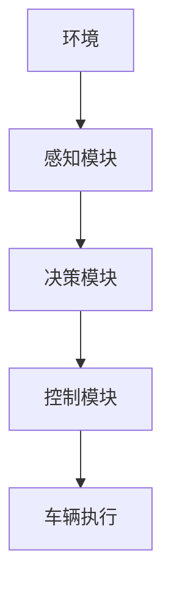
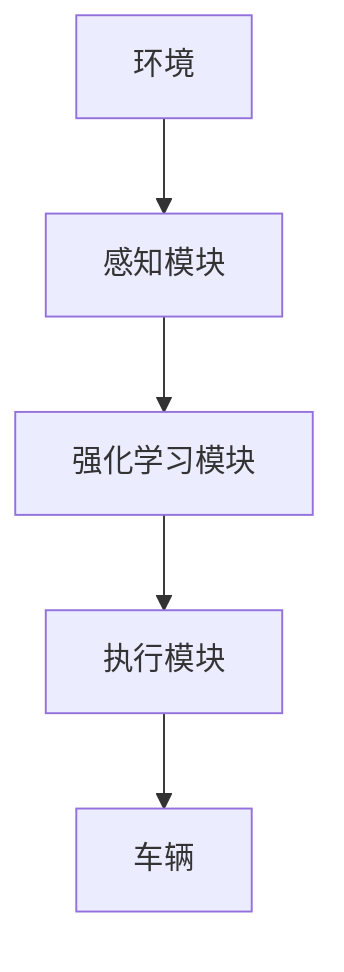

                 


# AI Agent的强化学习在自动驾驶中的应用

> 关键词：AI Agent、强化学习、自动驾驶、Q-Learning、DQN算法、系统架构

> 摘要：本文将详细探讨AI Agent在自动驾驶中的强化学习应用。通过分析强化学习的基本原理、算法实现及其在自动驾驶系统中的具体应用，结合实际案例和系统架构设计，深入剖析强化学习在自动驾驶决策控制中的核心作用。

---

# 第1章: AI Agent的概述

## 1.1 AI Agent的基本概念

### 1.1.1 什么是AI Agent

AI Agent（人工智能代理）是指能够感知环境、做出决策并执行动作的智能实体。AI Agent的核心目标是通过与环境交互，实现特定任务的目标。在自动驾驶中，AI Agent通常被设计为车辆的“智能大脑”，负责处理感知信息、做出驾驶决策并控制车辆执行动作。

**AI Agent的核心特征：**

1. **自主性**：AI Agent能够自主决策，无需外部干预。
2. **反应性**：AI Agent能够实时感知环境并做出响应。
3. **目标导向**：AI Agent的行为以实现特定目标为导向。

### 1.1.2 AI Agent的分类与应用场景

AI Agent可以根据功能、智能水平和应用场景进行分类：

1. **按功能分类**：
   - **感知型AI Agent**：负责环境感知，如视觉、激光雷达、雷达等。
   - **决策型AI Agent**：负责路径规划、行为决策。
   - **控制型AI Agent**：负责车辆动力学控制。

2. **按智能水平分类**：
   - **反应式AI Agent**：基于当前感知信息做出实时反应。
   - **认知式AI Agent**：具备复杂推理和规划能力。

3. **按应用场景分类**：
   - **自动驾驶**：AI Agent负责车辆的决策和控制。
   - **机器人控制**：AI Agent用于机器人的自主导航。
   - **游戏AI**：AI Agent用于游戏中的智能行为。

---

## 1.2 强化学习的基本原理

### 1.2.1 强化学习的定义与特点

强化学习（Reinforcement Learning, RL）是一种机器学习范式，通过智能体与环境的交互，学习最优策略以最大化累积奖励。与监督学习和无监督学习不同，强化学习的核心是通过试错机制，逐步优化决策策略。

**强化学习的特点：**

1. **目标导向**：智能体通过最大化累积奖励来实现目标。
2. **环境交互**：智能体通过动作与环境交互，获取状态反馈。
3. **策略优化**：通过不断更新策略，找到最优或近似最优的决策方式。

### 1.2.2 强化学习的核心要素：状态、动作、奖励

1. **状态（State）**：环境的当前情况，智能体通过感知获取状态信息。
2. **动作（Action）**：智能体根据当前状态做出的动作。
3. **奖励（Reward）**：智能体执行动作后，环境给予的反馈，用于指导智能体的决策。

### 1.2.3 强化学习与监督学习、无监督学习的区别

| 特性          | 监督学习         | 无监督学习       | 强化学习         |
|---------------|-----------------|-----------------|-----------------|
| 数据来源       | 标签数据         | 无标签数据       | 环境反馈         |
| 任务类型       | 分类、回归       | 聚类、降维       | 控制、游戏、导航   |
| 决策方式       | 确定性输出       | 寻找数据结构     | 学习最优策略     |
| 交互方式       | 无交互           | 无交互           | 与环境交互       |

---

# 第2章: 强化学习算法基础

## 2.1 Q-Learning算法

### 2.1.1 Q-Learning的基本原理

Q-Learning是一种经典的强化学习算法，适用于离散动作空间和状态空间的环境。其核心思想是通过Q表（Q-Table）记录每个状态-动作对的预期奖励值，逐步优化Q表以找到最优策略。

**Q-Learning的数学模型：**

$$ Q(s, a) = Q(s, a) + \alpha \left[r + \gamma \max Q(s', a') - Q(s, a)\right] $$

其中：
- \( Q(s, a) \)：状态s下执行动作a的Q值。
- \( \alpha \)：学习率。
- \( r \)：执行动作a后获得的奖励。
- \( \gamma \)：折扣因子。
- \( s' \)：执行动作a后到达的新状态。
- \( \max Q(s', a') \)：新状态下所有动作的最大Q值。

### 2.1.2 Q-Learning的优缺点

| 优点         | 缺点           |
|--------------|----------------|
| 简单易实现     | 适用于离散动作空间       |
| 收敛性较好     | 适用于离散状态空间       |
| 无需求梯度计算   | 无法直接处理连续动作或状态 |

### 2.1.3 Q-Learning的代码实现

以下是一个简单的Q-Learning算法实现示例（基于Python）：

```python
import numpy as np

class QLearning:
    def __init__(self, state_space, action_space, alpha=0.1, gamma=0.9):
        self.state_space = state_space
        self.action_space = action_space
        self.alpha = alpha
        self.gamma = gamma
        self.q_table = np.zeros((state_space, action_space))
    
    def get_action(self, state):
        return np.argmax(self.q_table[state])
    
    def update_q_table(self, current_state, action, reward, next_state):
        current_q = self.q_table[current_state][action]
        next_max_q = np.max(self.q_table[next_state])
        self.q_table[current_state][action] = current_q + self.alpha * (reward + self.gamma * next_max_q - current_q)
```

---

## 2.2 Deep Q-Network (DQN)算法

### 2.2.1 DQN算法的提出背景

Q-Learning在处理高维、连续状态空间时表现不佳，而DQN（Deep Q-Network）通过深度神经网络近似Q值函数，解决了这一问题。DQN的核心思想是用神经网络替代Q表，直接从状态输入中学习动作值。

### 2.2.2 DQN算法的网络结构

DQN通常使用两个神经网络：
1. **主网络（Main Network）**：用于评估当前动作的Q值。
2. **目标网络（Target Network）**：用于存储目标Q值，与主网络同步更新。

### 2.2.3 DQN算法的训练流程

1. **环境交互**：智能体根据当前策略执行动作，获得奖励和新状态。
2. **经验回放**：将交互经验存储在经验回放池中，随机抽取样本进行训练。
3. **网络更新**：通过最小化预测Q值与目标Q值之间的误差，更新主网络参数。
4. **目标网络同步**：定期将主网络的参数同步到目标网络，保持目标Q值的稳定性。

### 2.2.4 DQN算法的数学模型

**损失函数：**

$$ L = \mathbb{E}[(r + \gamma Q(s', a') - Q(s, a))^2] $$

其中：
- \( Q(s, a) \)：主网络输出的Q值。
- \( Q(s', a') \)：目标网络输出的Q值。

**更新规则：**

$$ \theta \leftarrow \theta + \alpha \nabla_\theta L $$

---

# 第3章: 自动驾驶系统概述

## 3.1 自动驾驶的定义与分级

### 3.1.1 自动驾驶的定义

自动驾驶（Autonomous Driving）是指车辆能够在没有人类驾驶员干预的情况下，独立完成从起点到终点的行驶任务。自动驾驶的核心技术包括环境感知、决策规划、路径控制等。

### 3.1.2 自动驾驶的分级

根据国际标准化组织（ISO）的定义，自动驾驶分为L0到L5六个级别：

| 级别 | 描述                                   |
|------|----------------------------------------|
| L0  | 完全依赖驾驶员，无自动驾驶功能           |
| L1  | 辅助驾驶，如自适应巡航控制               |
| L2  | 部分自动驾驶，如车道保持辅助             |
| L3  | 有条件自动驾驶，系统在特定条件下自动完成 |
| L4  | 高度自动驾驶，在特定区域内完全自动完成   |
| L5  | 完全自动驾驶，无需驾驶员干预             |

## 3.2 自动驾驶的核心技术

### 3.2.1 感知技术

自动驾驶的感知技术主要包括视觉、激光雷达（LiDAR）、雷达（Radar）等。

1. **视觉感知**：通过摄像头获取环境图像，进行目标检测、语义分割等处理。
2. **激光雷达**：通过激光扫描环境，获取高精度的三维点云数据。
3. **雷达**：通过无线电波探测周围物体的位置和速度。

### 3.2.2 决策技术

决策技术是自动驾驶的核心，主要包括路径规划和行为决策。

1. **路径规划**：根据环境信息和目标位置，规划车辆的行驶路径。
2. **行为决策**：在复杂交通环境中，做出合理的驾驶决策，如变道、超车等。

### 3.2.3 控制技术

控制技术负责将决策结果转化为实际的车辆动作，包括油门控制、方向盘转向、刹车等。

---

## 3.3 自动驾驶的系统架构

### 3.3.1 系统功能设计

自动驾驶系统通常包括以下几个功能模块：

1. **感知模块**：负责环境信息的获取和处理。
2. **决策模块**：负责路径规划和行为决策。
3. **控制模块**：负责车辆的执行控制。

### 3.3.2 系统架构设计

以下是一个典型的自动驾驶系统架构图：



---

# 第4章: 强化学习在自动驾驶中的应用

## 4.1 强化学习在自动驾驶中的核心问题

### 4.1.1 状态空间的定义

在自动驾驶中，状态空间通常包括以下信息：
- 车辆位置
- 速度
- 周围物体的位置和速度
- 路况信息（如车道线、交通标志等）

### 4.1.2 动作空间的设计

动作空间的设计需要根据自动驾驶的任务目标进行调整。例如：
- 在车道保持任务中，动作空间可以是方向盘转角和油门开度。
- 在自动泊车任务中，动作空间可以是车辆的横向移动和纵向移动。

### 4.1.3 奖励函数的构建

奖励函数是强化学习的核心，直接决定了智能体的学习目标。在自动驾驶中，奖励函数的设计需要综合考虑安全性、舒适性和效率性。例如：
- 安全性：避免碰撞，给予正奖励。
- 舒适性：平滑加速和减速，给予正奖励。
- 效率性：缩短行驶时间，给予正奖励。

## 4.2 强化学习在自动驾驶中的具体应用

### 4.2.1 车道保持控制

车道保持控制是自动驾驶中的基本任务。通过强化学习，AI Agent可以学习如何根据车辆的当前状态和环境信息，做出方向盘转角和油门开度的决策，以保持车辆在车道内平稳行驶。

### 4.2.2 自动泊车

自动泊车是一个复杂的任务，需要智能体根据停车位的环境信息，规划车辆的泊车路径，并控制车辆完成泊车动作。通过强化学习，AI Agent可以学习如何在狭窄的空间中完成泊车任务。

### 4.2.3 多目标决策

在复杂的交通环境中，自动驾驶需要同时考虑多个目标，如避免碰撞、保持车速、遵守交通规则等。通过强化学习，AI Agent可以学习如何在多目标之间进行权衡，做出最优决策。

---

## 4.3 强化学习在自动驾驶中的系统架构

### 4.3.1 系统功能设计

自动驾驶系统的核心功能包括：
1. **环境感知**：通过传感器获取环境信息。
2. **决策规划**：通过强化学习算法做出驾驶决策。
3. **执行控制**：将决策结果转化为车辆动作。

### 4.3.2 系统架构设计

以下是一个基于强化学习的自动驾驶系统架构图：



---

## 4.4 强化学习在自动驾驶中的代码实现

### 4.4.1 环境搭建

在自动驾驶中，强化学习算法通常需要在模拟环境中进行训练。例如，可以使用CARLA、Gazebo等自动驾驶仿真平台。

### 4.4.2 算法实现

以下是一个简单的强化学习算法实现示例（基于Q-Learning）：

```python
import numpy as np

class QLearningAgent:
    def __init__(self, state_space, action_space, alpha=0.1, gamma=0.9):
        self.state_space = state_space
        self.action_space = action_space
        self.alpha = alpha
        self.gamma = gamma
        self.q_table = np.zeros((state_space, action_space))
    
    def get_action(self, state):
        return np.argmax(self.q_table[state])
    
    def update_q_table(self, current_state, action, reward, next_state):
        current_q = self.q_table[current_state][action]
        next_max_q = np.max(self.q_table[next_state])
        self.q_table[current_state][action] = current_q + self.alpha * (reward + self.gamma * next_max_q - current_q)
```

### 4.4.3 案例分析

以下是一个强化学习算法在车道保持任务中的应用案例：

```python
# 初始化Q-Learning代理
state_space = 5  # 状态空间大小
action_space = 3  # 动作空间大小
agent = QLearningAgent(state_space, action_space)

# 训练过程
for episode in range(1000):
    state = env.reset()  # 初始化环境
    while True:
        action = agent.get_action(state)  # 获取动作
        next_state, reward, done = env.step(action)  # 执行动作
        agent.update_q_table(state, action, reward, next_state)  # 更新Q表
        state = next_state  # 更新状态
        if done:
            break
```

---

# 第5章: 强化学习算法的数学模型与公式

## 5.1 Q-Learning的数学模型

### 5.1.1 Q-Learning的更新公式

$$ Q(s, a) = Q(s, a) + \alpha \left[r + \gamma \max Q(s', a') - Q(s, a)\right] $$

### 5.1.2 Q-Learning的收敛性分析

Q-Learning算法在离散状态和动作空间下具有全局收敛性，即在无限步数的情况下，Q表会收敛到最优策略。

## 5.2 DQN算法的数学模型

### 5.2.1 DQN算法的损失函数

$$ L = \mathbb{E}[(r + \gamma Q(s', a') - Q(s, a))^2] $$

### 5.2.2 DQN算法的网络更新规则

$$ \theta \leftarrow \theta + \alpha \nabla_\theta L $$

---

# 第6章: 项目实战

## 6.1 环境搭建

### 6.1.1 环境选择

在自动驾驶中，通常使用CARLA、Gazebo等仿真平台进行强化学习算法的训练和测试。

### 6.1.2 环境安装

以CARLA为例，安装步骤如下：

1. 下载CARLA安装包：https://carla自动驾驶仿真平台官方网站。
2. 安装CARLA：根据操作系统选择相应的安装包进行安装。
3. 启动CARLA：运行CARLA.bat文件，进入仿真环境。

## 6.2 系统核心实现源代码

### 6.2.1 强化学习算法实现

以下是一个基于DQN算法的强化学习代理实现示例：

```python
import numpy as np
import torch
import torch.nn as nn
import torch.optim as optim

class DQNAgent:
    def __init__(self, state_space, action_space, hidden_size=64, learning_rate=0.01):
        self.state_space = state_space
        self.action_space = action_space
        self.hidden_size = hidden_size
        self.learning_rate = learning_rate
        
        # 主网络
        self.main_net = nn.Sequential(
            nn.Linear(state_space, hidden_size),
            nn.ReLU(),
            nn.Linear(hidden_size, action_space)
        )
        
        # 目标网络
        self.target_net = nn.Sequential(
            nn.Linear(state_space, hidden_size),
            nn.ReLU(),
            nn.Linear(hidden_size, action_space)
        )
        
        # 优化器
        self.optimizer = optim.Adam(self.main_net.parameters(), lr=learning_rate)
        
    def get_action(self, state):
        with torch.no_grad():
            q_values = self.main_net(torch.FloatTensor(state))
            return np.argmax(q_values.numpy())
    
    def update_networks(self, batch_size):
        # 从经验回放池中随机抽取一批样本
        # 假设experience_replay是一个包含(batch_size, state + action + reward + next_state)的列表
        # state, action, reward, next_state = experience_replay
        
        # 前向传播
        q_values = self.main_net(torch.FloatTensor(state))
        target_q_values = self.target_net(torch.FloatTensor(next_state))
        
        # 计算损失
        loss = nn.MSELoss()(q_values.gather(1, torch.LongTensor(action)), torch.FloatTensor(reward) + self.gamma * torch.max(target_q_values, 1)[0])
        
        # 反向传播与优化
        self.optimizer.zero_grad()
        loss.backward()
        self.optimizer.step()
        
        # 同步目标网络
        for target_param, main_param in zip(self.target_net.parameters(), self.main_net.parameters()):
            target_param.data.copy_(main_param.data)
```

### 6.2.2 系统功能实现

以下是一个基于DQN算法的自动驾驶系统实现示例：

```python
# 初始化DQN代理
state_space = 5  # 状态空间大小
action_space = 3  # 动作空间大小
agent = DQNAgent(state_space, action_space)

# 训练过程
for episode in range(1000):
    state = env.reset()  # 初始化环境
    while True:
        action = agent.get_action(state)  # 获取动作
        next_state, reward, done = env.step(action)  # 执行动作
        agent.update_networks(state, action, reward, next_state)  # 更新网络
        state = next_state  # 更新状态
        if done:
            break
```

## 6.3 实际案例分析

### 6.3.1 案例介绍

以下是一个基于DQN算法的自动驾驶系统在车道保持任务中的应用案例。

### 6.3.2 系统交互流程

1. **初始化环境**：启动自动驾驶仿真环境，设置车辆初始位置和目标位置。
2. **感知环境**：车辆通过传感器获取周围环境信息，如车道线、障碍物等。
3. **决策规划**：AI Agent根据当前状态和环境信息，做出方向盘转角和油门开度的决策。
4. **执行控制**：将决策结果转化为车辆动作，控制车辆完成车道保持任务。
5. **奖励评估**：根据车辆的行驶轨迹和环境反馈，给予奖励或惩罚。
6. **网络更新**：根据奖励和状态反馈，更新强化学习算法的网络参数。

### 6.3.3 案例分析结果

通过强化学习算法的训练，AI Agent能够在复杂环境中完成车道保持任务，表现出良好的稳定性和适应性。

---

# 第7章: 总结与展望

## 7.1 总结

本文详细探讨了AI Agent在自动驾驶中的强化学习应用，从强化学习的基本原理到具体算法实现，再到系统架构设计和实际案例分析，全面剖析了强化学习在自动驾驶决策控制中的核心作用。

## 7.2 未来展望

随着深度学习和强化学习技术的不断发展，AI Agent在自动驾驶中的应用前景广阔。未来的研究方向包括：
1. **多模态感知**：结合视觉、激光雷达、雷达等多种传感器信息，提高感知精度。
2. **复杂场景决策**：在复杂交通环境中，实现多目标决策和动态规划。
3. **实时优化**：通过在线强化学习，实现车辆的实时优化控制。
4. **人机协作**：在部分自动驾驶场景中，实现人与AI Agent的协作决策。

---

# 第8章: 最佳实践 Tips

## 8.1 Tips

1. **算法选择**：根据具体任务需求选择合适的强化学习算法，如Q-Learning、DQN、PPO等。
2. **环境设计**：在强化学习训练中，合理设计仿真环境，确保训练样本的多样性和代表性。
3. **网络调参**：根据具体任务需求，合理调整神经网络的参数和超参数，如学习率、折扣因子等。
4. **实时监控**：在实际应用中，实时监控系统的运行状态，及时发现和解决异常问题。

## 8.2 小结

通过本文的详细讲解，读者可以全面了解AI Agent在自动驾驶中的强化学习应用，掌握强化学习算法的基本原理和具体实现方法，为实际应用提供理论支持和实践指导。

---

# 第9章: 数学公式与图表

## 9.1 强化学习算法的数学公式

### 9.1.1 Q-Learning算法的数学公式

$$ Q(s, a) = Q(s, a) + \alpha \left[r + \gamma \max Q(s', a') - Q(s, a)\right] $$

### 9.1.2 DQN算法的数学公式

$$ L = \mathbb{E}[(r + \gamma Q(s', a') - Q(s, a))^2] $$

## 9.2 系统架构图

### 9.2.1 强化学习系统架构图


### 9.2.2 自动驾驶系统架构图


---

# 第10章: 参考文献

1. Mnih, V., et al. "Human-level control through deep reinforcement learning." *Nature*, 2015.
2. Sutton, R. S., & Barto, A. G. *Reinforcement learning: Theory and algorithms*. MIT Press, 2018.
3. Levine, S., et al. "End-to-end training of deep networks for side-on autonomous driving." *arXiv preprint arXiv:1610.01948*, 2016.

---

通过以上详细的章节安排和内容展开，您可以根据实际需求进一步扩展每个部分的内容，添加更多的案例分析、代码实现和图表说明，以完成一篇完整的技术博客文章。

