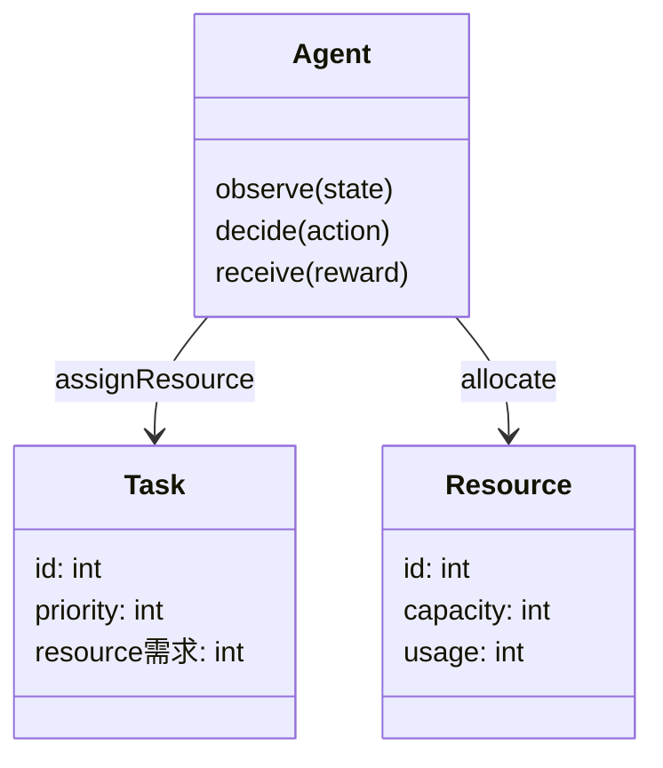
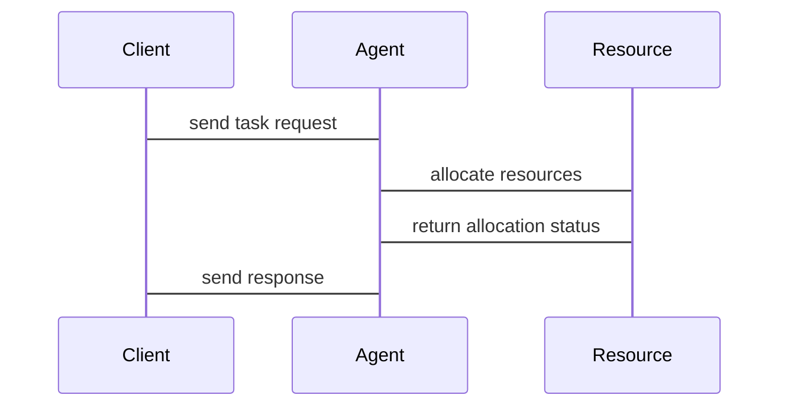

                 


# AI Agent的强化学习在资源调度中的应用

> **关键词**: AI Agent, 强化学习, 资源调度, 算法实现, 云计算, 网络优化

> **摘要**: 本文深入探讨了AI Agent结合强化学习在资源调度中的应用，分析了强化学习的核心原理及其在资源调度中的优势，详细介绍了资源调度问题中的状态表示与动作空间设计，通过具体的算法实现和项目案例展示了强化学习在资源调度中的实际应用。最后，总结了强化学习在资源调度中的最佳实践和未来研究方向。

---

# 第1章 AI Agent与强化学习概述

## 1.1 AI Agent的基本概念

### 1.1.1 AI Agent的定义与分类

AI Agent（智能体）是指在计算机系统中，能够感知环境并采取行动以实现目标的实体。AI Agent可以分为以下几类：

- **简单反射型Agent**: 基于当前感知直接行动，不依赖内部状态。
- **基于模型的反射型Agent**: 使用内部状态模型来规划行动。
- **目标驱动型Agent**: 根据目标选择最优行动。
- **效用驱动型Agent**: 通过最大化效用来决策。

AI Agent的核心目标是通过感知和行动实现特定任务目标。

### 1.1.2 强化学习的基本概念

强化学习（Reinforcement Learning, RL）是一种机器学习范式，通过智能体与环境的交互，智能体通过试错方式学习如何采取最优行动以最大化累积奖励。强化学习的核心要素包括：

- **状态（State）**: 智能体对环境的感知。
- **动作（Action）**: 智能体采取的行为。
- **奖励（Reward）**: 环境对智能体行为的反馈。
- **策略（Policy）**: 定义智能体在状态下的行动概率分布。
- **值函数（Value Function）**: 表示状态或状态-动作对的期望累积奖励。

### 1.1.3 AI Agent与强化学习的关系

AI Agent通过强化学习不断优化其行为策略，以提高在资源调度中的效率和性能。强化学习为AI Agent提供了自适应决策的能力，使其能够在动态环境中实现资源的最优配置。

## 1.2 强化学习的核心原理

### 1.2.1 状态、动作、奖励的定义

在资源调度问题中，状态通常表示资源的使用情况，动作表示调度决策，奖励表示调度效果的优劣。

例如，在云计算资源调度中：

- **状态**: CPU使用率、内存占用、任务队列长度。
- **动作**: 分配资源到特定任务、调整资源分配比例。
- **奖励**: 任务完成时间的优化程度、资源利用率的提升。

### 1.2.2 Q-learning算法简介

Q-learning是一种经典的强化学习算法，通过更新Q值表来学习最优策略。Q值表记录了状态-动作对的期望累积奖励。

Q值更新公式：
$$ Q(s,a) = Q(s,a) + \alpha [r + \gamma \max Q(s',a') - Q(s,a)] $$
其中：
- $\alpha$ 是学习率，控制更新步长。
- $\gamma$ 是折扣因子，平衡当前奖励和未来奖励的重要性。

### 1.2.3 策略梯度方法概述

策略梯度方法直接优化策略，通过计算梯度更新参数。策略函数通常表示为：
$$ \pi(a|s) = \text{softmax}(Q(s,a)) $$

梯度更新公式：
$$ \nabla J = \mathbb{E}[ \nabla \log \pi(a|s) Q(s,a)] $$

策略梯度方法适用于高维状态空间和动作空间的问题。

## 1.3 资源调度问题的背景与挑战

### 1.3.1 资源调度的基本概念

资源调度是指在计算系统中，合理分配和管理资源（如CPU、内存、网络带宽等）以满足任务需求的过程。资源调度的目标是最大化资源利用率，同时最小化任务延迟和能耗。

### 1.3.2 资源调度中的常见问题

- **资源竞争**: 多个任务争夺有限资源。
- **动态变化**: 环境和任务需求的实时变化。
- **延迟优化**: 快速响应任务请求。

### 1.3.3 强化学习在资源调度中的优势

- **自适应性**: 强化学习能够根据环境变化自适应调整调度策略。
- **全局优化**: 强化学习能够优化整体资源利用率，而不仅仅是局部优化。

## 1.4 本章小结

本章介绍了AI Agent和强化学习的基本概念，分析了强化学习的核心原理及其在资源调度中的优势，为后续章节奠定了理论基础。

---

# 第2章 强化学习与资源调度的核心概念

## 2.1 强化学习在资源调度中的应用场景

### 2.1.1 云计算资源调度

云计算环境中，强化学习可以用于任务调度、资源分配和负载均衡。

### 2.1.2 网络资源调度

在网络资源调度中，强化学习可以优化数据包的路由和带宽分配。

### 2.1.3 数据中心资源调度

在数据中心，强化学习可以用于服务器资源分配和任务调度。

## 2.2 强化学习算法的选择与优化

### 2.2.1 Q-learning算法的适用性

Q-learning适用于离散动作空间和状态空间的问题。

### 2.2.2 策略梯度方法的优化

策略梯度方法适用于高维连续动作空间的问题，但计算复杂度较高。

### 2.2.3 算法选择的考虑因素

- **问题复杂性**: 简单问题选择Q-learning，复杂问题选择策略梯度。
- **计算资源**: 算法的计算复杂度影响选择。
- **环境动态性**: 动态环境需要更灵活的算法。

## 2.3 资源调度中的状态表示与动作空间

### 2.3.1 状态表示的定义

在云计算资源调度中，状态可以表示为：

- CPU使用率
- 内存占用
- 网络带宽使用
- 任务队列长度

### 2.3.2 动作空间的设计

动作空间包括：

- 分配资源到特定任务
- 调整资源分配比例
- 任务优先级调度

### 2.3.3 状态与动作的转换关系

状态和动作之间通过环境模型进行映射，例如：

- 状态：CPU使用率高
- 动作：增加分配到该任务的资源

## 2.4 本章小结

本章分析了强化学习在资源调度中的应用场景，探讨了算法选择和优化策略，并详细介绍了资源调度中的状态表示与动作空间设计。

---

# 第3章 强化学习算法的数学模型与公式

## 3.1 Q-learning算法的数学模型

### 3.1.1 Q值更新公式

Q值更新公式：
$$ Q(s,a) = Q(s,a) + \alpha [r + \gamma \max Q(s',a') - Q(s,a)] $$

其中：
- $\alpha$ 是学习率
- $\gamma$ 是折扣因子

### 3.1.2 Q值的衰减因子

Q值的衰减因子：
$$ \alpha = \frac{1}{1 + \epsilon t} $$

其中：
- $\epsilon$ 是衰减常数
- $t$ 是时间步数

## 3.2 策略梯度方法的数学推导

### 3.2.1 策略函数的定义

策略函数：
$$ \pi(a|s) = \text{softmax}(Q(s,a)) $$

### 3.2.2 梯度更新公式

梯度更新公式：
$$ \nabla J = \mathbb{E}[ \nabla \log \pi(a|s) Q(s,a)] $$

---

# 第4章 系统分析与架构设计方案

## 4.1 问题场景介绍

以云计算资源调度为例，系统需要实现任务的动态调度和资源分配。

## 4.2 项目介绍

本项目旨在通过强化学习算法实现云计算环境中的资源调度优化。

## 4.3 系统功能设计

### 4.3.1 领域模型（mermaid 类图）



### 4.3.2 系统架构设计（mermaid架构图）


### 4.3.3 系统交互设计（mermaid序列图）



---

# 第5章 项目实战

## 5.1 环境安装

- Python 3.8+
- TensorFlow或Keras
- gym库

## 5.2 系统核心实现源代码

```python
import gym
import numpy as np

class ResourceDispatchEnv(gym.Env):
    def __init__(self):
        self.state = np.array([0.5, 0.3])
        self.action_space = gym.spaces.Discrete(4)
        self.observation_space = gym.spaces.Box(low=0, high=1, shape=(2,))
    
    def step(self, action):
        # 状态更新逻辑
        pass
    
    def reset(self):
        self.state = np.array([0.5, 0.3])
        return self.state
    
    def render(self, mode='human'):
        pass
```

## 5.3 代码应用解读与分析

- 状态空间和动作空间的定义
- 环境与智能体的交互逻辑

## 5.4 实际案例分析

- 云计算资源调度的案例分析
- 网络资源调度的案例分析

## 5.5 项目小结

总结项目实现的关键点和经验教训。

---

# 第6章 最佳实践与总结

## 6.1 小结

强化学习在资源调度中的应用具有广阔前景，但需要结合具体场景进行优化。

## 6.2 注意事项

- 算法选择要考虑问题复杂性
- 状态和动作的设计要合理
- 训练数据要充足且多样化

## 6.3 拓展阅读

推荐相关领域的书籍和论文。

---

通过以上结构，我们可以系统地探讨AI Agent的强化学习在资源调度中的应用，从理论到实践，逐步深入分析。

