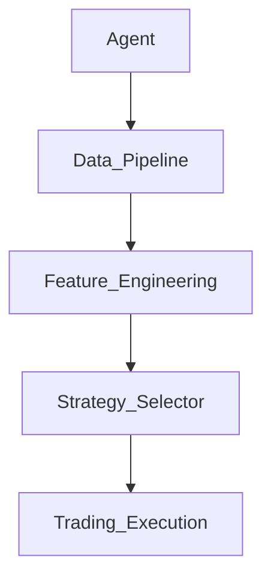

                 


# AI Agent的强化学习在金融交易中的应用

## 关键词：AI Agent，强化学习，金融交易，DQN算法，策略优化

## 摘要：本文探讨了AI Agent在金融交易中的强化学习应用，从基础概念到系统架构，再到实际案例，详细分析了如何利用强化学习提升交易策略的优化能力。通过DQN算法和策略梯度方法的深入讲解，结合系统设计与项目实战，展示了AI Agent在金融交易中的潜力与实现细节。

---

## 第一部分：AI Agent与强化学习的基础

### 1.1 强化学习的基本概念

#### 1.1.1 什么是强化学习
强化学习（Reinforcement Learning，RL）是一种机器学习范式，通过智能体与环境的交互，学习策略以最大化累积奖励。与监督学习不同，强化学习不依赖于标注数据，而是通过试错和奖励机制进行学习。

#### 1.1.2 强化学习的核心要素
- **状态（State）**：环境中的当前情况。
- **动作（Action）**：智能体采取的行为。
- **奖励（Reward）**：智能体行为的反馈，用于指导学习。
- **策略（Policy）**：智能体选择动作的规则。

#### 1.1.3 强化学习与监督学习的区别
| 特性 | 监督学习 | 强化学习 |
|------|----------|----------|
| 数据 | 标签数据 | 奖励信号 |
| 目标 | 最小化误差 | 最大化奖励 |
| 交互 | 静态 | 动态 |

### 1.2 AI Agent的基本原理

#### 1.2.1 AI Agent的定义
AI Agent是能够感知环境并采取行动以实现目标的智能体。在金融交易中，AI Agent通常负责决策买卖时机、优化投资组合等。

#### 1.2.2 基于强化学习的AI Agent
- **环境（Environment）**：金融市场，提供价格、交易数据等信息。
- **状态（State）**：当前市场数据、资产组合情况。
- **动作（Action）**：买入、卖出或持有。

#### 1.2.3 多Agent系统中的协作
在复杂的金融环境中，可能需要多个AI Agent协作，例如分别负责不同资产的交易决策。

---

## 第二部分：强化学习在金融交易中的应用

### 2.1 金融交易中的强化学习问题

#### 2.1.1 问题背景
金融市场的不确定性高，传统基于规则的交易策略在复杂多变的市场中表现有限，强化学习提供了更灵活的解决方案。

#### 2.1.2 问题描述
智能体需要在有限的交易时间内，通过买卖决策最大化收益，同时控制风险。

#### 2.1.3 强化学习的优势
- **适应性**：能够根据市场变化调整策略。
- **非线性关系**：能够捕捉复杂的价格波动模式。

### 2.2 基于DQN的AI Agent实现

#### 2.2.1 DQN算法的核心流程
```mermaid
graph TD
    Agent --> Environment
    Environment --> State
    State --> Action
    Action --> Reward
    Reward --> Next State
    Next State --> Agent
```

#### 2.2.2 DQN的数学模型
- **Q-learning公式**：
$$ Q(s, a) = Q(s, a) + \alpha (r + \gamma \max Q(s', a') - Q(s, a)) $$
其中，$\alpha$是学习率，$\gamma$是折扣因子。

- **神经网络结构**：
输入层（市场数据） → 隐藏层（特征提取） → 输出层（Q值）。

### 2.3 策略优化与风险控制

#### 2.3.1 策略优化
通过策略梯度方法优化策略，最大化期望奖励：
$$ J(\theta) = \mathbb{E}[ \log \pi_\theta(a|s) Q(s,a) ] $$
梯度计算：
$$ \nabla \theta J(\theta) = \mathbb{E}[ \nabla \log \pi_\theta(a|s) Q(s,a) ] $$

#### 2.3.2 风险控制
引入风险调整的奖励函数，如考虑VaR（Value at Risk）：
$$ R = r - \lambda \cdot \text{VaR} $$

---

## 第三部分：系统设计与实现

### 3.1 系统架构设计

#### 3.1.1 系统模块
- **数据获取模块**：从数据源获取实时或历史数据。
- **特征工程模块**：提取有用的特征，如技术指标。
- **策略选择模块**：基于强化学习模型选择动作。
- **执行模块**：模拟交易执行。

#### 3.1.2 系统架构图


### 3.2 项目实战

#### 3.2.1 环境配置
- **数据源**：使用Yahoo Finance API获取股票数据。
- **框架**：使用TensorFlow和Keras搭建DQN模型。

#### 3.2.2 核心代码实现
```python
import numpy as np
import tensorflow as tf

class DQN:
    def __init__(self, state_size, action_size):
        self.state_size = state_size
        self.action_size = action_size
        self.gamma = 0.99
        self.epsilon = 0.1
        self.model = self.build_model()

    def build_model(self):
        model = tf.keras.Sequential([
            tf.keras.layers.Dense(32, activation='relu', input_shape=(self.state_size,)),
            tf.keras.layers.Dense(32, activation='relu'),
            tf.keras.layers.Dense(self.action_size, activation='linear')
        ])
        return model

    def act(self, state):
        if np.random.random() < self.epsilon:
            return np.random.randint(0, self.action_size)
        q_values = self.model.predict(state)
        return np.argmax(q_values[0])

    def remember(self, state, action, reward, next_state):
        # 仅记录单个样本，简化处理
        self.model.fit(state, tf.keras.utils.to_categorical(action, num_classes=self.action_size), epochs=1, verbose=0)
```

#### 3.2.3 实际案例分析
以股票交易为例，训练模型在特定时间窗口内做出买卖决策，回测策略收益。

---

## 第四部分：总结与展望

### 4.1 最佳实践
- **数据质量**：确保数据清洗和特征提取的有效性。
- **风险控制**：结合风险指标优化奖励函数。
- **模型调优**：调整学习率和折扣因子以优化性能。

### 4.2 小结
本文详细探讨了AI Agent在金融交易中的强化学习应用，从理论到实践，展示了如何利用DQN算法优化交易策略。尽管取得了显著成果，但仍需进一步研究以应对复杂的金融环境。

### 4.3 注意事项
- 强化学习模型可能过拟合特定市场情况。
- 交易成本和延迟需在模型中考虑。

### 4.4 拓展阅读
建议阅读相关论文和书籍，深入了解强化学习在金融中的高级应用。

--- 

通过系统化的分析和实践，AI Agent的强化学习为金融交易提供了新的可能性，未来随着技术进步，其应用将更加广泛和深入。

