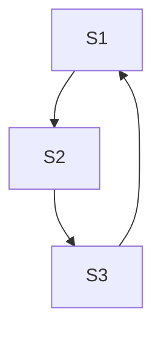
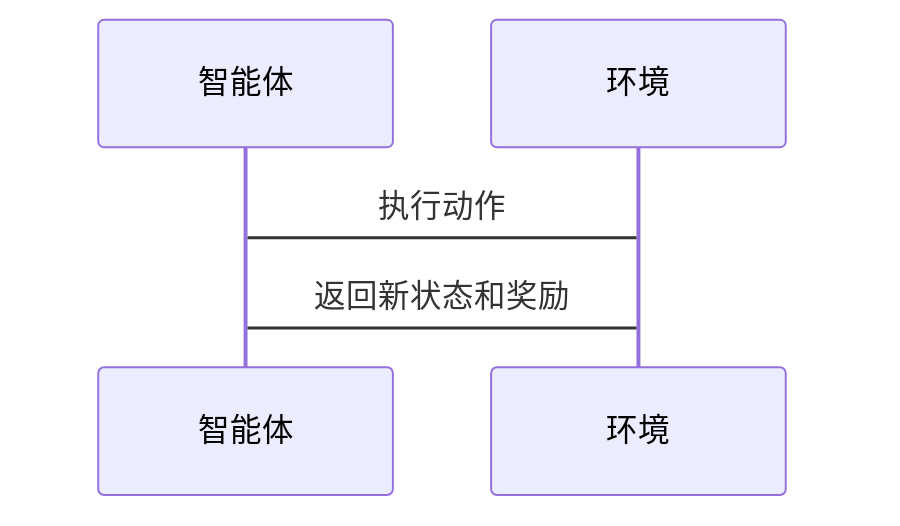

                 

# AI Agent的强化学习机制实现

> 关键词：AI Agent，强化学习，Q-learning，马尔可夫决策过程，策略梯度方法，系统架构设计，Python实现

> 摘要：本文详细探讨了AI Agent的强化学习机制实现，涵盖强化学习的基础理论、核心算法、系统架构设计以及实际项目中的应用。通过Q-learning、马尔可夫决策过程（MDP）、策略梯度方法等算法的深入分析，结合系统架构设计与项目实战，为读者提供全面的理论与实践指导。

---

## 第一章: AI Agent与强化学习概述

### 1.1 强化学习的基本概念

#### 1.1.1 强化学习的定义与特点

强化学习（Reinforcement Learning, RL）是一种机器学习范式，通过智能体（Agent）与环境的交互来学习策略，以最大化累积奖励。与监督学习和无监督学习不同，强化学习依赖于智能体与环境的动态交互，通过试错机制优化决策过程。

#### 1.1.2 强化学习的核心要素

| 要素 | 描述 |
|------|------|
| 状态（State） | 环境在某一时刻的观测 | 
| 动作（Action） | 智能体可以采取的行为 | 
| 奖励（Reward） | 环境对智能体行为的反馈 | 
| 策略（Policy） | 智能体选择动作的概率分布 | 
| 值函数（Value Function） | 表示状态或动作的价值 | 

#### 1.1.3 AI Agent与强化学习的关系

AI Agent需要在动态环境中做出最优决策，强化学习为其提供了一种有效的学习机制。通过强化学习，AI Agent能够从与环境的交互中学习到最优策略，从而提升其自主决策能力。

---

## 第二章: Q-learning算法

### 2.1 Q-learning的基本原理

#### 2.1.1 Q-learning的算法流程

Q-learning是一种基于值函数的强化学习算法，通过更新Q表（Q-Table）来存储状态-动作对的期望奖励。算法流程如下：

1. 初始化Q表为零。
2. 在当前状态下，选择一个动作。
3. 执行动作，观察新的状态和奖励。
4. 更新Q表：$Q(s, a) = Q(s, a) + \alpha [r + \gamma \max Q(s', a') - Q(s, a)]$，其中$\alpha$是学习率，$\gamma$是折扣因子。

#### 2.1.2 Q-learning的数学模型

$$ Q(s, a) = Q(s, a) + \alpha [r + \gamma \max Q(s', a') - Q(s, a)] $$

### 2.2 Q-learning的实现步骤

#### 2.2.1 状态空间的定义

状态空间是智能体可以感知的所有可能状态的集合。例如，在迷宫导航问题中，状态可以是智能体所在的位置。

#### 2.2.2 动作空间的定义

动作空间是智能体在每个状态下可以执行的所有动作的集合。例如，在迷宫导航中，动作可以是“上、下、左、右”。

#### 2.2.3 奖励函数的设计

奖励函数定义了智能体在执行某个动作后所获得的奖励。例如，在迷宫导航中，到达目标位置可以得到+1的奖励，碰撞墙壁可以得到-1的奖励。

### 2.3 Q-learning的优缺点

#### 2.3.1 优点

- 简单易实现，适用于离散状态和动作空间。
- 不需要环境的明确模型，适合在线学习。

#### 2.3.2 缺点

- 适用于小规模问题，状态和动作空间较大时效率低下。
- 可能存在探索不足的问题，导致次优解。

#### 2.3.3 改进方向

- 使用深度神经网络替代Q表，解决大规模问题（如DQN）。
- 引入经验回放机制，提升学习效率。

---

## 第三章: 马尔可夫决策过程（MDP）

### 3.1 MDP的基本概念

马尔可夫决策过程（Markov Decision Process）是强化学习的基本模型，描述了智能体与环境之间的交互过程。MDP由以下五个元组定义：

$$ M = (S, A, P, R, \gamma) $$

- $S$：状态空间
- $A$：动作空间
- $P$：状态转移概率
- $R$：奖励函数
- $\gamma$：折扣因子

### 3.2 MDP与非马尔可夫过程的对比

| 对比维度 | MDP | 非马尔可夫过程 |
|----------|-----|----------------|
| 状态转移 | 仅依赖当前状态 | 依赖完整历史 |
| 优化目标 | 最大化期望累积奖励 | 最大化即时奖励 |

### 3.3 状态转移图的绘制

使用Mermaid绘制状态转移图，展示智能体在不同状态下的转移概率。

---

## 第四章: 策略梯度方法

### 4.1 策略梯度的基本原理

策略梯度方法通过直接优化策略函数，最大化累积奖励。其核心思想是通过梯度上升算法更新策略参数。

$$ \theta = \theta + \alpha \nabla_\theta J(\theta) $$

其中，$J(\theta)$是目标函数，通常定义为策略的累积奖励期望。

### 4.2 策略评估与策略改进

#### 4.2.1 策略评估

策略评估通过蒙特卡洛方法或动态规划方法，估计当前策略的值函数。

#### 4.2.2 策略改进

策略改进通过贪心方法或软最大方法，优化策略参数，使其达到最优。

### 4.3 策略梯度与值函数的对比

| 对比维度 | 策略梯度 | 值函数方法 |
|----------|----------|------------|
| 优化目标 | 策略参数 | 值函数 |
| 优势 | 直接优化策略 | 间接优化策略 |

---

## 第五章: 深度强化学习

### 5.1 深度强化学习的基本概念

深度强化学习（Deep RL）结合了深度学习与强化学习，通过深度神经网络近似值函数或策略函数，解决高维状态空间问题。

### 5.2 基于DQN的实现

深度Q网络（DQN）通过经验回放和目标网络，解决了传统Q-learning的不稳定问题。

### 5.3 基于Actor-Critic的实现

Actor-Critic方法同时优化策略和值函数，通过优势函数提升学习效率。

---

## 第六章: 系统分析与架构设计

### 6.1 问题场景介绍

以智能体在迷宫中导航为例，设计一个强化学习系统。

### 6.2 系统功能设计

- 状态感知模块：感知环境状态。
- 动作选择模块：选择最优动作。
- 奖励计算模块：计算累积奖励。

### 6.3 系统架构设计

使用分层架构，包括感知层、决策层和执行层。

### 6.4 系统接口设计

定义智能体与环境之间的接口，包括状态输入、动作输出和奖励反馈。

### 6.5 系统交互流程图

使用Mermaid绘制系统交互流程图，展示智能体与环境的交互过程。

---

## 第七章: 项目实战

### 7.1 环境安装

安装必要的Python库，如TensorFlow、Keras、OpenAI Gym等。

### 7.2 核心代码实现

实现Q-learning算法的核心代码，包括Q表的更新和动作的选择。

### 7.3 代码解读与分析

详细解读代码功能，分析算法的优化点和改进方向。

### 7.4 实际案例分析

以迷宫导航为例，展示智能体的学习过程和最终结果。

### 7.5 项目总结

总结项目经验，提出改进建议。

---

## 第八章: 最佳实践与注意事项

### 8.1 小结

总结全文内容，强调强化学习的重要性及其在AI Agent中的应用。

### 8.2 注意事项

- 状态空间和动作空间的设计要合理。
- 奖励函数的设计要明确。
- 学习率和折扣因子的设置要适当。

### 8.3 未来趋势

- 结合深度学习，提升算法性能。
- 引入多智能体协作，解决复杂问题。

---

## 参考文献

1. Sutton, R. S., & Barto, A. G. (2018). Reinforcement Learning: An Introduction.
2. Mnih, V., et al. (2013). Playing atari with deep reinforcement learning.
3. Levine, S. (2016). Continuous control with deep reinforcement learning.

---

## 附录

### 附录A: 强化学习工具包

- OpenAI Gym
- TensorFlow RL
- Keras-RL

### 附录B: 推荐书籍

- 《强化学习》（Sutton & Barto）
- 《深度强化学习》（LeCun et al.）

### 附录C: 在线课程

- Coursera: Introduction to AI (Udacity)
- edX: Reinforcement Learning for Autonomous Systems (MIT)

---

通过以上内容，我们全面探讨了AI Agent的强化学习机制实现，从基础理论到实际应用，为读者提供了系统的知识体系和实践指导。

