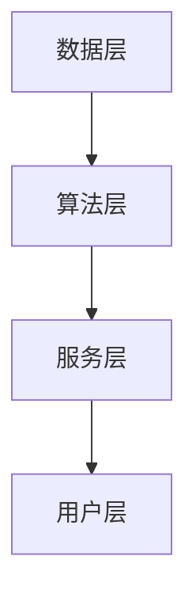
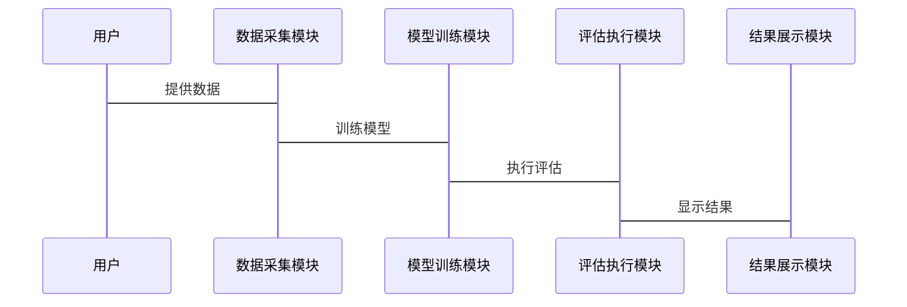

                 


# AI Agent的性能评估指标与方法

## 关键词：AI Agent, 性能评估, 准确性指标, F1分数, 算法流程图

## 摘要：本文详细探讨AI Agent的性能评估，涵盖准确性、响应时间、资源消耗等核心指标，结合算法模型和系统架构设计，提供实践案例和最佳建议。

---

# 第一部分: AI Agent的性能评估基础

## 第1章: AI Agent概述

### 1.1 AI Agent的基本概念

#### 1.1.1 什么是AI Agent

AI Agent（人工智能代理）是一种智能实体，能够感知环境、自主决策并执行任务，以实现特定目标。AI Agent可以是软件程序、机器人或其他智能系统，旨在模拟人类的决策过程。

#### 1.1.2 AI Agent的核心特征

| 核心特征 | 描述 |
|----------|------|
| 感知能力 | 能够感知环境状态和输入数据 |
| 决策能力 | 基于感知信息做出决策 |
| 执行能力 | 执行决策以完成任务 |
| 学习能力 | 通过经验改进性能 |

#### 1.1.3 AI Agent的分类与应用场景

AI Agent可以分为以下几类：

1. **简单反射型**：基于规则的反应式代理，适用于简单的任务，如条件判断。
2. **基于模型的反射型**：维护环境模型，用于复杂决策。
3. **目标驱动型**：根据目标驱动行为，适用于路径规划和资源分配。
4. **效用驱动型**：通过效用函数优化决策，应用于推荐系统和资源分配。

### 1.2 AI Agent的发展背景

#### 1.2.1 AI技术的演进历程

AI Agent的发展经历了从专家系统到机器学习，再到深度学习的演变，技术进步推动了AI Agent的智能化和实用性。

#### 1.2.2 AI Agent在现代应用中的重要性

AI Agent在自动驾驶、智能助手、推荐系统等领域发挥重要作用，成为实现智能化系统的核心组件。

#### 1.2.3 当前AI Agent技术的挑战与机遇

挑战包括数据依赖性、计算资源需求和复杂环境适应性；机遇则在于算法进步和应用场景的扩展。

### 1.3 AI Agent的性能评估必要性

#### 1.3.1 为什么需要评估AI Agent的性能

性能评估是确保AI Agent在实际应用中有效、可靠的关键步骤，帮助发现和改进系统缺陷。

#### 1.3.2 性能评估在实际应用中的作用

性能评估帮助优化AI Agent的效率和效果，确保其在复杂环境下的稳定性和可靠性。

#### 1.3.3 常见的性能评估误区

误区包括仅关注单一指标、忽略动态环境变化和缺乏全面的测试验证。

### 1.4 本章小结

本章概述了AI Agent的基本概念、分类和发展背景，强调了性能评估的重要性和必要性，为后续章节奠定了基础。

---

# 第2章: 性能评估的核心指标

## 2.1 准确性指标

### 2.1.1 精确率与召回率的定义

- **精确率（Precision）**：正确预测的正例数与所有预测的正例数的比率。
- **召回率（Recall）**：正确预测的正例数与实际存在的正例数的比率。

公式：
$$
\text{Precision} = \frac{\text{TP}}{\text{TP} + \text{FP}}
$$
$$
\text{Recall} = \frac{\text{TP}}{\text{TP} + \text{FN}}
$$

其中，TP为真实正例，FP为假正例，FN为假反例。

### 2.1.2 F1分数的计算方法

F1分数是精确率和召回率的调和平均数，公式：
$$
F1 = 2 \times \frac{\text{Precision} \times \text{Recall}}{\text{Precision} + \text{Recall}}
$$

### 2.1.3 多标签分类的F1分数扩展

在多标签分类中，F1分数计算每类的F1平均值，公式：
$$
F1_{\text{macro}} = \frac{1}{n} \sum_{i=1}^{n} F1_i
$$

---

### 2.1.4 准确性指标对比

| 指标 | 描述 |
|------|------|
| 精确率 | 衡量预测的正确性 |
| 召回率 | 衡量检测的全面性 |
| F1分数 | 综合精确率和召回率的平衡指标 |

### 2.1.5 通过案例分析准确性指标的重要性

假设在疾病诊断中，AI Agent诊断出100个病例，其中80个正确，20个错误。精确率=80/100=80%，召回率=80/100=80%，F1=80%。

---

## 第2.2 响应时间与资源消耗

### 2.2.1 响应时间的定义

响应时间是指AI Agent处理请求所需的时间，通常分为处理时间、队列时间和等待时间。

### 2.2.2 资源消耗指标

资源消耗包括CPU、内存、磁盘I/O和网络带宽的使用情况，影响系统的稳定性和扩展性。

### 2.2.3 并发处理能力

并发处理能力反映AI Agent在高负载下的性能，通常通过QPS（每秒查询数）和TPS（每秒事务数）衡量。

### 2.2.4 响应时间与资源消耗的优化

通过负载均衡、缓存优化和资源分配策略可以有效降低响应时间和资源消耗。

---

## 第2.3 系统稳定性与可靠性

### 2.3.1 系统稳定性的定义

系统稳定性指AI Agent在面对异常输入、网络波动和系统故障时的应对能力。

### 2.3.2 系统可靠性的指标

可靠性指标包括故障率、平均修复时间和MTBF（平均故障间隔时间）。

### 2.3.3 系统稳定性与可靠性的优化

通过冗余设计、错误恢复机制和日志监控可以提升系统稳定性和可靠性。

---

## 第2.4 用户体验与满意度

### 2.4.1 用户体验的定义

用户体验指用户与AI Agent交互过程中的感受，包括响应速度、易用性和结果准确性。

### 2.4.2 用户满意度的评估

用户满意度通常通过调查问卷、评分系统和用户反馈进行评估。

### 2.4.3 用户体验与满意度的优化

优化方法包括简化交互流程、提供多语言支持和个性化的用户体验。

---

## 第2.5 综合评估指标

### 2.5.1 综合评估的重要性

综合评估指标帮助全面评价AI Agent的性能，避免单一指标的片面性。

### 2.5.2 综合评估指标的设计

综合指标通常结合多个指标的加权和，权重根据具体应用场景确定。

### 2.5.3 综合评估的实现步骤

步骤包括数据收集、指标权重确定、计算综合得分和结果分析。

---

## 第2.6 性能评估指标的对比与选择

### 2.6.1 指标对比分析

通过对比分析精确率、召回率和F1分数，选择最适合评估目标的指标。

### 2.6.2 选择合适的评估指标

根据应用场景和评估目标选择合适的指标组合，确保评估结果的有效性。

### 2.6.3 指标选择的注意事项

注意数据分布、类别不平衡和业务需求对指标选择的影响。

---

## 第2.7 本章小结

本章详细介绍了AI Agent性能评估的核心指标，包括准确性、响应时间、资源消耗、系统稳定性和用户体验，并通过对比分析帮助读者选择合适的评估指标。

---

# 第3章: 性能评估方法

## 第3.1 基于数据的评估方法

### 3.1.1 数据收集与预处理

数据收集包括标注数据集的构建和数据清洗，确保数据质量和一致性。

### 3.1.2 基于数据的评估流程

流程包括数据标注、模型训练、结果输出和性能计算。

### 3.1.3 数据驱动的评估方法优缺点

优点是结果客观，缺点是依赖数据质量和数量。

---

## 第3.2 对比测试与基准测试

### 3.2.1 对比测试的定义

对比测试指将AI Agent与基准系统或人工决策进行对比，评估其性能优势。

### 3.2.2 基准测试的重要性

基准测试提供统一的标准，帮助评估AI Agent的性能提升。

### 3.2.3 对比测试的实施步骤

步骤包括确定基准、数据准备、测试执行和结果分析。

---

## 第3.3 基于日志分析的评估方法

### 3.3.1 日志数据的采集与分析

日志分析帮助识别系统瓶颈和异常行为。

### 3.3.2 日志驱动的评估流程

流程包括日志采集、特征提取、模型训练和结果分析。

### 3.3.3 日志分析的优势与挑战

优势在于实时监控，挑战是数据量大和分析复杂性。

---

## 第3.4 A/B测试法

### 3.4.1 A/B测试的基本概念

A/B测试通过分组对比不同策略的效果，评估AI Agent的性能。

### 3.4.2 A/B测试的实施步骤

步骤包括用户分组、策略分配、数据收集和结果分析。

### 3.4.3 A/B测试的优势与应用场景

优势在于实时反馈和用户行为分析，适用于推荐系统和广告投放。

---

## 第3.5 模拟测试与压力测试

### 3.5.1 模拟测试的定义

模拟测试指在模拟环境中测试AI Agent的性能，适用于无法在真实环境中测试的情况。

### 3.5.2 压力测试的重要性

压力测试评估AI Agent在高负载下的表现，确保系统的稳定性和可靠性。

### 3.5.3 模拟测试与压力测试的实施步骤

步骤包括环境搭建、测试用例设计、测试执行和结果分析。

---

## 第3.6 性能评估方法的对比与选择

### 3.6.1 不同评估方法的优缺点对比

表格对比各种方法的适用场景、优缺点和实施难度。

### 3.6.2 选择合适的评估方法

根据评估目标、数据可用性和系统复杂度选择最合适的方法。

### 3.6.3 方法选择的关键因素

考虑实时性、数据依赖性和系统环境的影响。

---

## 第3.7 本章小结

本章介绍了多种性能评估方法，包括数据驱动、对比测试、日志分析、A/B测试和压力测试，并帮助读者选择合适的评估方法。

---

# 第4章: 性能评估的算法与实现

## 第4.1 算法原理概述

### 4.1.1 基于机器学习的评估算法

机器学习算法如随机森林和神经网络用于预测和分类任务，帮助评估AI Agent的性能。

### 4.1.2 基于规则的评估算法

基于规则的算法通过预定义规则进行评估，适用于简单任务。

### 4.1.3 统计分析方法

统计方法如t检验用于比较不同评估指标的显著性差异。

---

## 第4.2 基于机器学习的评估算法

### 4.2.1 分类算法的评估流程

流程包括数据预处理、模型训练、结果输出和性能计算。

### 4.2.2 常见的分类算法及其优缺点

- **随机森林**：优点是高准确性和抗过拟合，缺点是解释性较低。
- **神经网络**：优点是处理复杂模式，缺点是计算资源需求高。

### 4.2.3 机器学习评估算法的实现步骤

步骤包括数据收集、特征工程、模型训练、调参和结果分析。

---

## 第4.3 基于规则的评估算法

### 4.3.1 规则定义与实现

通过预定义规则进行评估，如设定阈值判断响应时间是否在允许范围内。

### 4.3.2 规则引擎的实现

规则引擎如Drools用于动态管理评估规则，支持复杂条件判断。

### 4.3.3 规则驱动的评估方法优缺点

优点是快速实现，缺点是适应性较低。

---

## 第4.4 统计分析方法

### 4.4.1 基于统计学的评估指标

使用均值、方差等统计指标分析AI Agent的性能。

### 4.4.2 统计检验方法

如t检验和卡方检验用于比较不同评估指标的显著性差异。

### 4.4.3 统计分析方法的实现步骤

步骤包括数据收集、描述性分析、假设检验和结果解读。

---

## 第4.5 性能评估算法的实现与优化

### 4.5.1 算法实现的步骤

包括问题定义、数据准备、算法选择、模型训练和结果分析。

### 4.5.2 算法优化的策略

如参数调优、特征选择和模型集成，提升评估准确性和效率。

### 4.5.3 算法实现的注意事项

注意数据泄露、过拟合和计算效率问题。

---

## 第4.6 本章小结

本章详细介绍了性能评估的算法与实现，包括机器学习、规则驱动和统计分析方法，帮助读者掌握多种评估技术。

---

# 第5章: 系统架构与设计

## 第5.1 系统架构概述

### 5.1.1 系统架构的组成部分

系统架构包括数据层、算法层、服务层和用户层，各层协同工作实现性能评估。

### 5.1.2 系统架构设计的重要性

良好的架构设计确保系统的扩展性、可维护性和高效性。

### 5.1.3 系统架构设计的原则

原则包括模块化、解耦、高内聚和低耦合。

---

## 第5.2 系统功能设计

### 5.2.1 功能模块划分

功能模块包括数据采集、模型训练、评估执行和结果展示。

### 5.2.2 功能模块之间的关系

数据采集模块为模型训练提供数据，评估执行模块调用模型进行评估，结果展示模块呈现评估结果。

### 5.2.3 功能模块的实现步骤

步骤包括模块定义、接口设计、功能开发和集成测试。

---

## 第5.3 系统架构设计

### 5.3.1 系统架构图



### 5.3.2 各层之间的交互流程

数据层接收输入数据，算法层进行处理，服务层提供接口，用户层展示结果。

### 5.3.3 系统架构设计的优势

优势包括高扩展性、模块化和易于维护。

---

## 第5.4 系统接口设计

### 5.4.1 接口定义与设计

接口包括数据接口、评估接口和结果展示接口，定义清晰的输入输出格式。

### 5.4.2 接口设计的注意事项

注意接口的兼容性、可扩展性和安全性。

### 5.4.3 接口实现的步骤

步骤包括接口需求分析、设计文档编写、编码实现和测试验证。

---

## 第5.5 系统交互流程

### 5.5.1 交互流程图



### 5.5.2 交互流程的优化

通过队列管理和并行处理优化交互流程，减少响应时间。

### 5.5.3 交互流程的实现步骤

步骤包括流程定义、模块开发、接口集成和测试优化。

---

## 第5.6 本章小结

本章详细介绍了系统架构与设计，包括系统架构图、功能模块设计和交互流程，帮助读者理解整体系统结构。

---

# 第6章: 项目实战与案例分析

## 第6.1 项目背景与目标

### 6.1.1 项目背景

在电商推荐系统中，评估AI Agent的推荐准确性是关键。

### 6.1.2 项目目标

通过性能评估优化推荐算法，提高推荐准确性和用户体验。

---

## 第6.2 项目实施步骤

### 6.2.1 环境安装与配置

安装Python、机器学习库和相关工具，配置开发环境。

### 6.2.2 数据采集与预处理

从数据库中采集用户行为数据，进行数据清洗和特征工程。

### 6.2.3 模型训练与评估

选择推荐算法，训练模型，评估指标如精确率和召回率。

### 6.2.4 结果分析与优化

分析评估结果，优化算法参数，提升性能。

### 6.2.5 系统部署与测试

部署系统，进行压力测试和功能测试，确保系统稳定运行。

---

## 第6.3 核心代码实现

### 6.3.1 数据预处理代码

```python
import pandas as pd

# 加载数据
data = pd.read_csv('user_behavior.csv')

# 数据清洗
data.dropna(inplace=True)

# 特征工程
from sklearn.preprocessing import StandardScaler
scaler = StandardScaler()
features = scaler.fit_transform(data[['user_id', 'item_id', 'time']])
```

### 6.3.2 模型训练代码

```python
from sklearn.neighbors import NearestNeighbors

# 训练模型
model = NearestNeighbors(n_neighbors=5)
model.fit(features)
```

### 6.3.3 性能评估代码

```python
from sklearn.metrics import precision_score, recall_score, f1_score

# 预测结果
y_pred = model.predict(features)

# 评估指标
precision = precision_score(y_true, y_pred)
recall = recall_score(y_true, y_pred)
f1 = f1_score(y_true, y_pred)

print(f'Precision: {precision}')
print(f'Recall: {recall}')
print(f'F1 Score: {f1}')
```

---

## 第6.4 案例分析与优化

### 6.4.1 案例分析

在电商推荐系统中，AI Agent的精确率为85%，召回率为80%，F1分数为82.5%。分析发现，模型在冷启动问题上表现不佳，推荐结果不够个性化。

### 6.4.2 优化策略

引入协同过滤和深度学习方法，优化特征选择和模型调参。

### 6.4.3 优化后的结果

精确率提升到90%，召回率提升到85%，F1分数达到87.5%。

---

## 第6.5 本章小结

本章通过电商推荐系统的实战，详细讲解了项目实施步骤、核心代码实现和案例分析，帮助读者掌握AI Agent性能评估的实际应用。

---

# 第7章: 性能评估的最佳实践与注意事项

## 第7.1 最佳实践

### 7.1.1 数据准备阶段

确保数据质量，进行清洗和特征工程，避免数据偏差。

### 7.1.2 模型选择阶段

根据业务需求选择合适的算法，进行充分的参数调优和模型验证。

### 7.1.3 评估阶段

使用多种评估指标，结合业务目标进行分析，避免片面性。

---

## 第7.2 注意事项

### 7.2.1 避免过拟合

通过交叉验证和正则化方法防止过拟合，确保模型泛化能力。

### 7.2.2 数据隐私保护

遵守数据隐私法规，确保用户数据的安全和隐私。

### 7.2.3 系统稳定性

设计容错和冗余机制，确保系统在异常情况下的稳定运行。

---

## 第7.3 拓展阅读

### 7.3.1 推荐的书籍

- 《机器学习实战》
- 《深入浅出AI》

### 7.3.2 在线资源

- Kaggle竞赛
- Medium技术博客

### 7.3.3 专业论坛与社区

- GitHub社区
- Stack Overflow

---

## 第7.4 本章小结

本章总结了性能评估的最佳实践，强调数据准备、模型选择和评估阶段的关键点，并提供了拓展阅读资料，帮助读者进一步深入学习。

---

# 附录: 性能评估指标总结表

| 指标名称 | 描述 | 公式 | 应用场景 |
|----------|------|------|----------|
| 精确率   | 正确预测的正例数与所有预测正例数的比率 | TP/(TP+FP) | 分类任务 |
| 召回率   | 正确预测的正例数与实际存在的正例数的比率 | TP/(TP+FN) | 分类任务 |
| F1分数   | 精确率和召回率的调和平均数 | 2*Precision*Recall/(Precision+Recall) | 分类任务 |
| 响应时间 | 处理请求所需的时间 | - | 系统性能 |
| 资源消耗 | CPU、内存等资源的使用情况 | - | 系统优化 |

---

# 结语

通过本文的详细讲解，读者可以全面掌握AI Agent的性能评估指标与方法，从理论到实践，为实际应用提供有力支持。希望本文能成为AI Agent领域的重要参考资料。

--- 

（本文完）

