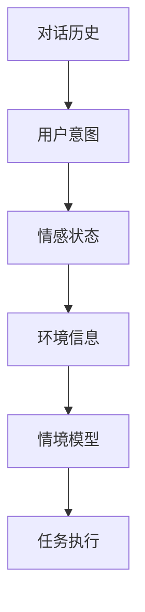
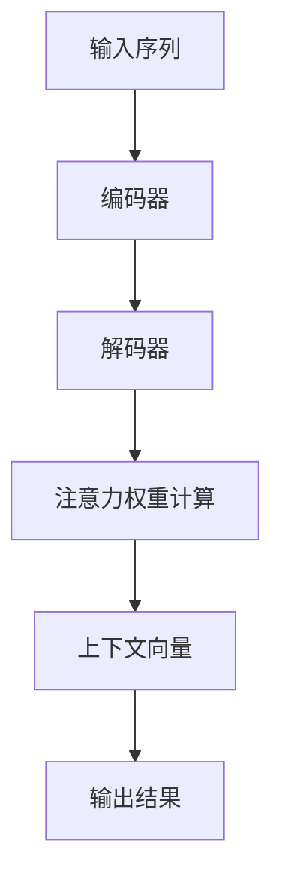
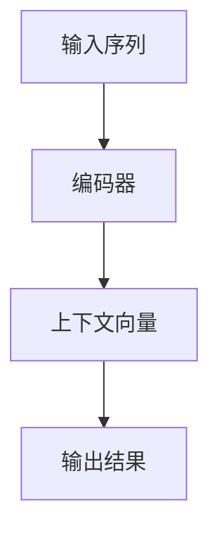
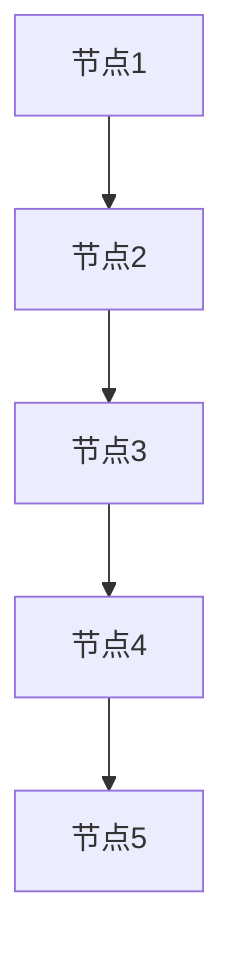
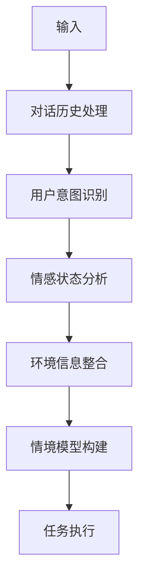
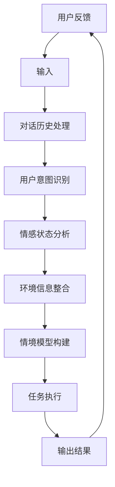

                 


# AI Agent的情境理解：超越单一对话的上下文把握

## 关键词
- AI Agent
- 情境理解
- 上下文处理
- 多轮对话
- 动态语境

## 摘要
AI Agent的情境理解能力是实现智能交互的核心，超越传统的单一对话上下文处理，通过多维度的情境建模和动态语境分析，提升AI Agent在复杂场景中的理解和应对能力，结合实际案例和系统设计，探讨情境理解在AI Agent中的应用及其技术实现。

## 第1章: AI Agent与情境理解概述

### 1.1 问题背景
#### 1.1.1 传统对话上下文的局限性
传统AI对话系统主要依赖于单一对话上下文，难以处理多轮对话中复杂的情境变化和语境信息，导致在实际应用中出现理解偏差和任务执行失败。

#### 1.1.2 AI Agent面临的复杂情境挑战
AI Agent在实际应用场景中需要应对复杂的动态情境，包括多轮对话、上下文切换、语境转移和情感变化等，传统上下文处理方法难以满足这些复杂需求。

#### 1.1.3 情境理解的重要性与应用场景
情境理解是实现AI Agent智能交互的关键技术，广泛应用于智能客服、智能助手、智能推荐、智能教育等领域，能够显著提升用户体验和任务执行效率。

### 1.2 问题描述
#### 1.2.1 单一对话上下文的不足
传统单一对话上下文处理方式在复杂对话中容易出现信息遗漏和语境断层，导致对话理解和任务执行失败。

#### 1.2.2 多轮对话中的情境断裂
在多轮对话中，情境信息需要在不同轮次之间保持一致性和连贯性，传统方法难以处理情境信息的动态变化和累积。

#### 1.2.3 复杂场景下的信息缺失问题
在复杂场景中，情境理解需要整合多源信息，包括对话历史、用户意图、环境信息等，传统方法难以有效整合这些信息。

### 1.3 问题解决
#### 1.3.1 引入情境理解的必要性
通过引入情境理解技术，AI Agent能够更好地捕捉和处理多维度的情境信息，提升对话理解和任务执行的准确性。

#### 1.3.2 情境理解的核心目标
情境理解的核心目标是通过整合多源信息，构建动态的情境模型，准确理解对话中的情境信息，支持智能决策和任务执行。

#### 1.3.3 情境理解与任务执行的结合
将情境理解与任务执行紧密结合，AI Agent能够根据情境信息动态调整任务执行策略，提高任务执行的成功率和用户体验。

### 1.4 概念结构与核心要素
#### 1.4.1 情境理解的定义与属性
情境理解是指AI Agent在对话过程中，通过整合多维度信息，构建动态的情境模型，准确理解对话中的情境信息，支持智能决策和任务执行。

#### 1.4.2 核心要素的组成与关系
情境理解的核心要素包括对话历史、用户意图、情感状态、环境信息等，这些要素相互关联，共同构建动态的情境模型。

#### 1.4.3 情境理解的边界与外延
情境理解的边界在于如何有效整合多源信息，构建动态的情境模型，外延则涉及如何将情境理解应用于实际场景，提升AI Agent的智能水平。

## 第2章: 情境理解的核心概念与联系

### 2.1 情境理解的原理
#### 2.1.1 情境理解的多维度特征
情境理解具有多维性、动态性和关联性等特征，需要从多个维度整合信息，构建动态的情境模型。

#### 2.1.2 语境、上下文与情境的关系
语境是指语言使用的具体环境，上下文是指对话中的历史信息，情境则是指整个对话的背景和环境信息，三者相互关联，共同影响对话理解和任务执行。

#### 2.1.3 情境理解的动态性与持续性
情境理解需要随着对话的进行动态更新和调整，保持对当前情境的准确理解。

### 2.2 核心概念对比
#### 2.2.1 情境理解与传统上下文处理的对比
| 对比维度 | 情境理解 | 传统上下文处理 |
|----------|----------|----------------|
| 信息维度 | 多维度   | 单一维度       |
| 动态性    | 动态     | 静态           |
| 范围      | 宽泛     | 局限           |

#### 2.2.2 不同情境理解方法的优劣势分析
- 基于规则的方法：优点是简单易懂，缺点是难以应对复杂情境。
- 基于统计的方法：优点是能够处理大量数据，缺点是缺乏解释性。
- 基于深度学习的方法：优点是能够捕捉复杂模式，缺点是需要大量数据和计算资源。

#### 2.2.3 情境理解与任务规划的协同关系
情境理解与任务规划密切相关，任务规划需要基于对情境的理解，情境理解则需要任务规划的反馈来动态调整。

### 2.3 实体关系图


## 第3章: 情境理解的算法原理

### 3.1 注意力机制在情境理解中的应用
#### 3.1.1 注意力机制的基本原理
注意力机制通过计算输入序列中各个位置的重要性权重，聚焦于关键信息，提升模型对重要信息的处理能力。

#### 3.1.2 在情境理解中的具体实现


#### 3.1.3 注意力机制的代码实现
```python
import numpy as np

def compute_attention(input_seq, attention_weights):
    # 计算每个位置的注意力权重
    weights = np.exp(attention_weights)
    # 对权重进行归一化
    weights = weights / np.sum(weights)
    # 计算加权和
    context_vector = np.sum(input_seq * weights, axis=1)
    return context_vector
```

### 3.2 上下文建模算法
#### 3.2.1 基于序列的上下文建模


#### 3.2.2 基于图结构的上下文建模


#### 3.2.3 上下文建模的代码实现
```python
class ContextModel:
    def __init__(self, input_dim, hidden_dim):
        self.input_dim = input_dim
        self.hidden_dim = hidden_dim
        self.weights = np.random.randn(input_dim, hidden_dim)
    
    def forward(self, inputs):
        return np.dot(inputs, self.weights)
    
    def backward(self, error):
        return error * self.weights.T
```

### 3.3 情境理解的数学模型
#### 3.3.1 基于概率论的模型
$$ P(context | input) = \prod_{i=1}^{n} P(context_i | input_i) $$

#### 3.3.2 基于图论的模型
$$ A = (a_{ij})_{n \times n} $$

## 第4章: 系统分析与架构设计

### 4.1 系统架构图


### 4.2 功能模块设计
#### 4.2.1 对话历史处理模块
负责记录和处理对话历史信息，提取关键信息，构建对话历史模型。

#### 4.2.2 用户意图识别模块
通过自然语言处理技术，识别用户的意图和需求，生成意图表示。

#### 4.2.3 情感状态分析模块
分析用户的语言和行为，识别用户的情感状态，生成情感表示。

#### 4.2.4 环境信息整合模块
整合环境信息，如时间、地点、用户身份等，生成环境表示。

#### 4.2.5 情境模型构建模块
将对话历史、用户意图、情感状态和环境信息整合，构建动态的情境模型。

### 4.3 系统架构设计


### 4.4 系统接口设计
- 输入接口：接收对话历史、用户输入、环境信息等。
- 输出接口：输出情境模型和任务执行结果。

### 4.5 系统交互设计


## 第5章: 项目实战

### 5.1 环境安装
安装必要的依赖包，如Python、TensorFlow、Keras等。

### 5.2 核心实现
实现情境理解的核心算法，包括注意力机制、上下文建模和情境模型构建。

### 5.3 案例分析
通过具体案例，展示情境理解技术在实际项目中的应用和效果。

### 5.4 项目小结
总结项目实施过程中的经验和教训，提出改进建议。

## 第6章: 总结与展望

### 6.1 总结
总结全文内容，强调情境理解的重要性和实现方法。

### 6.2 最佳实践 tips
- 合理选择情境理解方法，根据实际需求选择合适的技术。
- 注重多源信息的整合，提升情境模型的准确性和全面性。
- 定期更新和优化情境模型，适应不断变化的对话场景。

### 6.3 小结
情境理解是AI Agent实现智能交互的关键技术，通过多维度的情境建模和动态语境分析，能够显著提升AI Agent的理解能力和应对复杂场景的能力。

### 6.4 注意事项
- 注意情境模型的动态更新，保持对当前情境的准确理解。
- 避免信息过载，合理筛选和整合多源信息。
- 定期进行系统维护和优化，确保系统稳定性和高效性。

### 6.5 拓展阅读
推荐相关的书籍和论文，供读者进一步学习和研究。

---

通过以上内容，我们可以看到，AI Agent的情境理解是一个复杂而重要的技术，需要从多个维度进行建模和分析。通过合理的情境建模和动态语境分析，AI Agent能够更好地理解对话中的情境信息，提升智能交互的效果和用户体验。未来，随着技术的不断发展，情境理解将在更多领域得到广泛应用，推动AI Agent技术的进一步发展。

