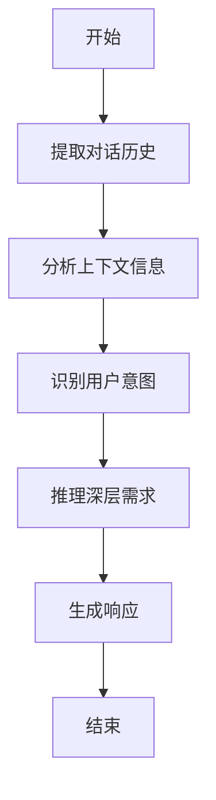
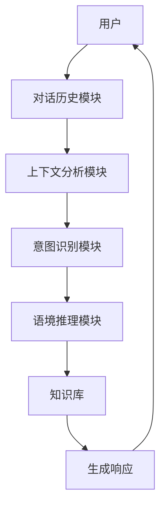
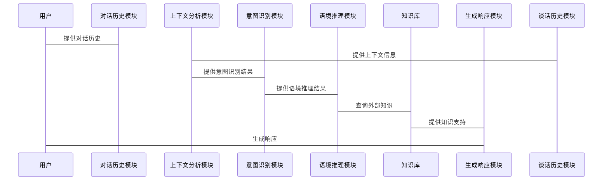

                 


# AI Agent的情境理解：超越单一对话轮次

## 关键词：AI Agent、情境理解、对话轮次、多轮对话、语境推理、知识图谱、自然语言处理

## 摘要：  
在AI Agent的发展中，情境理解是实现智能化交互的核心能力。超越单一对话轮次的情境理解，不仅需要理解当前对话内容，还需结合上下文、历史信息和外部知识，构建更全面的语境理解。本文将深入探讨AI Agent在多轮对话中的情境理解方法，结合语境推理、知识图谱和自然语言处理技术，分析其在实际应用中的挑战与解决方案，为实现更智能的AI交互提供理论支持和技术指导。

---

## 第1章: AI Agent的情境理解概述

### 1.1 情境理解的背景与问题背景  
AI Agent作为人工智能技术的重要应用，广泛应用于智能客服、智能助手、机器人对话等领域。然而，传统的对话系统往往局限于单轮对话，无法有效处理多轮对话中的上下文信息和复杂语境。随着用户需求的复杂化，AI Agent需要具备更深层次的情境理解能力，才能实现更自然、更智能的交互。

#### 1.1.1 当前AI Agent的发展现状  
AI Agent的发展经历了从简单任务执行到复杂场景适应的过程。早期的Agent主要基于规则或关键词匹配进行交互，难以应对复杂多变的用户需求。近年来，随着自然语言处理（NLP）和深度学习技术的进步，AI Agent逐渐具备了理解上下文、推理意图的能力，但在多轮对话中的情境理解仍存在诸多挑战。

#### 1.1.2 情境理解的必要性  
在多轮对话中，用户的需求往往隐含在对话的历史信息中。例如，用户可能在前一轮对话中提到“我需要订一张去北京的机票”，而在下一轮中仅说“我今天有空”，此时AI Agent需要结合上下文理解用户的真实需求。这种能力不仅提升了用户体验，还能提高系统的智能水平。

#### 1.1.3 超越单一对话轮次的意义  
超越单一对话轮次，意味着AI Agent能够持续关注对话的整体情境，而非仅仅关注当前轮次的内容。这种能力使AI Agent能够更好地理解用户的情感、意图和背景信息，从而提供更精准的服务。

### 1.2 情境理解的定义与问题描述  
情境理解是指AI Agent在多轮对话中，通过整合对话历史、上下文信息和外部知识，准确理解用户意图和需求的能力。与单轮对话相比，情境理解更注重跨轮次的信息整合和语境推理。

#### 1.2.1 情境理解的核心概念  
- **对话历史**：用户与AI Agent之间的所有历史对话内容。
- **上下文信息**：与当前对话相关联的背景信息，例如时间、地点、用户身份等。
- **外部知识**：AI Agent可以调用的知识库或外部数据，用于辅助理解用户需求。

#### 1.2.2 问题背景与目标  
当前AI Agent在情境理解中面临的主要问题包括：  
1. 对话历史信息的提取与整合能力不足。  
2. 上下文信息的动态变化难以有效捕捉。  
3. 外部知识的调用与应用效率较低。  

#### 1.2.3 情境理解的边界与外延  
- **边界**：情境理解的范围仅限于对话相关的上下文信息，不涉及外部实时数据或动态变化的环境信息。  
- **外延**：通过语境推理和知识图谱构建，扩展AI Agent的理解能力，使其能够处理更复杂的情境。

### 1.3 情境理解的核心要素与组成  
情境理解由以下几个核心要素组成：  
1. **对话历史**：记录用户与AI Agent之间的所有对话内容。  
2. **上下文信息**：包括用户的身份、位置、时间等背景信息。  
3. **意图识别**：准确识别用户的当前意图和潜在需求。  
4. **语境推理**：基于对话历史和上下文信息，推理用户的深层需求。  

### 1.4 本章小结  
本章介绍了AI Agent情境理解的背景与意义，明确了情境理解的核心概念和问题背景。通过分析对话历史、上下文信息和外部知识，为后续章节的深入探讨奠定了基础。

---

## 第2章: AI Agent的情境理解核心概念与联系

### 2.1 情境理解的核心原理  
情境理解的核心在于通过整合对话历史、上下文信息和外部知识，实现对用户意图的准确识别和语境推理。

#### 2.1.1 情境理解的基本原理  
- **输入**：用户当前的对话内容、对话历史、上下文信息。  
- **处理**：通过语境推理和意图识别，结合外部知识库，理解用户需求。  
- **输出**：生成符合用户需求的响应。  

#### 2.1.2 情境理解的关键特征  
- **动态性**：对话历史和上下文信息会随着对话的进行而动态变化。  
- **关联性**：用户的需求往往与对话历史中的信息密切相关。  
- **复杂性**：多轮对话中的情境理解需要处理多种信息源的整合与推理。  

#### 2.1.3 情境理解的数学模型基础  
情境理解的数学模型通常基于概率论和统计学习方法，例如条件随机场（CRF）和循环神经网络（RNN）。

### 2.2 情境理解的属性特征对比  
以下是不同情境理解方法的对比表格：

| 情境理解方法 | 对话历史依赖性 | 上下文信息利用程度 | 外部知识调用能力 |
|--------------|----------------|---------------------|------------------|
| 单轮对话     | 无             | 低                 | 无              |
| 多轮对话     | 高             | 高                 | 中              |
| 基于知识图谱  | 高             | 高                 | 高              |

#### 2.2.3 情境理解的ER实体关系图  
以下是情境理解的ER实体关系图：

```mermaid
er
    entity 情境 {
        id
        context
        entities
        relations
    }
    entity 对话历史 {
        id
        messages
        timestamps
    }
    entity 用户意图 {
        id
        intent
        slots
    }
    情境 --> 对话历史
    情境 --> 用户意图
```

### 2.3 本章小结  
本章通过对比不同情境理解方法的特征，构建了情境理解的ER实体关系图，为后续章节的算法设计和系统实现提供了理论基础。

---

## 第3章: 情境理解的算法原理与数学模型

### 3.1 情境理解的算法原理  
情境理解的算法通常包括以下几个步骤：  
1. **对话历史提取**：从对话记录中提取相关的信息。  
2. **上下文分析**：分析当前对话的上下文信息。  
3. **意图识别**：基于对话历史和上下文信息，识别用户的意图。  
4. **语境推理**：结合外部知识库，推理用户的深层需求。  

#### 3.1.1 情境理解的输入与输出  
- **输入**：用户当前的对话内容、对话历史、上下文信息。  
- **输出**：用户的意图、潜在需求、可能的响应。

#### 3.1.2 情境理解的处理流程  
以下是情境理解的处理流程图：



#### 3.1.3 情境理解的算法框架  
情境理解的算法框架通常基于循环神经网络（RNN）或变换器（Transformer）模型，结合预训练语言模型（如BERT）进行微调。

### 3.2 情境理解的数学模型  
情境理解的数学模型通常基于概率论和统计学习方法，例如条件随机场（CRF）和循环神经网络（RNN）。

#### 3.2.1 概率模型与损失函数  
以下是概率模型的损失函数示例：

$$
L = -\sum_{i=1}^{n} \log P(y_i|x_i)
$$

其中，$y_i$是真实标签，$x_i$是输入样本。

---

## 第4章: 系统分析与架构设计方案

### 4.1 项目背景介绍  
本项目旨在开发一个具备多轮对话能力的AI Agent，能够通过情境理解实现智能化的用户交互。

#### 4.1.1 系统功能设计  
- **对话历史记录**：记录用户与AI Agent之间的所有对话内容。  
- **上下文分析**：分析对话的上下文信息，包括用户身份、位置、时间等。  
- **意图识别**：基于对话历史和上下文信息，识别用户的意图。  
- **语境推理**：结合外部知识库，推理用户的深层需求。  

#### 4.1.2 系统架构设计  
以下是系统的架构设计图：



#### 4.1.3 系统接口设计  
- **输入接口**：接收用户的对话内容。  
- **输出接口**：生成AI Agent的响应。  
- **知识库接口**：调用外部知识库进行语境推理。  

#### 4.1.4 系统交互流程  
以下是系统交互流程图：



### 4.2 本章小结  
本章通过系统分析与架构设计，明确了AI Agent的情境理解系统的实现方案，为后续章节的项目实战奠定了基础。

---

## 第5章: 项目实战

### 5.1 环境安装  
以下是项目实战所需的环境安装步骤：  
1. 安装Python 3.8及以上版本。  
2. 安装必要的Python库，例如：numpy、pandas、scikit-learn、tensorflow。  

#### 5.1.1 安装步骤  
```bash
pip install numpy pandas scikit-learn tensorflow
```

### 5.2 系统核心实现源代码  
以下是系统核心实现的源代码：

```python
import numpy as np
from sklearn.metrics import accuracy_score
from tensorflow.keras.models import Sequential
from tensorflow.keras.layers import LSTM, Dense, Dropout

# 定义情境理解模型
def build_model(input_shape):
    model = Sequential()
    model.add(LSTM(128, return_sequences=True, input_shape=input_shape))
    model.add(Dropout(0.5))
    model.add(LSTM(64, return_sequences=True))
    model.add(Dropout(0.5))
    model.add(Dense(1, activation='sigmoid'))
    model.compile(loss='binary_crossentropy', optimizer='adam', metrics=['accuracy'])
    return model

# 训练模型
model = build_model((max_len, embedding_dim))
model.fit(X_train, y_train, epochs=10, batch_size=32, validation_data=(X_val, y_val))

# 评估模型
y_pred = model.predict(X_test)
print('准确率:', accuracy_score(y_true, np.round(y_pred)))
```

#### 5.2.1 代码解读与分析  
上述代码定义了一个基于LSTM的模型，用于情境理解任务。模型通过两层LSTM进行序列建模，最后通过全连接层进行分类。

### 5.3 实际案例分析与详细讲解  
以下是一个实际案例分析：  
假设用户在对话中提到“我需要订一张去北京的机票”，而在下一轮对话中仅说“我今天有空”。AI Agent需要结合对话历史和上下文信息，理解用户的真实需求。

#### 5.3.1 案例分析  
- 对话历史：用户提到需要订机票。  
- 上下文信息：用户身份、时间、地点等。  
- 意图识别：用户希望订机票。  
- 语境推理：结合对话历史和上下文信息，AI Agent可以推断出用户的具体需求。

#### 5.3.2 解析与总结  
通过上述案例，可以看出情境理解在多轮对话中的重要性。AI Agent需要结合对话历史和上下文信息，准确理解用户意图，提供更精准的服务。

### 5.4 本章小结  
本章通过项目实战，详细讲解了AI Agent的情境理解系统的实现过程，包括环境安装、代码实现和案例分析，为读者提供了实践指导。

---

## 第6章: 最佳实践与总结

### 6.1 总结与关键点  
- **总结**：AI Agent的情境理解是实现智能化交互的核心能力，通过多轮对话中的上下文信息和外部知识，能够更好地理解用户需求。  
- **关键点**：动态性、关联性和复杂性是情境理解的核心特征。  

### 6.2 注意事项与建议  
- **注意事项**：在实际应用中，需要结合具体场景选择合适的情境理解方法。  
- **建议**：通过不断优化算法和扩展知识库，提升AI Agent的情境理解能力。

### 6.3 未来展望与拓展阅读  
- **未来展望**：随着NLP和深度学习技术的不断进步，AI Agent的情境理解能力将更加智能化和个性化。  
- **拓展阅读**：建议读者进一步学习知识图谱构建、对话系统设计和语境推理的相关知识。

### 6.4 本章小结  
本章总结了AI Agent情境理解的关键点，提出了注意事项和建议，并展望了未来的发展方向，为读者提供了进一步学习和实践的指导。

---

## 结语  
AI Agent的情境理解是实现智能化交互的核心能力，通过多轮对话中的上下文信息和外部知识，能够更好地理解用户需求。本文通过理论分析、算法设计和项目实战，全面探讨了AI Agent的情境理解方法，为实现更智能的AI交互提供了理论支持和技术指导。

