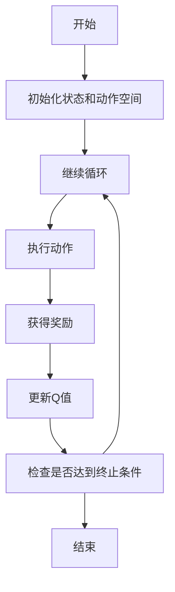
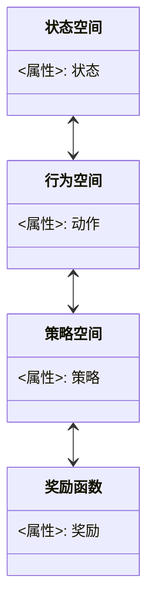
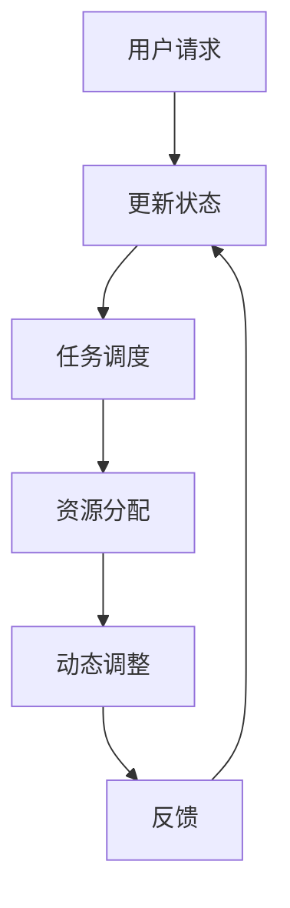
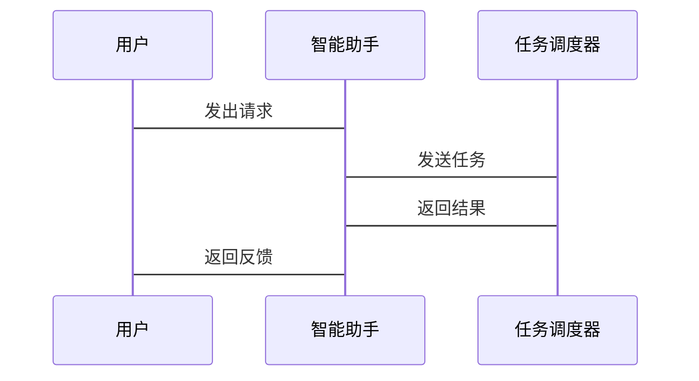

                 


# AI Agent的情境适应学习：提高在复杂环境中的表现

> 关键词：AI Agent，情境适应学习，复杂环境，动态策略，多模态学习，自适应机制

> 摘要：本文深入探讨了AI Agent在复杂环境中的情境适应学习，分析了其核心概念、算法原理、系统架构及项目实现，旨在提高AI Agent在复杂环境中的表现。

---

## 第一部分: AI Agent的情境适应学习背景介绍

### 第1章: 问题背景与描述

#### 1.1 问题背景
AI Agent（智能体）在复杂环境中的表现依赖于其学习能力。复杂环境具有动态性、不确定性、多样性和模糊性，传统学习方法难以应对这些挑战。情境适应学习通过实时调整策略，帮助AI Agent更好地适应复杂环境。

#### 1.2 问题描述
复杂环境中，AI Agent需要处理多变的任务和环境条件。传统强化学习在静态环境中表现良好，但在动态环境中容易失效。情境适应学习通过动态调整策略，解决了这一问题。

#### 1.3 问题解决与核心要素
情境适应学习的核心要素包括自适应机制、动态环境监测和多模态数据融合。这些要素使AI Agent能够实时调整策略，适应复杂环境。

---

## 第2章: 核心概念与联系

### 2.1 情境适应学习的基本原理
情境适应学习通过自适应机制，实时更新策略，以应对环境变化。动态环境中的策略调整基于当前状态和历史经验，而多模态学习整合了多种数据源，增强了适应性。

### 2.2 核心概念对比表
以下是情境适应学习与传统学习方法的对比：

| **特性**           | **传统强化学习**          | **情境适应学习**         |
|--------------------|--------------------------|--------------------------|
| 环境动态性          | 静态或低动态             | 高动态                   |
| 策略调整频率        | 低频或固定               | 高频或实时               |
| 数据来源            | 单一模态                 | 多模态                   |
| 适应能力            | 较低                    | 较高                    |

### 2.3 ER实体关系图
情境适应学习的实体关系图如下：

```mermaid
er
    %% 情境适应学习的实体关系图
    title 情境适应学习的实体关系图
    rectangle 状态空间 {
        组件: 状态
    }
    rectangle 行为空间 {
        组件: 动作
    }
    rectangle 奖励函数 {
        组件: 奖励
    }
    rectangle 策略空间 {
        组件: 策略
    }
    rectangle 动态环境 {
        组件: 环境状态
    }
    状态空间 --> 奖励函数
    行为空间 --> 策略空间
    策略空间 --> 动态环境
    动态环境 --> 状态空间
```

---

## 第3章: 算法原理讲解

### 3.1 情境适应学习的数学模型
情境适应学习的数学模型如下：

$$ V(s) = \max_a Q(s,a) $$

其中，$s$ 是状态，$a$ 是动作，$Q(s,a)$ 是动作的价值函数。

### 3.2 算法实现代码
以下是情境适应学习算法的Python实现：

```python
class ContextAdaptiveLearning:
    def __init__(self, state_space, action_space):
        self.state_space = state_space
        self.action_space = action_space
        self.Q = {}  # Q值存储

    def update_Q(self, s, a, reward):
        # 更新Q值
        self.Q[(s, a)] = reward

    def choose_action(self, s):
        # 根据Q值选择动作
        max_a = None
        max_q = -float('inf')
        for a in self.action_space:
            q = self.Q.get((s, a), 0)
            if q > max_q:
                max_q = q
                max_a = a
        return max_a

    def adapt_strategy(self, new_state):
        # 根据新状态调整策略
        self.state_space.add(new_state)
```

### 3.3 算法流程图
以下是情境适应学习算法的流程图：



---

## 第4章: 系统分析与架构设计

### 4.1 问题场景介绍
以智能助手为例，复杂任务包括任务调度、资源分配和动态调整。系统需要实时监测环境变化，动态调整策略。

### 4.2 系统功能设计
以下是领域模型类图：



### 4.3 系统架构设计
以下是系统架构图：



### 4.4 系统接口设计
以下是系统交互序列图：



---

## 第5章: 项目实战

### 5.1 环境安装与配置
安装必要的库和工具，例如Python、TensorFlow、Mermaid和Jupyter Notebook。

### 5.2 核心代码实现
以下是情境适应学习算法的实现代码：

```python
# 安装必要的库
pip install numpy matplotlib

# 状态空间和动作空间定义
state_space = ['s1', 's2', 's3']
action_space = ['a1', 'a2', 'a3']

# 初始化Q表
Q = { (s, a): 0 for s in state_space for a in action_space }

# 训练过程
for episode in range(100):
    current_state = 's1'
    while True:
        action = choose_action(current_state)
        next_state = transition(current_state, action)
        reward = get_reward(current_state, action, next_state)
        update_Q(current_state, action, reward)
        current_state = next_state
        if is_terminal(current_state):
            break
```

### 5.3 案例分析与解读
以智能助手为例，训练过程包括初始化状态和动作空间，选择动作，执行动作，获得奖励，更新Q值，直到达到终止条件。

---

## 第6章: 最佳实践与总结

### 6.1 最佳实践 tips
- 定期更新策略以适应环境变化。
- 使用多模态数据提高适应性。
- 监控系统性能，及时调整参数。

### 6.2 小结
情境适应学习通过自适应机制和多模态学习，在复杂环境中显著提高了AI Agent的表现。

### 6.3 注意事项
- 确保数据质量和多样性。
- 防止过拟合，保持模型泛化能力。
- 监控系统稳定性，避免策略崩溃。

### 6.4 拓展阅读
- 《Reinforcement Learning: Theory and Algorithms》
- 《Adaptive Dynamic Programming and Its Applications》

---

通过以上内容，我们系统地介绍了AI Agent的情境适应学习，从理论到实践，帮助读者深入理解并掌握这一技术。

