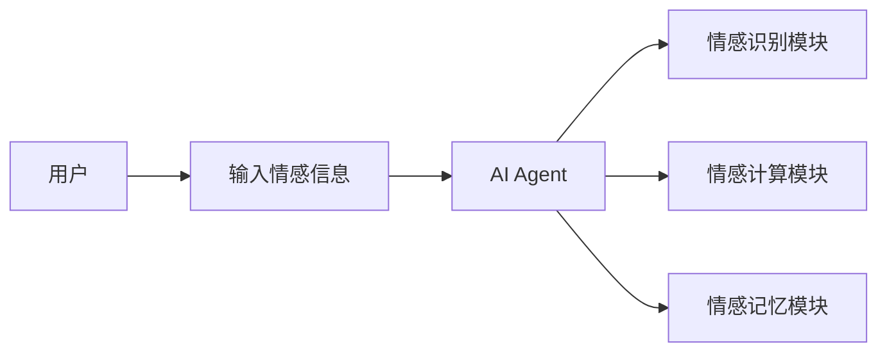
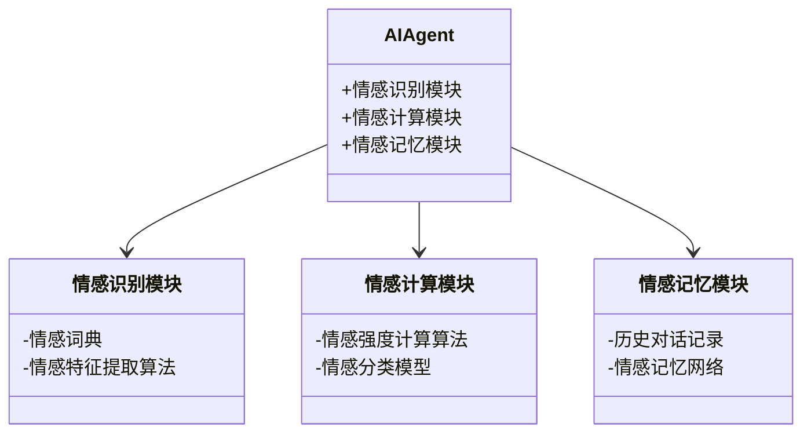

                 


# AI Agent的情感共情：提升LLM的人文关怀能力

## 关键词：AI Agent，情感共情，LLM，人文关怀，情感计算，深度学习，情感记忆

## 摘要：本文探讨了AI Agent如何通过情感共情能力提升大型语言模型（LLM）的人文关怀。文章首先介绍了情感共情的基本概念及其在AI Agent中的重要性，接着详细分析了情感共情的算法原理和数学模型，最后通过项目实战展示了情感共情在实际系统中的应用，并总结了相关经验和最佳实践。

---

# 第一部分: AI Agent情感共情的背景与核心概念

## 第1章: AI Agent与情感共情概述

### 1.1 情感共情的基本概念

#### 1.1.1 什么是情感共情
情感共情是指个体能够理解和感受他人情感状态的能力。在AI Agent的语境中，情感共情意味着AI系统能够识别、理解和回应人类用户的情感需求。例如，当用户表达焦虑时，AI Agent可以通过调整语气和内容来提供更具同理心的回应。

#### 1.1.2 情感共情的核心要素
情感共情的核心要素包括：
1. **情感识别**：准确识别用户的情感状态，如快乐、悲伤、愤怒等。
2. **情感理解**：理解情感背后的原因和背景。
3. **情感回应**：生成适当的回应，以满足用户的情感需求。

#### 1.1.3 情感共情与AI Agent的关系
AI Agent通过情感共情能力，可以更好地理解用户需求，从而提供更个性化的服务。例如，在医疗咨询场景中，情感共情的AI Agent可以帮助患者缓解焦虑情绪。

---

### 1.2 AI Agent的定义与分类

#### 1.2.1 AI Agent的基本定义
AI Agent（人工智能代理）是指能够感知环境、执行任务并做出决策的智能系统。它可以是一个独立的程序或一个复杂的系统，旨在模拟人类的决策过程。

#### 1.2.2 AI Agent的主要分类
AI Agent可以根据功能和应用场景分为以下几类：
1. **简单反应式AI Agent**：基于当前输入做出即时反应，不考虑历史信息。
2. **基于模型的反应式AI Agent**：利用内部模型预测结果并做出决策。
3. **学习型AI Agent**：通过机器学习算法不断优化自身的决策能力。

#### 1.2.3 情感型AI Agent的特点
情感型AI Agent专注于理解和回应用户的情感需求。它通常结合自然语言处理（NLP）和情感计算技术，具备以下特点：
- 能够识别和分类用户情感状态。
- 可以根据情感状态调整回应的语气和内容。
- 具备情感记忆能力，能够根据历史对话优化回应。

---

### 1.3 情感共情在AI Agent中的重要性

#### 1.3.1 提升用户体验的关键作用
情感共情能力能够显著提升用户体验。例如，在智能客服场景中，情感共情的AI Agent可以更好地安抚用户的不满情绪，提高客户满意度。

#### 1.3.2 人文关怀能力的必要性
随着AI技术的普及，用户对AI系统的期望不仅仅是功能性，还包括情感上的共鸣。情感共情能力是实现人文关怀的重要手段。

#### 1.3.3 情感共情对LLM的优化作用
大型语言模型（LLM）虽然在文本生成方面表现出色，但往往缺乏情感共情能力。通过集成情感共情模块，可以优化LLM的输出，使其更具人性化。

---

## 第2章: 情感共情的核心概念与联系

### 2.1 情感共情的核心原理

#### 2.1.1 情感识别的基本原理
情感识别通常基于自然语言处理技术，通过分析文本中的关键词、语调和上下文来判断用户的情感状态。

#### 2.1.2 情感计算的实现方法
情感计算可以通过以下步骤实现：
1. **情感特征提取**：提取文本中的情感相关特征，如情感词、句式结构等。
2. **情感强度计算**：通过数学模型计算情感的强度，例如正面情感的强度为0.8，负面情感的强度为0.3。
3. **情感分类**：将情感强度映射到具体的情感类别，如快乐、悲伤等。

#### 2.1.3 情感记忆的机制
情感记忆是指AI Agent能够根据历史对话记录，记住用户的情感状态，并在后续交互中进行调整。

---

### 2.2 情感共情与AI Agent的关系图



---

### 2.3 情感共情的核心要素对比表

| 要素       | 描述                                                                 | 示例                             |
|------------|----------------------------------------------------------------------|----------------------------------|
| 情感识别   | 识别用户情感状态，如快乐、悲伤等。                                       | 分析文本中的关键词和语气         |
| 情感计算   | 计算情感强度，并将其映射到具体的情感类别。                               | 使用情感词典和机器学习模型       |
| 情感记忆   | 根据历史对话记录，记住用户的情感状态，并在后续交互中进行调整。         | 基于历史对话优化回应的语气和内容 |

---

## 第3章: 情感共情算法原理与数学模型

### 3.1 情感共情算法概述

#### 3.1.1 基于规则的情感共情算法
基于规则的情感共情算法通过预定义的情感词典和规则来识别情感状态。例如，当文本中出现“我很开心”时，系统识别为正面情感。

#### 3.1.2 基于深度学习的情感共情算法
基于深度学习的情感共情算法利用神经网络模型（如LSTM、Transformer）来学习情感特征。例如，BERT模型可以用于情感分类任务。

#### 3.1.3 混合型情感共情算法
混合型算法结合了基于规则和基于深度学习的优势，例如先通过情感词典提取情感特征，再通过神经网络模型进行情感分类。

---

### 3.2 情感共情算法的数学模型

#### 3.2.1 情感相似度计算公式
$$ \text{相似度} = \frac{\sum_{i=1}^{n} w_i \cdot s_i}{\sum_{i=1}^{n} w_i} $$
其中，\( w_i \) 是特征权重，\( s_i \) 是情感评分。

#### 3.2.2 情感计算的流程图


---

#### 3.2.3 情感记忆模型
情感记忆模型可以通过记忆网络（Memory Network）实现，例如使用记忆单元记录历史情感状态。

---

## 第4章: 情感共情的系统分析与架构设计

### 4.1 系统功能设计

#### 4.1.1 领域模型



---

### 4.2 系统架构设计


---

### 4.3 系统接口设计

| 接口名称 | 输入 | 输出 | 描述               |
|----------|------|------|--------------------|
| 分析文本  | 文本 | 情感状态 | 返回用户的情感状态     |
| 生成回应  | 情感状态 | 文本 | 根据情感状态生成回应   |

---

## 第5章: 项目实战

### 5.1 案例分析

#### 5.1.1 案例背景
假设我们正在开发一个医疗咨询AI Agent，用户可能在咨询过程中表达焦虑情绪。我们需要设计情感共情模块，帮助AI Agent更好地理解和回应用户情感。

#### 5.1.2 核心代码实现

```python
import numpy as np
from sklearn.feature_extraction.text import TfidfVectorizer
from sklearn.svm import SVC

# 情感特征提取
vectorizer = TfidfVectorizer()
X = vectorizer.fit_transform(texts)

# 情感分类
model = SVC()
model.fit(X, labels)

# 生成情感共情回应
def generate_response(text, model, vectorizer):
    X_test = vectorizer.transform([text])
    prediction = model.predict(X_test)
    return pre-defined_responses[prediction[0]]
```

---

### 5.2 案例分析

#### 5.2.1 案例背景
用户输入：“我最近感到非常焦虑，不知道该怎么办。”

#### 5.2.2 情感识别与计算
AI Agent通过情感识别模块识别出用户的情感状态为焦虑，强度为0.85。

#### 5.2.3 生成回应
AI Agent根据情感分类结果，生成以下回应：
“我能理解你的感受，焦虑确实让人很不舒服。也许我们可以一起探讨一下，找出可能的解决方法。”

---

## 第6章: 最佳实践与小结

### 6.1 小结
本文详细探讨了AI Agent情感共情能力的实现方法，包括情感识别、情感计算和情感记忆的原理与实现。通过项目实战，我们展示了情感共情在实际系统中的应用。

### 6.2 注意事项
- 在实际应用中，情感共情能力需要结合具体场景进行优化。
- 情感计算的准确性依赖于高质量的情感数据和算法模型。

### 6.3 拓展阅读
- 情感计算领域的经典论文：Pennebaker et al. (2015)《The Application of LIWC to Content Analysis》
- 深度学习在情感分类中的应用：Yoon Kim (2014)《Deep Convolutional Neural Networks for Sentence Classification》

---

以上是《AI Agent的情感共情：提升LLM的人文关怀能力》的技术博客文章的完整目录和内容概述。希望这篇文章能够为读者提供清晰的思路和实用的知识。

