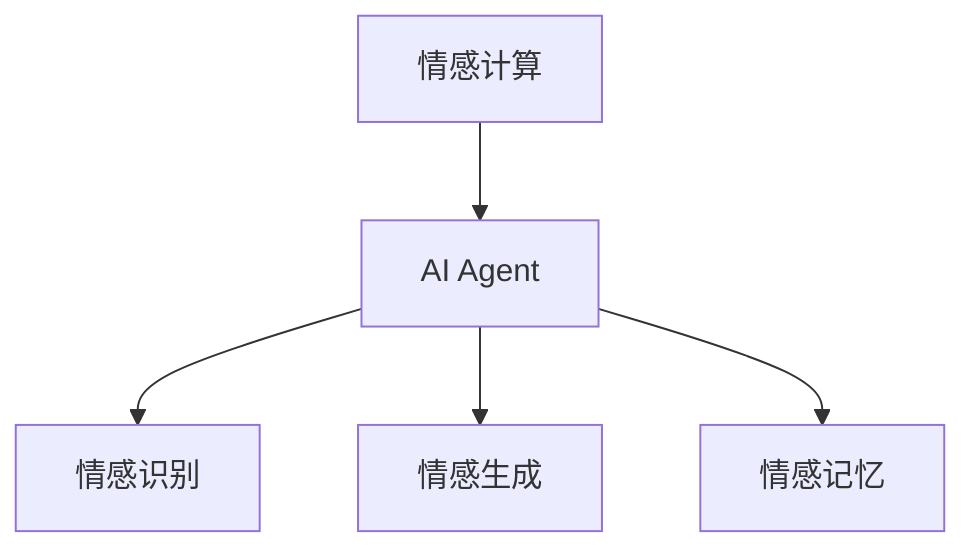

                 


# AI Agent的情感智能：利用LLM实现情感计算

> 关键词：AI Agent，情感计算，LLM，自然语言处理，情感智能，人机交互

> 摘要：随着人工智能技术的快速发展，AI Agent（人工智能代理）在各个领域的应用越来越广泛。为了提升人机交互的质量，情感智能成为AI Agent的重要组成部分。本文将详细介绍如何利用大语言模型（LLM）实现情感计算，探讨情感计算的核心概念、算法原理、系统架构以及实际应用案例，为读者提供全面的理论和实践指导。

---

## 目录大纲

### 目录

1. [AI Agent情感智能概述](#ai-agent情感智能概述)
   1.1 情感计算与AI Agent的基本概念
   1.2 情感计算的核心概念
   1.3 AI Agent的情感智能应用前景

2. [情感计算与AI Agent的核心概念](#情感计算与ai-agent的核心概念)
   2.1 情感计算的核心原理
   2.2 AI Agent的情感智能属性
   2.3 情感计算与AI Agent的实体关系图

3. [情感计算的算法原理](#情感计算的算法原理)
   3.1 情感计算的基本算法
   3.2 大语言模型（LLM）在情感计算中的应用
   3.3 情感计算的数学模型与公式

4. [系统分析与架构设计](#系统分析与架构设计)
   4.1 系统功能设计
   4.2 系统架构设计
   4.3 系统交互设计

5. [项目实战：利用LLM实现情感计算](#项目实战利用llm实现情感计算)
   5.1 项目背景与目标
   5.2 项目实现步骤
   5.3 项目代码实现
   5.4 项目案例分析

6. [高级应用与未来趋势](#高级应用与未来趋势)
   6.1 情感智能的高级应用
   6.2 情感计算的未来发展趋势
   6.3 情感智能在不同领域的应用前景

---

## 正文

### 第1章: AI Agent情感智能概述

#### 1.1 情感计算与AI Agent的基本概念

- **情感计算的定义与背景**
  情感计算（Affective Computing）是研究如何利用计算机技术来识别、理解和模拟人类情感的一门交叉学科。随着人工智能的快速发展，情感计算在自然语言处理、人机交互等领域得到了广泛应用。

- **AI Agent的基本概念与特点**
  AI Agent是一种智能体，能够感知环境并采取行动以实现目标。AI Agent的核心特点包括自主性、反应性、目标导向性和社交能力。

- **情感智能在AI Agent中的重要性**
  情感智能使AI Agent能够理解用户的情感状态，从而提供更加个性化和人性化的服务。这对于提升用户体验和增强人机交互的自然性至关重要。

#### 1.2 情感计算的核心概念

- **情感分析与生成的定义**
  情感分析是判断文本中表达的情感倾向（如正面、负面或中性），而情感生成则是根据输入生成具有特定情感倾向的文本。

- **情感计算的基本原理**
  情感计算通过分析文本中的关键词、句式结构和语调来推断情感状态。深度学习模型，如循环神经网络（RNN）和变压器（Transformer），在情感计算中发挥了重要作用。

- **情感计算与自然语言处理的关系**
  情感计算是自然语言处理的一个子领域，依赖于文本表示、情感分类和生成等技术。

#### 1.3 AI Agent的情感智能应用前景

- **情感智能在人机交互中的应用**
  情感智能使AI Agent能够理解用户的情绪，从而提供更加个性化的服务，如情感支持和情感反馈。

- **情感智能在智能助手中的作用**
  智能助手通过情感计算能够更好地理解用户需求，提供更贴心的服务，如情感陪伴和情感支持。

- **情感智能的未来发展趋势**
  随着技术的进步，情感智能将更加智能化和个性化，AI Agent将能够处理更复杂的情感信息，提供更深层次的情感支持。

---

### 第2章: 情感计算与AI Agent的核心概念

#### 2.1 情感计算的核心原理

- **情感计算的基本流程**
  1. **文本预处理**：包括分词、停用词处理和词干提取。
  2. **特征提取**：通过词袋模型或词嵌入模型提取文本特征。
  3. **情感分类**：利用机器学习或深度学习模型对文本进行情感分类。

- **情感计算的关键技术**
  - **文本表示**：如词袋模型、词嵌入（Word2Vec）和BERT。
  - **情感分类**：如支持向量机（SVM）、随机森林和深度学习模型（如LSTM和Transformer）。
  - **情感生成**：如基于生成对抗网络（GAN）的情感生成模型。

- **情感计算与AI Agent的结合**
  AI Agent通过情感计算技术，能够实时分析用户的情感状态，并生成相应的回应，从而实现情感交互。

#### 2.2 AI Agent的情感智能属性

- **情感识别能力**
  AI Agent能够通过分析用户输入的文本或语音，识别出用户的情感状态，如快乐、悲伤、愤怒等。

- **情感生成能力**
  AI Agent能够根据用户的情感需求，生成具有相应情感倾向的回应，增强交互的自然性。

- **情感记忆与学习能力**
  AI Agent能够记录用户的情感历史，并通过机器学习算法不断优化情感计算模型，提升情感识别和生成的准确性。

#### 2.3 情感计算与AI Agent的实体关系图



---

### 第3章: 情感计算的算法原理

#### 3.1 情感计算的基本算法

- **基于词袋模型的情感分析**
  词袋模型是一种简单的文本表示方法，将文本表示为单词的集合，不考虑单词的顺序。例如，对于文本“我非常高兴”，词袋模型将其表示为{我, 非常, 高兴}。

- **基于深度学习的情感分析**
  深度学习模型，如LSTM和Transformer，能够捕捉文本中的长距离依赖关系，提升情感分析的准确性。

- **基于生成模型的情感生成**
  生成模型，如生成对抗网络（GAN）和变体自编码器（VAE），能够生成具有特定情感倾向的文本。

#### 3.2 大语言模型（LLM）在情感计算中的应用

- **LLM的基本原理**
  大语言模型通过大量文本数据的预训练，掌握了丰富的语义信息，能够生成自然流畅的文本。

- **LLM在情感计算中的优势**
  - **上下文理解**：LLM能够理解文本的上下文，生成连贯的情感回应。
  - **多语言支持**：LLM支持多种语言的情感计算，扩展了应用场景。
  - **动态调整**：LLM能够根据用户的情感反馈动态调整生成内容，提升交互体验。

- **LLM在情感计算中的实现步骤**
  1. **输入处理**：将用户的输入文本进行预处理，提取情感特征。
  2. **情感分类**：利用预训练的情感分类模型，判断用户的当前情感状态。
  3. **情感生成**：根据用户的情感需求，生成相应的回应文本。
  4. **反馈优化**：根据用户的反馈，优化情感计算模型，提升准确性和生成效果。

#### 3.3 情感计算的数学模型与公式

- **情感分类的数学模型**
  情感分类可以看作是一个分类问题，目标是将输入文本映射到特定的情感类别。常用的情感分类模型包括支持向量机（SVM）、随机森林（RF）和深度学习模型（如LSTM和Transformer）。

  例如，SVM的优化目标可以表示为：
  $$ \text{min} \frac{1}{2} \|w\|^2 + C \sum_{i=1}^n \max(0, 1 - y_i(w \cdot x_i + b)) $$
  其中，\(w\) 是权重向量，\(b\) 是偏置项，\(y_i\) 是标签，\(x_i\) 是输入特征。

- **情感生成的数学模型**
  情感生成通常基于生成模型，如生成对抗网络（GAN）和变压器模型。例如，生成对抗网络由生成器和判别器两部分组成，目标是最小化生成样本与真实样本之间的差异。

  生成器的损失函数可以表示为：
  $$ \mathcal{L}_{\text{gen}} = -\mathbb{E}_{z \sim p(z)}[\log D(G(z))] $$
  判别器的损失函数可以表示为：
  $$ \mathcal{L}_{\text{dis}} = -\mathbb{E}_{x \sim p(x)}[\log D(x)] - \mathbb{E}_{z \sim p(z)}[\log (1 - D(G(z)))] $$

---

### 第4章: 系统分析与架构设计

#### 4.1 系统功能设计

- **核心功能**
  - **情感识别**：识别用户输入文本的情感状态。
  - **情感生成**：根据情感识别结果生成相应的回应文本。
  - **情感记忆**：记录用户的情感历史，优化后续的情感计算。

- **功能模块**
  - **文本预处理模块**：对输入文本进行分词、停用词处理和词干提取。
  - **情感分类模块**：利用预训练的情感分类模型对文本进行情感分类。
  - **情感生成模块**：根据情感分类结果生成回应文本。

#### 4.2 系统架构设计

- **分层架构**
  系统采用分层架构，包括数据层、表示层、计算层和应用层。

  ```mermaid
  graph TD
      A[数据层] --> B[表示层]
      B --> C[计算层]
      C --> D[应用层]
  ```

- **模块化设计**
  每个功能模块相对独立，便于维护和扩展。

- **接口设计**
  系统提供统一的API接口，方便与其他系统集成。

#### 4.3 系统交互设计

- **用户输入**
  用户通过文本或语音输入与AI Agent进行交互。

- **系统响应**
  AI Agent通过情感计算模块分析用户输入的情感状态，并生成相应的回应。

- **交互流程**
  ```mermaid
  sequenceDiagram
      participant 用户
      participant AI Agent
      用户 -> AI Agent: "我今天很累，能陪我聊聊天吗？"
      AI Agent ->> 用户: "好的，我很乐意陪伴您。您想聊些什么呢？"
      用户 ->> AI Agent: "感觉生活压力好大..."
      AI Agent ->> 用户: "听起来您现在心情有些低落，我们可以聊聊如何缓解压力。"
  ```

---

### 第5章: 项目实战：利用LLM实现情感计算

#### 5.1 项目背景与目标

- **项目背景**
  本项目旨在开发一个基于LLM的情感计算系统，实现情感识别、情感生成和情感记忆功能。

- **项目目标**
  - 实现情感识别功能，能够准确判断用户的情感状态。
  - 实现情感生成功能，能够生成具有特定情感倾向的回应文本。
  - 实现情感记忆功能，记录用户的情感历史，优化后续的情感计算。

#### 5.2 项目实现步骤

1. **环境安装**
   - 安装Python和必要的库，如TensorFlow、PyTorch和Hugging Face的Transformers库。
   
2. **数据准备**
   - 收集和标注情感数据集，如电影评论数据集。

3. **模型训练**
   - 使用预训练的情感分类模型进行微调，提升模型在特定任务上的性能。

4. **系统集成**
   - 将情感识别、情感生成和情感记忆模块集成到AI Agent系统中。

5. **系统测试**
   - 对系统进行功能测试和性能测试，确保系统能够稳定运行。

#### 5.3 项目代码实现

- **情感分类代码示例**
  ```python
  from transformers import pipeline

  # 加载预训练的情感分类模型
  classifier = pipeline("sentiment-analysis")

  # 情感分类
  result = classifier("我今天很高兴")[0]['label']
  print(result)  # 输出：'POSITIVE'
  ```

- **情感生成代码示例**
  ```python
  from transformers import AutoModelForCausalLM, AutoTokenizer

  # 加载预训练的生成模型
  model = AutoModelForCausalLM.from_pretrained('gpt2')
  tokenizer = AutoTokenizer.from_pretrained('gpt2')

  # 情感生成
  input_text = "我今天很难过，"
  inputs = tokenizer.encode(input_text, return_tensors='pt')
  outputs = model.generate(inputs, max_length=50, do_sample=True)
  generated_text = tokenizer.decode(outputs[0], skip_special_tokens=True)
  print(generated_text)  # 输出：我今天很难过，我该怎么办？
  ```

#### 5.4 项目案例分析

- **案例1：情感识别**
  输入文本：“我今天很高兴。”
  输出结果：POSITIVE。

- **案例2：情感生成**
  输入文本：“我今天很难过，”
  输出结果：“我今天很难过，我该怎么办？”

- **案例3：情感记忆**
  系统记录用户的情感历史，如用户最近的情感状态为“SAD”，并根据历史数据优化情感计算模型。

---

### 第6章: 高级应用与未来趋势

#### 6.1 情感智能的高级应用

- **情感陪伴**
  AI Agent可以通过情感计算技术，为用户提供情感陪伴，帮助用户缓解压力和焦虑。

- **情感支持**
  在医疗领域，情感智能可以用于病患者的康复支持，提供情感关怀和心理疏导。

- **情感反馈**
  在教育领域，情感智能可以用于学生的情感评估，提供个性化的学习建议。

#### 6.2 情感计算的未来发展趋势

- **多模态情感计算**
  结合文本、语音和视觉信息，实现更加精准的情感计算。

- **实时情感计算**
  提升情感计算的实时性，满足用户即时交互的需求。

- **个性化情感计算**
  根据用户的个性化需求，定制化情感计算模型，提供更加个性化的服务。

#### 6.3 情感智能在不同领域的应用前景

- **教育**
  情感智能可以用于学生的情感评估和个性化教学。

- **医疗**
  情感智能可以用于病患者的情感支持和康复指导。

- **客服**
  情感智能可以用于客户的情感分析和个性化服务。

---

### 总结

通过本文的详细介绍，我们可以看到，AI Agent的情感智能是实现人机交互的重要组成部分。利用大语言模型（LLM）实现情感计算，不仅能够提升AI Agent的理解能力，还能够增强人机交互的自然性和智能化。未来，随着技术的不断进步，情感智能将在更多领域得到广泛应用，为人类带来更加智能和贴心的服务。

---

### 最佳实践 Tips

- **选择合适的模型**：根据具体任务需求选择适合的情感计算模型，如BERT用于情感分类，GPT用于情感生成。
- **数据预处理**：对输入数据进行充分的预处理，如分词、去停用词和词干提取，提升模型的准确性。
- **模型优化**：通过微调和迁移学习，优化模型在特定任务上的性能。
- **系统集成**：将情感计算模块与其他系统模块无缝集成，确保系统的稳定性和高效性。

---

以上是《AI Agent的情感智能：利用LLM实现情感计算》的完整目录和内容框架。接下来，您可以根据这个大纲和内容，逐步撰写每章的具体内容，确保每个部分都详尽且逻辑清晰。

