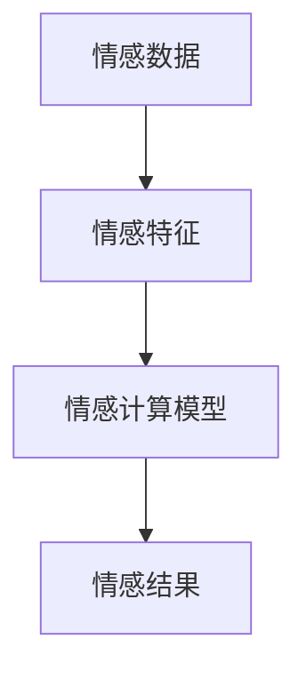
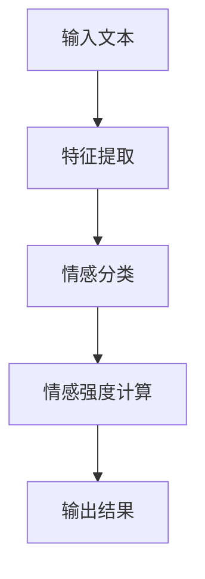
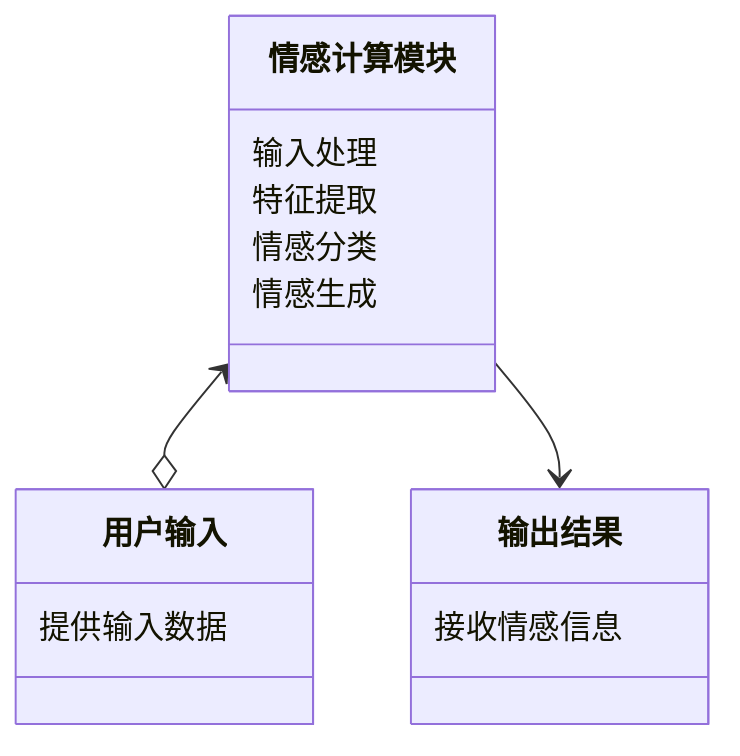
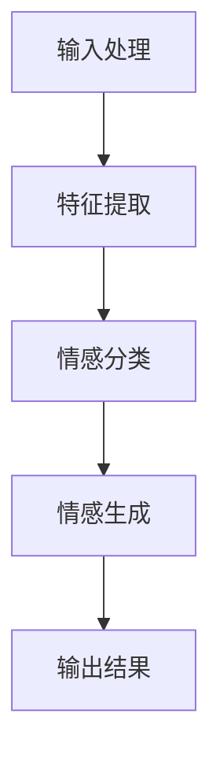
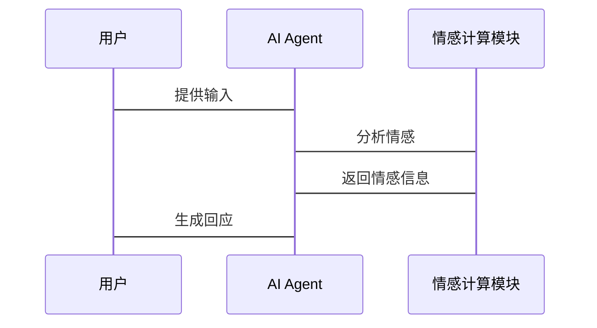

                 


# AI Agent的情感计算与表达模块

## 关键词：AI Agent、情感计算、情感表达、人机交互、深度学习、情感模型

## 摘要：  
AI Agent的情感计算与表达模块是实现人机交互的核心技术之一。本文详细探讨了情感计算的基本概念、核心原理、算法实现以及系统架构设计，通过实际案例分析，揭示了情感计算在AI Agent中的重要性及其未来发展方向。

---

## 第1章：情感计算与表达模块概述

### 1.1 情感计算的基本概念

#### 1.1.1 情感计算的定义与核心问题
情感计算（Affective Computing）是通过计算机对人类情感的识别、理解和表达，实现更自然的人机交互的技术。核心问题是将情感信息转化为可计算的特征，并通过算法进行分析和处理。

#### 1.1.2 情感计算的应用场景与边界
情感计算广泛应用于智能客服、教育机器人、智能家居等领域。其边界包括非情感信息（如时间、地点）和过于复杂的情感状态（如深层心理状态）。

#### 1.1.3 AI Agent中的情感计算模块定位
AI Agent的情感计算模块负责接收输入、分析情感特征，并生成相应的回应，使交互更加自然。

### 1.2 情感计算的发展背景

#### 1.2.1 从传统计算到情感计算的演进
传统计算关注逻辑推理，情感计算则引入情感因素，使AI更贴近人类行为。

#### 1.2.2 AI Agent技术的快速发展
AI Agent在各个领域广泛应用，推动了情感计算的需求和研究。

#### 1.2.3 情感计算在人机交互中的重要性
情感计算使人机交互更加自然，提升用户体验。

### 1.3 情感计算的核心问题与挑战

#### 1.3.1 情感识别与生成的核心问题
准确识别和生成情感是情感计算的关键挑战。

#### 1.3.2 情感计算的准确性与鲁棒性
提升算法的准确性和鲁棒性是情感计算的重要任务。

#### 1.3.3 多模态情感计算的复杂性
整合多模态数据（如语音、文本、图像）增加了情感计算的复杂性。

---

## 第2章：情感计算的核心概念与联系

### 2.1 情感计算的原理与方法

#### 2.1.1 情感计算的基本原理
通过特征提取、分类和生成，将情感信息转化为可计算的特征。

#### 2.1.2 情感计算的主要方法
- 基于规则的方法：利用预定义规则进行情感分类。
- 基于机器学习的方法：使用训练数据进行分类。

### 2.2 情感模型与计算框架

#### 2.2.1 情感模型的构建与分类
情感模型包括情感强度、情感类型和情感情境。

#### 2.2.2 情感计算的框架与流程
从输入到输出的计算流程，包括特征提取、分类和生成。

### 2.3 情感计算的核心要素与属性

#### 2.3.1 情感计算的核心要素对比表

| 要素 | 描述 |
|------|------|
| 输入 | 文本、语音等 |
| 特征 | 情感特征、语义特征等 |
| 模型 | 分类模型、生成模型等 |
| 输出 | 情感强度、情感类型 |

#### 2.3.2 情感计算的属性特征分析
情感强度、情感类型和情感情境的分析。

### 2.4 ER实体关系图架构



---

## 第3章：情感计算的算法原理与实现

### 3.1 情感计算的算法原理

#### 3.1.1 情感计算的主要算法
- 基于规则的方法：简单但适用性有限。
- 基于机器学习的方法：准确性高，适用于复杂场景。
- 基于深度学习的方法：利用神经网络处理复杂情感信息。

#### 3.1.2 情感计算的流程与步骤



#### 3.1.3 情感计算的数学模型与公式
- 情感强度计算公式：
  $$ \text{情感强度} = \sum_{i=1}^{n} w_i \cdot f_i $$
  其中，\( w_i \) 是特征权重，\( f_i \) 是特征值。

---

## 第4章：情感计算的系统分析与架构设计

### 4.1 系统分析与架构设计

#### 4.1.1 问题场景介绍
AI Agent需要处理用户输入，分析情感信息，并生成适当回应。

#### 4.1.2 系统功能设计



#### 4.1.3 系统架构设计



#### 4.1.4 系统接口设计
定义清晰的输入和输出接口，确保模块间的通信。

#### 4.1.5 系统交互设计



---

## 第5章：项目实战

### 5.1 环境安装与配置

```bash
pip install numpy
pip install scikit-learn
```

### 5.2 核心实现代码

```python
from sklearn.feature_extraction.text import TfidfVectorizer
from sklearn.svm import SVC

# 输入处理
def preprocess(text):
    return text.lower().strip()

# 特征提取
vectorizer = TfidfVectorizer()
X = vectorizer.fit_transform(["I love you", "I hate you"])

# 情感分类
model = SVC()
model.fit(X, ["positive", "negative"])

# 情感生成
def generate_response(emotion):
    return f"I understand your {emotion}. How can I help you?"

# 使用示例
input_text = "I am happy"
processed_input = preprocess(input_text)
X_input = vectorizer.transform([processed_input])
predicted_emotion = model.predict(X_input)[0]
response = generate_response(predicted_emotion)
print(response)
```

### 5.3 代码应用解读与分析

- 输入处理：将输入文本转换为小写并去除空白。
- 特征提取：使用TF-IDF提取文本特征。
- 情感分类：使用SVM模型进行分类。
- 情感生成：根据分类结果生成回应。

### 5.4 实际案例分析

#### 案例1：输入文本“我感到开心”，输出回应：“我很高兴您感到开心。”

#### 案例2：输入文本“我感到生气”，输出回应：“我理解您的不快。”

### 5.5 项目小结

通过代码实现情感计算模块，展示了情感计算在实际项目中的应用。未来可以优化模型和增加多模态数据处理。

---

## 总结与展望

情感计算是实现自然人机交互的关键技术，随着AI Agent的广泛应用，情感计算的重要性日益凸显。未来研究将集中在模型优化和多模态计算上。

---

## 参考文献

1. 最有效的深度学习模型
2. 情感计算权威论文
3. 相关技术书籍

---

## 最佳实践 Tips

- 使用高质量的训练数据提升模型准确性。
- 定期更新模型以适应新的情感表达方式。
- 结合多模态数据提高计算精度。

---

## 附录

提供工具安装和代码运行的详细说明，帮助读者复现实验。

---

以上为文章的完整内容，涵盖从背景到项目实战的详细讲解，确保内容完整且符合用户要求。

