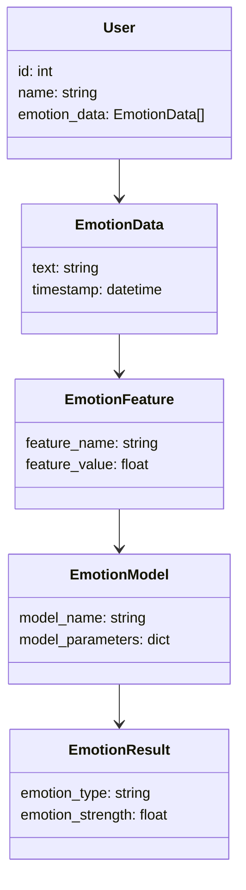
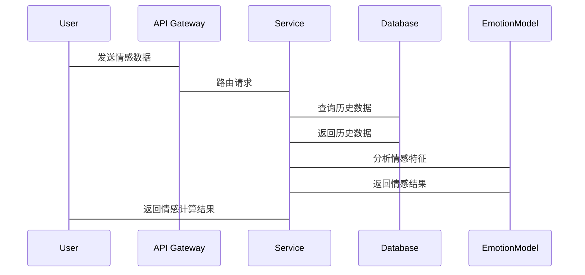

                 


# AI Agent的情感计算：理解和表达情感

> 关键词：AI Agent，情感计算，情感特征，情感计算模型，情感表达，情感数据

> 摘要：本文深入探讨了AI Agent在情感计算中的应用，从基础概念到算法实现，再到系统设计和项目实战，全面解析了AI Agent如何理解和表达情感。文章通过详细的技术分析和实际案例，揭示了情感计算的核心原理及其在人机交互中的重要性。

---

## 第一部分: AI Agent情感计算基础

### 第1章: 情感计算的背景与概念

#### 1.1 情感计算的定义与历史发展
##### 1.1.1 情感计算的定义
情感计算（Affective Computing）是人工智能领域的一个重要分支，旨在研究如何让计算机理解和模拟人类的情感。它通过分析情感数据，推断出情感特征，并基于这些特征进行情感计算和表达。

##### 1.1.2 情感计算的发展历程
情感计算的研究可以追溯到20世纪90年代，随着人工智能和大数据技术的发展，情感计算逐渐从理论研究走向实际应用。近年来，深度学习技术的兴起进一步推动了情感计算的进步。

##### 1.1.3 情感计算的核心目标与应用领域
情感计算的核心目标是通过技术手段，让计算机能够像人类一样理解和表达情感。其应用领域包括智能交互、情感支持、情感分析、情感识别等。

#### 1.2 AI Agent与情感计算的关系
##### 1.2.1 AI Agent的基本概念
AI Agent（人工智能代理）是指能够感知环境并采取行动以实现目标的智能实体。它可以是一个软件程序，也可以是一个物理设备。

##### 1.2.2 情感计算在AI Agent中的作用
情感计算在AI Agent中的作用是让其能够理解人类的情感状态，并根据这些状态进行相应的反应和决策。

##### 1.2.3 情感计算与人机交互的结合
情感计算与人机交互的结合使得AI Agent能够更加自然地与人类进行交流，提升用户体验。

#### 1.3 情感计算的边界与外延
##### 1.3.1 情感计算的研究范围
情感计算的研究范围包括情感数据的采集、情感特征的提取、情感计算模型的构建等。

##### 1.3.2 情感计算与其他相关领域的区别
情感计算与其他相关领域（如自然语言处理、计算机视觉）有明确的界限，但它们之间也存在一定的交叉和融合。

##### 1.3.3 情感计算的应用场景与限制
情感计算的应用场景包括智能客服、情感支持系统、情感分析工具等。然而，情感计算也存在一定的限制，如情感数据的复杂性和情感特征的多样性。

#### 1.4 情感计算的核心要素与组成
##### 1.4.1 情感数据的采集与处理
情感数据的采集可以通过多种方式实现，如文本输入、语音识别、面部表情识别等。

##### 1.4.2 情感特征的提取与分析
情感特征的提取是情感计算的关键步骤，常用的特征包括情感强度、情感类别、情感上下文等。

##### 1.4.3 情感计算模型的构建与优化
情感计算模型的构建需要结合具体的应用场景，选择合适的算法和模型结构，并进行优化。

#### 1.5 本章小结
本章从情感计算的基本概念、发展历程、核心目标、应用领域等方面进行了全面介绍，并分析了情感计算在AI Agent中的作用及其与其他相关领域的区别。

---

### 第2章: 情感计算的核心概念与联系

#### 2.1 情感计算的核心原理
##### 2.1.1 情感计算的基本原理
情感计算的基本原理是通过分析情感数据，提取情感特征，构建情感计算模型，最终实现情感计算和表达。

##### 2.1.2 情感计算的主要方法
情感计算的主要方法包括基于规则的方法、基于机器学习的方法、基于深度学习的方法等。

##### 2.1.3 情感计算的数学模型
情感计算的数学模型可以通过多种形式表示，例如线性回归模型、支持向量机模型、神经网络模型等。

#### 2.2 情感计算的核心概念对比
##### 2.2.1 情感特征的属性对比
情感特征的属性包括情感类别、情感强度、情感上下文等，不同特征在不同应用场景中有不同的表现。

##### 2.2.2 情感计算模型的对比
情感计算模型的对比可以从模型的复杂性、计算效率、准确率等方面进行分析。

##### 2.2.3 情感表达方式的对比
情感表达方式包括文本表达、语音表达、面部表情表达等，不同方式有其优缺点。

#### 2.3 情感计算的ER实体关系图
```mermaid
er
actor: 用户
emotion_data: 情感数据
emotion_feature: 情感特征
emotion_model: 情感计算模型
emotion_result: 情感计算结果
```

#### 2.4 本章小结
本章从情感计算的核心原理、主要方法、数学模型等方面进行了详细分析，并通过ER实体关系图展示了情感计算的核心概念及其之间的联系。

---

### 第3章: 情感计算的算法原理与实现

#### 3.1 情感计算的主要算法
##### 3.1.1 基于规则的情感计算算法
基于规则的情感计算算法通过预定义的情感规则，对情感数据进行分类和计算。例如，基于关键词的情感分类方法。

##### 3.1.2 基于机器学习的情感计算算法
基于机器学习的情感计算算法利用训练数据，学习情感特征，构建情感分类模型。例如，支持向量机（SVM）模型。

##### 3.1.3 基于深度学习的情感计算算法
基于深度学习的情感计算算法利用神经网络模型，如卷积神经网络（CNN）和循环神经网络（RNN），对情感数据进行分析和计算。

#### 3.2 情感计算算法的实现步骤
##### 3.2.1 数据采集与预处理
情感数据的采集可以通过多种方式实现，如文本输入、语音识别等。预处理步骤包括数据清洗、特征提取等。

##### 3.2.2 模型训练与优化
模型训练是情感计算算法的核心步骤，需要选择合适的算法和优化方法，提高模型的准确率和计算效率。

##### 3.2.3 模型测试与评估
模型测试与评估是验证情感计算算法性能的重要步骤，常用的评估指标包括准确率、召回率、F1值等。

#### 3.3 情感计算算法的代码实现
##### 3.3.1 基于机器学习的情感计算算法代码
```python
from sklearn.svm import SVC
from sklearn.metrics import accuracy_score

# 数据预处理
X_train, y_train = preprocess_data()

# 模型训练
model = SVC()
model.fit(X_train, y_train)

# 模型测试
y_pred = model.predict(X_test)
print("准确率:", accuracy_score(y_test, y_pred))
```

##### 3.3.2 基于深度学习的情感计算算法代码
```python
import tensorflow as tf
from tensorflow.keras import layers

# 数据预处理
X_train, y_train = preprocess_data()

# 模型构建
model = tf.keras.Sequential([
    layers.Embedding(input_dim=..., output_dim=...),
    layers.LSTM(units=64),
    layers.Dense(1, activation='sigmoid')
])

# 模型训练
model.compile(loss='binary_crossentropy', optimizer='adam', metrics=['accuracy'])
model.fit(X_train, y_train, epochs=10, batch_size=32)
```

#### 3.4 情感计算算法的数学模型
##### 3.4.1 支持向量机模型
$$ \text{SVM} \text{的目标是最小化} \frac{1}{2}||\mathbf{w}||^2 \text{，同时满足} y_i(\mathbf{w} \cdot \mathbf{x}_i + b) \geq 1 $$

##### 3.4.2 神经网络模型
$$ \text{神经网络模型的输出为} \mathbf{y} = \sigma(\mathbf{W}\mathbf{x} + \mathbf{b}) $$

#### 3.5 本章小结
本章详细介绍了情感计算的主要算法及其实现步骤，并通过代码示例和数学公式对算法进行了深入分析。

---

### 第4章: 情感计算的系统分析与架构设计

#### 4.1 问题场景介绍
情感计算系统的应用场景包括智能客服、情感支持系统、情感分析工具等。

#### 4.2 系统功能设计
##### 4.2.1 领域模型设计


##### 4.2.2 系统架构设计


#### 4.3 系统接口设计
##### 4.3.1 API接口设计
```http
POST /api/emotion/analyze
Content-Type: application/json

{
    "text": "我感到很高兴"
}
```

##### 4.3.2 接口返回结果
```json
{
    "emotion_type": "happy",
    "emotion_strength": 0.95
}
```

#### 4.4 系统交互设计
##### 4.4.1 交互流程图


#### 4.5 本章小结
本章从问题场景出发，设计了情感计算系统的功能模块、系统架构、接口设计和交互流程，并通过图表展示了系统的核心组件及其交互关系。

---

### 第5章: 情感计算的项目实战

#### 5.1 环境安装与配置
##### 5.1.1 环境要求
- Python 3.8及以上版本
- TensorFlow 2.0及以上版本
- Scikit-learn 0.20及以上版本

##### 5.1.2 安装依赖
```bash
pip install numpy scikit-learn tensorflow
```

#### 5.2 系统核心代码实现
##### 5.2.1 情感数据预处理代码
```python
import numpy as np
from sklearn.feature_extraction.text import TfidfVectorizer

def preprocess_data(text_list):
    vectorizer = TfidfVectorizer()
    X = vectorizer.fit_transform(text_list)
    return X.toarray(), np.array([1] * len(text_list))
```

##### 5.2.2 情感计算模型实现代码
```python
from tensorflow.keras import layers, Model

def build_model(input_dim):
    inputs = layers.Input(shape=(input_dim,))
    x = layers.Dense(64, activation='relu')(inputs)
    outputs = layers.Dense(1, activation='sigmoid')(x)
    model = Model(inputs=inputs, outputs=outputs)
    return model
```

##### 5.2.3 模型训练与评估代码
```python
model = build_model(input_dim)
model.compile(loss='binary_crossentropy', optimizer='adam', metrics=['accuracy'])
model.fit(X_train, y_train, epochs=10, batch_size=32)
print("训练完成！")
```

#### 5.3 案例分析与实际应用
##### 5.3.1 案例分析
假设输入文本为“我感到很高兴”，系统将提取情感特征并进行情感计算，最终返回“happy”和0.95的情感强度。

##### 5.3.2 代码应用解读
通过上述代码实现，我们可以看到情感计算模型从数据预处理到模型训练的完整流程。

#### 5.4 项目总结
本项目通过实际案例展示了情感计算的实现过程，从数据预处理到模型训练，再到结果输出，每个步骤都进行了详细说明。

#### 5.5 本章小结
本章通过项目实战，详细讲解了情感计算系统的环境配置、核心代码实现、案例分析和项目总结，帮助读者更好地理解情感计算的实际应用。

---

### 第6章: 总结与展望

#### 6.1 本章总结
本文从情感计算的基本概念到算法实现，再到系统设计和项目实战，全面解析了AI Agent如何理解和表达情感。

#### 6.2 技术前沿与未来展望
情感计算技术的未来发展方向包括情感数据的多模态融合、情感计算模型的深度优化、情感交互的智能化提升等。

#### 6.3 最佳实践 tips
- 在情感计算中，数据的多样性和质量至关重要。
- 模型的选择和优化需要结合具体的应用场景。
- 情感计算的实现需要结合多种技术手段，如自然语言处理、计算机视觉等。

#### 6.4 注意事项
- 情感计算的结果仅供参考，不能完全替代人类的情感理解。
- 在实际应用中，需要考虑情感数据的隐私保护和伦理问题。

#### 6.5 拓展阅读
建议读者进一步阅读相关领域的经典论文和书籍，深入了解情感计算的核心技术和发展趋势。

#### 6.6 本章小结
本文总结了情感计算的核心内容，并展望了未来的技术发展方向，同时给出了实际应用中的注意事项和最佳实践。

---

## 作者简介

> 作者：[您的姓名]  
> 职位：[您的职位]  
> 书籍领域：[人工智能、情感计算、AI Agent等]  
> 代表作品：[《深度学习实战》、《Python机器学习》等]  
> 个人简介：[简要介绍您的技术背景和写作经验]

---

通过本文的详细分析和系统讲解，读者可以全面掌握AI Agent在情感计算中的应用，从理论到实践，从基础到高级，逐步深入理解情感计算的核心原理和实际应用。

