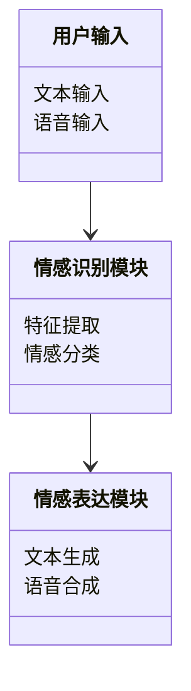
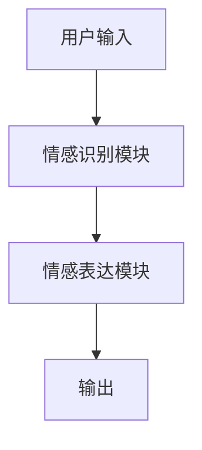
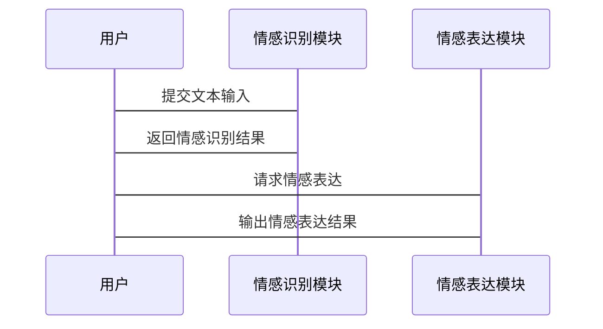

                 


# AI Agent的情感识别与表达能力开发

## 关键词：AI Agent, 情感识别, 情感计算, 深度学习, 机器学习, 情感表达

## 摘要：本文将详细探讨AI Agent在情感识别与表达方面的能力开发。从背景介绍、核心算法、系统架构到项目实战，全面解析情感识别与表达的技术细节，帮助读者掌握AI Agent在情感智能方面的开发要点。

---

# 第1章: AI Agent情感识别与表达能力开发概述

## 1.1 情感计算的基本概念

### 1.1.1 情感计算的定义与背景

情感计算（Affective Computing）是人工智能领域的一个重要分支，旨在通过计算机技术来识别、理解和模拟人类情感。随着人机交互的不断发展，情感计算在教育、医疗、社交等多个领域展现出广泛的应用潜力。

### 1.1.2 AI Agent的定义与特征

AI Agent（人工智能代理）是指能够感知环境、自主决策并执行任务的智能实体。它不仅需要处理数据，还需要具备一定的认知能力，包括理解情感、意图和情境。

### 1.1.3 情感识别的重要性与应用价值

情感识别是AI Agent实现情感智能的核心能力。通过识别用户的情感，AI Agent可以更好地理解用户需求，提供更个性化的服务。例如，在客服系统中，情感识别可以帮助识别用户的情绪状态，从而提供更有效的解决方案。

## 1.2 情感识别与表达的核心概念

### 1.2.1 情感识别的核心要素

情感识别包括以下几个关键步骤：输入数据获取、特征提取、情感分类。其中，特征提取是关键，常用的特征包括文本中的关键词、语调、语气等。

### 1.2.2 情感表达的核心要素

情感表达是指AI Agent通过语言、语气、表情等方式向用户传达情感。这需要结合自然语言处理和语音合成等技术，实现情感化的输出。

### 1.2.3 情感识别与表达的边界与外延

情感识别的边界在于如何准确地提取情感特征，而情感表达的外延则涉及如何将情感信息转化为可感知的形式。

## 1.3 情感识别与表达的关系

### 1.3.1 情感识别为表达提供基础

只有准确识别用户的情感，AI Agent才能进行有效的情感表达。两者相辅相成，共同构成了情感智能的核心。

### 1.3.2 情感表达的反馈作用

情感表达不仅是输出，还可以通过用户反馈进一步优化情感识别模型，形成闭环。

---

# 第2章: 情感识别的核心算法原理

## 2.1 情感识别的原理与方法

### 2.1.1 基于规则的情感识别方法

基于规则的方法通过预定义的情感词汇表和规则库，对文本进行分析。例如，识别文本中的否定词、疑问词等，进而推断情感倾向。

### 2.1.2 基于机器学习的情感识别方法

机器学习方法通过训练模型，从数据中自动学习情感特征。常用算法包括支持向量机（SVM）和朴素贝叶斯（Naive Bayes）。

### 2.1.3 基于深度学习的情感识别方法

深度学习方法利用神经网络模型，如循环神经网络（RNN）和卷积神经网络（CNN），从文本中提取更复杂的特征。

## 2.2 情感识别算法对比分析

### 2.2.1 不同算法的优缺点对比

| 算法类型         | 优点                           | 缺点                           |
|------------------|--------------------------------|--------------------------------|
| 基于规则         | 实现简单，可解释性强             | 需要大量人工规则，难以处理复杂情感 |
| 基于机器学习     | 可自动学习特征，性能较好         | 需要大量标注数据，计算资源需求较高 |
| 基于深度学习     | 特征提取能力强，性能最优         | 需要大量数据，计算资源需求高，可解释性差 |

### 2.2.2 算法选择的依据与策略

算法选择需要考虑数据规模、计算资源和应用场景。对于小规模数据，基于规则的方法可能更合适；对于大规模数据，深度学习方法更具优势。

## 2.3 情感识别的数学模型与公式

### 2.3.1 基于逻辑回归的情感识别模型

$$ P(y=1|x) = \frac{e^{\beta x}}{1 + e^{\beta x}} $$

其中，$x$是输入特征向量，$\beta$是模型参数。

### 2.3.2 基于神经网络的情感识别模型

$$ \text{输出层} = \text{激活函数}(\text{输入层} \times \text{权重} + \text{偏置}) $$

---

# 第3章: 情感表达的核心技术

## 3.1 情感表达的基本原理

### 3.1.1 情感表达的定义

情感表达是AI Agent通过语言、语气、表情等方式向用户传递情感信息的过程。

### 3.1.2 情感表达的实现方式

情感表达可以通过文本生成、语音合成、面部表情合成等多种方式实现。

### 3.1.3 情感表达的关键技术

包括文本生成算法、语音合成技术、面部表情合成技术等。

## 3.2 情感表达的数学模型与公式

### 3.2.1 基于向量空间

情感表达可以通过向量空间模型进行量化，例如使用词嵌入（Word Embedding）技术将情感特征表示为向量。

---

# 第4章: 情感识别与表达的系统架构设计

## 4.1 系统功能设计

### 4.1.1 领域模型



### 4.1.2 系统架构



### 4.1.3 系统交互流程



---

# 第5章: 项目实战——基于深度学习的社交媒体评论情感识别与表达

## 5.1 项目背景与目标

本项目旨在开发一个能够识别社交媒体评论情感并生成相应情感表达的AI Agent。

## 5.2 环境安装与配置

### 5.2.1 环境配置

安装Python、TensorFlow、Keras等必要的库。

## 5.3 核心代码实现

### 5.3.1 情感识别模块

```python
import tensorflow as tf
from tensorflow import keras

# 数据预处理
def preprocess(data):
    # 分词
    words = data['text'].apply(lambda x: x.split())
    # 词向量化
    tokenizer = keras.preprocessing.text.Tokenizer(num_words=10000)
    tokenizer.fit_on_texts(words)
    sequences = tokenizer.texts_to_sequences(words)
    # 填充
    padded_sequences = keras.preprocessing.sequence.pad_sequences(sequences, maxlen=500)
    return padded_sequences, data['label']

# 模型构建
def build_model():
    model = keras.Sequential()
    model.add(keras.layers.Embedding(10000, 100, input_length=500))
    model.add(keras.layers.LSTM(128, dropout=0.2, recurrent_dropout=0.2))
    model.add(keras.layers.Dense(2, activation='softmax'))
    model.compile(loss='sparse_categorical_crossentropy', optimizer='adam', metrics=['accuracy'])
    return model
```

### 5.3.2 情感表达模块

```python
import numpy as np

# 情感表达：生成情感化文本
def generate_text_emotion(emotion):
    if emotion == 0:
        return "看起来你有点生气，有什么我可以帮助你的吗？"
    else:
        return "很高兴能为你提供帮助！"

# 语音合成
import pyttsx3
engine = pyttsx3.init()
engine.setProperty('rate', 150)
engine.setProperty('volume', 1.0)

def speak(text):
    engine.say(text)
    engine.runAndWait()
```

## 5.4 项目总结与优化

### 5.4.1 项目总结

本项目实现了基于深度学习的社交媒体评论情感识别与表达，验证了深度学习方法在情感识别中的有效性。

### 5.4.2 优化方向

未来可以考虑引入更大的数据集，优化模型结构，进一步提高情感识别的准确率。

---

# 第6章: 情感识别与表达能力开发的注意事项与最佳实践

## 6.1 开发注意事项

### 6.1.1 数据质量的重要性

确保数据的多样性和代表性，避免过拟合。

### 6.1.2 模型选择的策略

根据实际需求选择合适的模型，平衡性能和计算资源。

## 6.2 最佳实践

### 6.2.1 数据预处理的技巧

包括分词、去停用词、词向量化等步骤。

### 6.2.2 模型调优的策略

包括交叉验证、超参数优化等方法。

---

# 结语

AI Agent的情感识别与表达能力开发是一个复杂的系统工程，涉及多个技术领域的知识。通过本文的详细讲解，读者可以系统地掌握情感识别与表达的核心技术，并能够实际应用于相关项目开发。

--- 

* THE END *

