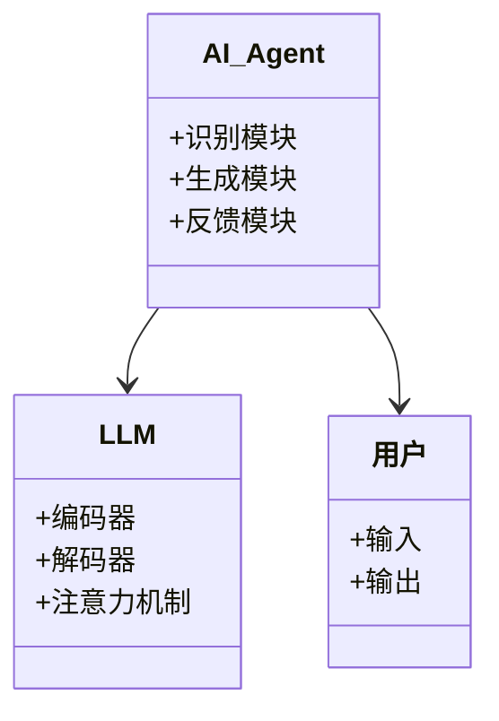
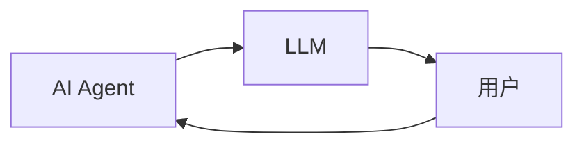
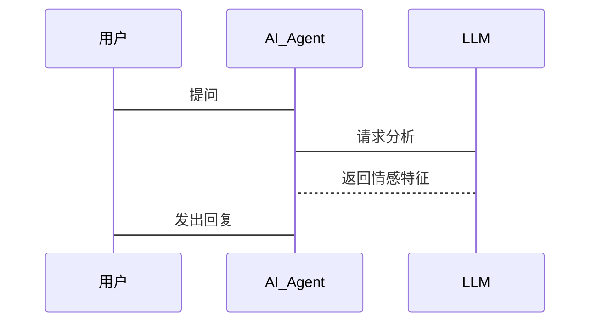

                 


# 《AI Agent的情感调节：利用LLM实现情绪智能交互》

> **关键词**：AI Agent, 情感调节, LLM, 情绪智能, 人机交互

> **摘要**：本文探讨了如何利用大语言模型（LLM）实现AI Agent的情感调节，提升人机交互的情感智能。文章从背景、核心概念、算法原理、系统架构到项目实战，全面解析情感调节的实现过程，提供详细的数学模型和系统设计，最后通过实际案例展示技术应用。

---

## 第1章: AI Agent情感调节的背景与问题描述

### 1.1 情感调节在AI Agent中的重要性

#### 1.1.1 AI Agent的基本概念
AI Agent是一种智能体，能够感知环境并采取行动以实现目标。它可以分为**反应式**和**认知式**两类，分别应对实时交互和复杂决策任务。

#### 1.1.2 情感调节的定义与作用
情感调节是指AI Agent能够理解和适应用户的情绪状态，调整自身行为以提供更贴心的服务。这在客服、教育和医疗等领域尤为重要，能显著提升用户体验。

#### 1.1.3 情感调节在人机交互中的应用
通过情感调节，AI Agent可以识别用户情绪，优化回复语气，甚至在用户情绪波动时主动提供支持，增强交互的自然性和亲和力。

### 1.2 问题背景与挑战

#### 1.2.1 当前人机交互中的情感缺失问题
传统AI Agent往往忽视情绪因素，导致用户体验生硬。情感调节技术的缺失使得交互缺乏温度。

#### 1.2.2 情感调节在提升用户体验中的作用
通过情感调节，AI Agent能更好地理解用户需求，提供个性化服务，增强用户忠诚度。

#### 1.2.3 实现情感调节的技术挑战
数据采集、模型训练和实时反馈调整是实现情感调节的主要挑战，需要结合自然语言处理和深度学习技术。

### 1.3 问题描述与目标

#### 1.3.1 情感调节的具体问题描述
AI Agent需要实时分析用户情绪，调整回复策略，确保交互流畅自然。

#### 1.3.2 核心目标
通过LLM实现情感调节，提升AI Agent的情感智能，增强用户体验。

#### 1.3.3 边界与外延
本文聚焦于基于LLM的情感调节技术，讨论其在自然语言交互中的应用，不涉及视觉或音频交互。

---

## 第2章: 情感智能的基本原理

### 2.1 情感分析与生成模型

#### 2.1.1 情感分析的作用
情感分析帮助AI Agent识别用户情绪，理解用户意图。

#### 2.1.2 生成模型的应用
生成模型用于生成符合情感需求的回复，增强交互的自然性。

### 2.2 LLM在情感调节中的作用

#### 2.2.1 情感智能的基本机制
通过训练数据和模型结构，LLM可以学习情感表达和上下文关联。

#### 2.2.2 情感调节的核心要素
包括情绪识别、情感生成和情感反馈三个关键步骤。

### 2.3 情感调节与LLM的关系

#### 2.3.1 情感调节如何依赖LLM
LLM提供强大的自然语言处理能力，支持情感分析和生成。

#### 2.3.2 LLM如何支持情感调节
通过微调和提示工程技术，优化模型的情感理解和生成能力。

---

## 第3章: LLM的算法原理

### 3.1 Transformer模型的核心原理

#### 3.1.1 编码器与解码器
编码器负责输入处理，解码器生成输出。

#### 3.1.2 自注意力机制
通过查询、键和值向量，计算词语之间的相关性。

### 3.2 LLM的情感调节实现

#### 3.2.1 情感特征提取
通过预训练模型提取情感相关特征。

#### 3.2.2 情感生成策略
基于情感特征生成合适的情感回复。

### 3.3 训练与微调

#### 3.3.1 预训练策略
在大规模数据集上预训练模型，提升整体能力。

#### 3.3.2 微调方法
通过小规模情感数据微调，优化模型在特定任务上的表现。

---

## 第4章: 数学模型与公式

### 4.1 情感分析的数学模型

#### 4.1.1 概率分布
使用Softmax函数计算每个情感类别概率。

$$ P(y_i | x) = \frac{e^{x_i}}{\sum_j e^{x_j}} $$

#### 4.1.2 损失函数
交叉熵损失用于衡量预测与真实标签的差异。

$$ \text{Loss} = -\sum_{i=1}^{n} y_i \log p(y_i) $$

### 4.2 情感生成的优化算法

#### 4.2.1 参数优化
使用Adam优化器调整模型参数。

$$ \theta_{t+1} = \theta_t - \eta \nabla_\theta \text{Loss} $$

#### 4.2.2 注意力机制的计算
自注意力机制计算公式如下：

$$ \text{Attention}(Q, K, V) = \text{softmax}\left( \frac{QK^T}{\sqrt{d_k}} \right)V $$

---

## 第5章: 系统分析与架构设计

### 5.1 系统功能设计

#### 5.1.1 领域模型设计
使用Mermaid类图展示系统模块关系。



### 5.2 系统架构设计

#### 5.2.1 系统架构图
展示AI Agent与LLM的交互流程。



### 5.3 接口与交互设计

#### 5.3.1 接口设计
定义AI Agent与LLM的交互接口。

#### 5.3.2 交互流程
使用Mermaid序列图展示交互过程。



---

## 第6章: 项目实战

### 6.1 环境安装与配置

#### 6.1.1 安装Python环境
使用Anaconda或virtualenv管理环境。

#### 6.1.2 安装依赖库
安装transformers库和torch框架。

### 6.2 核心代码实现

#### 6.2.1 情感分析模块
```python
from transformers import AutoTokenizer, AutoModelForSequenceClassification
model = AutoModelForSequenceClassification.from_pretrained('bert-base-uncased')
tokenizer = AutoTokenizer.from_pretrained('bert-base-uncased')
```

#### 6.2.2 情感生成模块
```python
def generate_response(input_text):
    inputs = tokenizer(input_text, return_tensors='np')
    outputs = model.generate(inputs.input_ids)
    return tokenizer.decode(outputs[0])
```

### 6.3 代码解读与分析

#### 6.3.1 模型训练
通过微调优化模型在特定任务上的性能。

#### 6.3.2 接口实现
定义API接口供其他系统调用。

### 6.4 实际案例分析

#### 6.4.1 案例描述
以客服场景为例，展示情感调节的实际应用。

#### 6.4.2 案例分析
分析模型在不同情境下的表现，总结经验教训。

---

## 第7章: 最佳实践与总结

### 7.1 最佳实践

#### 7.1.1 模型优化
通过数据增强和模型剪枝提升性能。

#### 7.1.2 交互设计
注重用户体验，优化交互流程。

### 7.2 小结与展望

#### 7.2.1 本文总结
回顾核心内容，强调情感调节的重要性。

#### 7.2.2 未来展望
探讨情感调节技术在更多领域的应用潜力。

---

## 参考文献

- 文献1：Transformers: Pre-training of text for understanding contexts.
- 文献2：BERT: Pre-training of deep bidirectional transformers for language understanding.

---

**感谢阅读！希望本文能为您提供有价值的技术见解和实践指导！**

