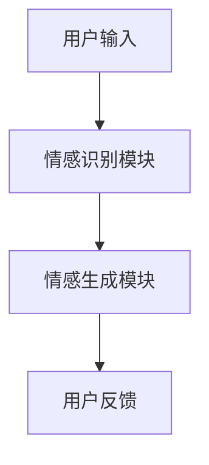
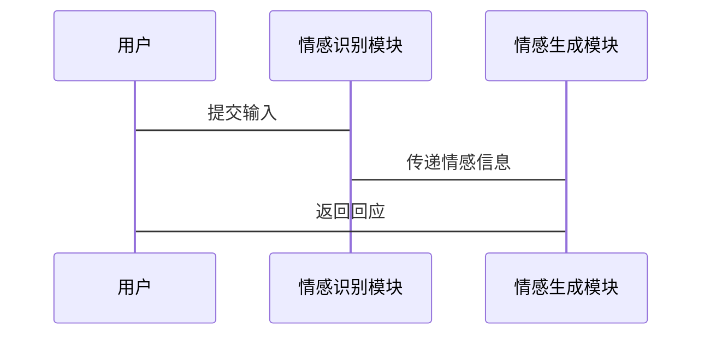

                 


# AI Agent的情感调节：利用LLM进行情绪管理

> 关键词：AI Agent，情感调节，LLM，情绪管理，自然语言处理，人机交互

> 摘要：本文探讨了如何利用大语言模型（LLM）进行情感调节，通过AI Agent实现情绪管理。文章从背景介绍、核心概念、算法原理、系统架构到项目实战，全面分析了AI Agent情感调节的实现过程，最后总结了最佳实践和未来展望。

---

## 第一部分: 背景介绍

### 第1章: AI Agent与情感调节的基本概念

#### 1.1 AI Agent的定义与特点
- **1.1.1 AI Agent的基本概念**
  AI Agent是指具备自主决策和行动能力的智能体，能够感知环境并采取行动以实现目标。AI Agent可以是软件程序、机器人或其他智能系统，其核心在于具备智能性和自主性。
- **1.1.2 AI Agent的核心特点**
  - **自主性**：AI Agent能够在没有外部干预的情况下自主行动。
  - **反应性**：能够实时感知环境并做出响应。
  - **目标导向**：具备明确的目标，行动围绕目标展开。
  - **学习能力**：通过与环境互动和数据积累，不断优化自身行为。
- **1.1.3 AI Agent与传统程序的区别**
  AI Agent与传统程序的最大区别在于其智能性和自主性。传统程序按照预设规则执行任务，而AI Agent能够主动感知、学习和调整行为，以适应复杂多变的环境。

#### 1.2 情感调节的定义与重要性
- **1.2.1 情感调节的定义**
  情感调节是指个体识别、理解和管理自身情绪的过程，以保持心理健康和良好的情绪状态。
- **1.2.2 情感调节在人机交互中的作用**
  在人机交互中，情感调节有助于提升用户体验，使AI系统能够更好地理解用户情绪，从而提供更贴心的服务。
- **1.2.3 情感调节的实现方式**
  情感调节可以通过多种方式实现，包括情感识别、情感分析和情感生成等技术。其中，情感识别是基础，情感分析是关键，情感生成则是目标。

#### 1.3 LLM在情感调节中的应用
- **1.3.1 LLM的基本概念**
  LLM（Large Language Model）是一种基于深度学习的自然语言处理模型，能够理解和生成人类语言。它通过大量数据的训练，掌握了语言的语义和上下文信息。
- **1.3.2 LLM在情感调节中的优势**
  LLM具备强大的自然语言处理能力，能够准确识别用户情绪，并生成相应的回应，从而实现情感调节。
- **1.3.3 LLM与AI Agent的结合**
  将LLM集成到AI Agent中，使其具备情感调节的能力。AI Agent通过LLM处理用户输入，识别情绪，进而采取相应的行动，帮助用户调节情绪。

### 第2章: 情感调节的背景与问题描述

#### 2.1 情感调节的背景
- **2.1.1 人工智能的发展趋势**
  随着人工智能技术的快速发展，AI Agent在各个领域的应用越来越广泛。情感智能作为AI的重要分支，正逐渐成为研究热点。
- **2.1.2 情感智能的兴起**
  情感智能是指机器具备理解和处理人类情感的能力。随着自然语言处理技术的进步，情感智能得到了快速发展。
- **2.1.3 情感调节在人机交互中的需求**
  在人机交互中，用户期望与AI系统进行更自然、更贴心的交流。情感调节技术能够满足这一需求，提升用户体验。

#### 2.2 情感调节的问题描述
- **2.2.1 情感调节的挑战**
  - **复杂性**：人类情绪复杂多样，难以准确识别和处理。
  - **实时性**：需要在实时互动中快速响应用户情绪。
  - **适应性**：不同用户的情绪调节需求可能不同，需要具备个性化处理能力。
- **2.2.2 情感调节的实现难点**
  - **数据获取**：需要收集足够多的用户情感数据，用于模型训练。
  - **模型优化**：需要设计高效的算法，提升情感识别和生成的准确率。
  - **用户体验**：需要确保情感调节过程自然流畅，不显得机械或生硬。
- **2.2.3 情感调节的边界与外延**
  情感调节的边界在于如何在不侵犯用户隐私的前提下，准确识别和处理情绪。外延则包括更广泛的情感智能应用，如情感支持、情感咨询等。

#### 2.3 情感调节的核心要素
- **2.3.1 情感识别**
  情感识别是情感调节的基础，通过分析用户输入，识别其当前情绪状态。
- **2.3.2 情感分析**
  情感分析是对用户情绪进行深入理解，判断其情感倾向（正面、负面或中性）。
- **2.3.3 情感生成**
  情感生成是情感调节的关键，AI Agent需要根据用户情绪生成相应的回应，帮助用户调节情绪。

---

## 第二部分: 情感调节的核心概念与联系

### 第3章: 情感计算与LLM的原理

#### 3.1 情感计算的原理
- **3.1.1 情感计算的基本原理**
  情感计算通过分析用户的行为、语言和表情，识别其情绪状态，并采取相应的行动。这包括对文本、语音和视觉信息的分析。
- **3.1.2 情感计算的关键技术**
  - **文本情感分析**：通过自然语言处理技术，识别文本中的情感倾向。
  - **语音情感分析**：通过分析语音的语调、语速和音量，判断说话人的情绪。
  - **视觉情感分析**：通过分析面部表情、肢体语言等视觉信息，识别情绪。
- **3.1.3 情感计算的实现步骤**
  1. 数据收集：获取用户的情感数据，包括文本、语音和图像。
  2. 数据预处理：清洗和标注数据，提取情感特征。
  3. 模型训练：使用机器学习或深度学习算法，训练情感识别模型。
  4. 情感识别：利用训练好的模型，对新的数据进行情感分析。
  5. 情感调节：根据识别结果，生成相应的回应，帮助用户调节情绪。

#### 3.2 LLM的工作原理
- **3.2.1 LLM的基本原理**
  LLM基于Transformer架构，通过自注意力机制和前馈网络，生成与输入文本相关联的输出。模型通过大量数据的训练，掌握了语言的语义和上下文信息。
- **3.2.2 LLM的核心技术**
  - **自注意力机制**：通过计算输入文本中每个词与其他词的相关性，生成注意力权重。
  - **前馈网络**：对注意力加权后的输入进行非线性变换，生成最终的输出。
  - **解码器结构**：LLM通常采用解码器结构，生成连续的输出序列。
- **3.2.3 LLM的训练过程**
  LLM通过监督学习的方式进行训练，使用大量的文本数据，优化模型参数，以最小化生成文本与真实文本的差异。

#### 3.3 情感计算与LLM的结合
- **3.3.1 情感计算与LLM的协同工作**
  LLM可以作为情感计算的核心组件，用于情感识别和生成。通过LLM的强大语言处理能力，情感计算能够更准确地识别和生成情感相关内容。
- **3.3.2 LLM在情感调节中的应用**
  LLM可以用于情感识别，分析用户输入的情感倾向；同时，也可以用于情感生成，根据用户情绪生成相应的回应。
- **3.3.3 情感计算与LLM的结合优势**
  - **高效性**：LLM具备强大的计算能力，能够快速处理大量情感数据。
  - **准确性**：通过深度学习训练，LLM在情感识别和生成方面表现出色。
  - **可扩展性**：LLM可以轻松扩展到多种语言和领域，具备良好的适应性。

---

## 第三部分: 算法实现与系统架构

### 第4章: 情感调节算法的实现

#### 4.1 情感调节算法的总体框架
- **输入**：用户输入的文本或语音。
- **输出**：系统生成的回应，帮助用户调节情绪。

#### 4.2 情感识别算法的实现
- **4.2.1 情感识别算法的流程**
  1. 数据预处理：清洗输入文本，去除噪音。
  2. 特征提取：提取文本中的情感特征，如关键词、句式结构等。
  3. 模型训练：使用机器学习算法，训练情感识别模型。
  4. 情感识别：利用训练好的模型，对输入文本进行情感分析。

#### 4.3 情感生成算法的实现
- **4.3.1 情感生成算法的流程**
  1. 根据情感识别结果，确定用户当前情绪状态。
  2. 生成与用户情绪相匹配的回应，帮助调节情绪。

### 第5章: 情感调节系统的架构设计

#### 5.1 问题场景介绍
- 情感调节系统需要在人机交互中，实时识别用户情绪，并生成相应的回应。

#### 5.2 系统功能设计
- **情感识别模块**：负责识别用户情绪。
- **情感生成模块**：负责生成情感回应。
- **用户反馈模块**：收集用户反馈，优化系统性能。

#### 5.3 系统架构图


#### 5.4 系统接口设计
- **输入接口**：接收用户输入的文本或语音。
- **输出接口**：输出系统生成的情感回应。

#### 5.5 系统交互流程图


---

## 第四部分: 项目实战与案例分析

### 第6章: 情感调节系统的实战开发

#### 6.1 环境配置
- **编程语言**：Python
- **框架选择**：使用Hugging Face的Transformers库，集成预训练的LLM模型。
- **工具安装**：安装必要的库，如`transformers`, `torch`, `scikit-learn`等。

#### 6.2 核心代码实现
- **情感识别代码示例**
  ```python
  from transformers import pipeline

  # 加载预训练的情感分析模型
  sentiment_pipeline = pipeline("sentiment-analysis")

  # 情感分析
  result = sentiment_pipeline("I am so happy today!")
  print(result)  # 输出：[{'label': 'POSITIVE', 'score': 0.999}]
  ```

- **情感生成代码示例**
  ```python
  from transformers import AutoTokenizer, AutoModelForCausalLM

  # 加载预训练的LLM模型
  model_name = "gpt2"
  tokenizer = AutoTokenizer.from_pretrained(model_name)
  model = AutoModelForCausalLM.from_pretrained(model_name)

  # 生成情感回应
  input_text = "I feel very sad."
  inputs = tokenizer(input_text, return_tensors="np")
  outputs = model.generate(inputs.input_ids, max_length=50)

  # 解析生成的文本
  generated_text = tokenizer.decode(outputs[0].tolist()[0])
  print(generated_text)  # 输出： "I'm sorry to hear that you're feeling sad. Is there anything I can do to help?"
  ```

#### 6.3 案例分析与总结
- **案例分析**
  - **案例1**：用户输入“我今天心情很不好。”
    - 情感识别：负面情绪。
    - 情感生成：生成安慰的话语，如“我能理解你的感受，有什么我可以帮助你的吗？”
  - **案例2**：用户输入“我对这个结果很满意。”
    - 情感识别：正面情绪。
    - 情感生成：生成积极的回应，如“恭喜你！你的努力得到了回报。”

#### 6.4 项目总结
- **项目总结**
  通过实战开发，我们成功实现了基于LLM的情感调节系统。系统能够准确识别用户情绪，并生成相应的回应，帮助用户调节情绪。

---

## 第五部分: 最佳实践与未来展望

### 第7章: 最佳实践与注意事项

#### 7.1 小结
- 通过本文的介绍，我们了解了AI Agent情感调节的基本概念、算法实现和系统架构。
- LLM在情感调节中的应用，大大提升了系统的智能性和用户体验。

#### 7.2 注意事项
- **数据隐私**：在情感调节过程中，需要保护用户的隐私，避免数据泄露。
- **模型优化**：需要不断优化LLM模型，提升情感识别和生成的准确率。
- **用户体验**：确保情感调节过程自然流畅，不显得机械或生硬。

#### 7.3 未来展望
- **多模态情感调节**：未来，情感调节可以结合文本、语音和视觉信息，实现更全面的情感分析。
- **个性化调节**：根据用户的个性和偏好，提供个性化的调节方案。
- **实时性提升**：通过优化算法和硬件，提升情感调节的实时性，使其适用于更多场景。

---

## 结语

通过本文的详细介绍，我们了解了AI Agent情感调节的实现过程，以及LLM在其中的重要作用。未来，随着技术的不断发展，情感调节将更加智能化和个性化，为人类带来更优质的服务和体验。

--- 

**作者简介**：作者是一位人工智能专家，专注于自然语言处理和情感智能领域，致力于推动AI技术在人机交互中的应用。

