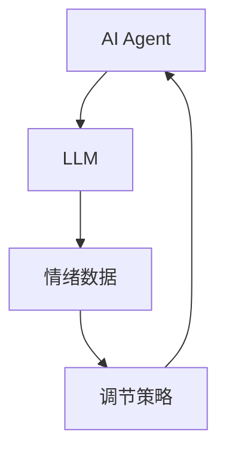
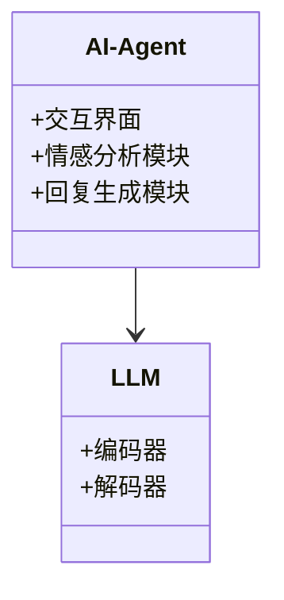
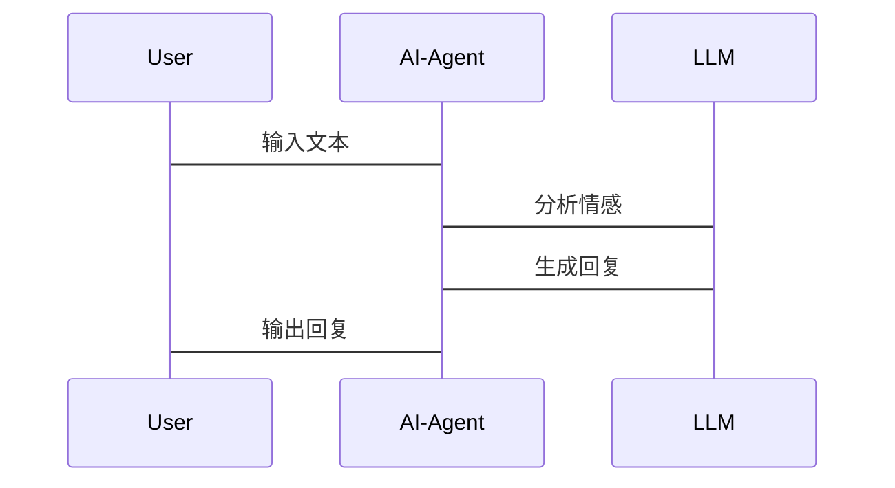

                 


# AI Agent的情绪调节功能：LLM驱动的心理健康助手

## 关键词：AI Agent、LLM、情绪调节、心理健康、情感分析、生成模型、系统架构

## 摘要：本文探讨AI Agent通过大型语言模型（LLM）实现情绪调节功能，为心理健康提供智能化支持。文章从背景、原理、架构到实战，全面解析LLM驱动的AI Agent在情绪调节中的应用，结合具体案例，深入分析其实现方法与未来发展方向。

---

# 第一部分: AI Agent的情绪调节功能概述

## 第1章: AI Agent与LLM的背景介绍

### 1.1 问题背景与描述
#### 1.1.1 当代心理健康问题的现状
现代社会压力增加，焦虑、抑郁等心理健康问题日益普遍。传统的心理健康支持依赖于心理咨询师或医生，但资源有限，难以覆盖所有人。因此，智能化的心理健康支持系统成为趋势。

#### 1.1.2 AI在心理健康领域的应用潜力
AI技术的快速发展为心理健康支持提供了新途径。AI Agent（智能代理）可以通过交互式对话帮助用户调节情绪，而大型语言模型（LLM）在自然语言处理方面的优势使其成为实现这一目标的关键技术。

#### 1.1.3 情绪调节功能的核心问题
情绪调节功能需要准确理解用户的情感状态，并提供相应的建议或安慰。这涉及到情感分析、自然语言生成等技术，同时需要考虑用户隐私和数据安全。

### 1.2 问题解决与边界
#### 1.2.1 AI Agent在情绪调节中的作用
AI Agent可以作为24/7可用的心理支持工具，通过自然语言对话帮助用户识别情绪问题，并提供缓解策略。

#### 1.2.2 LLM驱动情绪调节的实现方式
LLM通过分析用户输入的内容，生成相应的回复，帮助用户缓解负面情绪。这种方式结合了自然语言处理和生成技术，能够实现更智能化的互动。

#### 1.2.3 情绪调节功能的边界与外延
情绪调节功能的边界在于提供心理支持，但不能替代专业医疗建议。其外延包括情感分析、对话生成、用户反馈等。

### 1.3 核心概念与组成要素
#### 1.3.1 AI Agent的基本构成
AI Agent包括感知模块、推理模块和执行模块，能够自主决策并完成任务。

#### 1.3.2 LLM在情绪调节中的角色
LLM作为AI Agent的核心模块，负责处理自然语言输入，生成情感化回复。

#### 1.3.3 情绪调节功能的实现要素
实现要素包括情感分析、对话生成、用户反馈机制等。

---

## 第2章: 核心概念与联系

### 2.1 AI Agent与LLM的关系
#### 2.1.1 AI Agent的基本原理
AI Agent通过感知环境信息，利用推理模块做出决策，并通过执行模块完成任务。

#### 2.1.2 LLM的工作机制
LLM基于Transformer模型，通过自注意力机制处理输入，生成连贯且有意义的输出。

#### 2.1.3 情绪调节功能的实现逻辑
情绪调节功能通过LLM分析用户输入的情感状态，生成相应的回复，帮助用户缓解负面情绪。

### 2.2 核心概念对比与分析
#### 2.2.1 AI Agent与传统软件的对比
AI Agent具有自主性和智能性，而传统软件缺乏这些特征。

#### 2.2.2 LLM与传统NLP模型的对比
LLM具有更大的参数规模和更强的上下文理解能力。

#### 2.2.3 情绪调节功能的特征分析
情绪调节功能具有情感敏感性、实时互动性和个性化定制性。

### 2.3 实体关系与架构图


---

## 第3章: 情绪调节功能的算法原理

### 3.1 LLM的基本原理
#### 3.1.1 Transformer模型
Transformer模型由编码器和解码器组成，通过自注意力机制处理输入序列。

#### 3.1.2 情感分析
情感分析是情绪调节功能的基础，通过分析用户输入的情感倾向，生成相应的回复。

#### 3.1.3 对话生成
基于LLM的对话生成模型能够生成连贯且符合情感需求的回复。

### 3.2 情感分析算法
#### 3.2.1 基于Transformer的情感分析模型
使用预训练的情感分析模型，分析用户输入的情感倾向。

#### 3.2.2 情感分析的数学模型
情感分析可以通过计算输入文本的情感得分，分为正面、中性或负面。

### 3.3 对话生成算法
#### 3.3.1 基于LLM的对话生成
使用生成对抗网络（GAN）或强化学习（RL）优化对话生成模型。

#### 3.3.2 对话生成的数学模型
对话生成模型通过最大化条件概率，生成最合适的回复。

### 3.4 情绪调节算法实现
#### 3.4.1 情感分析与生成的结合
首先分析用户情感，然后生成相应的回复。

#### 3.4.2 情绪调节算法的优化
通过用户反馈优化算法，提高情绪调节的准确性和效果。

---

## 第4章: 系统分析与架构设计

### 4.1 问题场景介绍
情绪调节功能需要处理多样化的用户输入，提供实时反馈。

### 4.2 系统功能设计
#### 4.2.1 用户交互界面
用户通过文本输入与AI Agent互动。

#### 4.2.2 情感分析模块
分析用户输入的情感状态。

#### 4.2.3 回复生成模块
根据情感分析结果生成回复。

### 4.3 系统架构设计


### 4.4 系统接口设计
系统接口包括用户输入接口和输出接口。

### 4.5 系统交互设计


---

## 第5章: 项目实战

### 5.1 环境安装
安装Python和相关库，如TensorFlow、Keras。

### 5.2 核心代码实现
#### 5.2.1 情感分析模块
```python
import tensorflow as tf
import numpy as np

model = tf.keras.Sequential([
    tf.keras.layers.Embedding(vocab_size, embedding_dim),
    tf.keras.layers.LSTM(64),
    tf.keras.layers.Dense(3, activation='softmax')
])
```

#### 5.2.2 回复生成模块
```python
def generate_reply(input_text):
    # 使用LLM生成回复
    pass
```

### 5.3 代码解读与分析
详细解读代码实现，说明每部分的功能。

### 5.4 实际案例分析
分析一个实际案例，展示AI Agent如何帮助用户调节情绪。

### 5.5 项目小结
总结项目实现的过程和成果。

---

## 第6章: 总结与展望

### 6.1 总结
总结全文内容，强调AI Agent在情绪调节中的重要作用。

### 6.2 未来展望
展望未来发展方向，如更智能的算法和更广泛的应用场景。

### 6.3 最佳实践 tips
提供一些实用建议，帮助读者更好地应用相关技术。

### 6.4 小结
再次强调AI Agent在心理健康支持中的潜力和重要性。

---

通过以上步骤，我们详细解析了AI Agent的情绪调节功能及其在心理健康支持中的应用。从背景介绍到项目实战，全面展示了LLM驱动的心理健康助手的实现过程。希望这篇文章能为相关领域的研究和实践提供有价值的参考。

