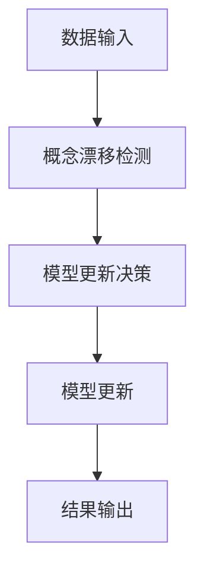
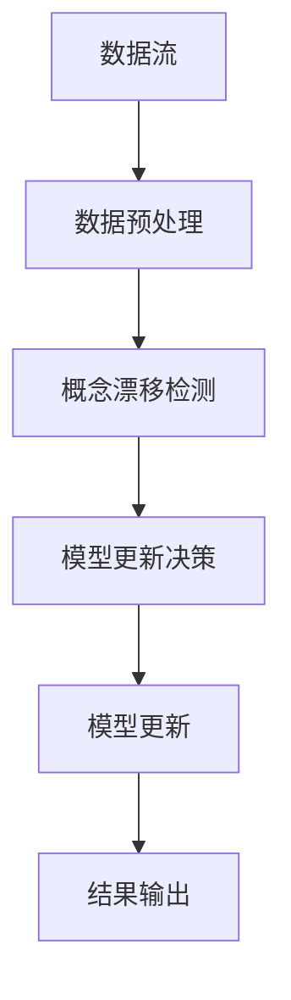
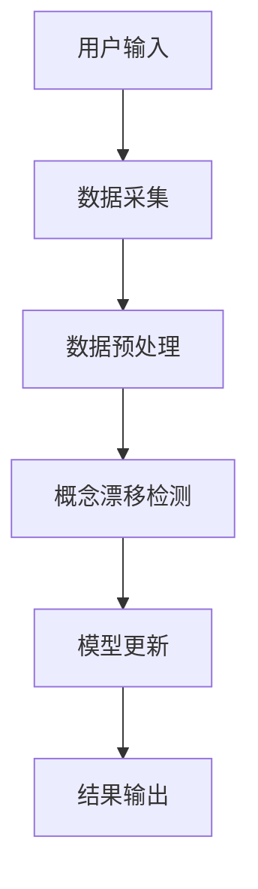

                 


# AI Agent的持续学习与概念漂移适应策略

**关键词：** AI Agent, 持续学习, 概念漂移, 适应策略, 实时监控, 模型更新, 知识表示

**摘要：**  
本文深入探讨AI Agent在动态环境中的持续学习能力，特别是如何应对概念漂移的挑战。通过分析持续学习的核心原理和概念漂移的检测与适应策略，结合实际应用场景，提出了一种基于增量学习和知识表示的适应方法。本文还详细介绍了算法实现、系统架构设计和项目实战，为AI Agent的持续学习与概念漂移适应提供了理论支持和实践指导。

---

## 第1章: AI Agent的背景与核心概念

### 1.1 AI Agent的基本概念  
AI Agent（人工智能代理）是一种能够感知环境、自主决策并执行任务的智能实体。它具备以下核心特征：  
- **自主性**：无需外部干预，自主完成任务。  
- **反应性**：能够实时感知环境并做出响应。  
- **目标导向**：以明确的目标为导向进行决策。  
- **学习能力**：通过经验或数据不断优化自身性能。  

AI Agent广泛应用于自动驾驶、智能助手、推荐系统等领域。  

### 1.2 持续学习的背景与意义  
传统机器学习算法通常需要离线训练，无法适应动态变化的环境。在实际应用中，数据分布往往会发生变化（即概念漂移），导致模型性能下降。为了解决这一问题，持续学习应运而生。  

**持续学习**是一种机器学习范式，允许模型在新数据流不断输入的情况下，逐步更新知识而不破坏已学内容。其优势包括：  
- **实时性**：能够实时处理数据流，适应动态环境。  
- **效率性**：避免了重新训练整个模型的高计算成本。  
- **灵活性**：能够快速适应新任务和数据分布的变化。  

### 1.3 概念漂移的定义与挑战  
**概念漂移**是指数据分布或类别标签随时间变化的现象。例如，在推荐系统中，用户偏好可能随时间变化；在金融领域，市场趋势也可能发生变化。  

概念漂移的类型包括：  
1. **突然漂移（突然变化）**：数据分布突然发生显著变化。  
2. **逐步漂移（渐进变化）**：数据分布逐渐变化。  
3. **周期性漂移（周期性变化）**：数据分布呈现周期性变化。  

概念漂移对AI Agent的挑战在于：  
- **检测困难**：如何准确检测数据分布的变化？  
- **模型更新**：如何在检测到漂移后，快速更新模型以适应新分布？  
- **计算效率**：频繁的模型更新可能带来计算成本的增加。  

---

## 第2章: 持续学习与概念漂移的核心概念  

### 2.1 持续学习的原理  
**增量学习**是持续学习的核心机制，其特点是逐步处理数据样本，每次仅更新模型的一部分。例如，在线支持向量机（Online SVM）和在线随机森林（Online Random Forest）都是典型的增量学习算法。  

**知识表示**是持续学习的关键，决定了模型如何存储和更新知识。常用的表示方法包括：  
- **神经网络表示**：通过神经网络的权重更新实现知识更新。  
- **符号表示**：通过规则或逻辑表达式表示知识。  
- **概率表示**：通过概率分布模型表示知识。  

### 2.2 概念漂移的检测与分析  
**概念漂移检测**可以通过以下方法实现：  
1. **统计方法**：基于分布统计量（如均值、方差）的变化检测。  
2. **分布比较方法**：通过KL散度、JS散度等衡量两个分布的差异。  
3. **分类性能监测**：通过模型性能下降来间接判断概念漂移。  

**概念漂移的特征分析**：  
- **漂移强度**：数据分布变化的剧烈程度。  
- **漂移方向**：数据分布变化的方向（如从类别A到类别B）。  
- **漂移时间**：数据分布变化的时间范围。  

### 2.3 持续学习与概念漂移的关系  
- **持续学习是应对概念漂移的核心方法**：通过增量学习和模型更新，AI Agent能够快速适应数据分布的变化。  
- **概念漂移影响持续学习的性能**：如果漂移过于频繁或剧烈，可能导致模型更新成本增加，甚至影响模型的稳定性。  
- **优化策略**：通过结合概念漂移检测和模型更新策略，可以在漂移发生时快速调整模型，确保性能的持续稳定。  

---

## 第3章: 持续学习算法的原理与实现  

### 3.1 持续学习算法的分类  
1. **基于增量的持续学习算法**：  
   - 优点：实时更新，计算成本低。  
   - 缺点：可能遗忘旧知识（灾难性遗忘）。  
2. **基于记忆的持续学习算法**：  
   - 优点：通过外部记忆模块保存旧知识，避免遗忘。  
   - 缺点：记忆模块的设计复杂。  
3. **基于优化的持续学习算法**：  
   - 优点：通过优化算法（如在线优化）实现模型更新。  
   - 缺点：需要较高的计算资源。  

### 3.2 概念漂移适应的算法流程  
1. **概念漂移检测**：  
   - 使用统计方法或分类性能监测方法检测漂移。  
2. **模型更新决策**：  
   - 根据漂移类型和强度决定是否更新模型。  
3. **模型更新**：  
   - 采用增量学习算法或重新训练模型。  

### 3.3 算法实现的数学模型  
**增量学习的数学表示**：  
$$w_{t+1} = w_t + \alpha (y_t - f(x_t; w_t))$$  
其中，$w_t$ 是当前模型参数，$\alpha$ 是学习率，$y_t$ 是目标输出，$f(x_t; w_t)$ 是当前输入的预测值。  

**概率模型**：  
$$P(y|x) = \frac{P(x|y)P(y)}{P(x)}$$  
通过计算两个时间点的概率分布差异，判断是否发生概念漂移。  

### 3.4 算法流程图  


---

## 第4章: 概念漂移适应的系统架构设计  

### 4.1 系统功能设计  
1. **数据采集模块**：实时采集数据流。  
2. **概念漂移检测模块**：分析数据分布变化。  
3. **模型更新模块**：根据检测结果更新模型。  
4. **结果输出模块**：输出更新后的模型预测结果。  

### 4.2 系统架构图  


### 4.3 系统交互流程图  


---

## 第5章: 项目实战与案例分析  

### 5.1 环境安装  
- **工具**：Python、TensorFlow、Keras。  
- **依赖库**：安装必要的机器学习库（如scikit-learn、pandas）。  

### 5.2 核心代码实现  

#### 概念漂移检测代码  
```python
from sklearn.metrics import accuracy_score
import numpy as np

def detect_drift(prev_X, prev_y, curr_X, curr_y):
    prev_acc = accuracy_score(prev_y, prev_X.predict(curr_X))
    curr_acc = accuracy_score(curr_y, prev_X.predict(curr_X))
    if abs(prev_acc - curr_acc) > 0.1:
        return True
    return False
```

#### 模型更新代码  
```python
from sklearn.svm import SVC

def update_model(prev_model, new_X, new_y):
    updated_model = SVC()
    updated_model.fit(np.concatenate([prev_X, new_X]), np.concatenate([prev_y, new_y]))
    return updated_model
```

### 5.3 实际案例分析  
以在线推荐系统为例，假设用户行为数据随时间变化。通过概念漂移检测模块发现用户偏好变化后，触发模型更新，确保推荐结果的准确性。  

---

## 第6章: 总结与展望  

### 6.1 本章总结  
本文详细探讨了AI Agent的持续学习能力及其在概念漂移适应中的应用。通过理论分析、算法实现和系统设计，为AI Agent的动态适应能力提供了全面的技术支持。  

### 6.2 未来展望  
未来研究可以进一步优化概念漂移检测的准确性，探索更高效的模型更新算法，并结合边缘计算等技术，提升AI Agent的实时性和计算效率。  

---

**附录**  
- **术语表**：列出本文中涉及的专业术语及其定义。  
- **参考文献**：列出相关文献和资料，供读者进一步查阅。

