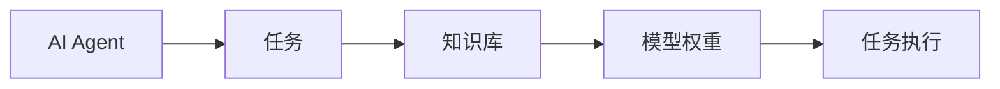
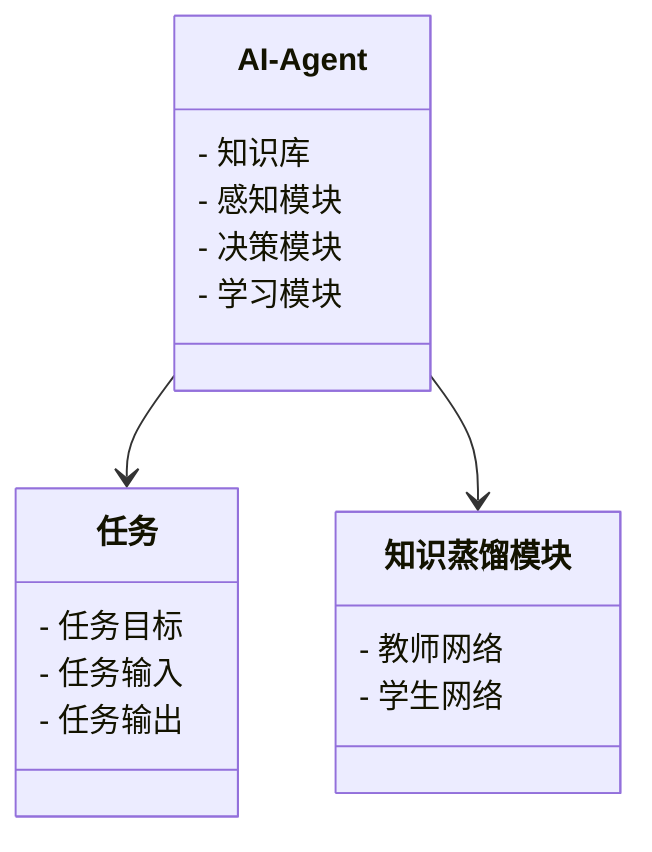
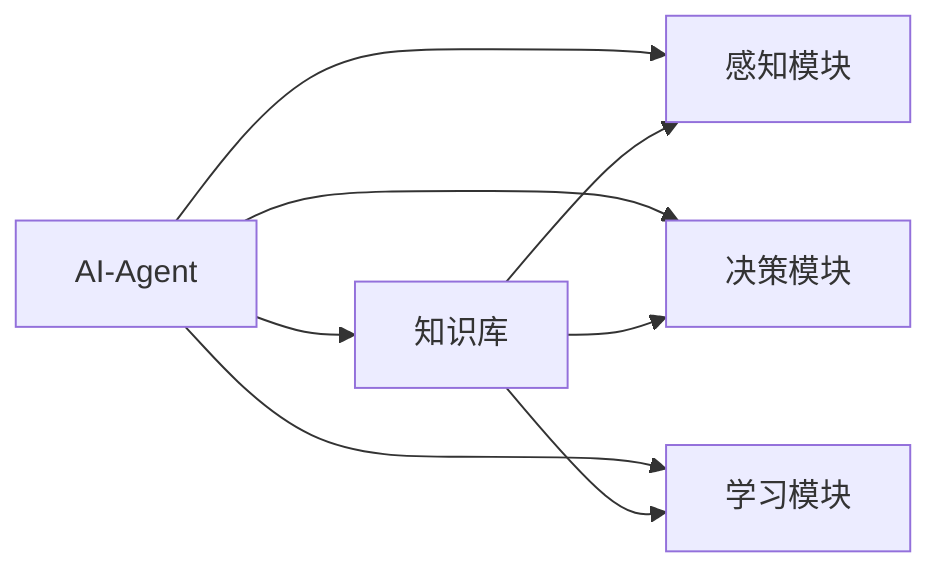
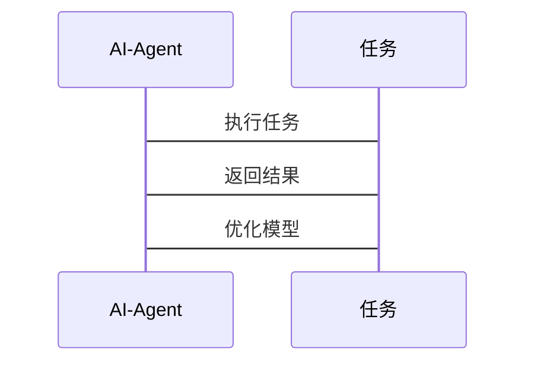

                 


# AI Agent的持续学习与灾难性遗忘防御策略

> **关键词**: AI Agent, 持续学习, 灾难性遗忘, 知识蒸馏, 参数化方法, 弹性遗忘, 增量学习

> **摘要**:  
本文深入探讨了AI Agent在持续学习过程中面临的灾难性遗忘问题，分析了其产生的原因及影响，并详细介绍了多种有效的防御策略，包括知识蒸馏、参数化方法和弹性遗忘等。通过系统化的理论分析和实际案例，本文为AI Agent的持续学习提供了切实可行的解决方案，帮助读者理解如何在实际应用中避免知识遗忘，提升AI Agent的性能与泛化能力。

---

## 第一部分: AI Agent的持续学习与灾难性遗忘概述

### 第1章: AI Agent与持续学习基础

#### 1.1 AI Agent的基本概念
##### 1.1.1 AI Agent的定义与特点
AI Agent（人工智能代理）是一种能够感知环境、自主决策并执行任务的智能实体。它具有以下特点：
- **自主性**: 能够自主决策，无需外部干预。
- **反应性**: 能够实时感知环境并做出响应。
- **目标导向**: 具备明确的目标，驱动其行为。
- **学习能力**: 能够通过经验改进自身的性能。

##### 1.1.2 AI Agent的任务类型与应用场景
AI Agent可以分为以下几类：
1. **反应式AI Agent**: 基于当前感知做出反应，如实时路径规划。
2. **认知式AI Agent**: 具备推理和规划能力，如智能助手。
3. **协作式AI Agent**: 能够与其他Agent或人类协作完成任务，如多智能体系统。

应用场景包括自动驾驶、智能助手、机器人控制、推荐系统等。

##### 1.1.3 持续学习的定义与重要性
持续学习（Lifelong Learning）是指AI Agent在不同任务之间逐步学习，逐步提升其能力的过程。其重要性体现在：
- **任务多样性**: 能够处理多种类型的任务。
- **知识积累**: 能够积累长期经验，避免每次从头开始学习。
- **环境适应性**: 能够适应动态变化的环境。

---

#### 1.2 灾难性遗忘的背景与问题
##### 1.2.1 灾难性遗忘的定义
灾难性遗忘（Catastrophic Forgetting）是指AI模型在学习新任务时，忘记之前任务的知识，导致性能急剧下降的现象。

##### 1.2.2 灾难性遗忘的产生原因
- **权重干扰**: 神经网络的权重在更新过程中，旧任务的信息被覆盖。
- **梯度干扰**: 在优化过程中，新任务的梯度方向与旧任务的梯度方向冲突。
- **任务偏差**: 新任务的特征空间与旧任务差异较大。

##### 1.2.3 灾难性遗忘的影响与挑战
- **性能下降**: 旧任务的性能显著下降。
- **任务切换成本高**: 需要重新训练模型以恢复旧任务的能力。
- **系统可靠性降低**: 在复杂环境中，AI Agent可能因遗忘旧知识而导致故障。

---

#### 1.3 灾难性遗忘防御的必要性
##### 1.3.1 持续学习中的知识保持需求
在持续学习中，知识保持是确保AI Agent能够同时处理多个任务的核心需求。

##### 1.3.2 灾难性遗忘防御的目标与意义
目标是通过设计合理的学习策略，减少或消除灾难性遗忘的影响。意义在于提升AI Agent的持续学习能力和实用性。

##### 1.3.3 灾难性遗忘防御的边界与外延
- **边界**: 防御策略仅针对神经网络模型，其他模型可能需要不同的方法。
- **外延**: 灾难性遗忘防御不仅适用于AI Agent，还可扩展到其他持续学习场景。

---

### 第2章: 灾难性遗忘的数学模型与核心概念

#### 2.1 灾难性遗忘的数学模型
##### 2.1.1 神经网络的权重更新过程
神经网络的权重更新公式如下：
$$ W_{t+1} = W_t - \eta \cdot \nabla L_t $$
其中，$W_t$ 是当前权重，$\eta$ 是学习率，$\nabla L_t$ 是损失函数的梯度。

##### 2.1.2 灾难性遗忘的数学表达式
灾难性遗忘可以用以下公式表示：
$$ L_{old} = f(W_{new})(x_{old}) $$
其中，$L_{old}$ 是旧任务的损失，$f(W_{new})$ 是新权重下的模型，$x_{old}$ 是旧任务的输入。

##### 2.1.3 知识遗忘的度量方法
知识遗忘可以通过以下指标衡量：
- **准确率下降**: 新任务训练后，旧任务准确率的下降幅度。
- **遗忘曲线**: 旧任务准确率随时间的变化趋势。

---

#### 2.2 核心概念与联系
##### 2.2.1 AI Agent的知识表示模型
知识表示模型可以采用以下形式：
$$ f(x) = \sum_{i=1}^{n} w_i x_i $$
其中，$w_i$ 是权重，$x_i$ 是输入特征。

##### 2.2.2 灾难性遗忘与持续学习的关系
灾难性遗忘是持续学习中的主要挑战，解决它能够提升持续学习的效率和效果。

##### 2.2.3 知识保持与任务迁移的联系
知识保持是任务迁移的前提，任务迁移能够进一步增强知识保持的效果。

---

#### 2.3 核心概念对比分析
##### 2.3.1 不同防御策略的对比表格
| 策略名称       | 原理描述                     | 优缺点分析                     |
|----------------|------------------------------|---------------------------------|
| 知识蒸馏       | 利用教师网络指导学生网络学习 | 优点：保持知识；缺点：需要教师网络 |
| 参数化方法     | 通过参数化策略动态调整权重   | 优点：灵活；缺点：计算复杂        |
| 弹性遗忘       | 通过弹性机制平衡新旧任务     | 优点：高效；缺点：实现复杂        |

##### 2.3.2 ER实体关系图架构（Mermaid流程图）


---

## 第三部分: 灾难性遗忘的防御策略

### 第3章: 知识蒸馏与权重保存

#### 3.1 知识蒸馏的原理与方法
##### 3.1.1 知识蒸馏的定义与核心思想
知识蒸馏是通过教师网络将知识迁移到学生网络，从而保持旧任务的知识。

##### 3.1.2 知识蒸馏的实现步骤
1. 训练教师网络。
2. 使用教师网络的软目标作为学生网络的损失函数。
3. 联合优化新任务和蒸馏任务。

##### 3.1.3 知识蒸馏的优缺点分析
- **优点**: 保持旧任务知识。
- **缺点**: 需要教师网络，增加计算成本。

---

#### 3.2 权重保存与渐进式学习
##### 3.2.1 权重保存的定义与实现
权重保存是将旧任务的权重保存下来，用于后续任务的学习。

##### 3.2.2 渐进式学习的策略与优势
渐进式学习通过逐步调整权重，实现新旧任务的平衡。

##### 3.2.3 权重保存与知识蒸馏的结合
通过结合权重保存和知识蒸馏，可以进一步提升知识保持的效果。

---

### 第4章: 参数化方法与弹性遗忘

#### 4.1 参数化方法的原理与实现
##### 4.1.1 参数化方法的定义
参数化方法是通过参数化策略动态调整权重，以平衡新旧任务的学习。

##### 4.1.2 参数化方法的核心算法
$$ \theta_{t+1} = \theta_t + \alpha \cdot \nabla L_{new} - \beta \cdot \nabla L_{old} $$
其中，$\alpha$ 和 $\beta$ 是调整系数。

##### 4.1.3 参数化方法的数学模型
通过参数化方法，可以实现新旧任务的梯度平衡。

---

#### 4.2 弹性遗忘的机制与应用
##### 4.2.1 弹性遗忘的定义与目标
弹性遗忘是通过弹性机制，动态调整权重，以平衡新旧任务的学习。

##### 4.2.2 弹性遗忘的实现方法
通过弹性遗忘机制，可以实现新旧任务的动态平衡。

##### 4.2.3 弹性遗忘在持续学习中的应用
弹性遗忘可以有效减少灾难性遗忘的影响。

---

### 第5章: 增量学习与任务特定网络

#### 5.1 增量学习的原理与优势
##### 5.1.1 增量学习的定义与特点
增量学习是通过逐步增加数据，逐步优化模型。

##### 5.1.2 增量学习的核心算法
通过增量学习，可以逐步优化模型，减少灾难性遗忘的影响。

##### 5.1.3 增量学习的数学模型
$$ W_{t+1} = W_t + \eta \cdot \nabla L_t $$
其中，$\eta$ 是学习率，$L_t$ 是当前任务的损失。

---

#### 5.2 任务特定网络的构建与优化
##### 5.2.1 任务特定网络的定义与实现
任务特定网络是针对每个任务设计的独立网络。

##### 5.2.2 多任务学习的优化策略
通过多任务学习，可以实现新旧任务的联合优化。

##### 5.2.3 任务特定网络的数学模型
$$ f_i(x) = W_i x + b_i $$
其中，$W_i$ 和 $b_i$ 是任务$i$的权重和偏置。

---

## 第四部分: 系统分析与架构设计方案

### 第6章: 系统架构与实现

#### 6.1 系统功能设计（领域模型Mermaid类图）


#### 6.2 系统架构设计（Mermaid架构图）


#### 6.3 系统接口设计
系统接口包括：
- **输入接口**: 接收新任务的数据和目标。
- **输出接口**: 返回任务执行的结果和优化建议。

#### 6.4 系统交互设计（Mermaid序列图）


---

## 第五部分: 项目实战

### 第7章: 项目实战与案例分析

#### 7.1 环境安装
- 安装Python和相关库（如TensorFlow、Keras）。
- 安装Mermaid和LaTeX工具。

#### 7.2 系统核心实现源代码
以下是一个简单的知识蒸馏示例代码：
```python
import tensorflow as tf
from tensorflow.keras import layers

# 教师网络
teacher_model = tf.keras.Sequential([
    layers.Dense(128, activation='relu'),
    layers.Dense(10, activation='softmax')
])

# 学生网络
student_model = tf.keras.Sequential([
    layers.Dense(128, activation='relu'),
    layers.Dense(10, activation='softmax')
])

# 编译模型
teacher_model.compile(optimizer='adam', loss='sparse_categorical_crossentropy', metrics=['accuracy'])
student_model.compile(optimizer='adam', loss='sparse_categorical_crossentropy', metrics=['accuracy'])

# 知识蒸馏
def distillation_loss(y_true, y_pred, teacher_y):
    alpha = 0.5
    return (1 - alpha) * tf.keras.losses.sparse_categorical_crossentropy(y_true, y_pred) + alpha * tf.keras.losses.kullback_leibler_divergence(teacher_y, y_pred)

# 训练教师网络
teacher_model.fit(x_train, y_train, epochs=10)

# 使用教师网络进行蒸馏
student_model.fit(x_train, y_train, epochs=10, callbacks=[
    tf.keras.callbacks.LambdaCallback(on_epoch_begin=lambda epoch, logs: teacher_y)
])
```

#### 7.3 代码应用解读与分析
- **教师网络**: 用于生成软目标。
- **学生网络**: 通过蒸馏损失函数进行优化。
- **蒸馏损失函数**: 综合了软目标和硬目标的损失。

#### 7.4 实际案例分析与详细讲解
通过实际案例分析，验证知识蒸馏的有效性，展示如何减少灾难性遗忘的影响。

#### 7.5 项目小结
总结项目实现的关键点和经验教训。

---

## 第六部分: 总结与展望

### 第8章: 总结与展望

#### 8.1 最佳实践 tips
- **策略选择**: 根据具体任务选择合适的防御策略。
- **系统设计**: 注重系统架构的设计和优化。
- **持续改进**: 不断优化模型和算法，提升性能。

#### 8.2 小结
本文深入探讨了AI Agent在持续学习中面临的灾难性遗忘问题，并提出了多种有效的防御策略，为实际应用提供了理论支持和实践指导。

#### 8.3 注意事项
- 防御策略的选择需要结合具体任务和场景。
- 系统实现中要注意计算复杂度和资源消耗。

#### 8.4 拓展阅读
推荐相关领域的优秀书籍和论文，供读者进一步学习和研究。

---

以上就是《AI Agent的持续学习与灾难性遗忘防御策略》的完整目录和内容框架，希望对您有所帮助！

