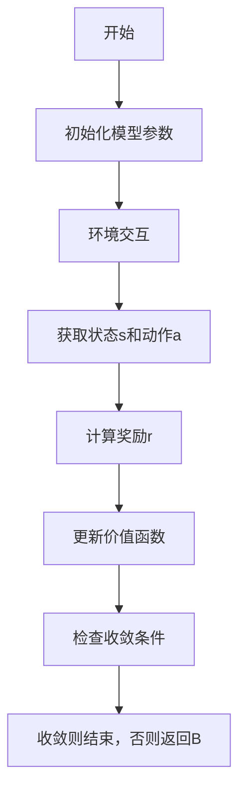
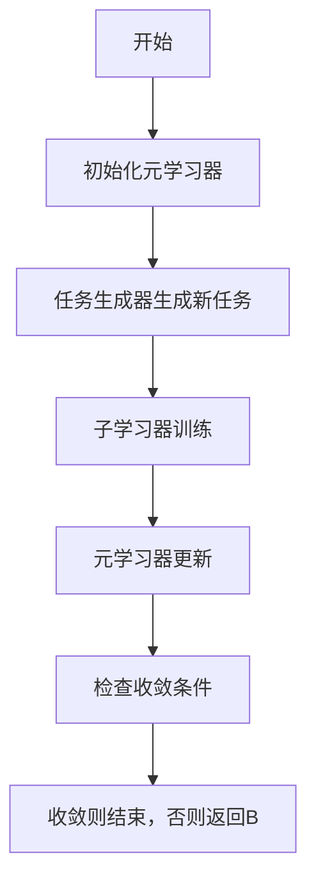
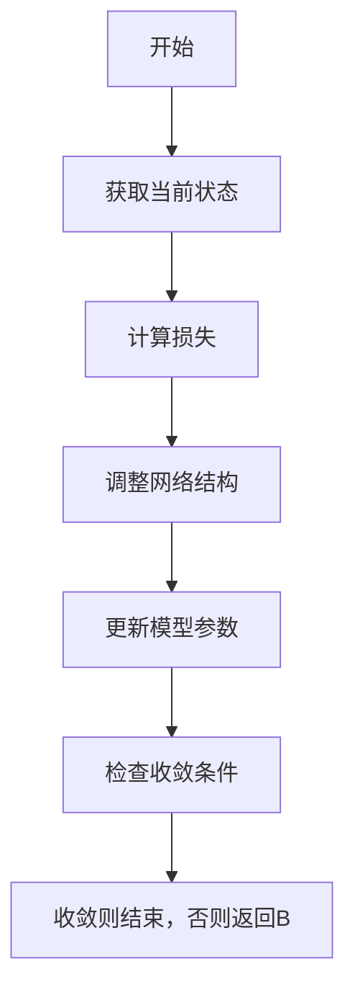
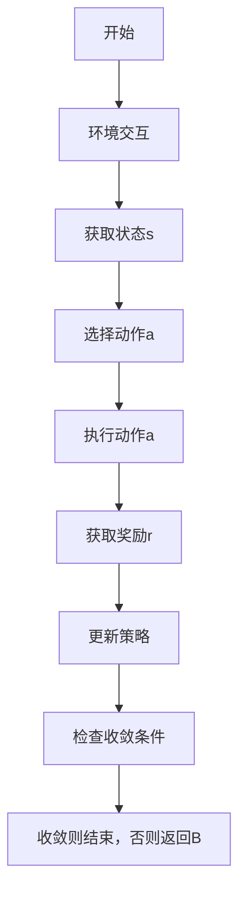
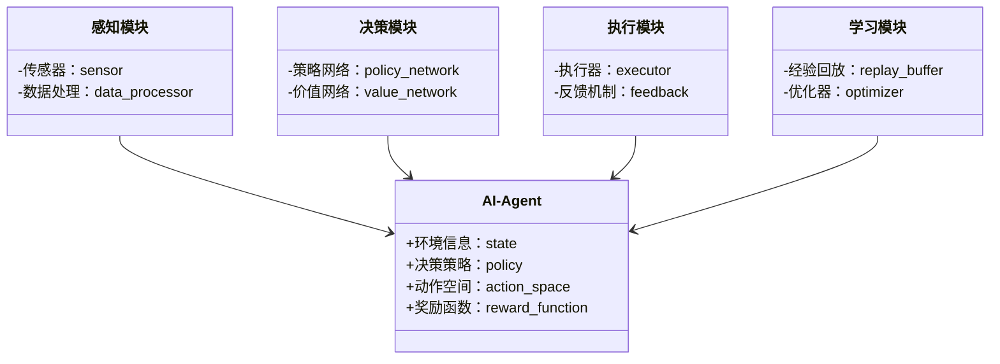
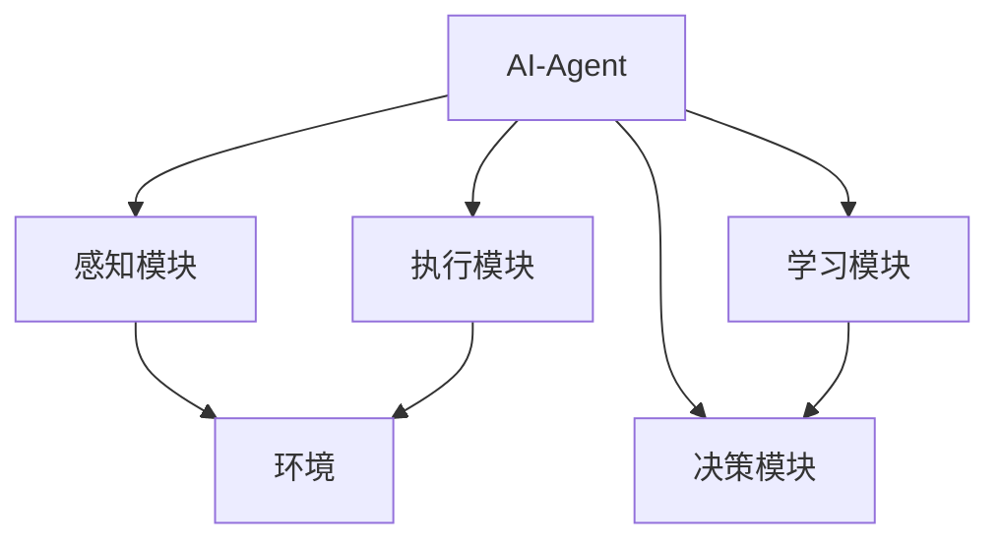

                 


# AI Agent的持续学习与自我优化机制

## 关键词
AI Agent, 持续学习, 自我优化, 强化学习, 元学习, 自适应网络

## 摘要
本文深入探讨了AI Agent的持续学习与自我优化机制，从背景、核心概念、算法原理到系统架构和项目实战，全面分析了AI Agent如何通过持续学习和自我优化提升其智能性和适应性。文章结合理论与实践，提供了详细的算法实现和系统设计，帮助读者全面理解AI Agent的持续学习与自我优化机制。

---

## 第一部分: AI Agent的持续学习与自我优化机制概述

### 第1章: AI Agent的基本概念与背景

#### 1.1 什么是AI Agent
- **定义**: AI Agent（人工智能代理）是指能够感知环境、自主决策并采取行动以实现特定目标的智能实体。
- **核心特征**:
  - 感知环境：通过传感器或其他输入方式获取环境信息。
  - 自主决策：基于获取的信息，通过算法做出决策。
  - 采取行动：根据决策执行操作，影响环境状态。
- **分类与应用场景**:
  - 分类：基于任务类型（如导航、游戏、推荐系统）和智能水平（如规则型、学习型）。
  - 应用场景：自动驾驶、智能助手、机器人控制、推荐系统等。

#### 1.2 持续学习与自我优化的必要性
- **问题背景**:
  - AI Agent在动态环境中需要不断适应新变化。
  - 单一任务训练无法应对多样化和复杂化的任务需求。
  - 现实场景中的数据分布偏移和任务迁移要求AI Agent具备持续学习能力。
- **定义与意义**:
  - 持续学习：AI Agent在新任务或新数据上，能够利用之前的学习成果，快速适应并提升性能。
  - 自我优化：AI Agent通过内部机制不断调整自身参数和策略，以达到更优性能。
  - 持续学习与自我优化结合，使AI Agent能够像人类一样不断进步和适应。

#### 1.3 当前AI Agent的发展现状
- **学术研究进展**:
  - 基于强化学习的持续学习研究。
  - 基于元学习的持续学习研究。
  - 自适应网络结构的研究。
- **工业界的应用案例**:
  - 自动驾驶中的路径规划和决策优化。
  - 智能客服系统的对话理解和优化。
  - 个性化推荐系统的持续优化。
- **技术瓶颈与未来方向**:
  - 瓶颈：计算资源消耗大、学习效率低、泛化能力不足。
  - 未来方向：更高效的算法、更强大的自适应能力、更广泛的应用场景。

---

### 第2章: 持续学习与自我优化的核心机制

#### 2.1 持续学习的基本原理
- **经验回放机制**:
  - 定义：将过去的经验存储在记忆库中，以便后续学习使用。
  - 优势：缓解样本稀疏性和数据偏差问题。
- **知识蒸馏技术**:
  - 定义：将复杂模型的知识迁移到简单模型中。
  - 优势：提升轻量级模型的性能。
- **增量学习方法**:
  - 定义：在新数据上逐步更新模型参数。
  - 优势：适用于在线学习场景。

#### 2.2 自我优化的实现方法
- **基于强化学习的优化策略**:
  - 定义：通过与环境交互，获得奖励信号，指导优化方向。
  - 优势：适用于需要实时反馈的任务。
- **基于元学习的优化框架**:
  - 定义：通过学习如何学习，快速适应新任务。
  - 优势：减少对大量数据的依赖。
- **基于自适应网络的优化技术**:
  - 定义：动态调整网络结构或参数，以适应新任务。
  - 优势：提升模型的灵活性和适应性。

#### 2.3 持续学习与自我优化的对比分析
- **核心概念对比表**:

| 对比维度 | 持续学习 | 自我优化 |
|----------|----------|----------|
| 目标     | 快速适应新任务 | 提升性能 |
| 方法     | 利用过去经验 | 调整内部参数 |
| 优势     | 适应性强 | 性能优化 |

- **实现方式的异同点**:
  - 相同点：都需要动态调整模型参数或结构。
  - 不同点：持续学习侧重于适应新任务，自我优化侧重于提升性能。
- **优缺点分析**:
  - 持续学习优点：适应性强，缺点：计算开销大。
  - 自我优化优点：性能优越，缺点：可能需要大量数据。

---

### 第3章: AI Agent的持续学习算法原理

#### 3.1 基于强化学习的持续学习算法
- **算法流程图（mermaid）**:



- **算法数学模型**:
  $$ V(s) = \max_{a} Q(s,a) $$
  其中，\( V(s) \) 是状态值函数，\( Q(s,a) \) 是动作值函数。
- **实例分析**:
  以自动驾驶为例，AI Agent通过与真实或模拟环境交互，不断优化路径规划策略。

#### 3.2 基于元学习的持续学习算法
- **算法流程图（mermaid）**:



- **算法数学模型**:
  $$ \theta = \arg\max_{\theta} \sum_{i=1}^{N} L_i(\theta) $$
  其中，\( \theta \) 是模型参数，\( L_i \) 是第 \( i \) 个任务的损失函数。
- **实例分析**:
  在推荐系统中，元学习器帮助子学习器快速适应不同用户的偏好。

---

### 第4章: AI Agent的自我优化算法实现

#### 4.1 基于自适应网络的优化算法
- **算法流程图（mermaid）**:



- **算法数学模型**:
  $$ \Delta w = \epsilon \cdot sign(\nabla L) $$
  其中，\( \Delta w \) 是参数更新量，\( \epsilon \) 是学习率，\( \nabla L \) 是损失函数的梯度。
- **实例分析**:
  在图像识别任务中，自适应网络根据输入图像自动调整权重。

#### 4.2 基于强化学习的优化策略
- **算法流程图（mermaid）**:



- **算法数学模型**:
  $$ Q(s,a) = r + \gamma \max_{a'} Q(s',a') $$
  其中，\( Q(s,a) \) 是动作值函数，\( \gamma \) 是折扣因子。
- **实例分析**:
  在游戏AI中，强化学习策略帮助AI不断优化游戏策略。

---

### 第5章: AI Agent的系统架构与设计

#### 5.1 系统功能设计
- **功能模块**:
  - 感知模块：负责获取环境信息。
  - 决策模块：负责做出决策。
  - 执行模块：负责执行决策。
  - 学习模块：负责持续学习和自我优化。

#### 5.2 系统架构设计
- **领域模型（mermaid类图）**:



- **系统架构图（mermaid）**:



---

### 第6章: AI Agent的项目实战

#### 6.1 环境安装与配置
- **安装依赖**:
  - Python 3.8+
  - TensorFlow或PyTorch
  - OpenAI Gym或其他仿真环境
- **配置环境**:
  - 安装必要的库：`pip install gym numpy matplotlib`

#### 6.2 核心代码实现
- **基于强化学习的持续学习代码**:

```python
import gym
import numpy as np

env = gym.make('CartPole-v1')
observation_space = env.observation_space.shape[0]
action_space = env.action_space.n

# 初始化模型参数
theta = np.zeros(observation_space, dtype=np.float32)

# 训练循环
for episode in range(1000):
    state = env.reset()
    for _ in range(100):
        # 计算动作
        action = np.argmax(np.dot(theta, state))
        # 执行动作
        next_state, reward, done, _ = env.step(action)
        # 更新模型参数
        theta += 0.1 * (reward - np.dot(theta, state)) * state
        state = next_state
        if done:
            break
```

- **基于元学习的持续学习代码**:

```python
import torch
import torch.nn as nn

# 定义元学习器
class MetaLearner(nn.Module):
    def __init__(self):
        super(MetaLearner, self).__init__()
        self.shared = nn.Linear(4, 16)
        self.task-specific = nn.Linear(16, 1)
    
    def forward(self, x, task):
        x = self.shared(x)
        x = self.task_specific(x)
        return x

# 初始化元学习器
meta_learner = MetaLearner()
optimizer = torch.optim.Adam(meta_learner.parameters())

# 元学习循环
for task in tasks:
    x, y = get_task_data(task)
    optimizer.zero_grad()
    output = meta_learner(x, task)
    loss = loss_fn(output, y)
    loss.backward()
    optimizer.step()
```

#### 6.3 案例分析与项目总结
- **案例分析**:
  - 以自动驾驶为例，展示如何通过持续学习和自我优化提升路径规划的准确性和效率。
- **项目总结**:
  - 通过代码实现，验证了持续学习与自我优化机制的有效性。
  - 展示了这些机制在实际场景中的应用价值。

---

### 第7章: 最佳实践与未来展望

#### 7.1 最佳实践
- **算法选择**:
  - 根据任务需求选择合适的持续学习和自我优化算法。
  - 对于动态环境，推荐使用强化学习和自适应网络技术。
  - 对于多任务场景，推荐使用元学习方法。

#### 7.2 小结
- AI Agent的持续学习与自我优化机制是实现智能系统的核心技术。
- 通过结合强化学习、元学习和自适应网络，可以显著提升AI Agent的智能性和适应性。

#### 7.3 注意事项
- **计算资源**:
  - 持续学习和自我优化通常需要大量计算资源，需优化算法以降低资源消耗。
- **数据质量**:
  - 数据的质量直接影响学习效果，需确保数据的多样性和代表性。
- **模型鲁棒性**:
  - 需考虑模型的鲁棒性，防止过拟合和欠拟合问题。

#### 7.4 拓展阅读
- 推荐阅读相关论文和书籍，深入了解持续学习和自我优化的最新研究成果。

---

## 总结
通过本文的详细分析，读者可以全面理解AI Agent的持续学习与自我优化机制，掌握其实现方法和应用场景。希望本文能为相关领域的研究和实践提供有价值的参考和指导。

