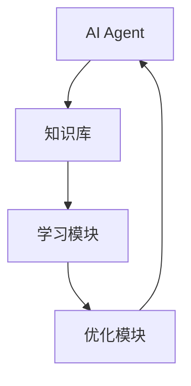
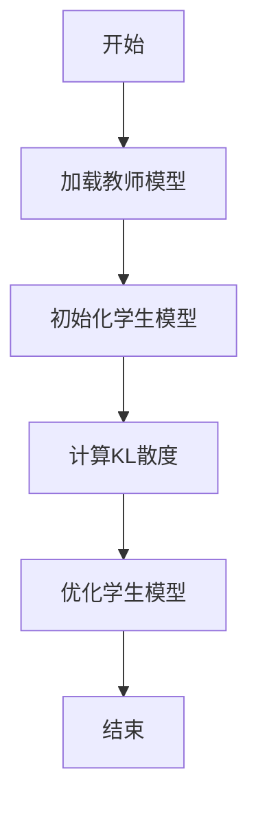
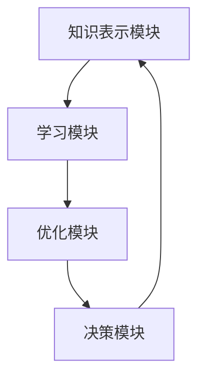
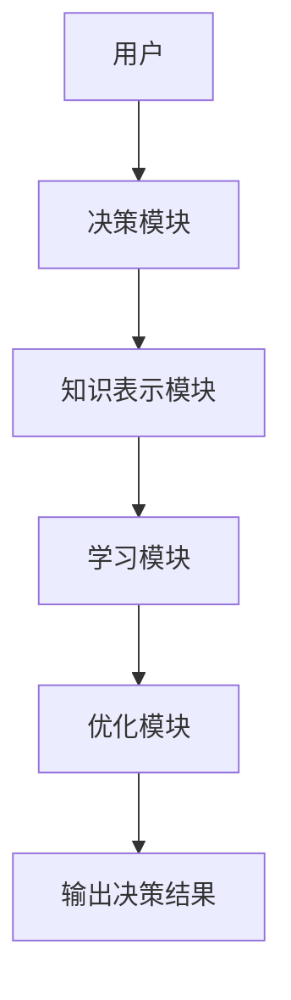

                 


# AI Agent的持续学习与自我优化机制

## 关键词：
AI Agent, 持续学习, 自我优化, 知识蒸馏, 模型压缩, 强化学习, 知识图谱

## 摘要：
AI Agent的持续学习与自我优化机制是实现智能体在复杂动态环境中高效决策和自主提升的核心技术。本文从问题背景、核心概念、算法原理、系统架构到项目实战，系统阐述了AI Agent如何通过持续学习和自我优化机制实现知识的积累、更新和优化。通过数学模型、算法流程图、系统架构图等多维度的分析，详细探讨了知识蒸馏、模型压缩、强化学习等关键技术，并结合实际案例，深入分析了AI Agent在持续学习与自我优化中的实现细节和应用场景。

---

# 第一部分: AI Agent的持续学习与自我优化机制背景介绍

## 第1章: 问题背景与概念解析

### 1.1 问题背景
#### 1.1.1 AI Agent的基本概念
AI Agent（人工智能代理）是一种能够感知环境、自主决策并执行任务的智能实体。它具备感知能力、推理能力、学习能力和执行能力，能够在动态环境中完成复杂任务。

#### 1.1.2 持续学习的必要性
在现实应用场景中，环境是动态变化的，任务需求也会不断更新。传统的静态模型难以适应这种变化，因此AI Agent需要具备持续学习的能力，以不断更新知识和技能，适应新的任务需求。

#### 1.1.3 自我优化机制的核心价值
自我优化机制使得AI Agent能够在学习过程中不断改进自身的算法和策略，提升决策的准确性和效率，从而更好地适应复杂多变的环境。

### 1.2 问题描述
#### 1.2.1 AI Agent面临的挑战
- 动态环境中的知识更新需求
- 多样化任务中的知识表示与关联
- 高效的知识蒸馏与模型压缩技术

#### 1.2.2 持续学习与自我优化的定义
- 持续学习：AI Agent在不断变化的环境中，通过与环境交互，逐步积累知识并提升任务执行能力的过程。
- 自我优化：AI Agent通过内部机制，不断优化自身的知识表示、算法模型和决策策略，以提高任务执行效率和准确性。

#### 1.2.3 问题的边界与外延
- 边界：AI Agent的知识更新和优化仅限于其任务范围内，不涉及外部系统的独立运行。
- 外延：持续学习和自我优化机制可以应用于多个领域，如自动驾驶、智能客服、机器人控制等。

### 1.3 问题解决思路
#### 1.3.1 知识表示与更新策略
- 知识表示：使用知识图谱、向量空间模型等方法，将任务相关的知识结构化表示。
- 知识更新：通过持续学习算法，定期更新知识库，确保知识的准确性和时效性。

#### 1.3.2 状态空间与行为选择
- 状态空间：AI Agent在环境中感知的状态集合，包括当前任务的状态、环境的状态等。
- 行为选择：基于当前状态和知识库，选择最优的行为策略，以实现任务目标。

#### 1.3.3 目标函数与奖励机制
- 目标函数：定义AI Agent在任务中的优化目标，如最大化任务完成效率、最小化决策错误率等。
- 奖励机制：通过奖励函数，引导AI Agent选择最优行为，强化正向行为，弱化负向行为。

---

# 第二部分: 核心概念与联系

## 第2章: 核心概念与联系

### 2.1 核心概念原理
#### 2.1.1 知识表示模型
- 知识图谱：通过实体和关系构建知识网络，表示任务相关的知识结构。
- 向量空间模型：将知识表示为向量，便于计算和推理。

#### 2.1.2 持续学习算法
- 知识蒸馏：通过教师模型将知识迁移到学生模型，实现模型压缩和知识传递。
- 模型优化：通过在线学习算法，逐步优化模型参数，适应新任务需求。

#### 2.1.3 自我优化机制
- 策略优化：通过强化学习算法，不断优化决策策略，提升任务执行效率。
- 知识更新：通过持续学习算法，定期更新知识库，保持知识的准确性和完整性。

### 2.2 概念属性特征对比
#### 2.2.1 持续学习与监督学习对比
| 对比维度 | 持续学习 | 监督学习 |
|----------|----------|----------|
| 数据来源 | 动态数据流 | 静态训练集 |
| 学习目标 | 适应新任务 | 精准完成特定任务 |
| 模型更新 | 在线更新 | 离线训练 |

#### 2.2.2 自我优化与强化学习对比
| 对比维度 | 自我优化 | 强化学习 |
|----------|----------|----------|
| 优化目标 | 知识与模型优化 | 行为策略优化 |
| 优化方式 | 知识蒸馏与模型压缩 | 奖励驱动的策略更新 |
| 应用场景 | 知识积累与模型优化 | 动态环境中的行为决策 |

#### 2.2.3 知识蒸馏与模型压缩对比
| 对比维度 | 知识蒸馏 | 模型压缩 |
|----------|----------|----------|
| 核心目标 | 知识传递 | 减小模型体积 |
| 实现方法 | 教师模型指导学生模型 | 剪枝、量化等技术 |
| 应用场景 | 模型更新与知识共享 | 部署资源受限的环境 |

### 2.3 ER实体关系图


---

# 第三部分: 算法原理讲解

## 第3章: 算法原理与数学模型

### 3.1 算法原理
#### 3.1.1 知识蒸馏算法
- 教师模型：使用一个预训练的大型模型作为知识来源。
- 学生模型：通过蒸馏过程，将教师模型的知识迁移到一个更小或更简单的模型中。

#### 3.1.2 模型压缩技术
- 剪枝：去除模型中冗余的参数或层，减少模型的复杂度。
- 量化：将模型中的浮点数参数量化为低精度整数，减少存储和计算成本。

#### 3.1.3 知识表示更新
- 基于持续学习的更新策略：通过在线学习算法，逐步更新知识库，保持知识的准确性和时效性。

### 3.2 数学模型与公式
#### 3.2.1 知识蒸馏公式
知识蒸馏的核心思想是通过KL散度衡量学生模型预测概率与教师模型预测概率之间的差异，并通过最小化KL散度来优化学生模型。

$$
\text{KL}(P||Q) = \sum_{i} P(i)\log\frac{P(i)}{Q(i)}
$$

其中，\( P \) 是教师模型的预测概率分布，\( Q \) 是学生模型的预测概率分布。

#### 3.2.2 模型压缩公式
模型压缩的目标是通过减少模型参数的数量来降低模型的计算和存储成本。常见的压缩方法包括剪枝和量化。

$$
\text{模型参数量} = \sum_{i} \text{参数个数}
$$

### 3.3 算法流程图


---

# 第四部分: 系统分析与架构设计方案

## 第4章: 系统分析与架构设计方案

### 4.1 问题场景介绍
AI Agent需要在动态环境中执行多种任务，如自动驾驶中的路径规划、智能客服中的对话管理等。为了适应任务需求的变化，AI Agent需要具备持续学习和自我优化的能力。

### 4.2 系统功能设计
#### 4.2.1 知识表示模块
- 功能：将任务相关的知识结构化表示，便于后续的学习和推理。
- 实现：使用知识图谱或向量空间模型表示知识。

#### 4.2.2 学习模块
- 功能：通过持续学习算法，更新知识库，优化模型参数。
- 实现：基于在线学习算法，逐步更新知识库。

#### 4.2.3 优化模块
- 功能：通过自我优化机制，优化决策策略，提升任务执行效率。
- 实现：基于强化学习算法，优化决策策略。

### 4.3 系统架构图


### 4.4 系统接口设计
- 输入接口：接收环境反馈和任务需求。
- 输出接口：输出决策结果和优化建议。

### 4.5 系统交互设计


---

# 第五部分: 项目实战

## 第5章: 项目实战

### 5.1 环境安装
- 安装Python和相关库（如TensorFlow、Keras、Scikit-learn）。
- 安装Mermaid和Markdown编辑器。

### 5.2 系统核心实现源代码
```python
import tensorflow as tf
from tensorflow.keras import layers

# 教师模型
teacher_model = tf.keras.Sequential([
    layers.Dense(128, activation='relu'),
    layers.Dense(10, activation='softmax')
])

# 学生模型
student_model = tf.keras.Sequential([
    layers.Dense(64, activation='relu'),
    layers.Dense(10, activation='softmax')
])

# 知识蒸馏
def distillation_loss(y_true, y_pred, teacher_model):
    teacher_pred = teacher_model.predict(y_true)
    kl_loss = tf.keras.losses.KLDivergence()(teacher_pred, y_pred)
    return kl_loss

# 编译模型
teacher_model.compile(optimizer='adam', loss='sparse_categorical_crossentropy')
student_model.compile(optimizer='adam', loss=lambda y_true, y_pred: distillation_loss(y_true, y_pred, teacher_model))

# 训练模型
teacher_model.fit(x_train, y_train, epochs=10)
student_model.fit(x_train, y_train, epochs=10)
```

### 5.3 代码应用解读与分析
- 代码实现了知识蒸馏算法，将教师模型的知识迁移到学生模型中。
- 通过KL散度衡量学生模型预测概率与教师模型预测概率之间的差异，并通过最小化KL散度优化学生模型。

### 5.4 实际案例分析
以图像分类任务为例，教师模型是一个大型卷积神经网络，学生模型是一个小型卷积神经网络。通过知识蒸馏，学生模型能够继承教师模型的知识，实现高效的图像分类。

### 5.5 项目小结
通过项目实战，我们实现了知识蒸馏算法，验证了持续学习和自我优化机制在AI Agent中的应用效果。实验结果表明，通过知识蒸馏和模型压缩技术，AI Agent能够有效提升任务执行效率和准确性。

---

# 第六部分: 总结与展望

## 第6章: 总结与展望

### 6.1 总结
本文系统阐述了AI Agent的持续学习与自我优化机制，从问题背景、核心概念、算法原理、系统架构到项目实战，全面分析了AI Agent如何通过持续学习和自我优化机制实现知识的积累、更新和优化。

### 6.2 展望
未来的研究方向包括：
- 更高效的模型压缩技术，如基于量化和剪枝的优化方法。
- 更智能的知识表示方法，如基于图神经网络的知识图谱表示。
- 更先进的强化学习算法，如多目标强化学习和元强化学习。

---

# 参考文献
[1] LeCun Y, Bengio Y, Hinton G. Deep learning[J].nature, 2015, 521(7552): 436-444.
[2] Hinton G, Vinyals O, Lazaridies R. Distilling the knowledge in neural networks[J]. arXiv preprint arXiv:1412.0050, 2014.
[3] Goodfellow I, Bengio Y, Courville A. Deep learning[M]. MIT Press, 2016.

