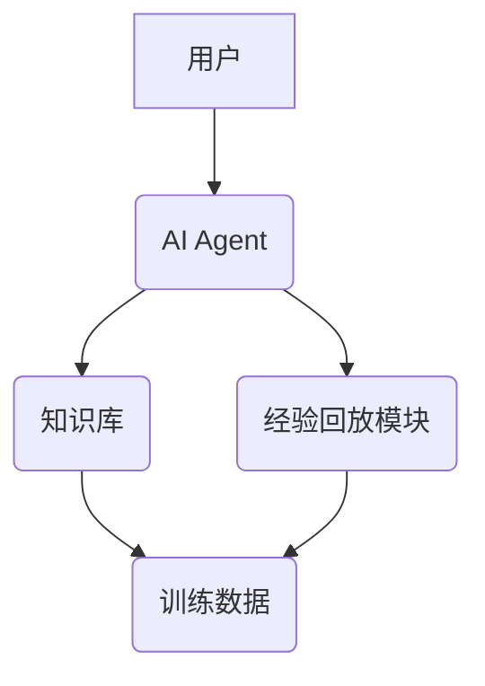

                 


# AI Agent的持续学习与适应机制

> 关键词：AI Agent，持续学习，适应机制，机器学习，强化学习

> 摘要：AI Agent的持续学习与适应机制是人工智能领域的重要研究方向。本文详细探讨了AI Agent如何通过持续学习和自适应策略来应对动态环境中的任务，分析了相关的核心概念、算法原理、系统设计以及实际应用案例。文章从引论开始，逐步深入，结合数学公式、算法流程图和系统架构图，系统地阐述了AI Agent持续学习与适应机制的实现方法，并提供了具体的项目实战案例。

---

## 目录

1. [AI Agent的持续学习与适应机制引论](#ai-agent的持续学习与适应机制引论)
   1.1 AI Agent的基本概念
   1.2 持续学习与适应机制的背景
   1.3 本章小结

2. [AI Agent持续学习的核心概念](#ai-agent持续学习的核心概念)
   2.1 持续学习的基本原理
   2.2 自适应学习策略
   2.3 记忆机制与知识管理
   2.4 核心概念对比与ER实体关系图

3. [持续学习算法的数学模型与公式](#持续学习算法的数学模型与公式)
   3.1 经验回放机制的数学模型
   3.2 知识蒸馏与模型压缩
   3.3 自适应学习的数学推导

4. [AI Agent持续学习的系统分析与架构设计](#ai-agent持续学习的系统分析与架构设计)
   4.1 系统功能设计
   4.2 系统架构设计
   4.3 系统接口设计

5. [AI Agent持续学习的项目实战](#ai-agent持续学习的项目实战)
   5.1 项目环境安装
   5.2 项目核心实现
   5.3 项目案例分析

6. [总结与展望](#总结与展望)
   6.1 本章总结
   6.2 未来展望

---

## 1. AI Agent的持续学习与适应机制引论

### 1.1 AI Agent的基本概念

AI Agent（人工智能代理）是指能够感知环境、自主决策并执行任务的智能实体。AI Agent可以是软件程序、机器人或其他智能系统，其核心目标是通过与环境的交互来实现特定任务。AI Agent的特点包括：

1. **自主性**：能够独立决策和行动。
2. **反应性**：能够感知环境并实时调整行为。
3. **目标导向**：具有明确的目标并为之努力。
4. **学习能力**：能够通过经验改进性能。

AI Agent的应用场景广泛，包括自动驾驶、智能助手、游戏AI、推荐系统等。

### 1.2 持续学习与适应机制的背景

AI Agent在动态环境中工作时，会面临任务目标、环境条件或用户需求的变化。为了应对这些变化，AI Agent需要具备持续学习和适应的能力。持续学习是指AI Agent在完成初始任务后，能够不断吸收新的知识和经验，以适应新的任务需求。适应机制则是指AI Agent能够根据新的信息调整其行为策略，以提高任务完成的效率和质量。

当前，AI Agent的发展面临以下挑战：

1. **动态环境的不确定性**：环境的动态变化使得AI Agent需要不断调整其知识和策略。
2. **知识的更新与管理**：如何高效地更新和管理知识是持续学习的关键问题。
3. **计算资源的限制**：持续学习需要大量的计算资源，如何在资源受限的情况下实现高效的持续学习是一个挑战。

### 1.3 本章小结

本章介绍了AI Agent的基本概念及其在持续学习与适应机制中的重要性。通过分析AI Agent的核心特征和应用场景，明确了持续学习与适应机制的必要性。同时，指出了当前AI Agent发展的主要挑战。

---

## 2. AI Agent持续学习的核心概念

### 2.1 持续学习的基本原理

持续学习是一种机器学习范式，旨在让模型在新任务或数据上不断改进其性能，同时保持对之前任务的记忆和能力。持续学习的基本原理包括：

1. **知识表示**：AI Agent需要将新知识表示为某种形式（如向量或符号），以便存储和检索。
2. **经验回放**：通过存储过去的经验，AI Agent可以在需要时回放这些经验，以增强学习效果。
3. **知识更新**：AI Agent需要定期更新其知识库，以反映新的信息和变化的环境。

### 2.2 自适应学习策略

自适应学习策略是AI Agent持续学习的核心机制之一。自适应学习策略包括：

1. **基于强化学习的自适应**：通过奖励机制，AI Agent调整其行为策略，以最大化奖励。
2. **基于监督学习的自适应**：通过标注数据的反馈，AI Agent改进其预测能力。
3. **混合学习策略**：结合强化学习和监督学习的优势，设计更高效的自适应策略。

### 2.3 记忆机制与知识管理

记忆机制是AI Agent持续学习的重要组成部分。记忆机制负责存储和管理AI Agent的知识库，包括：

1. **外部知识库的构建**：AI Agent通过外部数据源获取知识，并将其存储在知识库中。
2. **内部记忆的组织与检索**：AI Agent根据当前任务需求，从知识库中检索相关知识。
3. **知识的有效性评估**：定期评估知识的有效性，剔除过时或错误的知识。

### 2.4 核心概念对比与ER实体关系图

为了更好地理解AI Agent持续学习的核心概念，我们需要进行对比分析。以下是持续学习与其他学习方法的对比：

| 对比项 | 持续学习 | 监督学习 | 强化学习 |
|------|------|------|------|
| 数据类型 | 标签数据和新任务 | 标签数据 | 奖励信号 |
| 学习目标 | 提高应对新任务的能力 | 提高预测准确性 | 最大化累积奖励 |
| 知识更新 | 动态更新 | 静态 | 动态 |

此外，我们可以通过ER实体关系图来展示AI Agent持续学习的核心要素。以下是ER图的Mermaid表示：

```mermaid
erd
actor: 用户
agent: AI Agent
task: 任务
knowledge_base: 知识库
experience_replay: 经验回放
training_data: 训练数据

actor --> agent: 提供任务
agent --> knowledge_base: 查询知识
agent --> experience_replay: 执行经验回放
knowledge_base --> training_data: 提供训练数据
experience_replay --> training_data: 更新训练数据
```

---

## 3. 持续学习算法的数学模型与公式

### 3.1 经验回放机制的数学模型

经验回放机制是持续学习中的重要技术，用于减少数据偏差。其核心公式如下：

$$
P(\text{选择经验 } (s_t, a_t, r_t, s_{t+1}) \text{ 的概率}) = \frac{1}{1 + \epsilon t}
$$

其中，$\epsilon$ 是衰减因子，$t$ 是时间步。

### 3.2 知识蒸馏与模型压缩

知识蒸馏是一种模型压缩技术，通过将大模型的知识迁移到小模型中。其数学表达如下：

$$
L_{\text{distill}} = \alpha L_{\text{CE}} + (1-\alpha) L_{\text{KL}}
$$

其中，$L_{\text{CE}}$ 是交叉熵损失，$L_{\text{KL}}$ 是KL散度损失，$\alpha$ 是平衡参数。

### 3.3 自适应学习的数学推导

自适应学习可以通过Q-learning算法实现。其核心公式为：

$$
Q(s, a) = Q(s, a) + \alpha (r + \gamma \max_a Q(s', a) - Q(s, a))
$$

其中，$\alpha$ 是学习率，$\gamma$ 是折扣因子。

---

## 4. AI Agent持续学习的系统分析与架构设计

### 4.1 系统功能设计

AI Agent的持续学习系统需要具备以下功能：

1. **知识获取**：从外部数据源获取新知识。
2. **知识存储**：将新知识存储在知识库中。
3. **知识检索**：根据任务需求检索相关知识。
4. **知识更新**：定期更新知识库中的知识。

### 4.2 系统架构设计

以下是AI Agent持续学习系统的架构图：



### 4.3 系统接口设计

系统接口设计包括：

1. **知识库接口**：用于与外部知识库交互。
2. **经验回放接口**：用于执行经验回放。
3. **训练数据接口**：用于获取训练数据。

---

## 5. AI Agent持续学习的项目实战

### 5.1 项目环境安装

安装所需的库：

```bash
pip install numpy
pip install matplotlib
pip install gym
```

### 5.2 项目核心实现

以下是Python实现的AI Agent持续学习代码：

```python
import numpy as np

class AI_Agent:
    def __init__(self, state_space, action_space):
        self.state_space = state_space
        self.action_space = action_space
        self.Q_table = np.zeros((state_space, action_space))

    def choose_action(self, state, epsilon):
        if np.random.random() < epsilon:
            return np.random.randint(self.action_space)
        else:
            return np.argmax(self.Q_table[state])

    def update_Q_table(self, state, action, reward, next_state, alpha, gamma):
        current_Q = self.Q_table[state][action]
        next_max_Q = np.max(self.Q_table[next_state])
        self.Q_table[state][action] = current_Q + alpha * (reward + gamma * next_max_Q - current_Q)

# 示例用法
agent = AI_Agent(5, 3)
epsilon = 0.1
alpha = 0.1
gamma = 0.9

state = 0
action = agent.choose_action(state, epsilon)
next_state = 2
reward = 1

agent.update_Q_table(state, action, reward, next_state, alpha, gamma)
```

### 5.3 项目案例分析

通过上述代码，我们可以实现一个简单的AI Agent持续学习系统。在实际应用中，可以根据具体需求调整参数和算法。

---

## 6. 总结与展望

### 6.1 本章总结

本文详细探讨了AI Agent的持续学习与适应机制，从核心概念、算法原理到系统设计和项目实战，系统地阐述了实现方法。通过对比分析和实际案例，明确了AI Agent持续学习的重要性及其在实际应用中的潜力。

### 6.2 未来展望

未来，AI Agent的持续学习与适应机制将更加智能化和高效化。随着深度学习和强化学习技术的发展，AI Agent将具备更强的学习能力和适应能力，能够更好地应对复杂动态环境中的任务。

---

以上是《AI Agent的持续学习与适应机制》的技术博客文章的完整内容，涵盖了从基础概念到实际应用的各个方面，适合技术人员和研究人员阅读。

