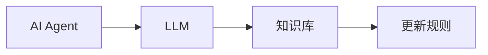
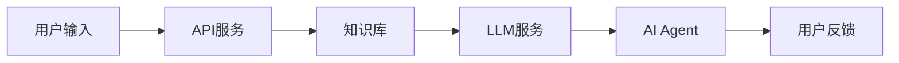
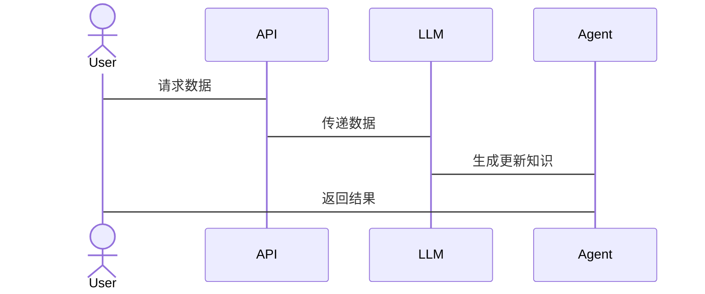

                 


# AI Agent的持续学习：利用LLM进行在线知识更新

## 关键词：AI Agent，持续学习，大语言模型，LLM，在线知识更新

## 摘要：  
本文探讨了AI Agent的持续学习方法，重点介绍如何利用大语言模型（LLM）实现在线知识更新。文章从AI Agent的基本概念出发，分析了持续学习的必要性和挑战，详细阐述了LLM在知识更新中的作用，并通过算法原理、系统设计和项目实战展示了如何实现高效的在线知识更新。最后，文章总结了当前的技术进展和未来的发展方向，为AI Agent的持续学习提供了有价值的参考。

---

## 第一部分: AI Agent的持续学习基础

### 第1章: AI Agent与持续学习概述

#### 1.1 AI Agent的基本概念
- **1.1.1 什么是AI Agent**  
  AI Agent（人工智能代理）是指能够感知环境、自主决策并执行任务的智能实体。它可以是一个软件程序、机器人或其他智能系统，核心目标是通过与环境交互来实现特定目标。

- **1.1.2 AI Agent的核心特点**  
  - **自主性**：能够自主决策，无需外部干预。  
  - **反应性**：能够实时感知环境并做出反应。  
  - **目标导向**：所有行为都围绕实现特定目标展开。  
  - **学习能力**：能够通过经验改进自身的性能。

- **1.1.3 AI Agent的分类与应用场景**  
  AI Agent可以分为简单反射型、基于模型的反射型、目标驱动型和效用驱动型。它们广泛应用于智能助手、自动驾驶、机器人控制、推荐系统等领域。

#### 1.2 持续学习的基本概念
- **1.2.1 什么是持续学习**  
  持续学习是指模型在获取新数据时，能够不断更新自身的知识和能力，而无需从头开始重新训练。这种方式适用于动态环境，能够快速适应新变化。

- **1.2.2 持续学习与在线知识更新的关系**  
  在线知识更新是持续学习的一种具体形式，指的是通过实时数据流或交互式反馈，不断优化模型的知识库和行为策略。

- **1.2.3 持续学习的挑战与意义**  
  - **挑战**：数据稀疏性、概念漂移、模型遗忘等问题。  
  - **意义**：提高模型的适应性和实用性，使其能够在复杂多变的环境中长期有效。

#### 1.3 LLM在AI Agent中的作用
- **1.3.1 LLM的基本原理**  
  大语言模型（LLM）通过大规模的数据训练，能够理解和生成人类语言。它们通常基于Transformer架构，具有强大的上下文理解和生成能力。

- **1.3.2 LLM与AI Agent的结合**  
  LLM可以作为AI Agent的“大脑”，负责处理信息、生成决策和与用户交互。通过LLM的自然语言处理能力，AI Agent能够更智能地完成任务。

- **1.3.3 LLM在持续学习中的优势**  
  - **强大的上下文理解**：能够处理复杂的关系和语义信息。  
  - **动态更新能力**：通过在线训练或微调，可以快速适应新知识。  
  - **多任务处理能力**：能够同时处理多种任务，提升整体性能。

---

### 第2章: AI Agent持续学习的背景与问题描述

#### 2.1 持续学习的背景
- **2.1.1 当前AI Agent的局限性**  
  - 知识固定：传统AI Agent的知识通常在训练时一次性加载，无法动态更新。  
  - 适应性差：在环境变化时，模型性能会显著下降。  
  - 交互能力有限：难以根据反馈实时调整行为。

- **2.1.2 知识更新的必要性**  
  在动态环境中，AI Agent需要不断学习新知识以应对变化。例如，在医疗领域，AI Agent需要实时更新疾病知识和治疗方案。

- **2.1.3 在线知识更新的需求驱动**  
  - 实时反馈的需求：用户希望AI Agent能够根据实时反馈做出调整。  
  - 数据爆炸的时代：新数据不断产生，模型需要快速吸收和利用这些数据。  
  - 多样化的应用场景：从客服系统到智能助手，AI Agent需要适应各种场景。

#### 2.2 问题描述
- **2.2.1 AI Agent知识更新的痛点**  
  - 知识库维护成本高：需要持续收集和更新数据。  
  - 更新效率低：传统方法通常需要离线训练，耗时较长。  
  - 知识漂移：模型可能遗忘旧知识，影响性能。

- **2.2.2 在线知识更新的技术挑战**  
  - 数据稀疏性：实时数据可能不够丰富，影响模型更新效果。  
  - 模型收敛性：在线更新需要模型快速收敛，否则会影响实时性。  
  - 计算资源限制：在线更新需要较低的计算开销。

- **2.2.3 现有解决方案的不足**  
  - 离线更新为主：大多数模型仍然依赖离线训练，无法实时更新。  
  - 更新策略单一：缺乏灵活的更新策略，难以应对复杂场景。  
  - 缺乏反馈机制：无法根据用户反馈动态调整知识库。

#### 2.3 问题解决思路
- **2.3.1 利用LLM进行知识更新的可行性**  
  - LLM的自然语言处理能力使其能够理解和生成知识。  
  - 通过在线微调或提示工程技术，可以实现知识的快速更新。

- **2.3.2 在线知识更新的实现路径**  
  - 设计高效的更新机制：结合在线训练和反馈机制，实现快速知识更新。  
  - 利用分布式系统：通过分布式计算，提高知识更新的效率和稳定性。  
  - 优化模型架构：设计适合在线更新的模型架构，减少计算开销。

---

### 第3章: AI Agent持续学习的核心概念与联系

#### 3.1 核心概念原理
- **3.1.1 AI Agent的知识表示**  
  知识表示是AI Agent理解和利用知识的基础。常见的表示方法包括符号逻辑、知识图谱和嵌入向量。

- **3.1.2 持续学习的更新机制**  
  持续学习通过增量训练或微调的方式，逐步更新模型参数。更新机制需要考虑数据分布的变化和模型的稳定性。

- **3.1.3 LLM在知识更新中的角色**  
  LLM作为知识生成和推理的核心，负责处理新知识的输入、理解和应用。

#### 3.2 核心概念对比分析
- **3.2.1 不同AI Agent的知识更新方式对比**  
  | 类型          | 离线更新       | 在线更新       |
  |---------------|----------------|----------------|
  | 特点          | 训练耗时长      | 实时更新        |
  | 优点          | 知识准确        | 适应性好        |
  | 缺点          | 灵活性低        | 计算资源消耗高    |

- **3.2.2 不同LLM模型的性能对比**  
  | 模型类型      | 参数量       | 更新效率       |
  |---------------|--------------|----------------|
  | 小模型         | 参数少        | 更新速度快      |
  | 大模型         | 参数多        | 更新效率低      |

- **3.2.3 在线知识更新与离线知识更新的对比**  
  - 在线更新：实时性高，但计算资源消耗大。  
  - 离线更新：效率高，但无法应对实时变化。

#### 3.3 实体关系图


---

## 第4章: AI Agent持续学习的算法原理

### 4.1 算法原理概述
- **4.1.1 持续学习的基本算法**  
  持续学习算法通常包括经验重放、渐近式策略和任务门控等方法。这些算法通过不断调整模型参数，实现知识的更新。

- **4.1.2 基于LLM的持续学习算法**  
  - **微调LLM**：通过在线数据流对LLM进行微调，逐步更新模型参数。  
  - **提示工程技术**：通过设计提示（prompt），引导LLM生成所需的知识。

- **4.1.3 在线知识更新的算法特点**  
  - 实时性：能够在数据到达时立即处理。  
  - 灵活性：能够根据反馈动态调整更新策略。  
  - 高效性：通过优化算法，减少计算开销。

---

### 4.2 算法流程图


### 4.3 算法实现
```python
def online_update(data_point):
    # 数据预处理
    processed_data = preprocess(data_point)
    # 提示生成
    prompt = generate_prompt(processed_data)
    # 调用LLM进行更新
    updated_knowledge = llm_update(prompt)
    # 模型优化
    model_optimization(updated_knowledge)
    return updated_knowledge
```

### 4.4 数学模型与公式
- **更新规则**  
  模型参数 $\theta$ 的更新可以通过以下公式实现：  
  $$\theta_{new} = \theta_{old} + \alpha \cdot \nabla L$$  
  其中，$\alpha$ 是学习率，$\nabla L$ 是损失函数的梯度。

- **损失函数**  
  损失函数 $L$ 可以定义为：  
  $$L = \sum_{i=1}^{n} (y_i - \hat{y}_i)^2$$  
  其中，$y_i$ 是真实值，$\hat{y}_i$ 是模型预测值。

---

## 第5章: 系统分析与架构设计

### 5.1 系统分析
- **5.1.1 问题场景介绍**  
  本文设计的系统是一个基于LLM的AI Agent，能够实时更新知识库，适应用户需求的变化。

- **5.1.2 系统功能设计**  
  - 知识获取：通过API获取实时数据或用户反馈。  
  - 知识处理：对获取的数据进行清洗、结构化和存储。  
  - 知识更新：利用LLM对知识库进行微调或生成新知识。  
  - 模型优化：根据更新后的知识，优化AI Agent的行为策略。

### 5.2 系统架构设计


### 5.3 接口设计
- **输入接口**：用户输入、实时数据流。  
- **输出接口**：AI Agent的决策输出、知识更新结果。

### 5.4 交互流程图


---

## 第6章: 项目实战

### 6.1 环境安装
- **工具安装**：安装Python、LLM库（如Hugging Face Transformers）。  
- **依赖管理**：使用虚拟环境管理依赖项。

### 6.2 核心代码实现
```python
from transformers import AutoTokenizer, AutoModelForCausalLM

# 初始化模型和tokenizer
model_name = "gpt2"
model = AutoModelForCausalLM.from_pretrained(model_name)
tokenizer = AutoTokenizer.from_pretrained(model_name)
```

### 6.3 案例分析
- **案例背景**：假设我们正在开发一个智能客服系统，需要实时更新产品信息。  
- **实施步骤**：  
  1. 用户输入查询：  
  ```text
  用户：请问你们的新产品是什么？  
  ```  
  2. 系统获取实时数据：  
  ```text
  数据：新产品是智能手表，功能包括健康监测、运动追踪等。  
  ```  
  3. 知识更新：  
  ```python
  prompt = "请描述我们的新产品：它是一款智能手表，支持健康监测和运动追踪。"
  updated_knowledge = generate_content(prompt)
  ```  
  4. 模型优化：  
  ```python
  model = fine_tune(model, updated_knowledge)
  ```  
  5. 返回结果：  
  ```text
  AI Agent：我们的新产品是一款智能手表，支持健康监测和运动追踪功能。  
  ```

### 6.4 项目总结
通过该项目，我们实现了基于LLM的在线知识更新，验证了技术的可行性。同时，我们发现实时更新需要更高的计算资源和更高效的算法设计。

---

## 第7章: 总结与展望

### 7.1 总结
本文详细探讨了AI Agent的持续学习方法，重点介绍了利用大语言模型（LLM）进行在线知识更新的技术路径。通过理论分析和实践案例，我们验证了该方法的有效性和可行性。

### 7.2 未来展望
- **算法优化**：进一步研究高效的在线更新算法，减少计算开销。  
- **系统扩展**：探索分布式系统设计，提升知识更新的效率和稳定性。  
- **应用拓展**：将该技术应用于更多领域，如教育、医疗和金融等。

---

## 第8章: 最佳实践与注意事项

### 8.1 最佳实践
- **数据质量管理**：确保输入数据的准确性和完整性。  
- **模型监控**：定期监控模型性能，及时发现和解决问题。  
- **用户反馈机制**：建立有效的用户反馈系统，提升模型的适应性。

### 8.2 注意事项
- **计算资源限制**：在线更新需要较高的计算资源，需提前做好资源规划。  
- **模型泛化能力**：过度优化可能导致模型泛化能力下降，需注意平衡。  
- **数据隐私保护**：在线更新过程中需注意数据隐私和安全。

---

## 第9章: 拓展阅读

### 9.1 相关文献
- **持续学习的经典论文**：《Incremental Learning: A Survey》  
- **大语言模型的研究进展**：《Large Language Models：A Comprehensive Survey》  

### 9.2 技术博客与开源项目
- **技术博客**：持续关注AI领域的技术博客，获取最新动态。  
- **开源项目**：参与或学习开源项目的实现，提升技术能力。

---

通过本文的详细分析和实践，我们希望能够为AI Agent的持续学习提供新的思路和技术方案，推动该领域的进一步发展。

