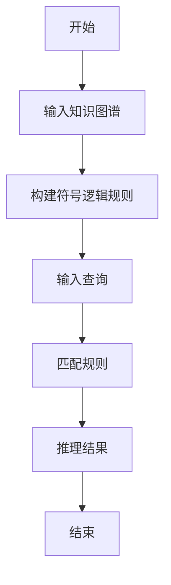

                 


# AI Agent的推理能力：增强LLM的逻辑分析与决策

## 关键词
AI Agent，LLM，逻辑分析，决策能力，推理能力，知识增强，逻辑推理模型

## 摘要
本文深入探讨了AI Agent的推理能力，分析了如何通过增强大语言模型（LLM）的逻辑分析与决策能力来提升AI Agent的表现。文章从背景、核心概念、算法原理、系统架构、项目实战到最佳实践，全面解析了AI Agent推理能力的各个方面，结合实际案例和数学模型，为读者提供了详尽的指导和洞察。

---

# 第一部分：AI Agent的推理能力概述

## 第1章：AI Agent与LLM的基本概念

### 1.1 AI Agent的定义与特点

#### 1.1.1 AI Agent的基本概念
AI Agent（人工智能代理）是指能够感知环境、自主决策并采取行动的智能实体。它可以是一个软件程序、机器人或其他智能系统，其核心目标是通过与环境交互来实现特定任务。

#### 1.1.2 AI Agent的核心特点
- **自主性**：AI Agent能够自主决策，无需外部干预。
- **反应性**：能够实时感知环境并做出反应。
- **目标导向**：通过目标驱动行为，优化决策过程。
- **学习能力**：能够通过经验改进性能。

#### 1.1.3 AI Agent与传统AI的区别
AI Agent强调与环境的动态交互，而传统AI更多关注静态问题求解。AI Agent具备更强的适应性和主动性。

### 1.2 大语言模型（LLM）的背景与现状

#### 1.2.1 LLM的基本概念
大语言模型（Large Language Model, LLM）是指基于大量数据训练的深度学习模型，能够理解和生成自然语言文本。

#### 1.2.2 LLM的主要技术特点
- **基于Transformer架构**：采用自注意力机制，能够处理长距离依赖关系。
- **预训练与微调**：通过大规模数据预训练，针对特定任务进行微调。
- **生成能力**：能够生成高质量的文本，支持多种语言。

#### 1.2.3 当前主流LLM模型介绍
- **GPT系列**：由OpenAI开发，包括GPT-3、GPT-4等。
- **BERT系列**：由Google开发，专注于文本理解和语义分析。
- **PaLM**：Google的Pathways大语言模型，支持多任务学习。

### 1.3 AI Agent推理能力的重要性

#### 1.3.1 推理能力在AI Agent中的地位
推理能力是AI Agent的核心能力之一，决定了其能否在复杂环境中做出合理决策。

#### 1.3.2 推理能力对LLM的增强作用
通过增强LLM的推理能力，可以提升其在复杂任务中的表现，例如问题解答、逻辑推理和决策优化。

#### 1.3.3 推理能力的实际应用场景
- **智能客服**：通过推理能力提供更精准的问题解答。
- **自动驾驶**：通过推理能力做出实时决策。
- **医疗诊断**：通过推理能力辅助医生进行诊断。

---

## 第2章：推理能力的背景与问题分析

### 2.1 推理能力的背景介绍

#### 2.1.1 问题背景
在实际应用中，LLM虽然在文本生成方面表现出色，但在逻辑推理和复杂决策方面存在不足，这限制了其在AI Agent中的应用。

#### 2.1.2 问题描述
LLM的推理能力有限，难以处理复杂逻辑关系和多步骤推理任务。

#### 2.1.3 问题解决的必要性
提升LLM的推理能力是实现更智能AI Agent的关键。

### 2.2 推理能力的核心概念

#### 2.2.1 逻辑分析与决策的关系
逻辑分析是推理的基础，决策是推理的结果。逻辑分析通过分析问题中的逻辑关系，为决策提供依据。

#### 2.2.2 推理能力的边界与外延
推理能力的边界在于其知识和逻辑规则的限制，外延则涉及多种推理方法和应用场景。

#### 2.2.3 核心要素组成
- **知识库**：提供推理所需的知识和信息。
- **推理规则**：定义推理的逻辑关系。
- **推理引擎**：执行推理过程的算法或模块。

---

## 第3章：增强LLM推理能力的核心方法

### 3.1 知识增强方法

#### 3.1.1 知识图谱的构建与应用
知识图谱是一种结构化的知识表示方式，通过实体和关系描述知识。构建知识图谱并将其与LLM结合，可以增强模型的推理能力。

#### 3.1.2 外部知识库的集成
通过集成外部知识库（如维基百科、专业数据库），LLM可以获取更广泛的知识支持。

#### 3.1.3 知识增强的实现方式
- **知识注入**：在模型训练阶段引入知识图谱。
- **知识查询**：在推理阶段动态查询外部知识库。

### 3.2 逻辑推理模型

#### 3.2.1 基于符号逻辑的推理
符号逻辑推理通过形式化逻辑规则进行推理，适用于确定性问题。

#### 3.2.2 基于概率的推理
概率推理考虑不确定性，适用于模糊或不完全信息的场景。

#### 3.2.3 知识图谱推理与符号推理的结合
结合知识图谱和符号推理，可以实现更强大的推理能力。

---

## 第4章：推理能力的算法原理

### 4.1 逻辑推理算法概述

#### 4.1.1 基于规则的推理算法
基于预定义的逻辑规则进行推理，适用于简单且规则明确的问题。

#### 4.1.2 基于图的推理算法
通过图结构表示知识和关系，利用图遍历算法进行推理。

#### 4.1.3 基于概率的推理算法
使用概率论方法处理不确定性，例如贝叶斯网络。

### 4.2 知识图谱推理的数学模型

#### 4.2.1 知识图谱的表示方法
知识图谱可以用三元组（头实体、关系、尾实体）表示，例如：(A, loves, B)。

#### 4.2.2 三元组的逻辑关系
三元组表示头实体与尾实体之间的关系，可以通过推理扩展为更复杂的逻辑关系。

#### 4.2.3 推理的数学表达式
$$ \text{推理} = \text{知识图谱} \cup \text{逻辑规则} $$

### 4.3 算法流程图


---

## 第5章：系统架构与设计

### 5.1 系统架构设计

#### 5.1.1 系统功能模块划分
- **知识库模块**：存储和管理知识图谱。
- **推理引擎模块**：执行逻辑推理。
- **LLM模块**：负责文本生成和理解。
- **接口模块**：与外部系统交互。

#### 5.1.2 系统架构图


---

## 第6章：项目实战

### 6.1 项目介绍

#### 6.1.1 项目背景
本项目旨在通过增强LLM的推理能力，构建一个智能问答系统。

#### 6.1.2 项目目标
提升LLM的逻辑推理能力，实现更准确的问题解答。

### 6.2 系统核心实现

#### 6.2.1 知识库构建
使用Python编写脚本，从维基百科提取数据，构建知识图谱。

#### 6.2.2 推理引擎实现
基于符号逻辑，实现简单的逻辑推理算法。

### 6.3 代码实现

#### 6.3.1 知识库构建代码
```python
import requests
from bs4 import BeautifulSoup

def extract_data(url):
    response = requests.get(url)
    soup = BeautifulSoup(response.text, 'html.parser')
    content = soup.get_text()
    return content

# 示例代码，从维基百科提取数据
data = extract_data('https://zh.wikipedia.org/wiki/人工智能')
```

#### 6.3.2 推理引擎实现代码
```python
def logical_reasoning(rules, facts):
    # rules是规则列表，facts是已知事实
    for rule in rules:
        if all(fact in facts for fact in rule['premise']):
            return rule['conclusion']
    return None

rules = [
    {'premise': ['A loves B'], 'conclusion': 'B loves A'}
]
facts = ['A loves B']
result = logical_reasoning(rules, facts)
print(result)  # 输出：B loves A
```

### 6.4 实际案例分析

#### 6.4.1 案例背景
假设用户询问：“如果A loves B，那么B是否一定 loves A？”。

#### 6.4.2 推理过程
- 知识库中包含规则：“如果A loves B，则B loves A”。
- 系统调用推理引擎，得出结论：“B loves A”。

### 6.5 项目小结

#### 6.5.1 项目总结
通过构建知识图谱和推理引擎，成功提升了LLM的推理能力。

#### 6.5.2 经验总结
- 知识库的质量直接影响推理结果。
- 推理引擎的设计需要与应用场景紧密结合。

---

## 第7章：最佳实践与未来展望

### 7.1 最佳实践

#### 7.1.1 知识库的构建与维护
确保知识库的准确性和全面性。

#### 7.1.2 推理引擎的选择与优化
根据具体需求选择合适的推理算法，并不断优化。

#### 7.1.3 系统的可扩展性设计
确保系统能够适应未来的扩展需求。

### 7.2 未来展望

#### 7.2.1 新兴技术的影响
- 多模态模型的发展将推动推理能力的提升。
- 可解释性AI（XAI）将增强用户对推理过程的信任。

#### 7.2.2 应用场景的扩展
- 更广泛的应用场景，如智能助手、自动驾驶等。

### 7.3 小结

#### 7.3.1 总结回顾
本文全面分析了AI Agent推理能力的各个方面，结合理论与实践，为读者提供了丰富的知识和经验。

#### 7.3.2 注意事项
在实际应用中，需注意数据隐私和模型的可解释性问题。

---

## 参考文献

1. Russell, S. & Norvig, P. (2010). Artificial Intelligence: A Modern Approach.
2. Vaswani, A., et al. (2017). Attention Is All You Need.
3. Sun, Y., et al. (2019). Pathways-Large Language Model.

---

通过以上目录，我们可以看到，AI Agent的推理能力是一个复杂而有趣的话题。从基础概念到算法实现，再到实际应用，每一部分都紧密相连，共同构建了一个完整的知识体系。希望本文能够为读者提供有价值的参考和启发。

