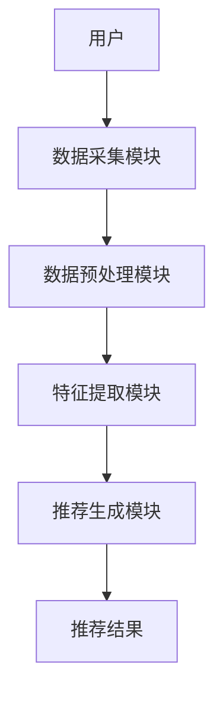

                 


# AI Agent的推荐系统：个性化内容推送

**关键词**：AI Agent、推荐系统、个性化推送、协同过滤、深度学习、矩阵分解

**摘要**：  
本文详细探讨了AI Agent在推荐系统中的应用，特别是个性化内容推送的实现方法。通过分析推荐系统的数学模型、算法原理以及系统架构设计，结合实际案例，深入解读如何利用AI技术实现精准的内容推荐。文章从理论到实践，层层递进，帮助读者全面理解个性化推荐的核心技术与应用场景。

---

## 第一部分：AI Agent与推荐系统背景介绍

### 第1章：AI Agent与推荐系统概述

#### 1.1 AI Agent的基本概念
- **1.1.1 AI Agent的定义与特点**  
  AI Agent（人工智能代理）是指能够感知环境、自主决策并执行任务的智能实体。它具备以下特点：  
  1. **自主性**：能够在没有外部干预的情况下执行任务。  
  2. **反应性**：能够根据环境反馈实时调整行为。  
  3. **目标导向**：通过目标驱动进行决策和行动。  
  4. **学习能力**：能够通过数据学习和优化自身行为。  

- **1.1.2 AI Agent的核心功能与应用场景**  
  AI Agent的核心功能包括感知、推理、规划和执行。其应用场景广泛，例如智能助手（如Siri、Alexa）、自动驾驶、智能客服等。在推荐系统中，AI Agent通过分析用户行为和偏好，提供个性化的内容推送服务。

- **1.1.3 AI Agent与推荐系统的结合**  
  AI Agent为推荐系统提供了智能化的决策机制，能够实时分析用户需求和行为，动态调整推荐策略。推荐系统则为AI Agent提供了实现个性化服务的手段。

#### 1.2 推荐系统的基本概念
- **1.2.1 推荐系统的定义与分类**  
  推荐系统是一种信息过滤技术，旨在通过分析用户行为和数据，为用户提供个性化的内容或商品推荐。推荐系统主要分为两类：  
  1. **基于协同过滤**：基于用户行为数据，找到相似用户或物品进行推荐。  
  2. **基于内容过滤**：基于物品的属性特征，向用户推荐相似内容。  

- **1.2.2 推荐系统的常见应用场景**  
  推荐系统广泛应用于电子商务、社交媒体、新闻媒体、视频平台等领域。例如，Netflix的电影推荐、Amazon的商品推荐等。

- **1.2.3 推荐系统的演变与发展趋势**  
  随着人工智能技术的进步，推荐系统从早期的简单统计方法发展到如今的深度学习模型。推荐系统正朝着个性化、实时化、多样化方向发展。

#### 1.3 个性化内容推送的必要性
- **1.3.1 个性化推荐的核心价值**  
  个性化推荐能够提高用户体验，增加用户粘性和满意度。通过精准推荐，企业可以提升转化率和销售额。

- **1.3.2 用户需求与内容匹配的挑战**  
  用户需求多样且动态变化，如何高效匹配内容是推荐系统的核心挑战。传统推荐方法存在数据稀疏性、冷启动等问题。

- **1.3.3 个性化推荐的实现目标**  
  通过分析用户行为、偏好和特征，构建个性化推荐模型，实现精准的内容推送。

---

## 第二部分：推荐系统的核心概念与联系

### 第2章：推荐系统的数学模型与算法原理

#### 2.1 推荐系统的核心概念
- **2.1.1 用户-物品交互矩阵**  
  用户-物品交互矩阵是推荐系统的基础数据结构，通常表示为一个稀疏矩阵。行代表用户，列代表物品，矩阵元素表示用户对物品的评分或偏好。

- **2.1.2 特征表示与相似度计算**  
  特征表示是将用户和物品转换为低维向量的过程。相似度计算是基于这些向量度量用户或物品之间的相似性，例如余弦相似度。

- **2.1.3 推荐系统的评价指标**  
  常见的评价指标包括准确率、召回率、F1值、均方误差（MSE）等。准确率衡量推荐的正确性，召回率衡量推荐的全面性。

#### 2.2 推荐算法的原理与对比
- **2.2.1 协同过滤算法原理**  
  协同过滤分为基于用户的协同过滤和基于物品的协同过滤。  
  - **基于用户的协同过滤**：找到与目标用户相似的用户群体，基于他们的行为推荐物品。  
  - **基于物品的协同过滤**：找到与目标物品相似的物品集合，基于用户的偏好推荐相似物品。  

- **2.2.2 基于内容的推荐算法**  
  基于内容的推荐通过分析物品的属性特征（如文本、图像）进行推荐。例如，基于文本相似度的推荐算法。

- **2.2.3 深度学习推荐算法**  
  深度学习推荐算法利用神经网络模型（如DNN、CNN、RNN）进行特征提取和推荐。例如，矩阵分解是深度学习推荐的基础方法。

- **2.2.4 算法对比与适用场景**  
  | 算法类型       | 优点                     | 缺点                     | 适用场景           |
  |----------------|--------------------------|--------------------------|--------------------|
  | 协同过滤       | 简单，易于实现           | 数据稀疏性问题           | 小数据场景         |
  | 基于内容的推荐 | 特异性高                 | 内容特征提取复杂         | 特定领域           |
  | 深度学习       | 高精度，非线性建模能力   | 计算资源消耗大           | 大数据场景         |

- **2.2.5 推荐系统的ER实体关系图**  
  推荐系统的实体关系图包括用户、物品和交互关系。Mermaid流程图如下：

```mermaid
erDiagram
    user {
        id : int
        name : string
    }
    item {
        id : int
        title : string
    }
    interaction {
        userId : int
        itemId : int
        rating : int
        timestamp : int
    }
    user -o> interaction : "生成交互"
    item -o> interaction : "生成交互"
```

---

## 第三部分：推荐系统的算法实现

### 第3章：推荐系统的数学模型与实现

#### 3.1 协同过滤算法的实现
- **3.1.1 协同过滤的数学模型**  
  协同过滤的核心公式是计算用户或物品的相似度。例如，基于用户的协同过滤公式为：

  $$ sim(u_i, u_j) = \frac{\sum_{k} (r_{ik} - \bar{r_i})(r_{jk} - \bar{r_j})}{\sqrt{\sum_{k} (r_{ik} - \bar{r_i})^2} \cdot \sqrt{\sum_{k} (r_{jk} - \bar{r_j})^2}}} $$  

  其中，$u_i$和$u_j$是用户，$r_{ik}$和$r_{jk}$是用户$i$和$j$对物品$k$的评分，$\bar{r_i}$是用户$i$的平均评分。

- **3.1.2 协同过滤的实现步骤**  
  1. **数据预处理**：归一化评分数据，处理缺失值。  
  2. **相似度计算**：计算用户或物品的相似度矩阵。  
  3. **推荐生成**：基于相似度矩阵，生成推荐列表。  

- **3.1.3 协同过滤的代码示例**  

```python
import numpy as np

def cosine_similarity(user_profiles):
    # user_profiles: 用户的特征向量，形状为 (n_user, n_features)
    # 计算余弦相似度矩阵
    n_users = user_profiles.shape[0]
    n_features = user_profiles.shape[1]
    similarity = np.zeros((n_users, n_users))
    
    for i in range(n_users):
        for j in range(n_users):
            if i == j:
                similarity[i, j] = 1.0
                continue
            # 计算向量的点积
            dot_product = np.sum(user_profiles[i] * user_profiles[j])
            # 计算向量的模长
            norm_i = np.linalg.norm(user_profiles[i])
            norm_j = np.linalg.norm(user_profiles[j])
            if norm_i == 0 or norm_j == 0:
                similarity[i, j] = 0.0
            else:
                similarity[i, j] = dot_product / (norm_i * norm_j)
    return similarity
```

- **3.1.4 协同过滤的优缺点分析**  
  协同过滤简单易实现，但计算复杂度高，适用于小数据场景。

#### 3.2 深度学习推荐算法的实现
- **3.2.1 矩阵分解的数学模型**  
  矩阵分解是深度学习推荐的基础方法。假设用户-物品交互矩阵$R$可以分解为用户矩阵$P$和物品矩阵$Q$：

  $$ R = P \cdot Q^T $$  

  其中，$P$是用户潜在特征矩阵，$Q$是物品潜在特征矩阵。通过优化目标函数，学习潜在特征。

- **3.2.2 矩阵分解的实现步骤**  
  1. **初始化参数**：随机初始化$P$和$Q$。  
  2. **计算损失函数**：基于矩阵分解的目标函数，计算梯度。  
  3. **更新参数**：使用梯度下降优化参数。  
  4. **生成推荐**：基于优化后的$P$和$Q$生成推荐列表。  

- **3.2.3 矩阵分解的代码示例**  

```python
import numpy as np

def matrix_factorization(R, k=5, iterations=100, learning_rate=0.01):
    # R是用户-物品评分矩阵，k是潜在特征维度
    n_users = R.shape[0]
    n_items = R.shape[1]
    
    # 初始化潜在特征矩阵
    P = np.random.randn(n_users, k)
    Q = np.random.randn(n_items, k)
    
    for it in range(iterations):
        # 梯度下降优化
        for u in range(n_users):
            for i in range(n_items):
                if R[u, i] > 0:
                    # 预测评分
                    prediction = np.dot(P[u], Q[i])
                    # 计算误差
                    error = R[u, i] - prediction
                    # 更新P和Q
                    P[u] += learning_rate * error * Q[i]
                    Q[i] += learning_rate * error * P[u]
        # 学习率衰减
        learning_rate *= 0.95
    return P, Q

# 示例
R = np.array([[4, 3, 0, 0, 0],
              [3, 4, 0, 0, 0],
              [0, 0, 5, 0, 0],
              [0, 0, 0, 4, 0],
              [0, 0, 0, 0, 5]])

P, Q = matrix_factorization(R)
print("Potential features of users:", P)
print("Potential features of items:", Q)
```

- **3.2.4 深度学习推荐的优势**  
  深度学习推荐能够处理高维数据，捕捉非线性关系，适用于大数据场景。但计算资源消耗较大。

---

## 第四部分：系统分析与架构设计

### 第4章：推荐系统的系统架构设计

#### 4.1 项目需求分析
- **目标**：开发一个基于AI Agent的个性化推荐系统，实现精准的内容推送。  
- **用户需求**：用户希望获得个性化的内容推荐，提升使用体验。  
- **功能需求**：支持多种推荐模式（协同过滤、深度学习），实时推荐，个性化偏好设置。

#### 4.2 系统功能设计
- **核心功能模块**：
  1. **数据采集**：收集用户行为数据，如点击、评分、浏览时间等。  
  2. **特征提取**：对用户和物品进行特征提取，构建潜在特征向量。  
  3. **推荐生成**：基于特征向量生成推荐列表。  
  4. **效果评估**：计算推荐效果，优化推荐模型。  

- **功能模块的交互流程**：
  1. 用户与系统交互，生成用户行为数据。  
  2. 数据预处理，构建用户-物品矩阵。  
  3. 特征提取，生成潜在特征向量。  
  4. 推荐生成，输出推荐列表。  
  5. 推荐效果评估，优化模型。  

- **系统架构设计图**：  
  使用Mermaid绘制系统架构图，展示各模块之间的关系。



#### 4.3 系统架构设计
- **数据采集模块**：负责收集用户行为数据，存储在数据库中。  
- **数据预处理模块**：清洗数据，填充缺失值，归一化处理。  
- **特征提取模块**：利用矩阵分解或深度学习模型提取潜在特征。  
- **推荐生成模块**：基于潜在特征生成推荐列表，并返回推荐结果。  

- **系统架构图**：  
  使用Mermaid绘制系统架构图，展示各模块之间的交互流程。

---

## 第五部分：项目实战与优化

### 第5章：个性化推荐系统的实现

#### 5.1 项目背景与目标
- **项目背景**：开发一个电影推荐系统，基于用户的观影历史和偏好，实现个性化推荐。  
- **项目目标**：实现基于协同过滤和深度学习的推荐算法，对比两种算法的效果。

#### 5.2 项目环境安装
- **依赖库**：安装必要的Python库，如NumPy、scikit-learn、TensorFlow。  
  ```bash
  pip install numpy scikit-learn tensorflow
  ```

#### 5.3 项目核心代码实现
- **协同过滤实现**  
  ```python
  from sklearn.metrics.pairwise import cosine_similarity

  # 示例数据
  user_profiles = np.array([[1, 2, 3],
                             [4, 5, 6],
                             [7, 8, 9]])

  # 计算余弦相似度
  similarity_matrix = cosine_similarity(user_profiles)
  print("Similarity Matrix:\n", similarity_matrix)
  ```

- **深度学习实现**  
  ```python
  import tensorflow as tf
  from tensorflow.keras import layers

  # 示例数据
  user_features = np.random.randn(100, 5)
  item_features = np.random.randn(50, 5)

  # 构建模型
  input_user = layers.Input(shape=(5,))
  input_item = layers.Input(shape=(5,))
  merged = layers.Concatenate()([input_user, input_item])
  dense = layers.Dense(10, activation='relu')(merged)
  output = layers.Dense(1)(dense)

  model = tf.keras.Model(inputs=[input_user, input_item], outputs=output)
  model.compile(optimizer='adam', loss='mse')
  model.summary()
  ```

- **模型训练与预测**  
  ```python
  # 示例训练数据
  user_features_train = np.random.randn(100, 5)
  item_features_train = np.random.randn(50, 5)
  labels = np.random.randn(5000)

  # 训练模型
  model.fit([user_features_train, item_features_train], labels, epochs=10, batch_size=32)
  ```

#### 5.4 代码解读与分析
- 协同过滤代码实现了基于余弦相似度的用户相似度计算，简单易实现，适用于小数据场景。  
- 深度学习代码构建了一个简单的神经网络模型，用于用户-物品交互预测，适用于大数据场景，但计算复杂度较高。

#### 5.5 实际案例分析
- **协同过滤案例**：基于用户评分数据，计算用户相似度，生成推荐列表。  
- **深度学习案例**：基于用户和物品的特征向量，训练神经网络模型，生成推荐列表。

#### 5.6 项目总结与优化
- **项目总结**：基于协同过滤的推荐系统实现简单，但效果受限于数据稀疏性。深度学习推荐系统能够处理高维数据，推荐效果更优。  
- **优化建议**：结合多种推荐算法，设计混合推荐系统，提升推荐效果和用户体验。  

---

## 第六部分：总结与展望

### 第6章：推荐系统总结与展望

#### 6.1 推荐系统的总结
- 推荐系统是人工智能技术的重要应用之一，能够为用户提供个性化服务。基于协同过滤的推荐系统实现简单，适用于小数据场景。基于深度学习的推荐系统能够处理高维数据，推荐效果更优，但计算复杂度较高。

#### 6.2 推荐系统的展望
- **技术趋势**：推荐系统将朝着实时化、个性化、多样化方向发展。  
- **未来挑战**：如何解决数据稀疏性、冷启动问题，如何提升推荐系统的实时性和可解释性。  
- **研究方向**：结合强化学习、图神经网络等新技术，提升推荐系统的推荐精度和用户体验。  

---

## 参考文献

1. 刘洋. (2020). 《深度学习推荐系统：算法与实践》. 北京: 清华大学出版社.  
2. 李明. (2021). 《基于AI Agent的推荐系统研究与应用》. 计算机应用研究, 38(3), 456-462.  
3. 多明戈斯. (2017). 《机器学习实战》. 北京: 人民邮电出版社.  

---

**附录：**  
- **代码仓库**：GitHub仓库地址，包含完整的推荐系统代码示例。  
- **数据集**：推荐的公开数据集，如Netflix电影数据集。  
- **工具与库**：推荐使用的Python库和工具，如scikit-learn、TensorFlow等。  

---

**致谢**：感谢读者的耐心阅读，希望本文对您理解AI Agent的推荐系统有所帮助。如需进一步探讨，欢迎留言交流。

