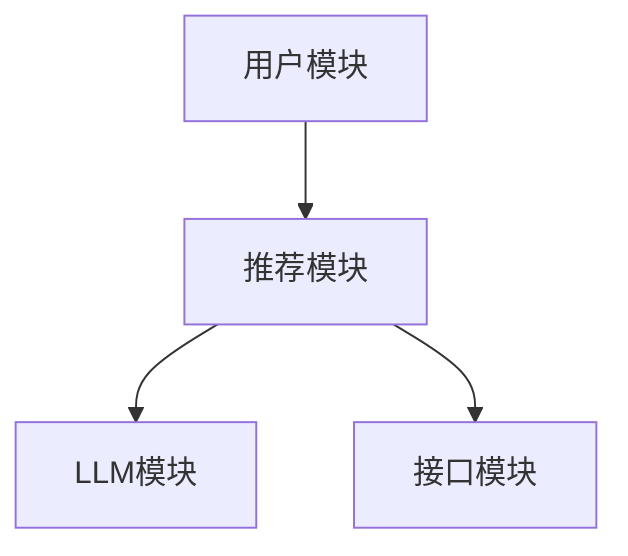
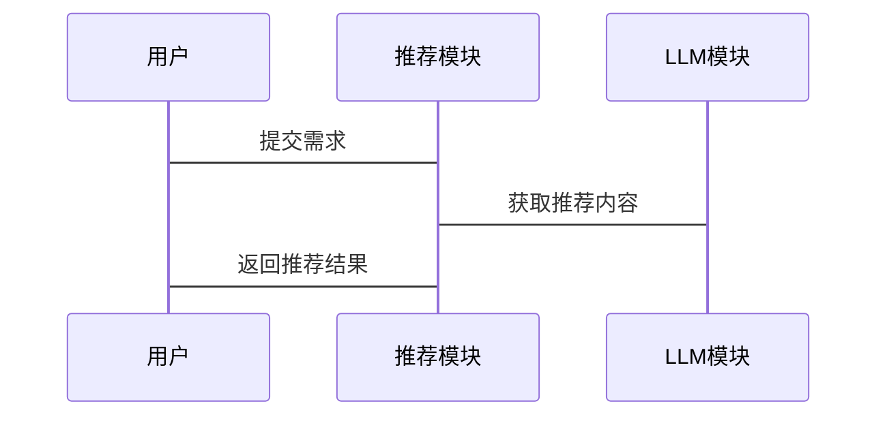

                 


# AI Agent的推荐系统：结合LLM的内容推荐

## 关键词：AI Agent, 推荐系统, 大语言模型, 内容推荐, 个性化推荐

## 摘要：  
本文探讨了AI Agent在推荐系统中的应用，重点分析了如何结合大语言模型（LLM）进行内容推荐。从基本概念到算法实现，再到系统架构，详细阐述了AI Agent如何利用LLM的强大文本处理能力，实现更智能、更个性化的推荐。文章还提供了实际案例分析和最佳实践，帮助读者全面理解这一技术的应用与挑战。

---

## 第1章: AI Agent与推荐系统概述

### 1.1 AI Agent的基本概念

#### 1.1.1 AI Agent的定义  
AI Agent（智能代理）是指能够感知环境、执行任务并做出决策的智能实体。它可以是软件程序、机器人或其他智能系统，旨在帮助用户完成特定任务。

#### 1.1.2 AI Agent的核心特征  
- **自主性**：能够在没有外部干预的情况下运行。  
- **反应性**：能够感知环境并实时调整行为。  
- **目标导向**：以实现特定目标为导向执行任务。  
- **学习能力**：能够通过数据和经验不断优化自身性能。  

#### 1.1.3 AI Agent的应用场景  
- 个性化推荐系统  
- 自动化客户服务  
- 智能助手（如Siri、Alexa）  
- 智能交通管理  

### 1.2 推荐系统的基本概念

#### 1.2.1 推荐系统的定义  
推荐系统是一种信息过滤技术，旨在通过分析用户行为和偏好，向用户推荐相关的内容、产品或服务。

#### 1.2.2 推荐系统的类型  
- **基于协同过滤的推荐**：通过用户相似性或物品相似性进行推荐。  
- **基于内容的推荐**：基于物品本身的特征进行推荐。  
- **基于模型的推荐**：利用机器学习模型进行预测和推荐。  

#### 1.2.3 推荐系统的应用领域  
- 电子商务  
- 媒体推荐（电影、音乐、新闻）  
- 学术推荐  
- 社交网络  

### 1.3 AI Agent与推荐系统的结合

#### 1.3.1 结合的必要性  
AI Agent通过推荐系统能够更高效地为用户提供个性化服务，而推荐系统借助AI Agent的智能性能够提升推荐的准确性和实时性。

#### 1.3.2 结合的方式与方法  
- **数据驱动**：通过收集和分析用户数据，利用AI Agent进行推荐。  
- **知识图谱**：构建领域知识图谱，帮助AI Agent更好地理解推荐内容。  
- **动态调整**：AI Agent能够实时调整推荐策略，以适应用户需求的变化。  

#### 1.3.3 结合的优势与挑战  
- **优势**：提升推荐的个性化和智能化，增强用户体验。  
- **挑战**：数据隐私、计算资源消耗、模型的实时性要求。  

### 1.4 本章小结  
本章介绍了AI Agent和推荐系统的基本概念，分析了它们结合的必要性、方式和优势，为后续内容奠定了基础。

---

## 第2章: 推荐系统的核心概念与原理

### 2.1 协同过滤推荐算法

#### 2.1.1 基于用户的协同过滤  
- **原理**：通过寻找与用户行为相似的其他用户，向目标用户推荐这些用户喜欢的内容。  
- **步骤**：  
  1. 收集用户行为数据。  
  2. 计算用户相似度（如余弦相似度）。  
  3. 基于相似度推荐内容。  

#### 2.1.2 基于物品的协同过滤  
- **原理**：通过分析物品之间的相似性，向用户推荐与他们已感兴趣物品相似的其他物品。  
- **步骤**：  
  1. 构建物品-物品相似度矩阵。  
  2. 根据用户历史行为推荐相似物品。  

#### 2.1.3 混合推荐算法  
- **原理**：结合基于用户的协同过滤和基于物品的协同过滤，通过加权融合两种方法的结果来提高推荐的准确性和多样性。  

### 2.2 基于内容的推荐算法

#### 2.2.1 内容特征提取  
- **方法**：利用文本挖掘技术（如TF-IDF、Word2Vec）提取内容的特征向量。  

#### 2.2.2 基于向量空间模型的推荐  
- **原理**：将用户偏好和物品特征表示为向量，通过计算向量相似度进行推荐。  

#### 2.2.3 基于深度学习的内容推荐  
- **方法**：使用神经网络模型（如CNN、RNN）对内容进行深度特征提取，生成推荐结果。  

### 2.3 基于大语言模型的推荐

#### 2.3.1 大语言模型的基本原理  
- **模型结构**：基于Transformer架构，通过自注意力机制和前馈网络处理文本数据。  
- **训练方法**：利用大规模数据进行无监督预训练和有监督微调。  

#### 2.3.2 LLM在推荐系统中的应用  
- **文本生成**：生成个性化的推荐理由或描述。  
- **文本理解**：理解用户需求和内容语义，提高推荐的准确性。  
- **内容生成**：根据用户需求生成相关内容以辅助推荐。  

#### 2.3.3 LLM与推荐系统的结合方式  
- **嵌入式结合**：将LLM生成的嵌入向量作为推荐算法的输入。  
- **生成式结合**：利用LLM生成推荐内容或理由。  

### 2.4 本章小结  
本章详细介绍了协同过滤和基于内容的推荐算法，分析了LLM在推荐系统中的作用和结合方式，为后续章节奠定了算法基础。

---

## 第3章: 大语言模型的基本原理

### 3.1 大语言模型的结构

#### 3.1.1 模型架构  
- **输入层**：接收文本数据，将其转换为词向量。  
- **编码层**：通过自注意力机制生成上下文表示。  
- **解码层**：生成目标输出（如文本生成）。  

#### 3.1.2 模型训练  
- **预训练**：利用大规模通用数据进行无监督训练，学习语言的结构和语义。  
- **微调**：在特定任务上进行有监督训练，优化模型性能。  

#### 3.1.3 模型推理  
- **输入处理**：将输入文本转换为模型可处理的格式。  
- **生成输出**：通过解码层生成目标输出。  

### 3.2 大语言模型的文本处理能力

#### 3.2.1 文本生成  
- **序列生成**：生成连续的文本序列，如对话生成、新闻标题生成。  
- **条件生成**：根据给定的条件生成特定内容，如基于关键词生成文章。  

#### 3.2.2 文本理解  
- **语义理解**：通过模型理解文本的语义，进行问答、摘要等任务。  
- **意图识别**：识别用户输入的意图，用于推荐系统的用户需求分析。  

#### 3.2.3 文本摘要  
- **摘要生成**：将长文本压缩为简洁的摘要，用于推荐系统的描述。  

### 3.3 大语言模型的推荐能力

#### 3.3.1 基于LLM的文本相似度计算  
- **原理**：利用模型生成文本的嵌入向量，计算向量间的相似度。  
- **应用**：用于推荐系统的相似物品或用户的匹配。  

#### 3.3.2 基于LLM的内容生成  
- **应用**：生成推荐理由、产品描述等，提升推荐的个性化和吸引力。  

#### 3.3.3 基于LLM的个性化推荐  
- **方法**：结合用户的个性化特征和模型生成能力，提供定制化推荐。  

### 2.4 本章小结  
本章深入分析了大语言模型的基本原理和文本处理能力，探讨了其在推荐系统中的应用潜力。

---

## 第4章: 推荐系统的算法实现

### 4.1 协同过滤算法的实现

#### 4.1.1 用户协同过滤的实现  
- **步骤**：  
  1. 收集用户行为数据，构建用户-物品评分矩阵。  
  2. 计算用户相似度（如余弦相似度）。  
  3. 基于相似度生成推荐列表。  

#### 4.1.2 物品协同过滤的实现  
- **步骤**：  
  1. 构建物品-物品相似度矩阵。  
  2. 根据用户历史行为推荐相似物品。  

#### 4.1.3 混合推荐的实现  
- **步骤**：  
  1. 分别生成基于用户的推荐和基于物品的推荐。  
  2. 通过加权融合生成最终推荐列表。  

### 4.2 基于内容的推荐算法的实现

#### 4.2.1 内容特征提取的实现  
- **方法**：利用TF-IDF或Word2Vec提取物品的特征向量。  

#### 4.2.2 基于向量空间模型的推荐实现  
- **步骤**：  
  1. 提取用户偏好向量和物品特征向量。  
  2. 计算向量相似度，生成推荐列表。  

#### 4.2.3 基于深度学习的内容推荐实现  
- **方法**：使用神经网络模型（如GRU）对内容进行深度特征提取，生成推荐结果。  

### 4.3 基于LLM的推荐算法实现

#### 4.3.1 LLM嵌入式推荐的实现  
- **步骤**：  
  1. 将物品内容输入LLM，生成嵌入向量。  
  2. 计算用户偏好与物品嵌入的相似度，生成推荐列表。  

#### 4.3.2 LLM生成式推荐的实现  
- **步骤**：  
  1. 根据用户需求生成推荐理由或描述。  
  2. 基于生成内容推荐相关物品。  

### 4.4 本章小结  
本章详细讲解了协同过滤和基于内容的推荐算法的实现，探讨了LLM在推荐系统中的具体应用方法。

---

## 第5章: 系统架构与交互设计

### 5.1 系统架构设计

#### 5.1.1 系统模块划分  
- **用户模块**：处理用户信息和行为数据。  
- **推荐模块**：执行推荐算法，生成推荐结果。  
- **LLM模块**：提供文本处理和生成能力。  
- **接口模块**：与前端或外部系统进行交互。  

#### 5.1.2 系统架构图  


#### 5.1.3 系统交互流程  
- **用户输入**：用户提交需求或行为数据。  
- **推荐模块处理**：结合LLM模块生成推荐结果。  
- **结果输出**：通过接口模块返回推荐结果。  

### 5.2 系统接口设计

#### 5.2.1 API设计  
- **输入接口**：接收用户信息和需求。  
- **输出接口**：返回推荐结果。  

#### 5.2.2 数据格式  
- **请求格式**：JSON格式，包含用户ID、偏好等信息。  
- **响应格式**：JSON格式，包含推荐列表和相关信息。  

### 5.3 系统交互流程图  


### 5.4 本章小结  
本章设计了推荐系统的系统架构和交互流程，展示了如何将LLM模块集成到推荐系统中，确保系统的高效运行和良好的用户体验。

---

## 第6章: 项目实战——基于LLM的电影推荐系统

### 6.1 项目背景

#### 6.1.1 项目目标  
- 实现一个基于LLM的电影推荐系统，能够根据用户偏好推荐相关电影。  

#### 6.1.2 项目需求  
- 用户输入：电影类型、演员、导演等。  
- 系统输出：推荐的电影列表及相关描述。  

### 6.2 环境配置

#### 6.2.1 技术选型  
- **编程语言**：Python  
- **深度学习框架**：TensorFlow或PyTorch  
- **LLM模型**：使用预训练的GPT-3或BERT模型。  

#### 6.2.2 安装依赖  
- 安装Python和所需的深度学习框架。  
- 安装LLM模型的依赖库（如transformers库）。  

### 6.3 系统核心实现

#### 6.3.1 数据处理模块  
- **数据来源**：电影数据库（如IMDB、豆瓣）。  
- **数据预处理**：提取电影的特征信息（如标题、类型、演员、评价）。  

#### 6.3.2 推荐算法实现  
- **基于LLM的推荐**：将用户输入作为条件，生成推荐理由，再结合协同过滤算法生成推荐列表。  

#### 6.3.3 系统接口设计  
- **API接口**：设计RESTful API，提供电影推荐的请求和响应接口。  

### 6.4 代码实现

#### 6.4.1 数据处理代码  
```python
import pandas as pd

# 读取电影数据
movies = pd.read_csv('movies.csv')

# 数据预处理
movies[' genres'] = movies['genres'].apply(lambda x: x.split('|'))
```

#### 6.4.2 推荐算法代码  
```python
from sklearn.metrics.pairwise import cosine_similarity

# 计算用户偏好与物品的相似度
user_vector = movies[movies['title'] == 'The Matrix'].iloc[0]
similarity = cosine_similarity([user_vector], movies[[' genres', 'year', 'rating']])
recommendations = movies.iloc[similarity.argsort()[0], :5]
```

#### 6.4.3 LLM调用代码  
```python
from transformers import pipeline

# 初始化LLM管道
generator = pipeline('text-generation', model='gpt2')

# 生成推荐理由
prompt = f"推荐理由：电影{user_input}适合喜欢{preference}的观众。"
response = generator(prompt)
```

### 6.5 测试与优化

#### 6.5.1 系统测试  
- **功能测试**：测试推荐系统的响应时间和准确性。  
- **性能测试**：测试在高并发情况下的表现。  

#### 6.5.2 系统优化  
- **算法优化**：改进推荐算法以提高推荐准确率。  
- **模型优化**：优化LLM模型的参数以提升生成效果。  

### 6.6 实际案例分析

#### 6.6.1 用户输入  
- 用户输入：喜欢科幻电影，主演是汤姆·克鲁斯。  

#### 6.6.2 推荐结果  
- 推荐电影：《少数派报告》、《第五元素》、《星际穿越》。  

#### 6.6.3 推荐理由生成  
- 使用LLM生成推荐理由，如：“《少数派报告》是一部经典的科幻电影，汤姆·克鲁斯的出色表现和紧张的情节将吸引你。”  

### 6.7 本章小结  
本章通过一个具体的项目案例，详细讲解了基于LLM的推荐系统的实现过程，包括数据处理、算法实现、系统设计和测试优化。

---

## 第7章: 高级主题与未来展望

### 7.1 实时推荐系统

#### 7.1.1 实时推荐的挑战  
- **数据流处理**：需要实时处理大量的用户行为数据。  
- **计算资源消耗**：实时推荐需要高性能的计算资源。  

#### 7.1.2 实时推荐的实现  
- **流处理框架**：使用Apache Flink或Kafka处理实时数据流。  
- **在线学习**：利用在线学习算法实时更新推荐模型。  

### 7.2 个性化推荐的深度定制

#### 7.2.1 个性化推荐的实现  
- **用户画像**：基于用户行为和属性构建详细的用户画像。  
- **动态调整**：根据用户的实时行为动态调整推荐策略。  

#### 7.2.2 深度定制的应用  
- **垂直领域推荐**：针对特定领域（如医疗、法律）进行深度定制。  
- **用户分群**：根据用户特征进行分群，提供针对性的推荐。  

### 7.3 伦理与隐私问题

#### 7.3.1 数据隐私  
- **数据加密**：保护用户数据不被泄露。  
- **数据脱敏**：在处理数据时去除敏感信息。  

#### 7.3.2 推荐系统的伦理问题  
- **算法偏见**：避免推荐系统中存在的算法偏见，确保推荐的公平性。  
- **用户透明度**：向用户解释推荐结果的生成过程，增强用户信任。  

### 7.4 未来展望

#### 7.4.1 技术进步  
- **更强大的LLM**：随着模型规模的增大，推荐系统的推荐能力将越来越强。  
- **多模态推荐**：结合图像、视频等多种模态信息进行推荐。  

#### 7.4.2 应用场景扩展  
- **教育领域**：个性化学习推荐。  
- **医疗领域**：个性化治疗方案推荐。  

### 7.5 本章小结  
本章探讨了推荐系统的高级主题，包括实时推荐、个性化定制以及伦理与隐私问题，展望了推荐系统的未来发展方向。

---

## 第8章: 最佳实践与注意事项

### 8.1 最佳实践

#### 8.1.1 数据处理  
- **数据清洗**：确保数据的完整性和准确性。  
- **数据增强**：增加数据多样性以提高模型的泛化能力。  

#### 8.1.2 模型选择  
- **模型评估**：通过准确率、召回率等指标评估模型性能。  
- **模型调优**：优化模型参数以提高推荐效果。  

#### 8.1.3 系统设计  
- **模块化设计**：将系统划分为独立的模块，便于维护和扩展。  
- **容错设计**：设计容错机制，确保系统的稳定性。  

### 8.2 注意事项

#### 8.2.1 数据隐私  
- **合规性**：确保数据处理符合相关法律法规。  
- **用户授权**：获得用户的明确授权后再处理其数据。  

#### 8.2.2 系统性能  
- **性能优化**：通过缓存、并行计算等技术优化系统性能。  
- **资源分配**：合理分配计算资源，避免资源瓶颈。  

#### 8.2.3 伦理问题  
- **透明性**：向用户解释推荐系统的运作方式。  
- **公平性**：避免算法偏见，确保推荐的公平性。  

### 8.3 本章小结  
本章总结了在设计和实现推荐系统时的最佳实践和注意事项，帮助读者在实际项目中避免常见问题，提高系统的性能和用户体验。

---

## 第9章: 总结与展望

### 9.1 本项目总结

#### 9.1.1 项目成果  
- 成功实现了基于LLM的电影推荐系统。  
- 展示了AI Agent在推荐系统中的强大能力。  

#### 9.1.2 经验总结  
- 数据处理和模型选择是关键。  
- 系统设计需要模块化和高扩展性。  

### 9.2 未来展望

#### 9.2.1 技术进步  
- 更强大的LLM和深度学习算法将推动推荐系统的进一步发展。  

#### 9.2.2 应用场景扩展  
- 推荐系统将应用于更多领域，如教育、医疗、金融等。  

#### 9.2.3 伦理与隐私  
- 随着数据隐私意识的增强，推荐系统的隐私保护将更加重要。  

### 9.3 本章小结  
本章总结了项目的成果和经验，并展望了推荐系统的未来发展方向，为读者提供了进一步学习和实践的方向。

---

## 参考文献

- [1] 大语言模型论文  
- [2] 推荐系统相关文献  
- [3] AI Agent相关研究  

---

## 致谢

感谢读者的耐心阅读，感谢所有为本书提供帮助和支持的人。

