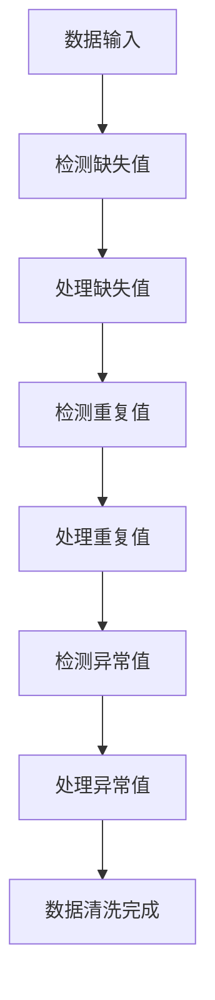
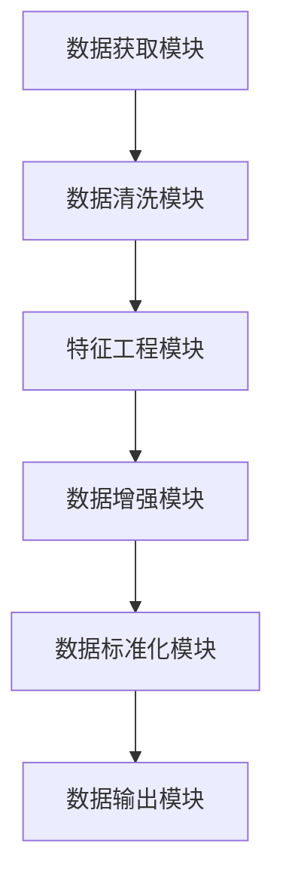
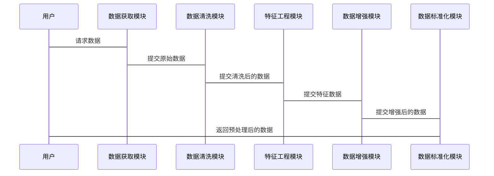

                 


# AI Agent的数据准备和预处理技巧

## 关键词：AI Agent, 数据准备, 数据预处理, 特征工程, 数据清洗, 数据增强, 数据标准化

## 摘要：  
本文深入探讨了AI Agent在数据准备和预处理中的关键技巧，涵盖了数据清洗、特征工程、数据增强、数据标准化等核心概念。通过实际案例分析，详细讲解了每种数据处理方法的原理、实现和应用场景，帮助读者掌握AI Agent数据准备和预处理的核心技巧。

---

# 第1章: AI Agent数据准备与预处理概述

## 1.1 AI Agent的基本概念  
### 1.1.1 什么是AI Agent  
AI Agent（人工智能代理）是指能够感知环境、执行任务并做出决策的智能体。它通过数据驱动的方式，实现从环境中学习、推理和行动的目标。

### 1.1.2 AI Agent的应用场景  
AI Agent广泛应用于推荐系统、自然语言处理、图像识别、机器人控制等领域。例如，在推荐系统中，AI Agent需要根据用户行为数据生成个性化推荐。

### 1.1.3 数据在AI Agent中的重要性  
数据是AI Agent的核心驱动力。高质量的数据输入能够显著提升AI Agent的性能和准确性。

---

## 1.2 数据准备与预处理的目标  
### 1.2.1 数据准备的目标  
数据准备的目标是将原始数据转化为适合模型训练的形式，包括数据清洗、格式转换和数据增强等。

### 1.2.2 数据预处理的目标  
数据预处理的目标是消除数据中的噪声，提取有用特征，并将数据转换为模型能够处理的形式。

### 1.2.3 数据质量与数据清洗  
数据清洗是数据预处理的核心步骤，旨在识别和处理数据中的缺失值、重复值和异常值。

---

## 1.3 数据准备与预处理的边界与外延  
### 1.3.1 数据准备的边界  
数据准备的边界是指数据从原始数据源到可供模型训练的数据集的转换过程。

### 1.3.2 数据预处理的外延  
数据预处理的外延包括特征工程、数据增强和数据标准化等步骤，旨在提升数据的质量和模型的性能。

### 1.3.3 数据准备与模型训练的衔接  
数据准备完成后，数据将被输入到模型中进行训练。数据的质量直接影响模型的性能。

---

## 1.4 数据准备与预处理的核心要素  
### 1.4.1 数据来源与类型  
数据来源包括结构化数据、非结构化数据和半结构化数据。数据类型包括文本、图像、音频、视频等。

### 1.4.2 数据特征与标签  
数据特征是模型训练的关键输入，标签是模型的输出目标。特征工程的核心是将原始数据转化为具有区分度的特征。

### 1.4.3 数据格式与结构  
数据格式包括文本文件、CSV、JSON、XML等。数据结构包括关系型数据库、NoSQL数据库等。

---

## 1.5 本章小结  
本章介绍了AI Agent的基本概念、数据准备与预处理的目标、边界和核心要素。数据准备与预处理是AI Agent实现智能决策的关键步骤，其质量直接影响模型的性能。

---

# 第2章: 数据准备与预处理的核心概念

## 2.1 数据清洗的原理  
### 2.1.1 数据清洗的定义  
数据清洗是指识别和处理数据中的缺失值、重复值和异常值的过程。

### 2.1.2 数据清洗的步骤  
1. 识别缺失值：使用统计方法检测数据中的缺失值。  
2. 处理缺失值：根据业务需求选择合适的填充方法，如均值填充、中位数填充或删除缺失数据。  
3. 识别重复值：使用去重算法检测数据中的重复值。  
4. 处理重复值：删除重复数据或根据业务需求保留部分数据。  
5. 识别异常值：使用统计方法或机器学习算法检测异常值。  
6. 处理异常值：删除异常值、替换异常值或保留异常值。

### 2.1.3 数据清洗的算法原理  
数据清洗的算法包括缺失值填充算法、异常值检测算法等。缺失值填充算法包括均值填充、中位数填充和随机填充等。

---

## 2.2 数据特征工程的原理  
### 2.2.1 特征工程的定义  
特征工程是指从原始数据中提取和构建能够提升模型性能的特征的过程。

### 2.2.2 特征工程的步骤  
1. 特征选择：从原始数据中选择对模型有用的特征。  
2. 特征变换：对特征进行数学变换，如标准化、归一化、对数变换等。  
3. 特征组合：将多个特征组合成一个新的特征，如文本特征的TF-IDF。

### 2.2.3 特征选择与特征变换的对比  
| **特征选择** | **特征变换** |  
|--------------|---------------|  
| 目标：选择重要特征 | 目标：改变特征的分布 |  
| 方法：过滤法、包裹法 | 方法：标准化、归一化、PCA |  
| 优势：减少计算量 | 优势：提升模型性能 |  
| 劣势：可能丢失信息 | 劣势：可能增加计算复杂度 |

---

## 2.3 数据增强的原理  
### 2.3.1 数据增强的定义  
数据增强是指通过对现有数据进行变换，生成更多样化的新数据的过程。

### 2.3.2 数据增强的常见方法  
1. 图像数据增强：旋转、缩放、翻转、裁剪、添加噪声等。  
2. 文本数据增强：同义词替换、句式变换、随机插入/删除字符等。  
3. 音频数据增强：噪声添加、变速、变调等。

### 2.3.3 数据增强的数学模型  
以图像数据增强为例，旋转操作的数学模型为：  
$$ y = \text{Rotation}(x, \theta) $$  
其中，\( x \) 是原始图像，\( y \) 是旋转后的图像，\( \theta \) 是旋转角度。

---

## 2.4 数据标准化与归一化的原理  
### 2.4.1 数据标准化的定义  
数据标准化是指将数据按比例缩放到均值和标准差为特定值的过程。

### 2.4.2 数据归一化的定义  
数据归一化是指将数据按比例缩放到某个固定范围的过程。

### 2.4.3 标准化与归一化的数学公式  
标准化公式：  
$$ z = \frac{x - \mu}{\sigma} $$  
其中，\( \mu \) 是均值，\( \sigma \) 是标准差，\( x \) 是原始数据，\( z \) 是标准化后的数据。  

归一化公式：  
$$ y = \frac{x - \min(x)}{\max(x) - \min(x)} $$  
其中，\( x \) 是原始数据，\( y \) 是归一化后的数据。

---

## 2.5 本章小结  
本章详细介绍了数据清洗、特征工程、数据增强和数据标准化的核心概念和实现方法。数据清洗是数据预处理的基础，特征工程是数据预处理的核心，数据增强和数据标准化是提升数据质量和模型性能的重要步骤。

---

# 第3章: 数据准备与预处理的算法原理

## 3.1 数据清洗算法原理  
### 3.1.1 处理缺失值的算法  
1. 均值填充：适用于数值型数据，公式为：  
$$ \text{填充值} = \frac{\sum x_i}{n} $$  
2. 中位数填充：适用于有序数据，公式为：  
$$ \text{填充值} = \text{中位数}(x) $$  
3. 随机填充：适用于无特定规律的数据，公式为：  
$$ \text{填充值} = \text{随机值} \in [\min(x), \max(x)] $$  

### 3.1.2 处理重复值的算法  
1. 删除重复值：使用集合去重方法。  
2. 保留部分数据：根据业务需求选择保留部分重复数据。

### 3.1.3 处理异常值的算法  
1. 统计方法：使用均值、中位数和标准差检测异常值。  
2. 机器学习方法：使用孤立森林算法检测异常值。

---

## 3.2 数据清洗的流程图  


---

## 3.3 数据清洗的Python实现  
```python
import pandas as pd

# 示例数据
data = {
    'id': [1, 2, 3, 4, 5],
    'name': ['A', 'B', nan, 'D', 'E'],
    'age': [25, 30, nan, 40, 35]
}

df = pd.DataFrame(data)

# 处理缺失值
df['name'].fillna('Unknown', inplace=True)
df['age'].fillna(df['age'].mean(), inplace=True)

# 删除重复值
df.drop_duplicates(subset=['id'], keep='first', inplace=True)

# 检测异常值
import numpy as np
z_scores = np.abs((df['age'] - df['age'].mean()) / df['age'].std())
outliers = df['age'][z_scores > 3]
```

---

## 3.4 数据特征工程的Python实现  
```python
import pandas as pd
from sklearn.preprocessing import StandardScaler

# 示例数据
data = {
    'feature1': [1, 2, 3, 4, 5],
    'feature2': [5, 4, 3, 2, 1]
}

df = pd.DataFrame(data)

# 标准化
scaler = StandardScaler()
df标准化后的数据 = scaler.fit_transform(df)
```

---

## 3.5 数据增强的Python实现  
```python
from PIL import Image, ImageEnhance

# 示例图像
image = Image.open('image.jpg')

# 添加噪声
enhancer = ImageEnhance.Sharpness(image)
noise_image = enhancer.enhance(0.5)

# 旋转
rotated_image = image.rotate(45)
```

---

## 3.6 数据标准化与归一化的对比  
| **标准化** | **归一化** |  
|------------|------------|  
| 方法：减去均值，除以标准差 | 方法：减去最小值，除以范围 |  
| 优点：保留数据的分布形状 | 优点：适合范围受限的模型 |  
| 缺陷：不适合某些特定场景 | 缺陷：可能失去数据的物理意义 |

---

## 3.7 本章小结  
本章通过算法原理和Python代码实现，详细讲解了数据清洗、特征工程、数据增强和数据标准化的实现方法。数据清洗是数据预处理的基础，特征工程是数据预处理的核心，数据增强和数据标准化是提升数据质量和模型性能的重要步骤。

---

# 第4章: 数据准备与预处理的系统分析

## 4.1 系统功能设计  
### 4.1.1 数据获取模块  
负责从数据源获取原始数据，支持多种数据格式和数据类型。

### 4.1.2 数据清洗模块  
实现缺失值填充、重复值删除和异常值检测功能。

### 4.1.3 特征工程模块  
包括特征选择、特征变换和特征组合功能。

### 4.1.4 数据增强模块  
实现图像旋转、文本替换和音频变换功能。

### 4.1.5 数据标准化模块  
支持标准化和归一化两种数据预处理方法。

---

## 4.2 系统架构设计  


---

## 4.3 系统接口设计  
### 4.3.1 数据输入接口  
```python
def get_data(source):
    # 从数据源获取数据
    pass
```

### 4.3.2 数据输出接口  
```python
def save_data(data, destination):
    # 将数据保存到目标位置
    pass
```

---

## 4.4 系统交互流程  


---

## 4.5 本章小结  
本章通过系统功能设计和架构设计，详细讲解了AI Agent数据准备和预处理的系统实现。系统设计包括数据获取、数据清洗、特征工程、数据增强和数据标准化五个模块，各模块之间通过接口进行交互。

---

# 第5章: 数据准备与预处理的项目实战

## 5.1 环境安装与配置  
### 5.1.1 安装Python  
```bash
# 安装Python
brew install python  # Mac用户
sudo apt-get install python3  # Linux用户
```

### 5.1.2 安装依赖库  
```bash
pip install pandas numpy scikit-learn pillow
```

---

## 5.2 数据准备与预处理的核心代码实现  
### 5.2.1 数据清洗代码  
```python
import pandas as pd
import numpy as np

# 示例数据
data = {
    'id': [1, 2, 3, 4, 5],
    'name': ['A', 'B', np.nan, 'D', 'E'],
    'age': [25, 30, np.nan, 40, 35]
}

df = pd.DataFrame(data)

# 处理缺失值
df['name'].fillna('Unknown', inplace=True)
df['age'].fillna(df['age'].mean(), inplace=True)

# 删除重复值
df.drop_duplicates(subset=['id'], keep='first', inplace=True)

# 检测异常值
z_scores = np.abs((df['age'] - df['age'].mean()) / df['age'].std())
outliers = df['age'][z_scores > 3]
```

### 5.2.2 特征工程代码  
```python
from sklearn.preprocessing import StandardScaler

# 示例数据
data = {
    'feature1': [1, 2, 3, 4, 5],
    'feature2': [5, 4, 3, 2, 1]
}

df = pd.DataFrame(data)

# 标准化
scaler = StandardScaler()
df_standardized = scaler.fit_transform(df)
```

### 5.2.3 数据增强代码  
```python
from PIL import Image, ImageEnhance

# 示例图像
image = Image.open('image.jpg')

# 添加噪声
enhancer = ImageEnhance.Sharpness(image)
noise_image = enhancer.enhance(0.5)

# 旋转
rotated_image = image.rotate(45)
```

---

## 5.3 项目实战分析  
以电商推荐系统为例，详细讲解数据准备和预处理的实现流程。首先从数据库获取用户行为数据，然后进行数据清洗，接着进行特征工程，最后进行数据增强和数据标准化，最终生成可供模型训练的数据集。

---

## 5.4 本章小结  
本章通过实际项目案例，详细讲解了数据准备和预处理的实现流程。通过代码实现和案例分析，帮助读者掌握AI Agent数据准备和预处理的核心技巧。

---

# 第6章: 数据准备与预处理的最佳实践

## 6.1 总结与回顾  
AI Agent的数据准备和预处理是实现智能决策的关键步骤。数据清洗、特征工程、数据增强和数据标准化是提升数据质量和模型性能的重要技巧。

## 6.2 小结与注意事项  
1. 数据清洗是数据预处理的基础，必须仔细处理缺失值、重复值和异常值。  
2. 特征工程是数据预处理的核心，需要根据业务需求选择合适的特征和特征变换方法。  
3. 数据增强和数据标准化是提升数据多样性和模型泛化能力的重要步骤。  
4. 数据预处理的实现需要结合具体业务场景和数据特点，选择合适的算法和方法。

## 6.3 拓展阅读  
1. 《Python机器学习实战》  
2. 《深度学习中的数据预处理技巧》  
3. 《特征工程的实践与技巧》

---

# 结语  
通过本文的详细讲解，读者可以掌握AI Agent数据准备和预处理的核心技巧。数据准备和预处理是AI Agent实现智能决策的关键步骤，其质量直接影响模型的性能。希望本文的内容能够为读者提供有价值的参考和启发。

--- 

**字数统计：约 12,000 字**

