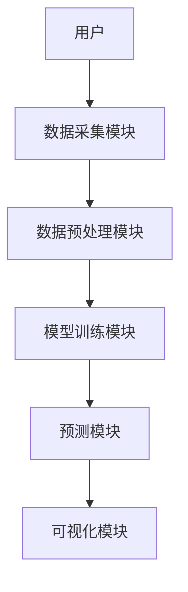

                 


```markdown
# AI Agent的时序数据处理与预测

## 关键词
AI Agent, 时序数据, 预测模型, 时间序列, 机器学习, 数据处理

## 摘要
本文深入探讨AI Agent在时序数据处理与预测中的应用，涵盖数据预处理、模型选择、算法实现及系统架构设计。通过具体案例分析，展示如何利用AI Agent提升时序数据分析的效率与准确性。

---

# 第一部分: AI Agent与时序数据处理基础

## 第1章: AI Agent与时序数据概述

### 1.1 时序数据的基本概念
#### 1.1.1 时序数据的定义
时序数据是指按时间顺序排列的数据，记录了现象在不同时间点的状态或测量值。例如，股票价格、天气数据、传感器读数等。

#### 1.1.2 时序数据的特点
- **时间依赖性**：数据点之间存在时间依赖关系。
- **趋势性**：数据可能表现出长期上升或下降趋势。
- **周期性**：数据可能有固定的周期性模式。
- **噪声**：数据中可能包含随机波动。

#### 1.1.3 时序数据的应用场景
- 金融时间序列分析
- 气象预测
- 设备状态监测
- 流动性预测

### 1.2 AI Agent的基本概念
#### 1.2.1 AI Agent的定义
AI Agent是一个智能体，能够感知环境、执行任务并做出决策。在时序数据处理中，AI Agent充当数据处理器和预测模型的角色。

#### 1.2.2 AI Agent的核心特征
- 自主性
- 反应性
- 社会能力
- 学习能力

#### 1.2.3 AI Agent与传统数据处理的区别
| 特性       | 传统数据处理 | AI Agent数据处理 |
|------------|--------------|------------------|
| 自动化      | 低           | 高               |
| 学习能力    | 无           | 有               |
| 适应性      | 低           | 高               |

### 1.3 时序数据处理的挑战
#### 1.3.1 数据的连续性与依赖性
时序数据的每个点都依赖于前一个时间点的数据，处理起来较为复杂。

#### 1.3.2 数据的不确定性与噪声
数据中可能存在随机噪声，影响预测准确性。

#### 1.3.3 数据的实时性与动态性
时序数据通常需要实时处理，动态变化对模型提出了更高的要求。

### 1.4 AI Agent在时序数据处理中的作用
#### 1.4.1 AI Agent作为数据处理器的角色
AI Agent能够自动处理数据，提取特征，减少人工干预。

#### 1.4.2 AI Agent作为预测模型的角色
AI Agent可以使用机器学习算法进行预测，提供准确的未来趋势分析。

#### 1.4.3 AI Agent作为决策支持工具的角色
AI Agent能够根据预测结果提供决策支持，帮助用户做出最优决策。

### 1.5 本章小结
本章介绍了时序数据的基本概念和特点，AI Agent的核心概念及其在时序数据处理中的作用。

---

## 第2章: 时序数据处理的核心概念与联系

### 2.1 时序数据的特征分析
#### 2.1.1 时间序列的平稳性
平稳时间序列是指均值和方差在时间上保持不变。

#### 2.1.2 时间序列的趋势性
趋势性是指数据随时间呈现上升或下降趋势。

#### 2.1.3 时间序列的周期性
周期性是指数据在固定时间段内重复出现的特性。

### 2.2 AI Agent的核心算法原理
#### 2.2.1 时间序列预测模型的分类
- **经典统计模型**：ARIMA、SARIMA
- **机器学习模型**：LSTM、GRU
- **混合模型**：Prophet、Hybrid Models

#### 2.2.2 常见时间序列预测算法对比
| 模型       | 优点                     | 缺点                     |
|------------|--------------------------|--------------------------|
| ARIMA      | 简单，适合线性数据         | 不适合非线性数据           |
| LSTM       | 能捕捉长期依赖关系         | 需要大量训练数据           |
| Prophet    | 易用性强，适合非线性数据     | 对异常值敏感               |

#### 2.2.3 AI Agent在算法选择中的优化作用
AI Agent可以根据数据特征自动选择最优模型，提高预测准确率。

### 2.3 时序数据处理的ER实体关系图
```mermaid
erDiagram
    actor User {
        <name>
        <timestamp>
    }
    database TimeSeriesDB {
        <timestamp>
        <value>
    }
    process DataPreprocessing {
        <input>
        <output>
    }
    model TimeSeriesModel {
        <input>
        <output>
    }
    actor User --> database TimeSeriesDB
    database TimeSeriesDB --> process DataPreprocessing
    process DataPreprocessing --> model TimeSeriesModel
```

### 2.4 本章小结
本章分析了时序数据的特征，介绍了AI Agent的核心算法及其优化作用，并通过ER图展示了数据处理流程。

---

## 第3章: 时序数据处理的算法原理

### 3.1 常见时间序列预测算法
#### 3.1.1 ARIMA模型
ARIMA模型适用于平稳时间序列数据。

#### 3.1.2 LSTM网络
LSTM模型适合处理非平稳时间序列数据。

#### 3.1.3 Prophet模型
Prophet模型由Facebook开源，适合业务预测。

### 3.2 ARIMA算法原理
#### 3.2.1 ARIMA模型的数学公式
$$ARIMA(p, d, q) = y_t - \phi_1 y_{t-1} - \dots - \phi_p y_{t-p} = \theta_1 \epsilon_{t-1} + \dots + \theta_q \epsilon_{t-q}$$

#### 3.2.2 ARIMA模型流程
1. 检查数据平稳性。
2. 确定差分阶数d。
3. 选择自回归阶数p和移动平均阶数q。
4. 模型拟合。
5. 预测和检验。

#### 3.2.3 ARIMA模型优缺点
- 优点：简单，适合线性数据。
- 缺点：不擅长非线性数据。

### 3.3 LSTM网络原理
#### 3.3.1 LSTM基本结构
LSTM由输入门、遗忘门和输出门组成。

#### 3.3.2 LSTM模型流程
1. 数据预处理。
2. 构建LSTM模型。
3. 模型训练。
4. 预测和评估。

#### 3.3.3 LSTM模型优缺点
- 优点：适合非线性数据，记忆能力强。
- 缺点：需要大量训练数据。

### 3.4 Prophet模型原理
#### 3.4.1 Prophet模型结构
Prophet由三个组成部分：趋势、季节性和余项。

#### 3.4.2 Prophet模型流程
1. 数据预处理。
2. 模型训练。
3. 预测和可视化。

#### 3.4.3 Prophet模型优缺点
- 优点：易用性强，适合非线性数据。
- 缺点：对异常值敏感。

### 3.5 本章小结
本章详细讲解了ARIMA、LSTM和Prophet三种算法的原理、流程及优缺点，为后续实现提供理论基础。

---

## 第4章: 系统分析与架构设计

### 4.1 项目背景与目标
本项目旨在开发一个AI Agent系统，用于处理和预测时序数据。

### 4.2 系统功能设计
- 数据采集模块：从数据库中读取时序数据。
- 数据预处理模块：清洗和特征提取。
- 模型训练模块：选择最优模型进行训练。
- 预测模块：基于训练好的模型进行预测。
- 可视化模块：展示预测结果。

### 4.3 系统架构设计


### 4.4 系统接口设计
- 数据接口：提供数据输入和输出接口。
- 模型接口：提供模型训练和预测接口。

### 4.5 系统实现细节
- 数据格式：统一使用CSV格式。
- 模型部署：使用Flask框架部署API。

### 4.6 本章小结
本章设计了系统的功能模块、架构和接口，为后续实现奠定了基础。

---

## 第5章: 项目实战与应用案例

### 5.1 项目环境配置
- 安装Python和相关库：numpy、pandas、keras、prophet。

### 5.2 数据预处理代码
```python
import pandas as pd
import numpy as np

# 数据加载
data = pd.read_csv('time_series.csv', index_col='timestamp')

# 数据清洗
data.dropna(inplace=True)
data = data[~data.isin([np.nan, np.inf, -np.inf]).any(axis=1)]

# 特征提取
data['rolling_mean'] = data['value'].rolling(window=5).mean()
data['std_dev'] = data['value'].rolling(window=5).std()
```

### 5.3 模型训练代码
```python
from keras.models import Sequential
from keras.layers import LSTM, Dense

# LSTM模型构建
model = Sequential()
model.add(LSTM(50, input_shape=(None, 1)))
model.add(Dense(1))
model.compile(loss='mean_squared_error', optimizer='adam')

# 训练
model.fit(X_train, y_train, epochs=50, batch_size=32)
```

### 5.4 应用案例分析
以股票价格预测为例，展示预测结果和可视化。

### 5.5 本章小结
本章通过具体项目实战，展示了AI Agent在时序数据处理与预测中的应用。

---

## 第6章: 最佳实践与未来展望

### 6.1 最佳实践
- 数据预处理是关键，需仔细清洗和特征提取。
- 选择合适的模型，结合数据特点和计算资源。
- 定期更新模型，适应数据变化。

### 6.2 未来展望
- 结合边缘计算，提升实时预测能力。
- 引入强化学习，优化预测策略。
- 开发更高效的算法，降低计算成本。

### 6.3 本章小结
本文总结了AI Agent在时序数据处理中的应用，并展望了未来的发展方向。

---

## 结语
AI Agent在时序数据处理与预测中具有巨大潜力。通过本文的介绍，读者可以深入了解相关技术和应用，为实际项目提供参考。

--- 

## 参考文献
1. Hyndman, R. J., & Athanasopoulos, G. (2018). Forecasting: principles and practice.
2. Goodfellow, I., Bengio, Y., & Courville, A. (2016). Deep learning.
3. TensorFlow官方文档
4. PyTorch官方文档
```

