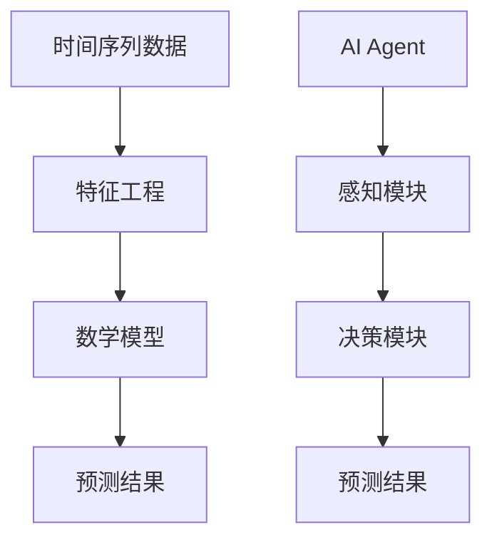

                 


# AI Agent的时序预测：理解和预测时间序列

> 关键词：AI Agent, 时间序列预测, 机器学习, 算法原理, 系统架构, 项目实战

> 摘要：本文深入探讨了AI Agent在时间序列预测中的应用，从基本概念到算法原理，再到系统架构和项目实战，全面解析了如何利用AI Agent进行高效、准确的时序预测。文章结合实际案例，通过丰富的图表和代码示例，帮助读者从理论到实践全面掌握时序预测的核心技术。

---

## 第一部分: AI Agent的时序预测基础

### 第1章: 时序预测与AI Agent概述

#### 1.1 时序预测的背景与应用
- **问题背景**：时间序列数据在金融、医疗、交通等领域广泛存在，准确预测未来趋势对决策至关重要。
- **实际应用**：
  - 金融市场的股票价格预测。
  - 智慧城市的交通流量预测。
  - 医疗领域的患者健康趋势预测。
- **AI Agent的优势**：通过持续学习和自适应能力，AI Agent能够实时更新模型，适应数据变化。

#### 1.2 AI Agent的基本概念
- **定义与分类**：AI Agent是具有感知环境、做出决策并执行任务的智能体。
- **核心特征**：
  - 感知能力：通过传感器或数据源获取信息。
  - 学习能力：利用机器学习算法提升预测准确性。
  - 自适应能力：根据反馈调整预测模型。
- **与传统算法的区别**：AI Agent能够动态调整策略，而传统算法需要手动更新。

#### 1.3 时序预测的核心概念与问题建模
- **时间序列的分解**：趋势、季节性、周期性、随机性。
- **问题边界**：数据平稳性、样本量、预测步长。
- **概念结构**：
  - 数据输入：原始时间序列。
  - 特征提取：降维和特征选择。
  - 模型训练：监督或无监督学习。
  - 预测输出：单步或多步预测结果。

---

### 第2章: 时序预测的核心概念与AI Agent的关系

#### 2.1 时序预测的数学模型与特征分析
- **时间序列的平稳性**：
  - 平稳序列：统计性质不随时间变化。
  - 非平稳序列：需要通过差分或变换处理。
- **特征工程**：
  - 时间窗口特征：滑动平均、滑动方差。
  - 周期性特征：傅里叶变换提取频域特征。
  - 外部因素：节假日、天气等影响预测结果。

#### 2.2 AI Agent的感知与决策机制
- **感知模型**：
  - 状态空间模型：描述系统的当前状态。
  - 观察模型：通过传感器获取外部信息。
- **决策机制**：
  - 基于模型的预测结果做出决策。
  - 实时调整预测模型参数。
- **多步预测策略**：
  - 单步预测：仅预测下一个时间点。
  - 多步预测：预测未来多个时间点的结果。

#### 2.3 时序预测与AI Agent的关系图解


---

### 第3章: 常见时序预测算法原理与实现

#### 3.1 基于统计学的时序预测算法
- **ARIMA模型**：
  - 原理：通过自相关性和偏自相关性分析数据的平稳性。
  - 实现步骤：
    1. 检查数据的平稳性。
    2. 确定差分次数d。
    3. 选择最佳的AR和MA阶数。
- **SARIMA模型**：
  - 原理：扩展的ARIMA模型，加入季节性因素。
  - 应用场景：具有明显季节性的时间序列数据。

#### 3.2 基于机器学习的时序预测算法
- **线性回归模型**：
  - 优点：简单易懂，计算速度快。
  - 缺点：无法捕捉复杂的时间依赖关系。
- **支持向量回归**：
  - 优点：适合非线性关系。
  - 缺点：需要参数调整，计算复杂。

#### 3.3 基于深度学习的时序预测算法
- **LSTM网络**：
  - 原理：通过门控机制记忆长期信息。
  - 代码示例：
    ```python
    import keras
    model = keras.models.Sequential()
    model.add(keras.layers.LSTM(50, input_shape=(timesteps, features)))
    model.add(keras.layers.Dense(1))
    model.compile(optimizer='adam', loss='mean_squared_error')
    ```
- **GRU网络**：
  - 优点：比LSTM结构简单，训练速度快。
  - 代码示例：
    ```python
    import tensorflow as tf
    model = tf.keras.Sequential([
        tf.keras.layers.GRU(50, input_shape=(timesteps, features)),
        tf.keras.layers.Dense(1)
    ])
    ```

---

### 第4章: AI Agent时序预测的数学模型与公式

#### 4.1 统计学模型的数学公式
- **ARIMA模型公式**
  $$ ARIMA(p, d, q) $$
- **Holt-Winters模型公式**
  $$ \alpha, \beta, \gamma $$

#### 4.2 神经网络模型的数学公式
- **LSTM细胞公式**
  $$ f(t) = \sigma(W_f \cdot [h_{t-1}, x_t] + b_f) $$
- **GRU细胞公式**
  $$ z_t = \sigma(W_z \cdot [h_{t-1}, x_t] + b_z) $$

---

### 第5章: 系统分析与架构设计方案

#### 5.1 问题场景介绍
- **项目介绍**：设计一个AI Agent，用于预测城市交通流量。
- **系统功能设计**：
  - 数据采集：实时获取交通数据。
  - 特征提取：提取时间、天气、节假日等特征。
  - 模型训练：训练LSTM模型。
  - 预测输出：生成未来1小时的交通流量预测。

#### 5.2 系统架构设计
- **领域模型类图**
  ```mermaid
  classDiagram
  class 数据源 {
    <属性>: 时间戳, 流量值
    <方法>: 提供数据()
  }
  class 特征提取器 {
    <属性>: 时间窗口特征
    <方法>: 提取特征()
  }
  class 预测模型 {
    <属性>: LSTM网络
    <方法>: 训练模型(), 预测()
  }
  数据源 --> 特征提取器
  特征提取器 --> 预测模型
  ```
- **系统架构图**
  ```mermaid
  flowchart TD
      A[用户] --> B[数据采集模块]
      B --> C[特征提取模块]
      C --> D[预测模型]
      D --> E[结果展示模块]
  ```

---

### 第6章: 项目实战

#### 6.1 环境安装
- **Python环境**：Python 3.8及以上。
- **依赖库**：TensorFlow、Keras、Pandas、Numpy。

#### 6.2 核心代码实现
```python
import pandas as pd
import numpy as np
from tensorflow.keras.models import Sequential
from tensorflow.keras.layers import LSTM, Dense

# 数据预处理
data = pd.read_csv('traffic_data.csv')
features = data[['time', 'weather', 'holiday']]
labels = data['flow']

# 划分训练集和测试集
train_features = features[:-100]
train_labels = labels[:-100]
test_features = features[-100:]
test_labels = labels[-100:]

# 构建模型
model = Sequential()
model.add(LSTM(50, input_shape=(train_features.shape[1], 1)))
model.add(Dense(1))
model.compile(optimizer='adam', loss='mean_squared_error')

# 训练模型
model.fit(train_features, train_labels, epochs=50, batch_size=32)

# 预测结果
predictions = model.predict(test_features)
```

#### 6.3 代码解读与分析
- **数据预处理**：提取时间、天气、节假日等特征。
- **模型训练**：使用LSTM网络进行训练。
- **结果展示**：将预测结果与实际值进行对比分析。

---

## 第七章: 总结与展望

### 7.1 最佳实践
- **数据质量**：确保数据的完整性和准确性。
- **模型选择**：根据数据特性选择合适的算法。
- **实时性优化**：优化模型计算速度，降低延迟。

### 7.2 小结
- AI Agent通过感知和决策能力，显著提升了时序预测的准确性和实时性。
- 未来研究方向：多模态数据融合、在线学习算法优化。

### 7.3 注意事项
- 避免过拟合，使用交叉验证。
- 定期更新模型，适应数据变化。

### 7.4 拓展阅读
- 《深度学习实战》
- 《时间序列分析：方法与应用》
- 《AI Agent开发指南》

--- 

通过本文的详细讲解，读者可以全面掌握AI Agent在时间序列预测中的应用，从理论到实践都能得到有效的指导和启发。

