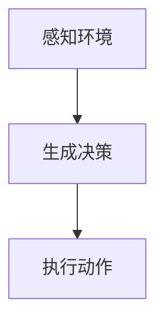
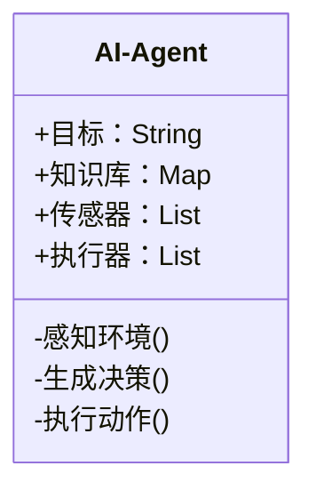
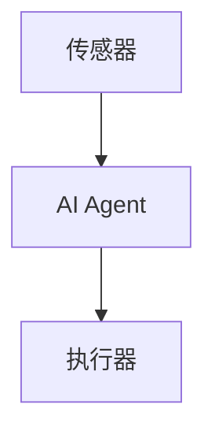
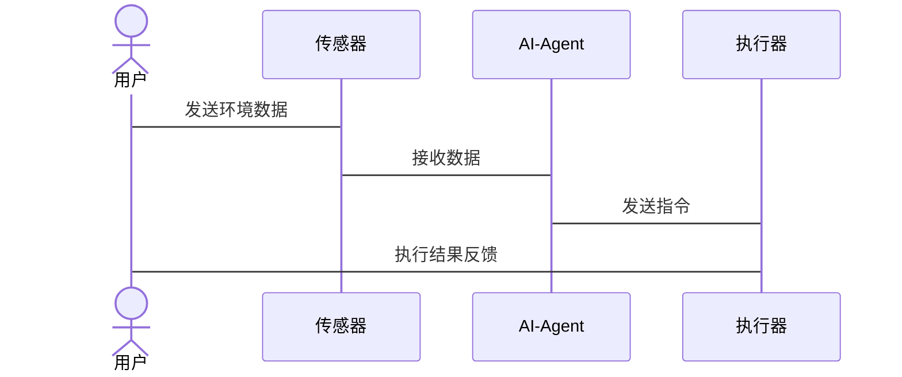

                 


# AI Agent的未来：趋势预测与展望

> 关键词：AI Agent, 人工智能, 机器学习, 趋势预测, 技术展望

> 摘要：本文从AI Agent的基本概念出发，深入分析其核心技术和算法原理，结合实际应用场景，探讨其在不同领域的应用现状与未来发展方向。通过系统分析与架构设计，结合项目实战案例，预测AI Agent的未来技术趋势，并提出相应的建议与展望。

---

# 第1章 AI Agent的背景与定义

## 1.1 AI Agent的基本概念
### 1.1.1 什么是AI Agent
AI Agent（人工智能代理）是指能够感知环境、自主决策并执行任务的智能实体。它通过传感器获取信息，利用推理能力解决问题，并通过执行器与环境交互。

### 1.1.2 AI Agent的核心特征
- **自主性**：能够在没有外部干预的情况下独立运行。
- **反应性**：能够实时感知环境并做出反应。
- **目标导向性**：具备明确的目标，并通过决策实现目标。
- **学习能力**：能够通过经验改进自身的性能。

### 1.1.3 AI Agent的分类与应用场景
AI Agent可以分为**简单反射型**、**基于模型的反应型**、**目标驱动型**和**效用驱动型**。其应用场景包括智能助手、自动驾驶、智能推荐、智能客服等。

## 1.2 AI Agent的发展历程
### 1.2.1 AI Agent的起源
AI Agent的概念起源于20世纪60年代的知识表示与推理研究，70年代开始出现基于规则的专家系统。

### 1.2.2 AI Agent的技术演进
从基于规则的系统到机器学习驱动的代理，AI Agent的技术经历了知识驱动、数据驱动和混合驱动的演进。

### 1.2.3 当前AI Agent的主要趋势
当前，AI Agent的发展主要集中在多智能体协作、强化学习、人机交互和边缘计算等方向。

## 1.3 AI Agent的现状与挑战
### 1.3.1 当前AI Agent的技术瓶颈
- **计算资源限制**：复杂任务需要大量计算资源。
- **数据依赖性**：AI Agent的表现高度依赖数据质量。
- **安全性问题**：恶意攻击可能导致AI Agent失控。

### 1.3.2 AI Agent在不同领域的应用现状
- **智能家居**：通过物联网设备实现家居自动化。
- **医疗健康**：AI Agent用于辅助诊断和治疗方案推荐。
- **金融领域**：用于智能投资顾问和风险控制。

### 1.3.3 AI Agent的未来发展方向
未来，AI Agent将朝着**通用化**、**自主化**、**人机协作化**和**智能化**方向发展。

---

# 第2章 AI Agent的核心概念与技术原理

## 2.1 AI Agent的核心概念
### 2.1.1 AI Agent的定义与属性对比表
| 属性       | 描述                     |
|------------|--------------------------|
| 自主性     | 能够独立执行任务         |
| 反应性     | 能够实时感知并做出反应     |
| 目标导向性 | 具备明确的目标并追求优化   |
| 学习能力   | 能够通过经验改进性能       |

### 2.1.2 AI Agent的实体关系图（ER图）
```mermaid
er
actor: AI Agent
attributes: 目标、知识库、传感器、执行器
```

## 2.2 AI Agent的技术原理
### 2.2.1 AI Agent的核心算法
- **生成模型**：如GANS（生成对抗网络）和Diffusion模型。
- **强化学习**：如Q-Learning和DQN（深度强化学习）。

### 2.2.2 AI Agent的数据流图


---

# 第3章 AI Agent的算法原理

## 3.1 AI Agent的核心算法
### 3.1.1 生成模型
- **GANS（生成对抗网络）**：由生成器和判别器组成，通过对抗训练生成数据。
- **Diffusion模型**：通过逐步添加噪声并学习去噪过程生成数据。

### 3.1.2 强化学习
- **Q-Learning**：通过经验累积值Q(s, a)学习状态-动作值函数。
- **DQN（深度强化学习）**：将Q-Learning与深度神经网络结合。

## 3.2 算法原理的数学模型
### 3.2.1 生成模型的数学公式
$$ P(x) = \prod_{i=1}^{n} p(x_i|x_{i-1}) $$

### 3.2.2 强化学习的数学公式
$$ Q(s,a) = r + \gamma \max_{a'} Q(s',a') $$

## 3.3 算法实现的代码示例
### 3.3.1 生成模型的实现
```python
import torch
class GAN(torch.nn.Module):
    def __init__(self):
        super(GAN, self).__init__()
        self.generator = torch.nn.Sequential(
            torch.nn.Linear(100, 256),
            torch.nn.ReLU(),
            torch.nn.Linear(256, 10)
        )
        self.discriminator = torch.nn.Sequential(
            torch.nn.Linear(10, 256),
            torch.nn.ReLU(),
            torch.nn.Linear(256, 1)
        )
```

---

# 第4章 AI Agent的系统分析与架构设计

## 4.1 问题场景介绍
### 4.1.1 AI Agent的应用场景
- **智能家居**：通过传感器和执行器实现家居自动化。
- **智能助手**：如Siri、Alexa等，通过语音交互提供服务。

### 4.1.2 问题的边界与限制
- **计算能力限制**：AI Agent的性能受硬件资源限制。
- **数据隐私**：AI Agent需要处理大量用户数据，存在隐私风险。

## 4.2 系统功能设计
### 4.2.1 领域模型的类图


## 4.3 系统架构设计
### 4.3.1 系统架构图


## 4.4 系统接口设计
### 4.4.1 接口定义
- **输入接口**：传感器数据、用户输入。
- **输出接口**：执行器指令、用户反馈。

## 4.5 系统交互设计
### 4.5.1 交互序列图


---

# 第5章 AI Agent的项目实战

## 5.1 环境安装
### 5.1.1 安装依赖
- Python 3.8+
- PyTorch 1.9+
- Mermaid CLI

## 5.2 系统核心实现
### 5.2.1 核心代码实现
```python
import torch
class AI-Agent:
    def __init__(self):
        self.sensors = []
        self.actuators = []
    
    def感知环境(self):
        # 获取传感器数据
        pass
    
    def生成决策(self):
        # 通过算法生成决策
        pass
    
    def执行动作(self):
        # 通过执行器执行动作
        pass
```

## 5.3 案例分析
### 5.3.1 智能家居案例
- **场景描述**：AI Agent通过传感器感知室内温度，并根据设定的阈值调整空调运行状态。
- **代码实现**：
  ```python
  class智能家居AI-Agent(AI-Agent):
      def __init__(self):
          super().__init__()
          self.temperature_sensor = TemperatureSensor()
          self.air_conditioner = AirConditioner()
      
      def感知环境(self):
          return self.temperature_sensor.get_temperature()
      
      def生成决策(self, temperature):
          if temperature > 26:
              return '打开空调'
          elif temperature < 20:
              return '关闭空调'
          else:
              return '保持现状'
      
      def执行动作(self, action):
          if action == '打开空调':
              self.air_conditioner.start()
          elif action == '关闭空调':
              self.air_conditioner.stop()
  ```

---

# 第6章 AI Agent的未来趋势与展望

## 6.1 当前AI Agent的技术趋势
### 6.1.1 多智能体协作
AI Agent将更加注重多智能体协作，通过分布式计算实现更复杂的任务。

### 6.1.2 强化学习优化
强化学习将继续推动AI Agent的决策能力优化。

## 6.2 未来AI Agent的预测
### 6.2.1 通用AI Agent的实现
未来的AI Agent将朝着通用化方向发展，具备更强的跨领域适应能力。

### 6.2.2 边缘计算与AI Agent的结合
AI Agent将与边缘计算深度融合，实现低延迟、高效率的实时响应。

## 6.3 挑战与机遇
### 6.3.1 挑战
- **计算资源限制**：如何在有限的计算资源下实现更复杂的任务。
- **数据隐私**：如何在保护用户隐私的前提下进行数据处理。

### 6.3.2 机遇
- **人机协作**：AI Agent将更加注重与人类的协作，提升用户体验。
- **边缘计算**：通过边缘计算实现低延迟、高效率的实时响应。

---

# 第7章 总结与展望

## 7.1 全文总结
本文从AI Agent的基本概念出发，深入分析了其核心技术和算法原理，结合实际应用场景，探讨了其在不同领域的应用现状与未来发展方向。

## 7.2 未来研究方向
- **通用AI Agent的研究**：探索如何实现具备跨领域适应能力的通用AI Agent。
- **多智能体协作的优化**：研究如何通过分布式计算实现更高效的多智能体协作。

## 7.3 学习建议
- **持续关注AI Agent领域的最新研究**。
- **积极参与实际项目，提升实践能力**。

---

# 关键词
AI Agent, 人工智能, 机器学习, 趋势预测, 技术展望

# 摘要
本文从AI Agent的基本概念出发，深入分析了其核心技术和算法原理，结合实际应用场景，探讨了其在不同领域的应用现状与未来发展方向。通过系统分析与架构设计，结合项目实战案例，预测AI Agent的未来技术趋势，并提出相应的建议与展望。

