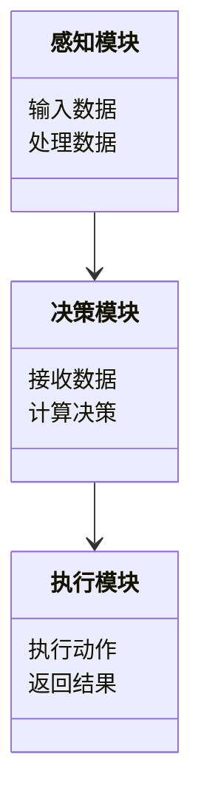
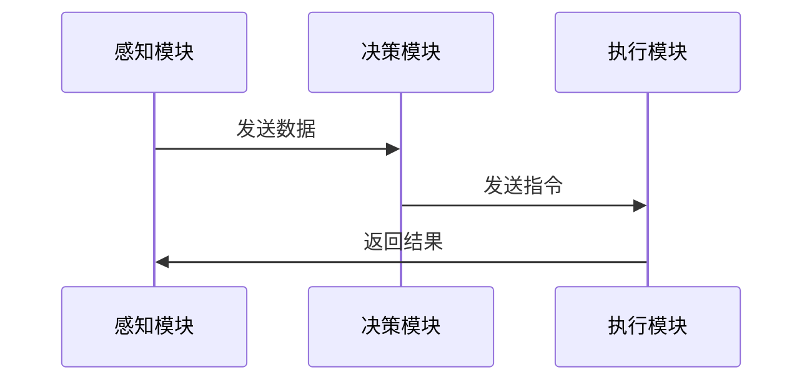

                 


# AI Agent的架构设计：从概念到实现

---

## 关键词
AI Agent, 架构设计, 强化学习, 系统架构, 项目实战, 智能算法

---

## 摘要
本文深入探讨了AI Agent的架构设计，从基本概念到实现细节，结合实际案例，全面分析了AI Agent的核心算法、系统架构和项目实战。文章首先介绍了AI Agent的定义、特点和发展背景，然后详细阐述了AI Agent的设计原则，包括模块化设计、通信协议和安全性。接着，文章深入讲解了AI Agent的核心算法原理，如强化学习和监督学习，并通过数学公式和Mermaid图展示了算法实现和系统架构设计。最后，文章通过一个实际项目案例，详细讲解了AI Agent的实现过程，并展望了AI Agent的未来发展趋势。

---

# 第一部分: AI Agent的架构设计概述

## 第1章: AI Agent的基本概念与背景

### 1.1 AI Agent的定义与特点
AI Agent（人工智能代理）是指在特定环境中能够感知并自主行动以实现目标的智能实体。AI Agent可以是软件程序、机器人或其他智能系统，其核心目标是通过与环境的交互实现预定目标。

#### 1.1.1 什么是AI Agent
AI Agent是一种能够感知环境、做出决策并执行行动的智能系统。与传统程序不同，AI Agent具有自主性、反应性、目标导向性和社会性四大特点。

#### 1.1.2 AI Agent的核心特点
1. **自主性**：AI Agent能够在没有外部干预的情况下自主运行。
2. **反应性**：AI Agent能够根据环境的变化动态调整行为。
3. **目标导向性**：AI Agent的所有行为都是为了实现特定目标。
4. **社会性**：AI Agent能够与其他AI Agent或人类进行交互和协作。

#### 1.1.3 AI Agent与传统程序的区别
传统程序是基于固定的规则和输入执行任务，而AI Agent能够通过学习和适应环境来动态调整行为。例如，传统程序无法处理不确定性，而AI Agent可以通过强化学习算法在动态环境中做出最优决策。

---

### 1.2 AI Agent的历史与发展
AI Agent的概念起源于20世纪60年代的专家系统研究，随着人工智能技术的快速发展，AI Agent逐渐从理论走向实际应用。

#### 1.2.1 AI Agent的起源
AI Agent的起源可以追溯到20世纪50年代的“逻辑理论家”程序，这是最早的AI Agent之一，能够通过逻辑推理解决简单的数学问题。

#### 1.2.2 从简单规则到复杂学习的演进
早期的AI Agent主要基于规则和逻辑推理，随着深度学习和强化学习的兴起，AI Agent逐渐具备了更强的学习能力和适应性。

#### 1.2.3 当前AI Agent的发展现状
当前，AI Agent已经广泛应用于智能助手、自动驾驶、机器人等领域。例如，Siri、Alexa等智能助手就是典型的AI Agent应用。

---

### 1.3 AI Agent的应用场景
AI Agent的应用场景非常广泛，涵盖智能助手、自动驾驶、游戏AI、智慧城市等多个领域。

#### 1.3.1 智能助手
智能助手（如Siri、Alexa）通过自然语言处理技术为用户提供信息查询、任务执行等服务。

#### 1.3.2 自动交易系统
AI Agent可以通过强化学习算法在金融市场中进行自动交易，实现收益最大化。

#### 1.3.3 游戏AI
游戏AI可以通过强化学习算法在复杂的游戏环境中做出最优决策，例如在《星际争霸》中实现AI对战。

#### 1.3.4 智慧城市中的应用
AI Agent可以应用于交通管理、环境监测等领域，通过实时数据处理和决策优化提升城市管理效率。

---

## 第2章: AI Agent的设计原则

### 2.1 设计AI Agent的基本原则
设计AI Agent需要遵循模块化设计、目标明确性、安全性等基本原则。

#### 2.1.1 目标明确性
AI Agent的设计必须明确其目标，例如在自动驾驶中，AI Agent的目标是安全、高效地将乘客送达目的地。

#### 2.1.2 模块化设计
AI Agent可以分为感知模块、决策模块、执行模块等，每个模块负责不同的功能。

#### 2.1.3 可扩展性
AI Agent的设计应具备良好的可扩展性，以便在需要时增加新的功能模块。

#### 2.1.4 安全性与隐私保护
AI Agent在设计时需要考虑安全性与隐私保护，例如在自动驾驶中，需要防止恶意攻击和数据泄露。

---

### 2.2 AI Agent的通信协议设计
AI Agent通常需要与其他系统或AI Agent进行通信，因此需要设计合理的通信协议。

#### 2.2.1 通信协议的选择
常用的通信协议包括HTTP、WebSocket等，选择合适的通信协议可以提高系统的性能和安全性。

#### 2.2.2 通信过程中的数据加密
为了保证通信的安全性，AI Agent需要对传输的数据进行加密，例如使用AES加密算法。

#### 2.2.3 通信异常处理
在通信过程中，可能会出现网络中断、数据丢失等问题，因此需要设计合理的异常处理机制。

---

### 2.3 AI Agent的模块化设计
AI Agent的模块化设计可以提高系统的可维护性和可扩展性。

#### 2.3.1 感知模块
感知模块负责接收环境中的输入数据，例如摄像头、传感器等设备传入的数据。

#### 2.3.2 决策模块
决策模块基于感知模块提供的数据，通过算法计算出最优行动方案。

#### 2.3.3 执行模块
执行模块负责根据决策模块的指令执行具体的动作，例如控制机器人移动。

#### 2.3.4 学习模块
学习模块负责通过机器学习算法优化AI Agent的行为，例如使用强化学习算法优化决策策略。

---

## 第3章: AI Agent的核心算法原理

### 3.1 感知模块的算法实现
感知模块是AI Agent获取环境信息的关键部分，通常使用深度学习算法进行处理。

#### 3.1.1 基于深度学习的感知算法
深度学习算法（如CNN、RNN）可以有效地处理图像、语音等非结构化数据。

#### 3.1.2 基于强化学习的感知算法
强化学习算法通过与环境的交互不断优化感知模型，例如在自动驾驶中优化路径规划。

#### 3.1.3 感知算法的优缺点对比
| 算法类型 | 优点 | 缺点 |
|----------|------|------|
| 深度学习 | 高精度 | 需要大量数据和计算资源 |
| 强化学习 | 自适应性强 | 需要长时间训练 |

---

### 3.2 决策模块的算法实现
决策模块是AI Agent的核心部分，通常使用强化学习算法进行决策。

#### 3.2.1 基于规则的决策算法
基于规则的决策算法通过预定义的规则进行决策，例如在简单的游戏AI中使用规则判断下一步动作。

#### 3.2.2 基于Q-learning的决策算法
Q-learning是一种经典的强化学习算法，通过Q值表记录状态-动作对的价值，不断更新Q值表以优化决策。

#### 3.2.3 基于神经网络的决策算法
基于神经网络的决策算法（如DQN）通过深度神经网络近似Q值函数，可以处理复杂的决策问题。

---

### 3.3 执行模块的算法实现
执行模块负责将决策模块的指令转化为具体行动，通常需要考虑行动的可行性和最优性。

#### 3.3.1 基于反馈的执行优化
执行模块可以通过反馈机制不断优化执行策略，例如在机器人控制中通过反馈调整动作幅度。

#### 3.3.2 基于强化学习的执行策略
强化学习算法可以用于优化执行策略，例如在自动驾驶中优化加速和刹车的控制。

#### 3.3.3 执行过程中的异常处理
在执行过程中可能会出现环境变化或其他异常情况，需要设计合理的异常处理机制。

---

## 第4章: AI Agent的系统架构设计

### 4.1 系统功能设计
AI Agent的系统功能设计需要考虑模块划分和功能交互。

#### 4.1.1 领域模型设计
领域模型是系统功能设计的核心，通常使用Mermaid类图表示。



#### 4.1.2 系统架构设计
AI Agent的系统架构设计通常包括感知层、决策层和执行层。


#### 4.1.3 系统接口设计
系统接口设计需要考虑模块之间的通信协议和数据格式。

#### 4.1.4 系统交互设计
系统交互设计通常使用Mermaid序列图表示。



---

## 第5章: AI Agent的项目实战

### 5.1 项目背景
本项目旨在实现一个简单的AI Agent，用于自动控制机器人在迷宫中寻找出口。

### 5.2 系统核心实现
AI Agent的核心实现包括感知模块、决策模块和执行模块。

#### 5.2.1 环境搭建
需要安装Python、TensorFlow、OpenCV等依赖库。

#### 5.2.2 核心代码实现
以下是AI Agent的核心代码实现：

```python
import tensorflow as tf
import numpy as np

# 定义感知模块
class PerceptionModule:
    def __init__(self):
        self.model = self.build_model()
    
    def build_model(self):
        model = tf.keras.Sequential([
            tf.keras.layers.Conv2D(32, (3,3), activation='relu', input_shape=(64,64,3)),
            tf.keras.layers.MaxPooling2D((2,2)),
            tf.keras.layers.Flatten(),
            tf.keras.layers.Dense(128, activation='relu'),
            tf.keras.layers.Dense(4, activation='softmax')
        ])
        return model
    
    def process(self, input_data):
        return self.model.predict(input_data)

# 定义决策模块
class DecisionModule:
    def __init__(self):
        self.model = self.build_model()
    
    def build_model(self):
        model = tf.keras.Sequential([
            tf.keras.layers.Dense(64, activation='relu'),
            tf.keras.layers.Dense(64, activation='relu'),
            tf.keras.layers.Dense(4, activation='softmax')
        ])
        return model
    
    def decide(self, input_data):
        return self.model.predict(input_data)

# 定义执行模块
class ExecutionModule:
    def __init__(self):
        pass
    
    def execute(self, action):
        # 执行具体的动作
        pass
```

#### 5.2.3 实际案例分析
通过训练AI Agent在迷宫中寻找出口，可以验证系统的有效性。

---

## 第6章: 未来展望与总结

### 6.1 未来发展趋势
随着人工智能技术的不断发展，AI Agent将具备更强的自主性和智能性，应用场景也将更加广泛。

### 6.2 总结
本文从概念到实现，全面分析了AI Agent的架构设计，包括核心算法、系统架构和项目实战。通过本文的学习，读者可以掌握AI Agent的设计方法和实现技巧。

---

## 参考文献
1. 《深度学习》—— Ian Goodfellow
2. 《强化学习》—— Richard S. Sutton
3. 《软件架构设计》—— Simon Brown

---

## 结语
AI Agent的架构设计是一个复杂而有趣的过程，需要结合算法、系统架构和实际应用进行综合考虑。通过不断的学习和实践，我们可以设计出更加智能和高效的AI Agent，为人类社会的发展带来更多的便利。

