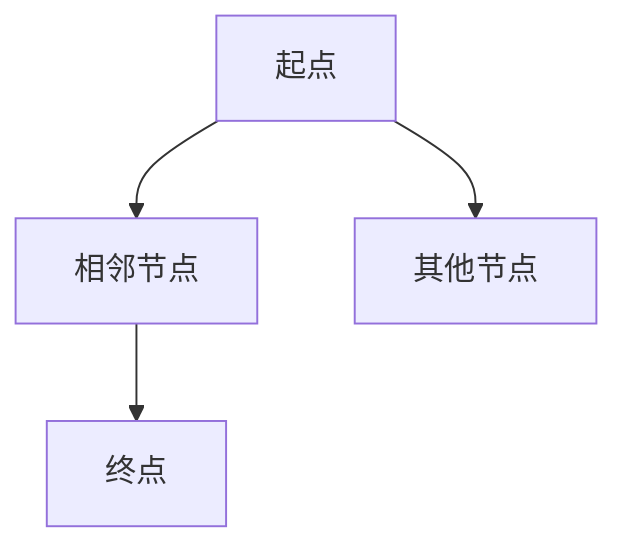
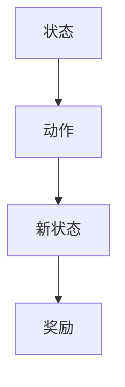
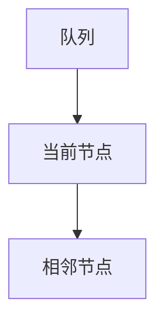
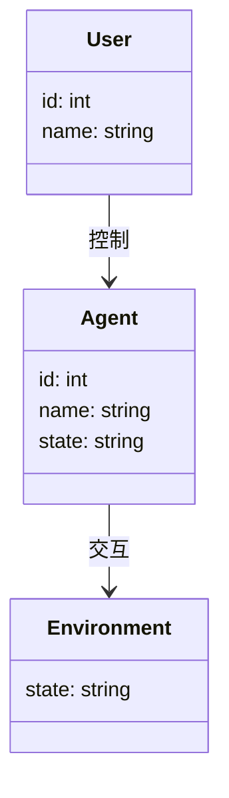
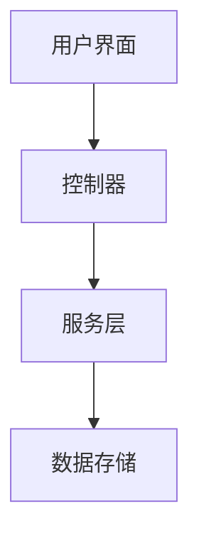
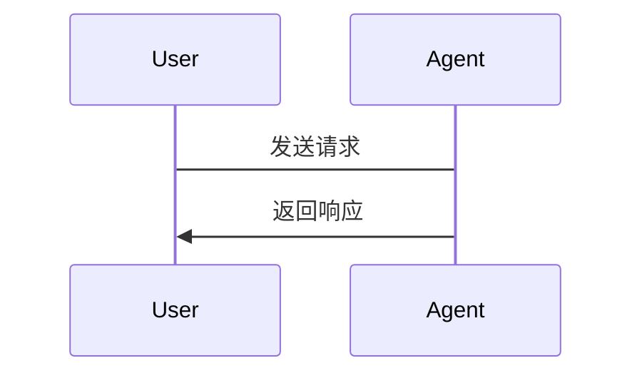

                 


# AI Agent的架构设计：从需求分析到系统规划

> 关键词：AI Agent, 架构设计, 需求分析, 系统规划, 人工智能, 强化学习

> 摘要：本文将从AI Agent的基本概念出发，逐步分析其架构设计的核心要素，包括需求分析、算法原理、系统架构、项目实战等。通过详细的理论推导和实际案例分析，帮助读者掌握AI Agent从概念到实现的全过程。

---

## 第一部分: AI Agent的背景与概述

### 第1章: AI Agent的基本概念与背景

#### 1.1 AI Agent的定义与特点

##### 1.1.1 什么是AI Agent
AI Agent（人工智能代理）是一种能够感知环境、自主决策并采取行动的智能系统。它可以理解用户需求、执行任务并优化目标达成的过程。AI Agent的核心特点包括自主性、反应性、目标导向性和学习能力。

##### 1.1.2 AI Agent的核心特点
- **自主性**：AI Agent能够在没有外部干预的情况下独立运行。
- **反应性**：能够实时感知环境变化并做出响应。
- **目标导向性**：基于目标驱动行为，优化决策过程。
- **学习能力**：通过数据和经验不断优化自身性能。

##### 1.1.3 AI Agent与传统程序的区别
AI Agent与传统程序的区别主要体现在以下几个方面：
- **自主性**：AI Agent能够主动感知环境并采取行动，而传统程序通常只是被动执行指令。
- **适应性**：AI Agent能够通过学习和适应环境变化，而传统程序无法做到这一点。
- **智能性**：AI Agent具备一定的推理和决策能力，而传统程序仅能执行预定义的逻辑。

#### 1.2 AI Agent的发展历程

##### 1.2.1 AI Agent的起源
AI Agent的概念起源于20世纪60年代的人工智能研究，早期的智能体研究主要集中在专家系统和逻辑推理领域。

##### 1.2.2 AI Agent的演进与变革
随着机器学习和深度学习技术的发展，AI Agent逐渐从基于规则的系统演变为基于数据驱动的智能体。

##### 1.2.3 当前AI Agent的技术趋势
当前，AI Agent技术的主要趋势包括：
- **多智能体协作**：多个AI Agent协同工作，共同完成复杂任务。
- **强化学习应用**：强化学习在AI Agent的决策过程中的应用越来越广泛。
- **人机协作**：AI Agent与人类用户协同工作，提升用户体验。

#### 1.3 AI Agent的技术基础

##### 1.3.1 人工智能的基本概念
人工智能（AI）是指计算机系统模拟人类智能的能力，包括学习、推理、问题解决等。

##### 1.3.2 机器学习与深度学习的关系
机器学习是AI Agent的核心技术之一，深度学习是机器学习的一个子领域，主要基于神经网络模型。

##### 1.3.3 自然语言处理在AI Agent中的应用
自然语言处理（NLP）技术使得AI Agent能够理解和生成人类语言，从而实现人机交互。

#### 1.4 AI Agent的应用场景

##### 1.4.1 智能助手
智能助手（如Siri、Alexa）是AI Agent的典型应用，能够通过语音交互为用户提供信息查询、任务执行等服务。

##### 1.4.2 自动化系统
AI Agent在工业自动化、自动驾驶等领域发挥重要作用，能够自主决策并执行复杂任务。

##### 1.4.3 游戏AI与虚拟角色
游戏AI和虚拟角色通过AI Agent技术实现智能行为，提升游戏体验。

---

### 第2章: AI Agent的核心概念与体系结构

#### 2.1 AI Agent的体系结构

##### 2.1.1 单智能体与多智能体系统
- **单智能体**：单个AI Agent独立完成任务。
- **多智能体**：多个AI Agent协作完成复杂任务，通常通过通信和协调机制实现。

##### 2.1.2 AI Agent的层次结构
AI Agent的层次结构通常包括：
1. **感知层**：负责感知环境信息。
2. **决策层**：基于感知信息进行推理和决策。
3. **执行层**：根据决策结果执行具体动作。

##### 2.1.3 基于模型的体系结构
基于模型的AI Agent通过构建环境模型来推理和决策，通常用于复杂任务。

#### 2.2 AI Agent的行为模式

##### 2.2.1 反应式AI Agent
反应式AI Agent基于当前感知信息做出即时反应，不依赖于环境模型。

##### 2.2.2 规则驱动的AI Agent
基于预定义规则进行决策，适用于任务明确且规则固定的场景。

##### 2.2.3 学习驱动的AI Agent
通过机器学习技术不断优化决策模型，适用于复杂且动态变化的环境。

#### 2.3 AI Agent的决策机制

##### 2.3.1 基于规则的决策
基于预定义规则进行决策，适用于任务简单且规则固定的场景。

##### 2.3.2 基于概率的决策
通过概率模型计算不同决策的可能性，选择最优决策。

##### 2.3.3 基于强化学习的决策
通过强化学习算法，AI Agent在与环境交互的过程中不断优化决策策略。

---

### 第3章: AI Agent的需求分析与问题建模

#### 3.1 需求分析的基本方法

##### 3.1.1 理解用户需求
通过用户访谈、需求文档分析等方式，深入了解用户需求。

##### 3.1.2 分解需求
将复杂需求分解为多个子需求，便于后续实现。

##### 3.1.3 需求优先级排序
根据需求的重要性和紧急程度进行排序，确定开发优先级。

#### 3.2 问题建模的步骤

##### 3.2.1 明确问题边界
确定问题的范围和限制条件，避免超出目标范围。

##### 3.2.2 建立问题模型
通过数学模型或逻辑模型描述问题，便于后续分析和解决。

##### 3.2.3 验证模型的合理性
通过测试和验证，确保模型能够准确反映实际问题。

#### 3.3 需求分析的案例分析

##### 3.3.1 智能助手的典型需求
- **信息查询**：天气、新闻等信息的查询。
- **任务执行**：设置提醒、发送消息等任务。
- **对话交互**：与用户进行自然语言对话。

##### 3.3.2 自动化系统的复杂需求
- **多任务协作**：协调多个子系统完成复杂任务。
- **实时监控**：实时监控系统运行状态并做出响应。
- **故障处理**：自动检测和修复系统故障。

##### 3.3.3 虚拟角色的行为需求
- **角色塑造**：根据设定的性格特点进行行为决策。
- **任务执行**：根据任务要求完成特定动作。
- **情感交互**：通过情感计算与用户进行情感互动。

---

## 第二部分: AI Agent的算法与数学模型

### 第4章: AI Agent的算法原理与数学模型

#### 4.1 规划算法

##### 4.1.1 A*算法
A*算法是一种常用的路径规划算法，通过评估节点的优先级进行搜索。



数学模型：
$$ f(n) = g(n) + h(n) $$
其中，$$ g(n) $$ 是从起点到节点 $$ n $$ 的实际成本，$$ h(n) $$ 是从节点 $$ n $$ 到目标的估计成本。

#### 4.2 强化学习

##### 4.2.1 Q-Learning算法
Q-Learning是一种基于值函数的强化学习算法，通过更新Q值表来学习最优策略。



数学模型：
$$ Q(s, a) = Q(s, a) + \alpha (r + \gamma \max Q(s', a') - Q(s, a)) $$
其中，$$ \alpha $$ 是学习率，$$ \gamma $$ 是折扣因子。

#### 4.3 搜索算法

##### 4.3.1 BFS算法
BFS（广度优先搜索）是一种常用的图搜索算法，适用于无权图的最短路径问题。



数学模型：
$$ \text{队列} = \text{队列} + \text{相邻节点} $$

#### 4.4 知识表示学习

##### 4.4.1 Word2Vec模型
Word2Vec是一种用于词语表示的模型，通过神经网络学习词向量。

数学模型：
$$ f(x) = Wx + b $$

---

## 第三部分: AI Agent的系统架构设计

### 第5章: AI Agent的系统架构与实现

#### 5.1 系统功能设计

##### 5.1.1 领域模型设计
通过领域模型类图描述系统功能模块之间的关系。



#### 5.2 系统架构设计

##### 5.2.1 分层架构
将系统划分为多个层次，每一层负责不同的功能。



#### 5.3 系统接口设计

##### 5.3.1 RESTful API
通过RESTful API实现系统间的通信。

##### 5.3.2 WebSocket通信
实时通信协议，适用于需要实时交互的场景。

#### 5.4 系统交互设计

##### 5.4.1 序列图
描述系统交互的流程。



---

## 第四部分: AI Agent的项目实战

### 第6章: AI Agent的项目实战与优化

#### 6.1 环境安装与配置

##### 6.1.1 安装Python
```bash
python --version
```

##### 6.1.2 安装依赖库
```bash
pip install numpy matplotlib
```

#### 6.2 系统核心实现

##### 6.2.1 核心算法实现
```python
def a_star(start, goal, heuristic):
    open_set = {start}
    came_from = {}
    g_score = {start: 0}
    f_score = {start: heuristic(start, goal)}
    while open_set:
        current = min(open_set, key=lambda x: f_score[x])
        if current == goal:
            break
        open_set.remove(current)
        for neighbor in neighbors(current):
            tentative_g_score = g_score[current] + cost(current, neighbor)
            if neighbor not in g_score or tentative_g_score < g_score[neighbor]:
                came_from[neighbor] = current
                g_score[neighbor] = tentative_g_score
                f_score[neighbor] = g_score[neighbor] + heuristic(neighbor, goal)
                if neighbor not in open_set:
                    open_set.add(neighbor)
    return came_from, g_score
```

##### 6.2.2 代码解读与优化
通过代码解读和优化，提升系统的性能和可维护性。

#### 6.3 实际案例分析

##### 6.3.1 智能助手的实现
通过实际案例分析，详细解读AI Agent在智能助手中的应用。

##### 6.3.2 自动化系统的实现
分析AI Agent在工业自动化中的具体应用。

#### 6.4 项目小结

##### 6.4.1 项目总结
总结项目实现的过程和经验教训。

##### 6.4.2 项目优化建议
提出进一步优化系统性能和功能的建议。

---

## 第五部分: AI Agent的最佳实践与小结

### 第7章: AI Agent的最佳实践与小结

#### 7.1 最佳实践

##### 7.1.1 代码规范
遵循Python代码规范，提升代码可读性和可维护性。

##### 7.1.2 性能优化
通过算法优化和代码优化提升系统性能。

##### 7.1.3 安全与隐私
确保系统数据的安全性和用户隐私。

#### 7.2 小结

##### 7.2.1 核心概念回顾
回顾AI Agent的核心概念和体系结构。

##### 7.2.2 技术趋势展望
展望AI Agent技术的发展趋势和未来方向。

---

通过以上章节的详细讲解，读者可以全面掌握AI Agent从需求分析到系统规划的全过程，从理论到实践，逐步构建完整的AI Agent系统。

