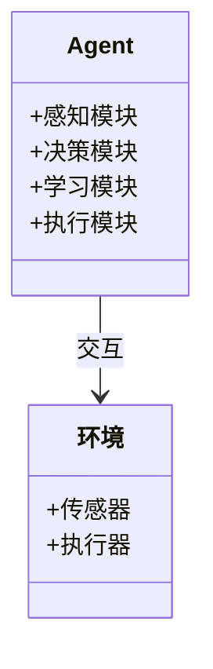
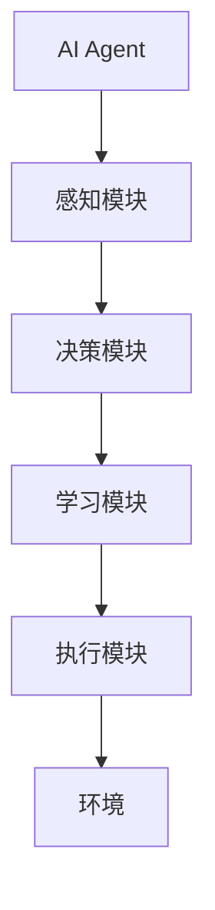
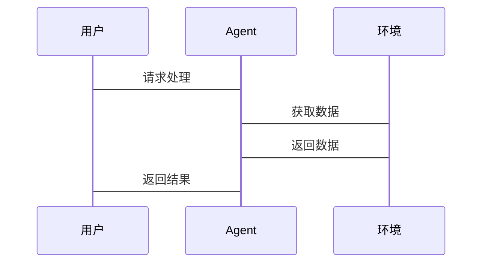

                 


# AI Agent的概念学习与推理实现

## 关键词：AI Agent、人工智能、推理机制、学习机制、系统架构、数学模型

## 摘要：AI Agent作为人工智能领域的重要概念，结合了学习与推理能力，能够在复杂环境中自主决策。本文将逐步解析AI Agent的核心概念，探讨其实现原理，并通过具体案例展示其应用，帮助读者全面理解AI Agent的概念与技术细节。

---

## 第一部分: AI Agent的概念学习与推理基础

### 第1章: AI Agent的基本概念

#### 1.1 什么是AI Agent
##### 1.1.1 AI Agent的定义
AI Agent，即人工智能代理，是一种能够感知环境、自主决策并采取行动以实现目标的智能实体。它能够通过与环境的交互，学习和适应新的情况，从而提高自身的智能水平。

##### 1.1.2 AI Agent的核心特点
- **自主性**：AI Agent能够在没有外部干预的情况下自主运作。
- **反应性**：能够实时感知环境变化并做出反应。
- **目标导向**：基于目标驱动行为，优化决策过程。
- **学习能力**：通过经验改进性能，适应新环境。

##### 1.1.3 AI Agent与传统AI的区别
传统AI主要依赖预设规则和数据进行处理，而AI Agent具备自主学习和推理能力，能够根据环境反馈动态调整策略。

#### 1.2 AI Agent的类型
##### 1.2.1 简单反射型Agent
基于预定义规则对输入做出反应，如自动门禁系统。

##### 1.2.2 基于模型的反应式Agent
使用内部模型预测环境变化，做出更复杂的决策，如自动驾驶汽车。

##### 1.2.3 计划式Agent
能够制定并执行复杂计划，适用于任务管理等场景。

##### 1.2.4 学习式Agent
通过机器学习技术不断优化自身模型，提升性能。

##### 1.2.5 人机协作型Agent
与人类协同工作，结合人类决策和AI建议，提升整体效率。

#### 1.3 AI Agent的应用场景
##### 1.3.1 自然语言处理
用于智能对话系统，提升用户体验。

##### 1.3.2 游戏AI
在游戏开发中，实现智能NPC行为。

##### 1.3.3 推荐系统
根据用户行为推荐个性化内容，如Netflix的推荐算法。

##### 1.3.4 智能客服
通过自然语言处理提供24/7的客户支持服务。

---

### 第2章: AI Agent的核心概念与背景

#### 2.1 问题背景
##### 2.1.1 当前AI技术的局限性
传统AI依赖于大量数据和规则，缺乏灵活性和自适应能力。

##### 2.1.2 AI Agent的提出动机
为了实现更智能、更自主的AI系统，适应动态变化的环境。

#### 2.2 问题描述
##### 2.2.1 AI Agent的目标
通过感知和学习，实现自主决策和目标达成。

##### 2.2.2 AI Agent的实现挑战
包括环境感知、实时推理、学习优化等技术难题。

#### 2.3 问题解决
##### 2.3.1 AI Agent的设计思路
结合感知、推理、学习和执行模块，构建完整的智能系统。

##### 2.3.2 AI Agent的实现方法
采用深度学习、强化学习等技术，实现自主学习和推理。

#### 2.4 AI Agent的边界与外延
##### 2.4.1 AI Agent的适用范围
适用于需要自主决策和动态适应的场景。

##### 2.4.2 AI Agent的局限性
当前技术仍存在环境理解不足、推理能力有限等问题。

#### 2.5 AI Agent的概念结构与核心要素
##### 2.5.1 感知模块
通过传感器或数据输入，获取环境信息。

##### 2.5.2 决策模块
基于感知信息，制定行动计划。

##### 2.5.3 执行模块
将决策转化为具体行动，影响环境。

##### 2.5.4 学习模块
通过反馈机制，优化模型和策略。

---

## 第二部分: AI Agent的核心概念与联系

### 第3章: AI Agent的核心原理

#### 3.1 AI Agent的学习机制
##### 3.1.1 监督学习
通过标注数据训练模型，如图像分类任务。

##### 3.1.2 强化学习
通过与环境互动，学习最优策略，如游戏AI。

##### 3.1.3 无监督学习
从无标签数据中发现模式，如聚类分析。

##### 3.1.4 图模型
使用图结构表示知识，如知识图谱。

##### 3.1.5 深度学习
通过神经网络模型，学习复杂模式，如GAN、Transformer等。

#### 3.2 AI Agent的推理机制
##### 3.2.1 基于规则的推理
基于预设规则进行逻辑推理，如专家系统。

##### 3.2.2 基于知识图谱的推理
通过知识图谱进行关联推理，如语义搜索。

##### 3.2.3 基于概率的推理
利用概率论进行不确定性推理，如贝叶斯网络。

---

### 第4章: AI Agent的核心概念对比

#### 4.1 AI Agent与传统AI的对比
| 特性                | 传统AI                   | AI Agent                 |
|---------------------|--------------------------|--------------------------|
| 自主性               | 依赖外部规则             | 具有自主决策能力         |
| 反应性               | 基于预设规则             | 实时感知并动态反应         |
| 学习能力             | 无法自主学习             | 具备学习优化能力         |

#### 4.2 不同类AI Agent的对比
| 类型                | 描述                     | 优缺点                   |
|---------------------|--------------------------|--------------------------|
| 简单反射型Agent     | 基于规则的反应式系统     | 实现简单，但灵活性低       |
| 基于模型的反应式Agent | 使用内部模型预测环境变化 | 更加灵活，但计算复杂       |
| 计划式Agent         | 基于复杂计划的决策系统   | 适合复杂任务，但计算量大   |
| 学习式Agent         | 通过学习优化模型         | 适应性强，但需要大量数据和计算 |

---

## 第三部分: AI Agent的系统架构与实现

### 第5章: AI Agent的系统架构设计

#### 5.1 问题场景介绍
AI Agent需要在动态环境中完成任务，如智能助手需要根据用户需求调整推荐策略。

#### 5.2 系统功能设计
##### 5.2.1 领域模型设计
使用领域模型类图展示系统功能模块之间的关系。



##### 5.2.2 系统架构设计
展示系统整体架构，包括感知、决策、学习和执行模块。



##### 5.2.3 系统接口设计
定义各模块之间的接口，如感知模块提供环境数据接口。

##### 5.2.4 系统交互设计
展示系统交互流程，如用户请求处理流程。



### 第6章: AI Agent的核心实现

#### 6.1 环境与数据准备
##### 6.1.1 数据集选择
选择适合任务的数据集，如图像数据集用于计算机视觉任务。

##### 6.1.2 数据预处理
对数据进行清洗、归一化等预处理，提升模型性能。

#### 6.2 系统核心实现
##### 6.2.1 知识图谱构建
使用图数据库构建知识图谱，展示实体间的关系。

##### 6.2.2 算法实现
实现感知、决策、学习和执行模块的具体算法，如Q-learning算法。

##### 6.2.3 系统优化
通过参数调整和模型优化提升系统性能，如使用批量归一化技术。

#### 6.3 代码实现与解读
##### 6.3.1 环境模拟
编写环境模拟代码，如简单的迷宫环境。

```python
class Environment:
    def __init__(self, size):
        self.size = size
        self.goal = (size-1, size-1)
```

##### 6.3.2 感知模块
实现感知数据的获取，如使用摄像头捕捉图像数据。

##### 6.3.3 决策模块
实现基于感知数据的决策逻辑，如路径规划算法。

##### 6.3.4 学习模块
实现机器学习算法，如神经网络训练代码。

```python
import torch
class DQN(nn.Module):
    def __init__(self, input_dim, hidden_dim, output_dim):
        super(DQN, self).__init__()
        self.fc1 = nn.Linear(input_dim, hidden_dim)
        self.fc2 = nn.Linear(hidden_dim, output_dim)
    
    def forward(self, x):
        x = torch.relu(self.fc1(x))
        x = torch.relu(self.fc2(x))
        return x
```

##### 6.3.5 执行模块
将决策结果转化为实际操作，如控制机器人移动。

#### 6.4 系统测试与优化
通过测试用例验证系统性能，根据测试结果优化模型参数。

#### 6.5 项目实战
##### 6.5.1 环境安装
安装必要的库，如PyTorch、numpy等。

##### 6.5.2 核心代码实现
实现AI Agent的核心功能，如强化学习算法。

##### 6.5.3 应用案例分析
分析AI Agent在实际场景中的应用，如智能客服系统。

---

## 第四部分: 总结与展望

### 第7章: 总结
回顾AI Agent的核心概念、实现技术和应用场景，强调其在人工智能领域的重要性。

### 第8章: 未来展望
探讨AI Agent的发展方向，如结合边缘计算、增强学习能力等，展望其更广泛的应用前景。

---

## 第五部分: 最佳实践与注意事项

### 第9章: 最佳实践 tips
##### 9.1 选择合适的算法
根据具体场景选择适合的AI Agent算法，如强化学习适用于动态环境。

##### 9.2 数据质量
确保数据的准确性和多样性，提升模型的泛化能力。

##### 9.3 系统优化
通过参数调优和模型压缩等方法，提升系统运行效率。

### 第10章: 注意事项
##### 10.1 数据隐私
注意保护用户数据隐私，符合相关法律法规。

##### 10.2 系统安全
防范潜在的安全漏洞，确保系统稳定运行。

##### 10.3 伦理问题
关注AI Agent的伦理问题，确保技术应用符合社会价值观。

### 第11章: 小结
总结全文内容，强调学习AI Agent的重要性，并鼓励读者深入研究相关技术。

---

## 第六部分: 拓展阅读

### 第12章: 拓展阅读
推荐相关的书籍和论文，如《深度学习》、《强化学习导论》等，鼓励读者进一步学习。

---

通过以上步骤，我们可以系统地理解AI Agent的概念、原理和实现方法，并通过实际案例应用，深入掌握其技术细节。希望本文能为读者提供有价值的技术指导，帮助他们更好地理解和应用AI Agent技术。

