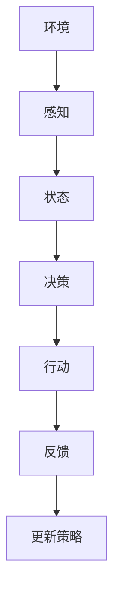
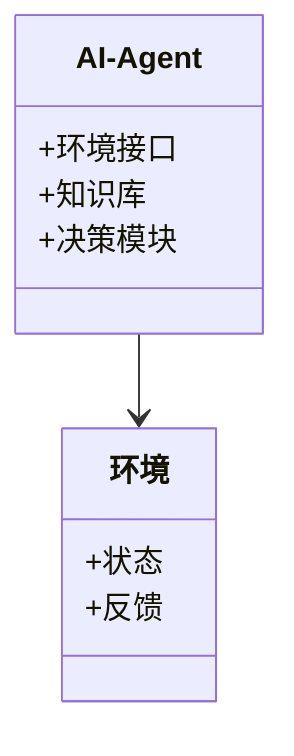

                 


# AI Agent的概念学习：从具体到抽象的认知过程

## 关键词：AI Agent、人工智能、认知科学、算法原理、系统架构、项目实战

## 摘要：AI Agent作为一种人工智能的核心概念，涉及感知、决策和行动的闭环系统。本文从具体应用场景出发，逐步抽象到AI Agent的核心概念，分析其算法原理、数学模型和系统架构，最后通过项目实战巩固认知。

---

## 第一部分：AI Agent的背景与基础

### 第1章：AI Agent的基本概念

#### 1.1 AI Agent的定义与特点

**1.1.1 AI Agent的定义**

AI Agent（人工智能代理）是指能够感知环境、自主决策并采取行动以实现目标的智能实体。它通过与环境交互，优化自身行为，以达到预定目标。

**1.1.2 AI Agent的核心特点**

- **自主性**：无需外部干预，自主决策。
- **反应性**：能实时感知环境变化并做出反应。
- **目标导向**：所有行为均以实现目标为导向。
- **学习能力**：通过经验改进性能。

**1.1.3 AI Agent与其他AI概念的对比**

| 概念     | 定义与特点                                      |
|----------|------------------------------------------------|
| AI系统   | 包括所有使用AI技术的系统，范围广泛。             |
| AI Agent | 具有自主性、反应性和目标导向的智能实体。       |
| 智能体   | 广义概念，涵盖AI Agent和其他类型智能体。         |

#### 1.2 AI Agent的应用场景

- **智能助手**：如Siri、Alexa，帮助用户完成日常任务。
- **自动交易系统**：在金融市场中进行自动化的买卖决策。
- **游戏AI**：在游戏中的NPC行为控制和策略制定。

### 第2章：从认知科学角度看AI Agent

#### 2.1 AI Agent的认知模型

认知模型涉及感知、推理和行动的循环过程，模拟人类的认知方式。AI Agent通过感知获取信息，利用推理理解信息，最后做出决策并执行行动。

#### 2.2 知识表示与推理

知识表示是AI Agent理解和推理的基础，常用逻辑符号、语义网络等方式。推理过程通过逻辑规则或概率方法进行。

#### 2.3 学习机制

学习机制使AI Agent能够从经验中改进性能，分为监督学习、无监督学习和强化学习。

---

## 第二部分：AI Agent的核心概念与联系

### 第3章：AI Agent的核心要素

#### 3.1 感知与理解

感知是AI Agent获取环境信息的第一步，包括视觉、听觉等多种方式。理解则通过语言处理、知识表示等技术实现。

#### 3.2 决策与规划

决策基于当前状态和目标，选择最优行动方案。规划则是制定详细行动步骤。

#### 3.3 行动与反馈

行动是AI Agent与环境交互的输出，反馈用于评估行动效果并改进未来决策。

#### 3.4 核心要素的联系

AI Agent的感知、决策和行动环相互依赖，形成闭环系统。

---

## 第三部分：AI Agent的算法原理

### 第4章：基础算法与实现

#### 4.1 感知算法

感知算法如物体识别、语音识别，使用深度学习模型实现。

**代码示例（物体识别）**

```python
import tensorflow as tf
model = tf.keras.models.load_model('object_detection.h5')
image = ...  # 输入图像
prediction = model.predict(image)
```

#### 4.2 决策算法

决策算法如强化学习，通过奖励机制优化决策策略。

**强化学习流程图**



---

## 第四部分：AI Agent的数学模型

### 第5章：数学模型与公式

#### 5.1 概率论

用于不确定性推理，如贝叶斯网络。

**贝叶斯公式**

$$ P(A|B) = \frac{P(B|A)P(A)}{P(B)} $$

#### 5.2 逻辑推理

用于确定性推理，如一阶逻辑。

**示例：如果A，则B。A为真，所以B为真。**

---

## 第五部分：系统分析与架构设计

### 第6章：系统架构与实现

#### 6.1 系统功能设计

系统包括感知模块、决策模块和执行模块。

**类图**



---

## 第六部分：项目实战

### 第7章：项目实战与应用

#### 7.1 环境安装与核心实现

安装必要的库如TensorFlow、Keras，实现感知、决策和执行模块。

#### 7.2 案例分析与代码实现

**案例：智能助手**

```python
def感知环境():
    # 获取用户输入
    return input()

def决策(输入):
    # 分析输入并生成响应
    return 响应

def执行(响应):
    # 输出响应
    print(响应)

# 主程序
while True:
    输入 = 感知环境()
    响应 = 决策(输入)
    执行(响应)
```

---

## 第七部分：总结与展望

### 7.1 最佳实践

- 明确目标和需求
- 选择合适的技术和算法
- 注重数据质量和多样性
- 定期测试和优化

### 7.2 小结

AI Agent是一个复杂的系统，涉及感知、决策和行动的闭环。通过具体项目和算法分析，可以深入理解其设计与实现。

### 7.3 注意事项

- 数据隐私和安全
- 算法的可解释性
- 系统的鲁棒性

### 7.4 拓展阅读

- 《强化学习》书籍
- 相关论文和研究

---

通过以上步骤，从具体到抽象的认知过程，读者可以全面理解AI Agent的概念、原理和应用。

