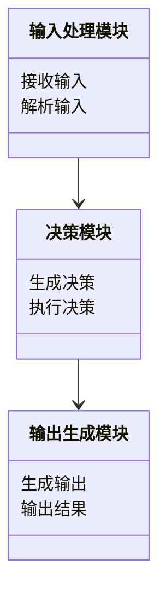

                 


# AI Agent的概念形成：模拟LLM的抽象思维过程

> 关键词：AI Agent, 大语言模型, LLM, 人工智能, 代理, 生成式思维

> 摘要：本文深入探讨AI Agent的概念形成，重点分析其与大语言模型（LLM）的关系，模拟LLM的抽象思维过程，从背景介绍、核心概念、算法原理、系统架构到项目实战，逐步解析AI Agent的形成与发展。

---

## 第一章: AI Agent的基本概念与背景

### 1.1 AI Agent的定义与特点

AI Agent（人工智能代理）是一种智能实体，能够感知环境、自主决策并执行任务。其核心特点包括：

- **自主性**：无需外部干预，自主完成任务。
- **反应性**：能实时感知环境并做出反应。
- **目标导向**：基于目标驱动行为。
- **学习能力**：通过经验优化决策。

### 1.2 大语言模型（LLM）的演进

LLM（Large Language Model）基于深度学习，通过大量数据训练，具备理解和生成自然语言的能力。其演进过程包括：

- **初始阶段**：基于规则的简单模型。
- **发展时期**：引入神经网络，如RNN和LSTM。
- **成熟阶段**：采用Transformer架构，如BERT、GPT系列。

### 1.3 AI Agent与LLM的结合

AI Agent利用LLM的生成能力，模拟人类思维方式。其结合方式包括：

- **LLM作为核心模块**：负责理解和生成文本。
- **AI Agent的决策机制**：基于LLM输出进行判断和执行。

---

## 第二章: AI Agent的核心概念原理

### 2.1 AI Agent的结构与功能

AI Agent的结构包括输入处理模块、决策模块和输出生成模块。各模块功能如下：

- **输入处理模块**：接收并解析输入信息。
- **决策模块**：基于输入生成决策。
- **输出生成模块**：生成最终输出结果。

### 2.2 LLM的内部工作机制

LLM通过注意力机制处理输入，生成相关输出。其工作流程包括：

1. 输入处理：将输入转化为模型可处理的向量。
2. 解码过程：利用自注意力机制生成输出。
3. 输出生成：生成最终的自然语言文本。

### 2.3 AI Agent与LLM的关系

AI Agent依赖LLM的生成能力，而LLM通过AI Agent的架构优化性能。两者结合实现了智能代理的高效运行。

---

## 第三章: LLM的算法原理

### 3.1 LLM的训练过程

LLM的训练包括数据预处理、模型初始化和优化步骤。数学模型如下：

$$
\text{损失函数} = -\sum_{i=1}^{n} \log P(w_i|w_{<i})
$$

### 3.2 LLM的推理过程

推理过程包括输入处理、解码和输出生成。注意力机制公式为：

$$
\text{注意力权重} = \frac{e^{QK^T}}{\sqrt{d_k}}
$$

### 3.3 注意力机制的作用

注意力机制通过加权输入向量，提升模型对重要信息的关注。例如，在生成回答时，模型会优先关注相关部分。

---

## 第四章: AI Agent的系统分析与架构设计方案

### 4.1 系统功能设计

AI Agent的功能模块包括输入处理、决策和输出生成模块。类图如下：



### 4.2 系统架构设计

系统架构包括前端、后端和API接口。架构图如下：


---

## 第五章: AI Agent的项目实战

### 5.1 环境安装

安装Python和相关库：

```bash
pip install transformers torch
```

### 5.2 核心代码实现

```python
from transformers import AutoTokenizer, AutoModelForCausalLM
import torch

tokenizer = AutoTokenizer.from_pretrained('gpt2')
model = AutoModelForCausalLM.from_pretrained('gpt2')

inputs = tokenizer("AI Agent", return_tensors="pt")
outputs = model.generate(inputs.input_ids, max_length=50)
print(tokenizer.decode(outputs[0], skip_special_tokens=True))
```

### 5.3 案例分析

通过案例分析，验证AI Agent的生成能力。例如，在对话系统中，AI Agent能够根据输入生成自然回复。

---

## 第六章: 总结与展望

### 6.1 本章总结

AI Agent通过模拟LLM的思维方式，实现了智能代理的功能。其核心在于算法和架构的设计优化。

### 6.2 未来展望

未来，AI Agent将在更多领域应用，如教育、医疗和金融，进一步提升智能化水平。

---

## 结语

本文全面解析了AI Agent的概念形成，从背景到实现，逐步展开，为读者提供了系统的知识框架。通过深入分析，帮助读者理解AI Agent与LLM的关系，掌握其核心原理和实际应用。

