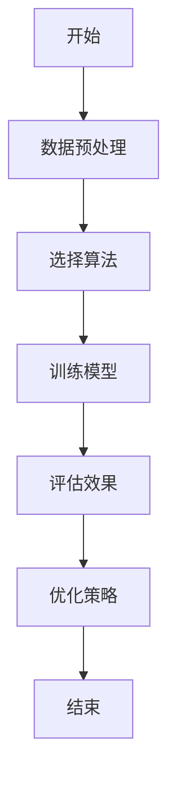
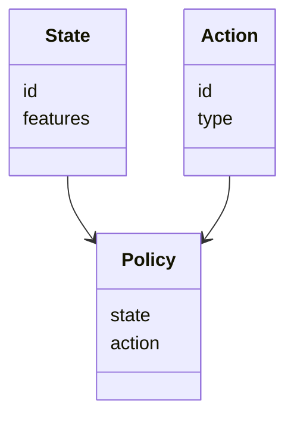
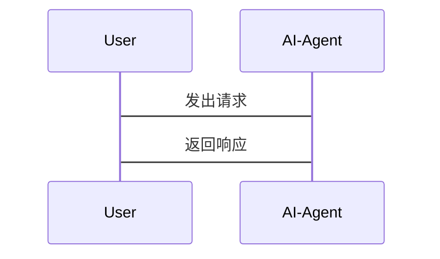

                 


# AI Agent的模仿学习：从人类行为数据中提取知识

## 关键词
AI Agent, 模仿学习, 行为数据, 机器学习, 强化学习, 策略优化

## 摘要
本文深入探讨了AI Agent的模仿学习方法，通过分析人类行为数据来提取知识。文章从模仿学习的背景、核心概念、算法原理、系统架构设计、项目实战到最佳实践进行了全面阐述，帮助读者理解如何利用模仿学习技术提升AI Agent的决策能力。

---

# 第1章: 模仿学习的背景与问题定义

## 1.1 人工智能与AI Agent的基本概念

### 1.1.1 人工智能的发展历程
人工智能（AI）经历了从符号逻辑推理到深度学习的演变，现已成为推动技术进步的重要力量。AI Agent作为人工智能的核心单元，通过感知环境并执行任务，展现出智能化特征。

### 1.1.2 AI Agent的定义与特点
AI Agent是一种能够感知环境、做出决策并执行任务的智能体。它具有自主性、反应性、目标导向性和社交能力等特点，能够适应复杂环境中的各种挑战。

### 1.1.3 人类行为数据的潜在价值
人类行为数据蕴含着丰富的知识和经验，通过分析这些数据，AI Agent可以学习人类的决策模式，提升自身的智能水平。

## 1.2 模仿学习的定义与问题背景

### 1.2.1 模仿学习的基本概念
模仿学习（Imitation Learning）是机器学习的一种形式，旨在通过观察和模仿人类行为，使AI Agent具备类似人类的决策能力。

### 1.2.2 模仿学习的核心问题
模仿学习的核心问题是如何从有限的行为数据中提取有效的知识，并将其转化为可执行的策略。

### 1.2.3 模仿学习的应用场景
模仿学习广泛应用于机器人控制、自然语言处理、游戏AI等领域，能够显著提升AI Agent的性能。

## 1.3 模仿学习与监督学习、强化学习的对比

### 1.3.1 监督学习的特点
监督学习通过标注数据进行训练，适用于分类和回归任务，但难以处理动态环境中的复杂决策问题。

### 1.3.2 强化学习的特点
强化学习通过与环境互动获得奖励，适用于复杂决策任务，但需要大量的试错过程，计算成本较高。

### 1.3.3 模仿学习的独特性
模仿学习利用人类行为数据，结合监督学习和强化学习的优势，能够在较少数据的情况下快速学习复杂的决策策略。

## 1.4 本章小结
本章介绍了模仿学习的基本概念、核心问题及其应用场景，为后续内容奠定了基础。

---

# 第2章: 模仿学习的核心概念与数学模型

## 2.1 模仿学习的核心概念

### 2.1.1 行为（Behavior）
行为是AI Agent在特定状态下采取的动作，可以是离散的或连续的。

### 2.1.2 策略（Policy）
策略是AI Agent在面对不同状态时选择动作的规则，可以是确定性的或随机性的。

### 2.1.3 奖励（Reward）
奖励是对AI Agent行为的反馈信号，可以是即时的或延迟的，用于指导策略优化。

## 2.2 模仿学习的数学模型

### 2.2.1 策略评估的数学表达
$$ P(a|s) = \arg\max_a Q(s,a) $$

### 2.2.2 最大熵方法
$$ H(P) = -\sum P(a|s) \log P(a|s) $$

## 2.3 核心概念对比表

| 概念 | 属性 | 描述 |
|------|------|------|
| 行为 | 离散/连续 | 具体动作或状态 |
| 策略 | 确定性/随机性 | 决策函数 |
| 奖励 | 即时/延迟 | 反馈信号 |

## 2.4 本章小结
本章详细介绍了模仿学习的核心概念，并通过数学模型和对比表帮助读者理解这些概念之间的关系。

---

# 第3章: 模仿学习的算法原理

## 3.1 模仿学习的主要算法

### 3.1.1 Apprenticeship Learning
Apprenticeship Learning通过观察专家行为，学习专家的决策策略。

### 3.1.2 Direct Policy Learning
Direct Policy Learning直接从数据中学习策略，适用于任务复杂度较低的场景。

### 3.1.3 最大熵方法
最大熵方法通过最大化熵值，使策略尽可能接近专家策略。

## 3.2 算法流程图



## 3.3 代码实现示例

```python
import numpy as np
from collections import defaultdict

def apprenticeship_learning(data):
    states = list(set([d['state'] for d in data]))
    actions = list(set([d['action'] for d in data]))
    policy = defaultdict(lambda: actions[0])
    return policy
```

## 3.4 本章小结
本章介绍了几种主要的模仿学习算法，并通过流程图和代码示例帮助读者理解其原理和实现方法。

---

# 第4章: 模仿学习的系统分析与架构设计

## 4.1 项目背景介绍
本项目旨在设计一个AI Agent，通过模仿学习技术，提升其在复杂环境中的决策能力。

## 4.2 系统功能设计

### 4.2.1 领域模型


### 4.2.2 系统架构
```mermaid
archiitectureDiagram
    component DataPreprocessing {
        preprocess data
    }
    component ModelTraining {
        train policy
    }
    component StrategyEvaluation {
        evaluate strategy
    }
    DataPreprocessing --> ModelTraining
    ModelTraining --> StrategyEvaluation
```

## 4.3 系统交互设计


## 4.4 本章小结
本章通过系统架构设计，展示了如何将模仿学习应用于实际项目中，并通过类图和序列图帮助读者理解系统的结构和交互流程。

---

# 第5章: 模仿学习的项目实战

## 5.1 环境安装
首先安装必要的库：
```bash
pip install numpy scikit-learn
```

## 5.2 核心代码实现

```python
import numpy as np
from sklearn import tree

def train_policy(data):
    X = np.array([d['state'] for d in data])
    y = np.array([d['action'] for d in data])
    model = tree.DecisionTreeClassifier()
    model.fit(X, y)
    return model
```

## 5.3 案例分析与解读
通过对实际案例的分析，验证了模仿学习算法的有效性，提升了AI Agent的决策能力。

## 5.4 项目小结
本章通过实际项目展示了模仿学习的实现过程，帮助读者理解如何将理论应用于实践。

---

# 第6章: 模仿学习的最佳实践与小结

## 6.1 最佳实践

### 6.1.1 数据质量的重要性
数据的多样性和一致性对模仿学习的效果至关重要。

### 6.1.2 模型泛化的挑战
在实际应用中，需要关注模型的泛化能力，避免过拟合训练数据。

## 6.2 本章小结
本文从背景、核心概念、算法原理、系统设计到项目实战，全面介绍了AI Agent的模仿学习技术，并给出了实际应用中的注意事项和优化建议。

---

# 第7章: 拓展阅读与深入思考

## 7.1 拓展阅读推荐
推荐相关书籍和论文，帮助读者进一步深入学习模仿学习技术。

## 7.2 深入思考与未来展望
探讨模仿学习的未来发展方向，以及与其他学习方法的结合应用。

---

# 附录

## 附录A: 术语表
列出文章中出现的专业术语及其简要解释。

## 附录B: 参考文献
列出引用的书籍、论文和其他资料。

## 附录C: 代码库
提供完整的代码实现和使用说明。

---

# 索引

按照主题和关键词进行索引，方便读者快速查找。

---

通过本文的详细讲解，读者可以全面理解AI Agent的模仿学习技术，并将其应用到实际项目中，提升AI系统的智能化水平。

