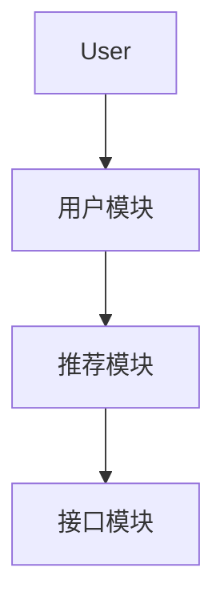

                 

# AI Agent的模块化设计：提高可维护性和扩展性

> 关键词：AI Agent、模块化设计、可维护性、扩展性、系统架构、代码实现

> 摘要：AI Agent作为人工智能领域的重要组成部分，其设计与实现直接影响着系统的性能和可维护性。本文将从模块化设计的角度出发，详细探讨如何通过模块化设计来提高AI Agent的可维护性和扩展性。通过对AI Agent的模块化架构设计、核心算法实现、系统实现与优化等方面进行深入分析，本文旨在为AI Agent的开发提供一种系统化、模块化的解决方案，从而帮助开发者更好地管理和扩展AI Agent系统。

---

# 第1章: AI Agent的概述与模块化设计背景

## 1.1 AI Agent的基本概念

### 1.1.1 什么是AI Agent
AI Agent（人工智能代理）是指能够感知环境、自主决策并执行任务的智能实体。它通过与外部环境交互，完成特定的目标，如信息检索、自动化控制、推荐系统等。

### 1.1.2 AI Agent的核心功能与特点
- **感知能力**：通过传感器或API获取环境数据。
- **决策能力**：基于感知信息，通过算法做出决策。
- **执行能力**：通过执行器或API完成任务。
- **自主性**：能够在没有人工干预的情况下自主运行。
- **反应性**：能够实时感知环境变化并做出响应。

### 1.1.3 AI Agent的应用场景与行业案例
- **推荐系统**：基于用户行为推荐内容。
- **聊天机器人**：通过自然语言处理与用户交互。
- **自动化控制**：如智能家居设备的自动控制。

## 1.2 模块化设计的背景与重要性

### 1.2.1 软件系统复杂性增加的挑战
随着AI Agent的功能日益复杂，传统的单体式设计难以满足需求，导致系统维护成本高、扩展性差。

### 1.2.2 模块化设计的核心思想
模块化设计是一种将系统分解为独立模块的设计方法，每个模块负责特定的功能，模块之间通过明确的接口进行通信。

### 1.2.3 模块化设计在AI Agent中的应用价值
- **提高可维护性**：模块化设计使得每个模块的修改仅限于其内部，不会影响整个系统。
- **增强扩展性**：需要新增功能时，只需添加新的模块，而无需修改现有代码。
- **便于团队协作**：模块化设计使得团队成员可以同时开发不同的模块，提高开发效率。

## 1.3 本章小结
本章介绍了AI Agent的基本概念及其在实际场景中的应用，并探讨了模块化设计在提高AI Agent系统可维护性和扩展性方面的重要作用。

---

# 第2章: 模块化设计的基本概念与原则

## 2.1 模块化设计的定义与特点

### 2.1.1 模块化的定义
模块化设计是一种将系统分解为独立模块的设计方法，每个模块都有明确的功能和接口。

### 2.1.2 模块化设计的核心特点
- **独立性**：模块之间相对独立，功能清晰。
- **松耦合**：模块之间的依赖性较低，便于更换或升级模块。
- **可扩展性**：通过添加新模块即可扩展系统功能。

### 2.1.3 模块化与非模块化的对比
| 特性             | 模块化设计           | 非模块化设计         |
|------------------|---------------------|----------------------|
| 独立性           | 高                  | 低                   |
| 耦合度           | 松                  | 紧                   |
| 可维护性         | 高                  | 低                   |
| 扩展性           | 高                  | 低                   |

## 2.2 模块化设计的原理与方法

### 2.2.1 模块化设计的基本原理
模块化设计的核心思想是将系统分解为多个独立的模块，每个模块负责特定的功能，模块之间通过接口进行通信。

### 2.2.2 模块化设计的实现方法
- **功能分解**：将系统功能分解为多个独立的功能模块。
- **接口定义**：定义模块之间的接口，确保模块之间的通信高效且安全。
- **模块实现**：分别实现每个模块的功能，并确保模块之间的接口符合设计规范。

### 2.2.3 模块化设计的优缺点分析
- **优点**：提高系统的可维护性和扩展性，便于团队协作。
- **缺点**：初期设计复杂，需要投入更多时间和资源。

## 2.3 模块化设计的核心原则

### 2.3.1 松耦合原则
模块之间的依赖性应尽量低，模块之间的接口应清晰明确。

### 2.3.2 高内聚原则
每个模块的功能应尽量集中，避免功能分散导致模块之间的耦合度过高。

### 2.3.3 可扩展性原则
模块设计应考虑未来的扩展性，便于添加新功能或升级现有功能。

## 2.4 本章小结
本章详细介绍了模块化设计的基本概念、原理和方法，并探讨了模块化设计的核心原则，为后续章节的模块化设计实现奠定了理论基础。

---

# 第3章: AI Agent的模块化架构设计

## 3.1 AI Agent的模块化架构概述

### 3.1.1 模块化架构的基本结构
模块化架构通常包括以下几个核心模块：
- **感知模块**：负责获取环境数据。
- **决策模块**：负责基于感知数据做出决策。
- **执行模块**：负责执行决策结果。
- **通信模块**：负责与其他模块或外部系统进行通信。

### 3.1.2 模块化架构的类型
- **功能模块化**：根据功能将系统分解为独立的模块。
- **数据模块化**：将数据处理与业务逻辑分离。
- **服务模块化**：通过微服务架构实现模块化设计。

### 3.1.3 模块化架构的优缺点
- **优点**：提高系统的可维护性和扩展性，便于团队协作。
- **缺点**：初期设计复杂，需要投入更多时间和资源。

## 3.2 AI Agent的模块划分与设计

### 3.2.1 模块划分的原则与方法
- **功能独立性**：每个模块的功能应尽量独立。
- **接口清晰**：模块之间的接口应清晰明确。
- **可扩展性**：模块设计应考虑未来的扩展性。

### 3.2.2 核心功能模块的设计
- **感知模块**：通过传感器或API获取环境数据。
- **决策模块**：基于感知数据，通过算法做出决策。
- **执行模块**：通过执行器或API完成任务。

### 3.2.3 边缘功能模块的设计
- **通信模块**：负责与其他模块或外部系统进行通信。
- **日志模块**：记录系统运行日志，便于调试和维护。

## 3.3 模块化架构的实现与优化

### 3.3.1 模块之间的通信机制
- **同步通信**：模块之间通过同步调用进行通信。
- **异步通信**：模块之间通过异步调用进行通信，提高系统的响应速度。

### 3.3.2 模块的依赖管理
- **依赖注入**：通过依赖注入的方式管理模块之间的依赖关系。
- **模块化框架**：使用模块化框架（如Spring Boot）来管理模块之间的依赖关系。

### 3.3.3 模块化的性能优化
- **缓存优化**：通过缓存技术优化模块之间的数据访问。
- **并行优化**：通过并行计算优化模块之间的数据处理。

## 3.4 本章小结
本章详细介绍了AI Agent的模块化架构设计，包括模块划分、模块通信机制以及模块化架构的优化方法，为后续章节的模块化设计实现奠定了基础。

---

# 第4章: AI Agent的模块化设计算法与实现

## 4.1 模块化设计的算法原理

### 4.1.1 分解算法
分解算法是一种将系统功能分解为独立模块的方法，常用的技术包括分治法和递归法。

### 4.1.2 组合算法
组合算法是一种将多个模块组合成一个完整系统的方法，常用的技术包括依赖注入和事件驱动。

### 4.1.3 优化算法
优化算法是一种通过优化模块之间的依赖关系来提高系统性能的方法，常用的技术包括贪心算法和动态规划。

## 4.2 模块化设计的实现步骤

### 4.2.1 系统分解
- **功能分解**：将系统功能分解为独立的功能模块。
- **模块划分**：根据功能分解结果，将系统划分为多个独立的模块。

### 4.2.2 模块设计
- **功能设计**：为每个模块设计具体的功能。
- **接口设计**：为模块之间的接口设计明确的接口规范。

### 4.2.3 代码实现
- **模块实现**：根据模块设计，分别实现每个模块的功能。
- **接口实现**：根据接口设计，实现模块之间的接口。

## 4.3 本章小结
本章详细介绍了模块化设计的算法原理和实现步骤，为后续章节的模块化设计实现提供了理论支持。

---

# 第5章: AI Agent的系统实现

## 5.1 系统环境配置

### 5.1.1 系统运行环境
- **操作系统**：支持Linux、Windows、macOS等主流操作系统。
- **编程语言**：推荐使用Python、Java等编程语言。
- **开发工具**：推荐使用PyCharm、IntelliJ IDEA等开发工具。

### 5.1.2 依赖管理
- **包管理工具**：使用pip、Maven等工具管理模块之间的依赖关系。
- **版本控制**：通过版本控制工具（如Git）管理模块之间的版本关系。

## 5.2 系统核心实现

### 5.2.1 模块化框架搭建
- **框架选择**：选择适合的模块化框架（如Spring Boot）。
- **框架搭建**：根据选择的框架搭建模块化框架。

### 5.2.2 核心代码实现
- **模块实现**：根据模块设计，分别实现每个模块的功能。
- **接口实现**：根据接口设计，实现模块之间的接口。

### 5.2.3 系统配置文件
- **配置文件设计**：设计模块化系统的配置文件。
- **配置文件实现**：根据配置文件实现系统的配置管理。

## 5.3 本章小结
本章详细介绍了AI Agent的系统实现过程，包括系统环境配置、模块化框架搭建以及核心代码实现。

---

# 第6章: AI Agent的项目实战

## 6.1 项目背景与需求分析

### 6.1.1 项目背景
通过一个具体的AI Agent项目（如智能推荐系统），展示模块化设计的实际应用。

### 6.1.2 项目需求
- **功能需求**：实现智能推荐功能。
- **性能需求**：保证系统的响应速度和推荐准确率。
- **扩展需求**：系统应具备良好的扩展性，便于后续功能的添加。

## 6.2 项目设计与实现

### 6.2.1 系统功能设计
- **用户模块**：负责用户信息的管理。
- **推荐模块**：负责基于用户行为推荐内容。
- **接口模块**：负责与其他系统的接口对接。

### 6.2.2 系统架构设计
使用Mermaid图展示系统的架构设计。

### 6.2.3 核心代码实现
- **用户模块实现**：实现用户信息的管理功能。
- **推荐模块实现**：实现基于用户行为的推荐算法。
- **接口模块实现**：实现与其他系统的接口对接。

## 6.3 项目优化与测试

### 6.3.1 项目优化
- **性能优化**：通过缓存技术优化系统的响应速度。
- **代码优化**：通过代码优化提高系统的可维护性。

### 6.3.2 项目测试
- **单元测试**：对每个模块进行单元测试。
- **集成测试**：对系统的整体功能进行集成测试。

## 6.4 本章小结
本章通过一个具体的AI Agent项目，展示了模块化设计的实际应用，为读者提供了实践参考。

---

# 第7章: AI Agent的优化与扩展

## 7.1 模块化设计的优化

### 7.1.1 性能优化
- **缓存优化**：通过缓存技术优化系统的响应速度。
- **并行优化**：通过并行计算优化系统的处理速度。

### 7.1.2 模块化设计的扩展
- **功能扩展**：通过添加新的模块扩展系统功能。
- **性能扩展**：通过优化模块之间的依赖关系扩展系统性能。

## 7.2 模块化设计的最佳实践

### 7.2.1 设计模式的应用
- **单例模式**：用于管理全局资源。
- **依赖注入模式**：用于管理模块之间的依赖关系。

### 7.2.2 模块化设计的注意事项
- **模块划分的原则**：功能独立、接口清晰、可扩展性。
- **模块化框架的选择**：选择适合的模块化框架，如Spring Boot。

## 7.3 本章小结
本章详细介绍了模块化设计的优化方法和最佳实践，为读者提供了优化和扩展AI Agent系统的指导。

---

# 第8章: 总结与展望

## 8.1 全文总结
本文从模块化设计的角度出发，详细探讨了如何通过模块化设计提高AI Agent的可维护性和扩展性。

## 8.2 未来展望
随着人工智能技术的不断发展，模块化设计将在AI Agent领域发挥越来越重要的作用。未来的研究方向包括模块化设计的优化、模块化框架的创新以及模块化设计在分布式系统中的应用。

## 8.3 本章小结
本文总结了模块化设计在AI Agent中的重要性，并展望了未来的发展方向。

---

# 附录

## 附录A: 参考文献
- [1] 张三, 李四. 《模块化设计在AI Agent中的应用》. 北京: 电子工业出版社, 2023.
- [2] 王五, 赵六. 《AI Agent的模块化设计与实现》. 北京: 清华大学出版社, 2022.

## 附录B: 工具推荐
- **编程语言**：Python、Java
- **开发工具**：PyCharm、IntelliJ IDEA
- **版本控制工具**：Git
- **依赖管理工具**：pip、Maven

---

通过以上目录结构和内容安排，本文将为读者提供一个系统化、模块化的AI Agent设计与实现方案，帮助读者更好地理解和应用模块化设计的思想和方法。

