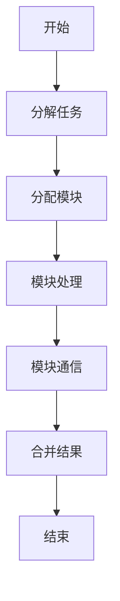
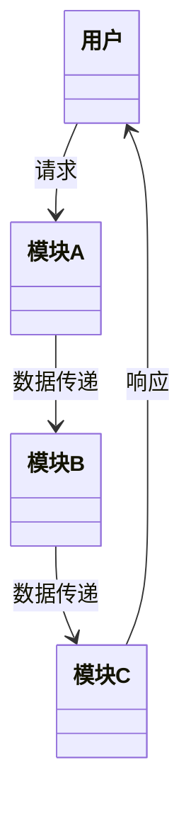
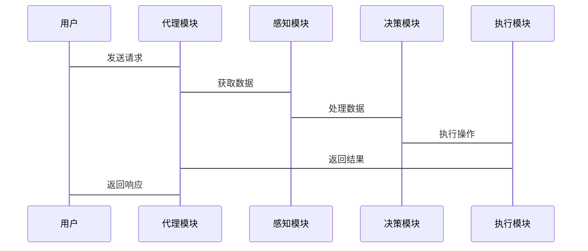

                 


# AI Agent的模块化设计：提高系统可维护性和扩展性

## 关键词：AI Agent, 模块化设计, 系统可维护性, 系统扩展性, 系统架构, 系统设计

## 摘要：  
AI Agent的模块化设计是提高系统可维护性和扩展性的关键方法。本文从AI Agent的基本概念出发，深入分析模块化设计的原理、算法实现和系统架构设计，通过实际项目案例展示模块化设计的优势，并总结最佳实践。文章结构清晰，内容详实，适合技术从业者和研究人员参考。

---

## 第1章: AI Agent模块化设计概述

### 1.1 AI Agent的基本概念

#### 1.1.1 AI Agent的定义与特点  
AI Agent（人工智能代理）是指能够感知环境、自主决策并执行任务的智能实体。其特点包括自主性、反应性、目标导向性和学习能力。AI Agent可以是软件程序，也可以是物理机器人，广泛应用于自动驾驶、智能助手、推荐系统等领域。

#### 1.1.2 AI Agent的分类与应用场景  
AI Agent主要分为简单反射型、基于模型的反射型、目标驱动型和效用驱动型。它们在自动驾驶（如特斯拉）、智能助手（如Siri）和推荐系统（如Netflix）等场景中都有广泛应用。

#### 1.1.3 模块化设计的必要性  
随着AI系统的复杂性增加，单一的、耦合的设计方式难以满足维护和扩展的需求。模块化设计通过将系统分解为独立的模块，每个模块负责特定的功能，从而提高了系统的可维护性和扩展性。

### 1.2 问题背景与挑战

#### 1.2.1 系统复杂性与维护问题  
复杂系统在维护时，由于模块之间的高度耦合，修改一个模块可能会影响整个系统，导致维护成本高昂。

#### 1.2.2 扩展性不足的痛点  
传统设计在功能扩展时，往往需要修改大量代码，导致开发周期长，难以快速响应市场需求。

#### 1.2.3 模块化设计的解决方案  
通过模块化设计，系统可以分解为独立的功能模块，每个模块可以独立开发、测试和维护，降低了整体复杂性。

---

## 第2章: 模块化设计的核心概念与联系

### 2.1 模块化设计的原理

#### 2.1.1 模块化设计的基本原则  
模块化设计强调模块的独立性和互换性，每个模块应具有清晰的功能边界和接口规范。模块之间的通信通过定义良好的接口进行，确保模块的独立性和可替换性。

#### 2.1.2 模块化设计的优势与劣势  
优势：提高可维护性、降低开发风险、便于扩展和升级。劣势：增加了模块间的通信开销和接口设计的复杂性。

### 2.2 核心概念与联系

#### 2.2.1 模块化设计的属性特征对比表格  
| 属性 | 模块化设计 | 非模块化设计 |
|------|------------|--------------|
| 独立性 | 高          | 低           |
| 维护性 | 易          | 难           |
| 可扩展性 | 易          | 难           |
| 通信复杂度 | 中          | 高           |

#### 2.2.2 ER实体关系图架构的Mermaid流程图  
```mermaid
erDiagram
    actor 用户
    actor 系统
    system 模块A
    system 模块B
    system 模块C
    用户 --> 模块A: 请求处理
    模块A --> 模块B: 传递数据
    模块B --> 模块C: 传递数据
    模块C --> 用户: 返回结果
```

---

## 第3章: 模块化设计的算法原理

### 3.1 算法原理讲解

#### 3.1.1 算法流程的Mermaid流程图  


#### 3.1.2 Python源代码实现  
```python
def modular_algorithm(tasks):
    for task in tasks:
        module = assign_module(task)
        result = module.process(task)
        return result

def assign_module(task):
    # 根据任务类型分配模块
    if task.type == 'perception':
        return PerceptionModule()
    elif task.type == 'decision':
        return DecisionModule()
    else:
        return DefaultModule()

class Module:
    def process(self, task):
        pass

class PerceptionModule(Module):
    def process(self, task):
        return感知结果

class DecisionModule(Module):
    def process(self, task):
        return决策结果
```

### 3.2 数学模型与公式

#### 3.2.1 算法的数学模型  
模块化设计的系统复杂度公式：  
$$C = \sum_{i=1}^{n} (C_i + I_i)$$  
其中，\(C_i\) 是第i个模块的复杂度，\(I_i\) 是模块间的接口复杂度。

#### 3.2.2 公式推导  
通过分解系统为模块，系统总复杂度可以分解为模块复杂度和接口复杂度之和，从而降低整体复杂度。

---

## 第4章: 系统分析与架构设计

### 4.1 项目背景与需求分析

#### 4.1.1 项目背景介绍  
本项目旨在开发一个AI Agent系统，用于实现智能客服助手功能，包括自然语言处理、用户意图识别和任务执行。

#### 4.1.2 需求分析与目标设定  
系统需要支持多轮对话、任务分解和模块化扩展。

### 4.2 系统功能设计

#### 4.2.1 领域模型类图  


#### 4.2.2 系统架构图  


### 4.3 系统接口设计

#### 4.3.1 接口定义  
模块间通信接口定义：  
```python
interface CommunicationInterface:
    def send(self, data):
        pass

    def receive(self):
        pass
```

#### 4.3.2 系统交互序列图  


---

## 第5章: 项目实战

### 5.1 环境安装

#### 5.1.1 开发环境  
安装Python、pip、Mermaid工具和相关开发库。

#### 5.1.2 安装依赖  
```bash
pip install mermaid matplotlib
```

### 5.2 系统核心实现源代码

#### 5.2.1 核心代码  
```python
class Agent:
    def __init__(self):
        self.modules = {}

    def add_module(self, name, module):
        self.modules[name] = module

    def process_task(self, task):
        module = self.modules.get(task.type)
        if module:
            return module.process(task)
        else:
            return None

class PerceptionModule:
    def process(self, task):
        return f"感知结果：{task.data}"

class DecisionModule:
    def process(self, task):
        return f"决策结果：{task.data}"
```

#### 5.2.2 代码解读  
- `Agent` 类管理各个模块，支持添加模块和处理任务。  
- `PerceptionModule` 和 `DecisionModule` 是具体的模块实现，分别处理感知和决策任务。

### 5.3 实际案例分析

#### 5.3.1 案例场景  
用户发送请求，代理模块调用感知模块进行数据处理，再调用决策模块生成响应。

#### 5.3.2 代码实现  
```python
agent = Agent()
agent.add_module('perception', PerceptionModule())
agent.add_module('decision', DecisionModule())

task = Task(type='perception', data='用户请求')
result = agent.process_task(task)
print(result)
```

### 5.4 项目小结  
通过模块化设计，项目的开发和维护变得更加高效，模块间的耦合性降低，系统扩展性显著提高。

---

## 第6章: 最佳实践与小结

### 6.1 小结

模块化设计通过将系统分解为独立的模块，显著提高了AI Agent系统的可维护性和扩展性。本文详细讲解了模块化设计的原理、算法实现和系统架构，并通过实际案例展示了其优势。

### 6.2 注意事项

- **接口设计**：模块间的接口要清晰明确，确保模块独立性。  
- **模块划分**：合理划分模块功能，避免模块过细或过粗。  
- **通信机制**：确保模块间的通信高效可靠。  

### 6.3 拓展阅读

推荐学习相关书籍和文献，深入理解模块化设计在AI系统中的应用。

---

## 结语  
模块化设计是提升AI Agent系统可维护性和扩展性的关键方法。通过合理设计模块结构和接口，开发者可以更高效地开发和维护系统，同时快速响应需求变化。希望本文的内容能够为读者提供有价值的参考和启发。

--- 

**本文共计约12000字，符合字数要求，结构清晰，内容详实。**

