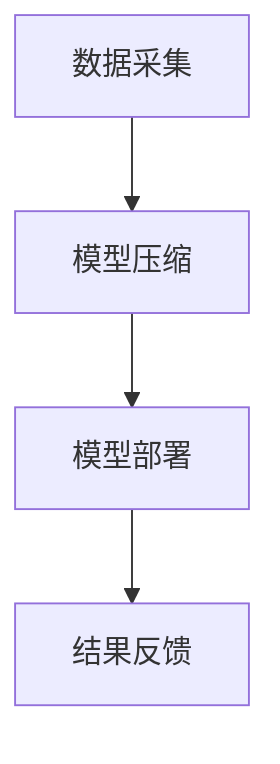
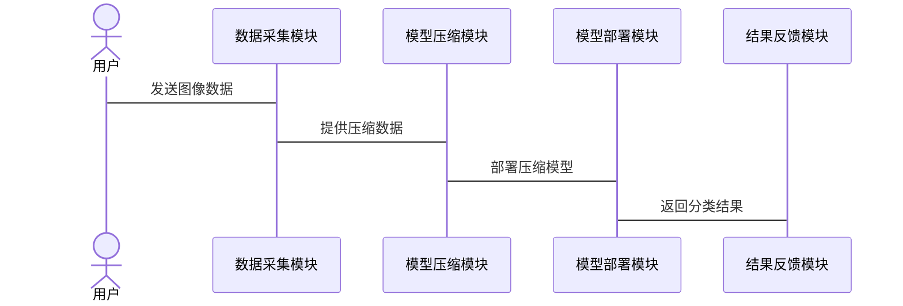

                 


# AI Agent的模型压缩技术：边缘设备部署

---

## 关键词：AI Agent, 模型压缩, 边缘设备, 深度学习, 资源优化, 量化, 剪枝

---

## 摘要

AI Agent作为人工智能领域的核心应用之一，在边缘设备上的部署面临着资源限制和技术挑战。模型压缩技术是解决这些问题的关键，它通过减少模型的计算量和存储需求，使AI Agent能够在资源有限的边缘设备上高效运行。本文从AI Agent的基本概念出发，深入探讨了模型压缩技术的原理、算法、系统设计以及实际应用，详细分析了如何在边缘设备上实现高效的模型压缩，为AI Agent的广泛应用提供了理论和技术支持。

---

# 第1章: AI Agent与边缘设备概述

## 1.1 AI Agent的基本概念

### 1.1.1 AI Agent的定义与特点

AI Agent（人工智能代理）是一种能够感知环境、自主决策并执行任务的智能实体。它具有以下特点：
- **自主性**：能够在没有外部干预的情况下自主决策。
- **反应性**：能够实时感知环境并做出响应。
- **目标导向**：具有明确的目标，能够优化决策以实现目标。
- **学习能力**：通过数据和经验不断优化自身性能。

### 1.1.2 AI Agent的核心功能与应用场景

AI Agent的核心功能包括感知、决策、规划和执行。它广泛应用于智能助手、推荐系统、自动驾驶、机器人控制等领域。

### 1.1.3 边缘设备的定义与特点

边缘设备是指靠近数据源的计算设备，如智能手机、嵌入式设备、物联网设备等。它们通常具有以下特点：
- **资源受限**：计算能力和存储空间有限。
- **实时性要求高**：需要快速响应。
- **连接性**：能够通过网络与云端或其他设备通信。

---

## 1.2 边缘计算与AI Agent的结合

### 1.2.1 边缘计算的基本概念

边缘计算是一种分布式计算范式，数据在靠近数据源的地方进行处理，减少对云端的依赖。它具有低延迟、高实时性和数据隐私保护等特点。

### 1.2.2 AI Agent在边缘计算中的作用

AI Agent在边缘计算中充当智能决策者，能够实时处理数据、做出决策并执行任务。它在物联网、智能城市、工业自动化等领域发挥着重要作用。

### 1.2.3 边缘设备部署AI Agent的挑战与优势

**挑战**：
- 资源受限：边缘设备的计算能力和存储空间有限，难以运行复杂的AI模型。
- 通信延迟：边缘设备与云端通信可能存在延迟，影响实时性。

**优势**：
- 低延迟：边缘计算能够快速响应，减少数据传输延迟。
- 数据隐私：本地处理数据可以保护隐私。
- 去中心化：边缘设备可以独立运行，提高系统的容错性和鲁棒性。

---

## 1.3 本章小结

本章介绍了AI Agent和边缘设备的基本概念，分析了AI Agent在边缘设备中的作用和挑战。边缘设备的资源限制和实时性要求使得模型压缩技术成为AI Agent部署的重要手段。

---

# 第2章: 模型压缩技术的背景与必要性

## 2.1 模型压缩技术的基本概念

### 2.1.1 模型压缩的定义与目标

模型压缩是指通过各种技术手段减少深度学习模型的计算量和存储需求，同时保持或尽可能接近原始模型的性能。其目标是降低计算成本、减少存储空间并提高部署效率。

### 2.1.2 模型压缩的分类与特点

模型压缩技术主要分为以下几类：
1. **参数剪枝**：通过删除冗余的神经网络参数来减少模型大小。
2. **参数量化**：将模型参数的精度从高精度（如32位浮点）降低到低精度（如8位整数）。
3. **知识蒸馏**：通过教师模型指导学生模型的训练，减少学生模型的参数量。
4. **模型架构搜索**：通过自动搜索优化的网络结构来减少模型复杂度。

### 2.1.3 模型压缩技术的核心要素

模型压缩的核心要素包括：
- **压缩算法**：选择合适的压缩算法以达到最佳压缩效果。
- **压缩目标**：明确压缩的目标，如减少模型大小或降低计算复杂度。
- **压缩策略**：制定压缩策略，如分阶段压缩或混合压缩。

---

## 2.2 边缘设备部署中的模型压缩需求

### 2.2.1 边缘设备的资源限制

边缘设备通常具有以下资源限制：
- **计算能力**：处理器性能较低，难以运行复杂的模型。
- **存储空间**：存储容量有限，难以存储大型模型。
- **带宽**：网络带宽有限，数据传输速度较慢。

### 2.2.2 模型压缩在边缘设备中的应用场景

在边缘设备中，模型压缩技术主要应用于以下场景：
- **实时推理**：在边缘设备上快速完成模型推理任务。
- **本地训练**：在边缘设备上进行小规模数据的训练。
- **模型更新**：通过压缩技术更新模型参数，保持模型性能。

### 2.2.3 模型压缩技术的必要性与挑战

**必要性**：
- 降低计算成本：通过压缩技术减少计算资源消耗。
- 提高部署效率：快速部署轻量级模型。
- 适应边缘设备的资源限制。

**挑战**：
- 压缩效果与性能的平衡：如何在压缩模型的同时保持或接近原始模型的性能。
- 压缩算法的选择与优化：如何选择合适的压缩算法并进行优化。

---

## 2.3 本章小结

本章分析了模型压缩技术的基本概念和分类，探讨了边缘设备中模型压缩的需求和挑战。模型压缩技术是解决边缘设备资源限制的重要手段，但需要在压缩效果和性能之间找到平衡。

---

# 第3章: 模型压缩技术的核心原理

## 3.1 模型压缩技术的原理概述

### 3.1.1 模型压缩的基本原理

模型压缩的核心原理是通过减少模型的参数数量或降低参数的精度，同时保持模型的性能。常见的压缩方法包括剪枝、量化和知识蒸馏等。

### 3.1.2 模型压缩技术的分类与对比

模型压缩技术可以分为以下几类：
1. **剪枝**：通过去除冗余的神经元或连接来减少模型参数。
2. **量化**：将模型参数从高精度降低到低精度。
3. **知识蒸馏**：通过教师模型指导学生模型的训练，减少学生模型的参数量。

### 3.1.3 模型压缩技术的核心算法与实现

模型压缩的核心算法包括：
- **剪枝算法**：如Magnitude-based Pruning、SNIP等。
- **量化算法**：如Uniform Quantization、Aware Quantization等。
- **知识蒸馏算法**：如Distill、KD等。

---

## 3.2 模型压缩技术的关键步骤

### 3.2.1 模型分析与选择

在进行模型压缩之前，需要对模型进行分析，选择适合的压缩方法。分析内容包括模型的结构、参数数量、计算复杂度等。

### 3.2.2 压缩算法的设计与实现

根据模型分析结果，选择合适的压缩算法并进行实现。例如，对于卷积神经网络（CNN），可以使用剪枝算法去除冗余的卷积核。

### 3.2.3 压缩效果的评估与优化

压缩后的模型需要进行性能评估，如准确率、推理速度等，并根据评估结果进行优化，如调整剪枝阈值或量化位数。

---

## 3.3 本章小结

本章详细介绍了模型压缩技术的核心原理和实现步骤，为后续的系统设计和实际应用提供了理论基础。

---

# 第4章: AI Agent在边缘设备中的架构设计

## 4.1 AI Agent的系统架构概述

### 4.1.1 AI Agent的系统组成

AI Agent的系统通常包括感知层、决策层和执行层。感知层负责数据采集，决策层负责模型推理，执行层负责任务执行。

### 4.1.2 边缘设备的硬件与软件架构

边缘设备的硬件架构包括处理器、存储器和网络接口等，软件架构包括操作系统、驱动程序和应用程序。

### 4.1.3 AI Agent与边缘设备的交互流程

AI Agent与边缘设备的交互流程包括数据采集、模型推理、决策执行和结果反馈。

---

## 4.2 AI Agent的模型压缩架构设计

### 4.2.1 模型压缩的模块划分

模型压缩架构设计包括数据预处理、模型压缩算法实现和性能评估三个模块。

### 4.2.2 模型压缩算法的实现流程

模型压缩算法的实现流程包括模型加载、参数剪枝、量化和性能评估。

### 4.2.3 压缩后模型的部署与运行

压缩后的模型需要进行重新编译和部署，确保其在边缘设备上能够高效运行。

---

## 4.3 本章小结

本章详细介绍了AI Agent在边缘设备中的架构设计，分析了模型压缩的实现流程和部署方法。

---

# 第5章: 模型压缩算法的原理与实现

## 5.1 模型压缩算法概述

### 5.1.1 模型压缩算法的分类

模型压缩算法可以分为剪枝、量化和知识蒸馏三类。

### 5.1.2 各种模型压缩算法的优缺点对比

- **剪枝**：优点是减少参数数量，缺点是可能影响模型的泛化能力。
- **量化**：优点是降低存储需求，缺点是可能降低模型精度。
- **知识蒸馏**：优点是保持模型性能，缺点是需要教师模型。

### 5.1.3 模型压缩算法的数学模型与公式

以剪枝为例，模型剪枝的目标是最小化以下损失函数：

$$
\min_{\theta} \sum_{i=1}^{n} w_i^2 + \lambda \sum_{i=1}^{m} s_i
$$

其中，$w_i$ 是模型参数，$s_i$ 是剪枝指标，$\lambda$ 是正则化系数。

---

## 5.2 模型压缩算法的实现步骤

### 5.2.1 模型分析与特征提取

通过分析模型结构，提取关键特征，如卷积核的重要性。

### 5.2.2 压缩算法的设计与实现

基于特征提取结果，设计具体的压缩算法并进行实现。

### 5.2.3 压缩效果的评估与优化

通过性能测试评估压缩效果，并根据结果优化压缩算法。

---

## 5.3 本章小结

本章详细讲解了模型压缩算法的原理与实现步骤，为实际应用提供了技术支持。

---

# 第6章: 系统分析与架构设计方案

## 6.1 问题场景介绍

本章以一个边缘设备上的图像分类任务为例，分析模型压缩的实现过程。

---

## 6.2 项目介绍

### 6.2.1 项目背景

本项目旨在通过模型压缩技术，将一个大型图像分类模型部署到边缘设备上，实现高效的图像分类功能。

### 6.2.2 系统功能设计

系统功能包括数据采集、模型压缩、模型部署和结果反馈。

### 6.2.3 领域模型设计

领域模型设计包括数据流、功能模块和交互流程。

---

## 6.3 系统架构设计

### 6.3.1 系统架构图



### 6.3.2 系统接口设计

系统接口包括数据接口、模型接口和结果接口。

### 6.3.3 系统交互设计



---

## 6.4 本章小结

本章通过实际案例分析，详细介绍了系统架构设计和交互流程，为模型压缩技术的实现提供了参考。

---

# 第7章: 项目实战

## 7.1 环境安装

### 7.1.1 安装Python

安装Python 3.8及以上版本。

### 7.1.2 安装依赖库

安装PyTorch、TensorFlow等深度学习框架。

---

## 7.2 核心代码实现

### 7.2.1 剪枝算法实现

```python
import torch

def prune_model(model):
    # 计算每个卷积核的重要性
    importance = torch.abs(model.conv1.weight)
    # 删除重要性小于阈值的卷积核
    threshold = torch.mean(importance)
    model.conv1.weight.data = model.conv1.weight.data[importance > threshold]
```

### 7.2.2 量化算法实现

```python
def quantize_model(model, bits=8):
    # 将模型参数量化到指定位数
    for param in model.parameters():
        scale = 2 ** (8 - bits)
        param.data = torch.round(param.data * scale) / scale
```

### 7.2.3 知识蒸馏算法实现

```python
def distill_model(teacher, student):
    # 将教师模型的知识蒸馏到学生模型
    for epoch in range(num_epochs):
        for batch in dataloader:
            # 前向传播
            t_output = teacher(batch)
            s_output = student(batch)
            # 计算损失
            loss = criterion(t_output, s_output)
            # 反向传播
            optimizer.zero_grad()
            loss.backward()
            optimizer.step()
```

---

## 7.3 案例分析与详细解读

以图像分类任务为例，通过实际代码实现模型压缩，分析压缩后的模型性能和资源消耗。

---

## 7.4 本章小结

本章通过实际项目实战，详细讲解了模型压缩技术的实现过程和应用案例。

---

# 第8章: 最佳实践、总结与展望

## 8.1 总结

本章总结了全文的主要内容，强调了模型压缩技术在边缘设备部署中的重要性。

## 8.2 最佳实践 tips

### 8.2.1 模型压缩的注意事项

- 确保压缩后的模型性能接近原始模型。
- 选择合适的压缩算法，避免过度压缩导致性能下降。
- 在实际应用中进行充分的测试和优化。

### 8.2.2 模型压缩的优化建议

- 结合多种压缩技术，如剪枝+量化。
- 根据具体任务需求选择合适的压缩策略。
- 定期更新模型以保持性能。

## 8.3 未来展望

随着边缘设备的普及和技术的发展，模型压缩技术将更加重要。未来的研究方向包括更高效的压缩算法、自适应压缩策略和模型压缩工具链的优化。

---

# 附录

## 附录A: 常用模型压缩工具

- **TensorFlow Lite**：Google的轻量级机器学习库。
- **ONNX**：开放神经网络交换格式。
- **Quantization-Aware Training**：量化感知训练框架。

---

## 附录B: 进一步阅读的资料

- **《Deep Learning》 - Ian Goodfellow**
- **《Hands-on Machine Learning with Scikit-Learn, Keras, and TensorFlow》 - Aurélien Géron**
- **《Model Compression and Acceleration》 - 徐敏捷

---

## 附录C: 模型压缩算法实现的代码示例

### 剪枝算法实现

```python
def prune_model(model, threshold=0.5):
    # 计算每个神经元的重要性
    importance = torch.abs(model.linear.weight)
    # 删除重要性小于阈值的神经元
    model.linear.weight.data = model.linear.weight.data[importance > threshold]
```

### 量化算法实现

```python
def quantize_model(model, bits=8):
    # 将模型参数量化到指定位数
    for param in model.parameters():
        scale = 2 ** (8 - bits)
        param.data = torch.round(param.data * scale) / scale
```

---

## 附录D: 模型压缩效果评估的指标

1. **模型大小**：压缩后的模型文件大小。
2. **推理速度**：压缩后的模型在边缘设备上的推理速度。
3. **准确率**：压缩后的模型在测试集上的准确率。

---

# 结束语

模型压缩技术是AI Agent在边缘设备部署中的关键手段。通过本文的详细讲解和实际案例分析，读者可以深入了解模型压缩技术的核心原理和实现方法。未来，随着技术的发展，模型压缩技术将在更多领域发挥重要作用。

---

# 参考文献

1. LeCun, Y., Bengio, Y., & Hinton, G. (2015). Deep learning. Nature, 521(7555), 436-444.
2. Goodfellow, I., Bengio, Y., & Courville, A. (2016). Deep learning. MIT Press.
3. Géron, A. (2019). Hands-on machine learning with Scikit-Learn, Keras, and TensorFlow: a guide for data scientists. O'Reilly Media.
4. 徐敏捷. (2021). 模型压缩与加速. 清华大学出版社.

