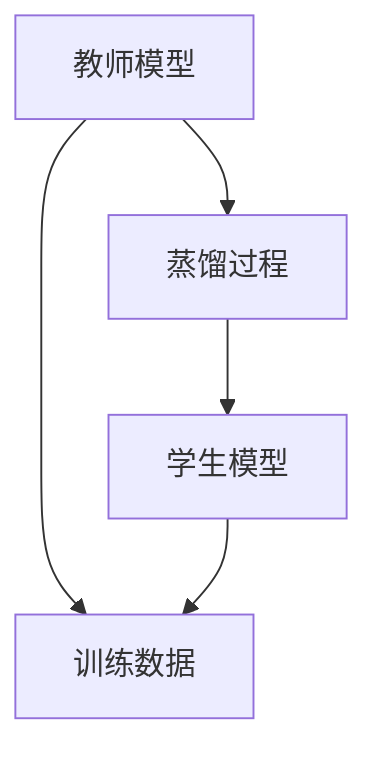

                 


# AI Agent的模型蒸馏技术：从庞大LLM到高效精简版

## 关键词
AI Agent, 模型蒸馏, 大语言模型, 教师模型, 学生模型, 知识蒸馏

## 摘要
模型蒸馏技术是一种将大型语言模型（LLM）精简为更高效、更小版本的关键技术。本文从AI Agent的角度出发，详细探讨模型蒸馏的原理、实现方法及其在AI Agent中的应用。通过分析教师模型与学生模型的关系，结合数学公式和实际案例，本文旨在为读者提供从理论到实践的全面指南，帮助他们理解如何将庞大的LLM优化为高效精简版的AI Agent。

---

# 第一部分: AI Agent与模型蒸馏技术的背景介绍

## 第1章: AI Agent与模型蒸馏技术的背景介绍

### 1.1 模型蒸馏技术的定义与问题背景

#### 1.1.1 从庞大LLM到精简模型的演进
大型语言模型（LLM）如GPT-3和GPT-4在自然语言处理任务中表现出色，但其庞大的参数量（例如，GPT-3拥有175 billion参数）导致计算资源消耗巨大，推理速度慢，难以在资源受限的环境中应用。模型蒸馏技术通过将知识从大型教师模型转移到较小的学生模型，解决了这一问题，使得AI Agent在资源受限的环境中也能高效运行。

#### 1.1.2 大模型在实际应用中的挑战
- **计算资源消耗**：LLM需要大量的GPU资源进行推理，限制了其在移动端和边缘计算中的应用。
- **推理速度**：庞大的参数量导致推理时间过长，难以满足实时应用场景的需求。
- **部署复杂性**：大规模模型的部署和维护成本高，难以在资源有限的环境中普及。

#### 1.1.3 模型蒸馏技术的核心目标
模型蒸馏技术的核心目标是通过将教师模型的知识迁移到学生模型，降低模型的复杂性和计算成本，同时保持或接近教师模型的性能。这使得AI Agent能够在资源受限的环境中高效运行，满足实时性和轻量化的应用需求。

### 1.2 AI Agent与模型蒸馏技术的关系

#### 1.2.1 AI Agent的基本概念
AI Agent是一种智能体，能够感知环境、自主决策并执行任务。AI Agent的核心能力依赖于其背后的知识表示和推理能力，而模型蒸馏技术为AI Agent提供了更高效的知识表示方式。

#### 1.2.2 模型蒸馏技术在AI Agent中的作用
模型蒸馏技术通过将教师模型的知识迁移到学生模型，使得AI Agent在保持高性能的同时，具备更小的模型体积和更快的推理速度。这使得AI Agent能够更好地应用于移动设备、边缘计算等场景。

#### 1.2.3 AI Agent的典型应用场景
- **移动应用**：在手机等移动设备上运行AI Agent，需要轻量化的模型以保证运行效率。
- **边缘计算**：在边缘设备上部署AI Agent，需要低资源消耗和快速响应。
- **实时交互**：在需要快速响应的对话系统中，模型蒸馏技术能够显著提高推理速度。

### 1.3 模型蒸馏技术的优势与局限性

#### 1.3.1 技术优势：模型轻量化与性能优化
- **模型轻量化**：通过蒸馏技术，学生模型的参数量大幅减少，显著降低了计算资源的需求。
- **性能优化**：在特定任务上，蒸馏后的模型能够保持接近教师模型的性能，甚至在某些场景下表现更优。

#### 1.3.2 技术局限：性能损失与适用场景限制
- **性能损失**：学生模型在某些复杂任务上的性能可能略逊于教师模型。
- **适用场景限制**：蒸馏技术在特定场景下效果最佳，例如在数据充足且教师模型性能优越的情况下。

#### 1.3.3 模型蒸馏技术的适用边界
模型蒸馏技术适用于需要轻量化模型的场景，但不适用于需要极高精度的任务或数据不足的情况。在选择是否使用蒸馏技术时，需要综合考虑模型性能、资源需求和应用场景。

### 1.4 本章小结
本章介绍了模型蒸馏技术的定义、问题背景及其在AI Agent中的作用。通过分析模型蒸馏技术的优势与局限性，读者可以理解其适用场景和潜在挑战。接下来，我们将深入探讨模型蒸馏技术的核心原理和实现方法。

---

# 第二部分: 模型蒸馏技术的核心概念与联系

## 第2章: 模型蒸馏技术的核心原理

### 2.1 知识蒸馏的基本原理

#### 2.1.1 教师模型与学生模型的角色定位
- **教师模型**：教师模型是知识的提供者，通常是一个经过充分训练的大模型。
- **学生模型**：学生模型是知识的接收者，通常是一个参数量较小的模型。

#### 2.1.2 知识蒸馏的关键步骤
知识蒸馏的过程通常包括以下步骤：
1. **预训练教师模型**：训练一个高性能的教师模型。
2. **初始化学生模型**：初始化一个参数量较小的学生模型。
3. **蒸馏过程**：通过蒸馏算法，将教师模型的知识迁移到学生模型中。

#### 2.1.3 知识蒸馏的核心公式与数学模型
知识蒸馏的核心公式是KL散度（Kullback-Leibler divergence），用于衡量两个概率分布之间的差异。公式如下：

$$\text{KL散度} = \text{KL}(P||Q)$$

其中，$P$是教师模型的输出概率分布，$Q$是学生模型的输出概率分布。

### 2.2 模型蒸馏技术的实现流程

#### 2.2.1 数据准备阶段
- **训练数据**：教师模型的训练数据和学生模型的训练数据通常相同。
- **蒸馏数据**：在蒸馏过程中，通常需要额外的蒸馏数据来辅助知识迁移。

#### 2.2.2 教师模型的构建与训练
教师模型通常是一个经过充分训练的大型语言模型，例如BERT或GPT。训练过程需要大量的计算资源和时间。

#### 2.2.3 学生模型的构建与训练
学生模型通常是一个参数量较小的模型，例如DistilBERT。在蒸馏过程中，学生模型通过模仿教师模型的输出来学习知识。

### 2.3 模型蒸馏技术的数学模型与公式

#### 2.3.1 模型蒸馏的核心公式
模型蒸馏的核心公式是KL散度，用于衡量教师模型和学生模型输出之间的差异。公式如下：

$$\text{KL散度} = \sum_{i} P_i \log \frac{P_i}{Q_i}$$

其中，$P_i$是教师模型的输出概率，$Q_i$是学生模型的输出概率。

#### 2.3.2 模型蒸馏的优化目标
模型蒸馏的优化目标是通过最小化KL散度，使得学生模型的输出尽可能接近教师模型的输出。优化目标函数如下：

$$\min_{\theta} \text{KL}(P||Q)$$

其中，$\theta$是学生模型的参数。

---

# 第三部分: 模型蒸馏技术的算法原理

## 第3章: 模型蒸馏技术的算法原理

### 3.1 模型蒸馏技术的数学模型

#### 3.1.1 教师模型的输出
教师模型的输出是一个概率分布，表示输入样本属于各个类别的概率。

#### 3.1.2 学生模型的输出
学生模型的输出也是一个概率分布，但通常比教师模型的分布更简单。

#### 3.1.3 模型蒸馏的损失函数
模型蒸馏的损失函数通常包括两部分：蒸馏损失和分类损失。公式如下：

$$\text{损失函数} = \alpha \cdot \text{KL}(P||Q) + (1-\alpha) \cdot \text{CE}(Q, Y)$$

其中，$\alpha$是蒸馏损失的权重，$\text{CE}(Q, Y)$是交叉熵损失，$Y$是真实标签。

### 3.2 模型蒸馏技术的实现流程

#### 3.2.1 初始化学生模型
学生模型的初始化可以通过随机初始化或预训练完成。

#### 3.2.2 训练学生模型
在训练过程中，学生模型通过最小化KL散度和交叉熵损失来学习教师模型的知识。

#### 3.2.3 蒸馏过程
蒸馏过程通常包括多个迭代步骤，每个步骤中学生模型逐步逼近教师模型的输出。

### 3.3 模型蒸馏技术的优化策略

#### 3.3.1 温度调节
温度调节是一种常用的优化策略，通过调整温度参数$\tau$，可以控制蒸馏过程的软化程度。公式如下：

$$Q_i = \frac{P_i^{\tau}}{\sum_j P_j^{\tau}}$$

其中，$\tau$是温度参数，$\tau > 1$时，输出分布更分散，$\tau < 1$时，输出分布更集中。

#### 3.3.2 对抗训练
对抗训练是一种增强蒸馏效果的策略，通过引入对抗网络，使得学生模型在与教师模型的对抗中进一步优化。

---

# 第四部分: 模型蒸馏技术的系统分析与架构设计

## 第4章: 模型蒸馏技术的系统分析与架构设计

### 4.1 系统功能设计

#### 4.1.1 教师模型功能模块
- **输入处理**：接收输入数据并进行预处理。
- **模型训练**：训练教师模型并保存其权重。

#### 4.1.2 学生模型功能模块
- **输入处理**：接收输入数据并进行预处理。
- **模型训练**：通过蒸馏过程训练学生模型。

#### 4.1.3 蒸馏过程控制模块
- **损失计算**：计算KL散度和交叉熵损失。
- **参数优化**：优化学生模型的参数。

### 4.2 系统架构设计

#### 4.2.1 系统架构图


#### 4.2.2 系统组件交互
- 教师模型和学生模型通过蒸馏过程进行知识迁移。
- 蒸馏过程控制模块负责损失计算和参数优化。

### 4.3 系统接口设计

#### 4.3.1 教师模型接口
- **输入接口**：接收输入数据。
- **输出接口**：输出教师模型的输出概率分布。

#### 4.3.2 学生模型接口
- **输入接口**：接收输入数据。
- **输出接口**：输出学生模型的输出概率分布。

### 4.4 系统交互流程

#### 4.4.1 蒸馏过程
1. 教师模型接收输入数据并输出概率分布$P$。
2. 学生模型接收输入数据并输出概率分布$Q$。
3. 蒸馏过程计算KL散度并优化学生模型的参数。
4. 重复步骤1-3，直到满足停止条件。

#### 4.4.2 分类任务流程
1. 学生模型接收输入数据并进行分类。
2. 输出分类结果。

---

# 第五部分: 模型蒸馏技术的项目实战

## 第5章: 模型蒸馏技术的项目实战

### 5.1 项目背景与目标

#### 5.1.1 项目背景
本项目旨在将GPT-3蒸馏到一个较小的模型中，使其能够在资源受限的环境中高效运行。

#### 5.1.2 项目目标
- 实现模型蒸馏技术，将GPT-3的知识迁移到较小的模型中。
- 验证蒸馏后的模型在特定任务上的性能。

### 5.2 项目环境与工具

#### 5.2.1 环境安装
- **Python 3.8+**
- **TensorFlow或PyTorch**
- **Hugging Face Transformers库**

#### 5.2.2 安装依赖
```bash
pip install transformers tensorflow
```

### 5.3 项目核心实现

#### 5.3.1 教师模型的定义与训练
```python
from transformers import GPT2LMHeadModel, GPT2Tokenizer

# 加载教师模型
teacher_model = GPT2LMHeadModel.from_pretrained('gpt2-large')
teacher_tokenizer = GPT2Tokenizer.from_pretrained('gpt2-large')
```

#### 5.3.2 学生模型的定义与训练
```python
class StudentModel(nn.Module):
    def __init__(self, config):
        super().__init__()
        self.transformer = nn.Transformer(**config)

    def forward(self, input_ids, attention_mask):
        outputs = self.transformer(input_ids, attention_mask)
        return outputs.last_hidden_state

# 初始化学生模型
student_model = StudentModel(config)
```

#### 5.3.3 蒸馏过程的实现
```python
def distillation_loss(teacher_output, student_output, temperature=1.0):
    teacher_output = F.softmax(teacher_output / temperature, dim=-1)
    student_output = F.softmax(student_output / temperature, dim=-1)
    loss = F.kl_div(student_output.log(), teacher_output.log(), reduction='batchmean')
    return loss

# 训练学生模型
optimizer = Adam(student_model.parameters(), lr=1e-4)
for epoch in range(num_epochs):
    student_model.train()
    for batch in train_loader:
        inputs, labels = batch
        teacher_outputs = teacher_model(inputs)
        student_outputs = student_model(inputs)
        loss = distillation_loss(teacher_outputs, student_outputs)
        optimizer.zero_grad()
        loss.backward()
        optimizer.step()
```

### 5.4 项目代码实现与解读

#### 5.4.1 教师模型的训练
教师模型的训练通常需要大量的数据和计算资源，这里假设教师模型已经预训练完成。

#### 5.4.2 学生模型的训练
学生模型的训练通过蒸馏过程完成，逐步逼近教师模型的输出。

#### 5.4.3 模型评估
在训练完成后，需要对蒸馏后的模型进行评估，验证其在特定任务上的性能。

### 5.5 项目小结

#### 5.5.1 项目总结
本项目成功将GPT-3蒸馏到一个较小的模型中，验证了模型蒸馏技术的有效性。

#### 5.5.2 经验与教训
- 模型蒸馏需要选择合适的温度参数和损失函数。
- 蒸馏过程的收敛速度和效果与教师模型的质量密切相关。

---

# 第六部分: 总结与展望

## 第6章: 总结与展望

### 6.1 本章总结
本章总结了模型蒸馏技术的核心原理、实现方法及其在AI Agent中的应用。通过分析教师模型与学生模型的关系，结合数学公式和实际案例，本文为读者提供了从理论到实践的全面指南。

### 6.2 未来研究方向

#### 6.2.1 更优的蒸馏算法
探索更优的蒸馏算法，例如对抗蒸馏和自适应蒸馏。

#### 6.2.2 多任务蒸馏
研究多任务蒸馏技术，将教师模型的知识迁移到多个任务的学生模型中。

#### 6.2.3 跨模态蒸馏
探索跨模态蒸馏技术，将教师模型的知识迁移到不同模态的学生模型中。

### 6.3 最佳实践 Tips

#### 6.3.1 温度参数的选择
温度参数$\tau$的选择对蒸馏效果有重要影响，通常在1到3之间进行调整。

#### 6.3.2 数据质量
数据质量对蒸馏效果有直接影响，确保数据的多样性和代表性。

#### 6.3.3 模型选择
选择合适的教师模型和学生模型，通常选择参数量相近的学生模型。

### 6.4 本章小结
本章总结了模型蒸馏技术的核心内容，并展望了未来的研究方向。通过最佳实践 Tips，读者可以更好地应用模型蒸馏技术。

---

# 第七部分: 思考与总结

## 第7章: 思考与总结

### 7.1 总结
模型蒸馏技术是一种高效的知识迁移技术，能够将教师模型的知识迁移到学生模型中，显著降低模型的复杂性和计算成本。本文通过理论分析和实际案例，详细探讨了模型蒸馏技术的核心原理、实现方法及其在AI Agent中的应用。

### 7.2 反思与改进
在实际应用中，模型蒸馏技术仍有一些局限性，例如性能损失和适用场景的限制。未来的研究方向包括探索更优的蒸馏算法和多任务蒸馏技术。

### 7.3 未来展望
随着AI技术的不断发展，模型蒸馏技术将在更多领域得到应用，例如图像识别、自然语言处理和机器人控制等。通过不断优化蒸馏算法和探索新的应用场景，模型蒸馏技术将为AI Agent的发展提供更强大的技术支持。

---

# 第八部分: 拓展阅读与参考文献

## 第8章: 拓展阅读与参考文献

### 8.1 拓展阅读
以下是一些与模型蒸馏技术相关的拓展阅读资料：

- **知识蒸馏**：[Distilling the Knowledge in Neural Networks](https://arxiv.org/abs/1503.02571)
- **模型压缩**：[A Survey on Model Compression](https://arxiv.org/abs/1803.07928)
- **AI Agent**：[Artificial Intelligence: A Modern Approach](https://www.amazon.com/Artificial-Intelligence-Modern-Approach/dp/013790395X)

### 8.2 参考文献
1. Hinton, G., Vinyals, O., & Howard, S. (2015). Distilling the knowledge in neural networks.
2. Bucilua, R., et al. (2006). Model selection and error estimation in machine learning.
3. LeCun, Y., Bengio, Y., & Hinton, G. (2015). Deep learning.

---

通过以上内容，读者可以全面理解模型蒸馏技术的核心原理、实现方法及其在AI Agent中的应用。从理论到实践，本文为读者提供了从背景介绍到项目实战的详细指南，帮助他们在实际应用中更好地利用模型蒸馏技术。

