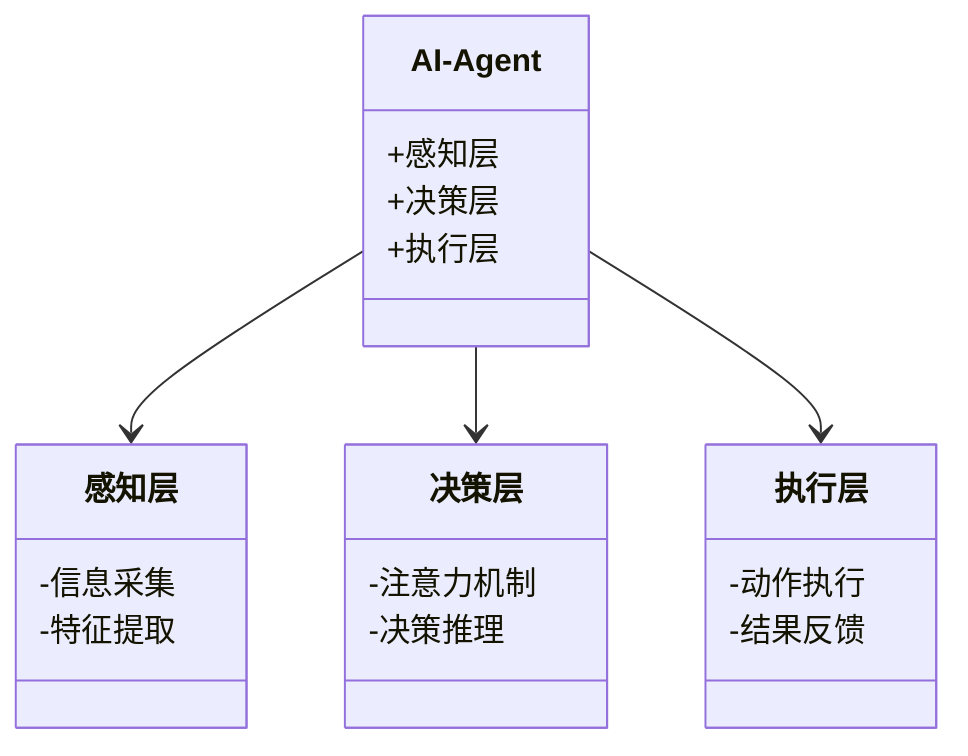
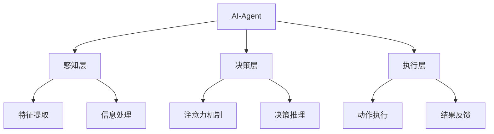
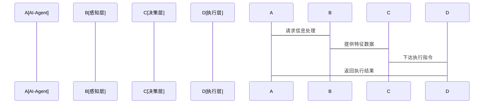

                 


# 第四部分：系统分析与架构设计

## 第4章：AI Agent系统架构与注意力机制的整合

### 4.1 系统架构概述
在AI Agent系统中，注意力机制通常被集成到信息处理的核心模块中。系统架构需要考虑以下几个关键部分：感知层、决策层和执行层。

### 4.2 系统功能设计
系统需要具备信息感知、注意力分配、决策制定和执行反馈等功能。通过Mermaid类图可以清晰展示各个模块的关系。



### 4.3 系统架构设计
系统的整体架构需要具备可扩展性和灵活性。通过Mermaid架构图可以展示系统的各个部分如何协同工作。



### 4.4 系统接口设计
系统需要定义清晰的接口规范，确保各模块之间的通信和协作。例如，感知层与决策层之间的接口需要明确数据格式和调用方式。

### 4.5 系统交互设计
通过Mermaid序列图可以展示系统在处理任务时的交互流程。



## 第5章：项目实战——基于注意力机制的智能客服系统

### 5.1 项目背景与目标
智能客服系统需要高效处理大量的用户咨询，提升用户体验。注意力机制可以帮助系统更精准地识别用户需求。

### 5.2 项目环境与工具安装
需要安装Python、TensorFlow等工具，并配置好开发环境。

### 5.3 系统核心实现
以下是基于注意力机制的智能客服系统的Python代码实现：

```python
import tensorflow as tf
from tensorflow import keras

# 定义注意力机制模型
class AttentionModel(keras.Model):
    def __init__(self, embed_dim, num_heads):
        super(AttentionModel, self).__init__()
        self.num_heads = num_heads
        self.embed_dim = embed_dim
        self.query_dense = keras.layers.Dense(embed_dim)
        self.key_dense = keras.layers.Dense(embed_dim)
        self.value_dense = keras.layers.Dense(embed_dim)
    
    def call(self, inputs, training=None):
        queries = self.query_dense(inputs)
        keys = self.key_dense(inputs)
        values = self.value_dense(inputs)
        
        # 计算注意力权重
        attention_weights = tf.nn.softmax(tf.matmul(queries, keys, transpose_b=True) / tf.sqrt(float(self.embed_dim)))
        # 加权求和
        output = tf.matmul(attention_weights, values)
        return output

# 初始化模型
model = AttentionModel(embed_dim=128, num_heads=8)
model.compile(optimizer='adam', loss='sparse_categorical_crossentropy', metrics=['accuracy'])
```

### 5.4 代码功能解读
该代码定义了一个注意力机制模型，包括查询、键和值的计算，以及注意力权重的计算和输出的生成。

### 5.5 实际案例分析
通过具体案例分析，展示系统如何应用注意力机制快速定位用户需求，提升响应效率。

## 第6章：最佳实践与小结

### 6.1 最佳实践
在实际应用中，建议根据具体场景优化注意力机制的参数，合理设计模型结构，确保系统的高效性和准确性。

### 6.2 小结
总结全书内容，强调注意力机制在提升AI Agent信息处理效率中的重要作用，同时展望未来的研究方向。

### 6.3 注意事项
提醒读者在实际应用中需要注意的事项，例如数据质量问题、模型训练效率等。

### 6.4 拓展阅读
推荐相关书籍和论文，供读者进一步深入学习。

---

# 附录：完整代码示例

## 附录A：注意力机制模型的实现代码

```python
import tensorflow as tf
from tensorflow import keras

class AttentionLayer(tf.keras.layers.Layer):
    def __init__(self, attention_dim):
        super(AttentionLayer, self).__init__()
        self.attention_dim = attention_dim
    
    def build(self, input_shape):
        self.W_q = self.add_weight(name='W_q', 
                                  shape=(input_shape[-1], self.attention_dim),
                                  initializer='glorot_uniform')
        self.W_k = self.add_weight(name='W_k', 
                                  shape=(input_shape[-1], self.attention_dim),
                                  initializer='glorot_uniform')
        self.W_v = self.add_weight(name='W_v', 
                                  shape=(input_shape[-1], self.attention_dim),
                                  initializer='glorot_uniform')
        super(AttentionLayer, self).build(input_shape)
    
    def call(self, inputs):
        query = tf.matmul(inputs, self.W_q)
        key = tf.matmul(inputs, self.W_k)
        value = tf.matmul(inputs, self.W_v)
        
        # 计算注意力权重
        attention_scores = tf.matmul(query, key, transpose_b=True)
        attention_weights = tf.nn.softmax(attention_scores / tf.sqrt(float(self.attention_dim)))
        # 加权求和
        output = tf.matmul(attention_weights, value)
        return output

# 使用自定义注意力层构建模型
model = keras.Sequential([
    keras.layers.Input(shape=(input_length, input_features)),
    AttentionLayer(attention_dim=128),
    keras.layers.Dense(num_classes, activation='softmax')
])

model.compile(optimizer='adam', loss='sparse_categorical_crossentropy', metrics=['accuracy'])
```

## 附录B：系统架构图


---

# 结束语

通过本文的详细讲解，我们深入探讨了AI Agent的注意力机制，从基础概念到算法实现，再到系统设计和项目实战，为读者提供了一个全面的学习路径。希望本文能为相关领域的研究和实践提供有价值的参考。

