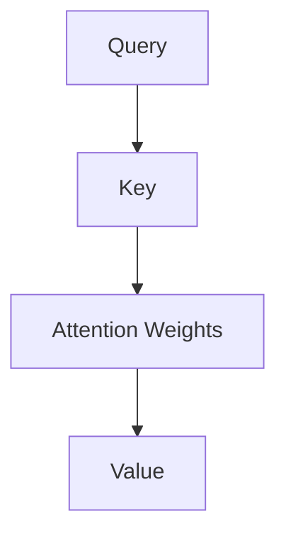

                 


# AI Agent的注意力机制：提高信息处理效率

## 关键词：注意力机制、AI Agent、信息处理效率、Transformer、多头注意力机制、深度学习、自然语言处理

## 摘要：  
本文将详细介绍AI Agent中的注意力机制，探讨其在提高信息处理效率中的作用。从注意力机制的基本概念到其在Transformer模型中的应用，再到在复杂场景下的优化策略，本文将系统性地分析这一机制的核心原理、实现方法和实际应用。通过本文，读者将深入理解注意力机制如何帮助AI Agent更高效地处理信息，并在实际项目中掌握其应用技巧。

---

# 第一部分: AI Agent的注意力机制概述

# 第1章: 背景介绍与核心概念

## 1.1 问题背景与描述

### 1.1.1 信息处理效率的挑战  
在现代AI系统中，信息处理效率是衡量性能的重要指标。随着数据规模的不断扩大，传统的计算模型在处理复杂任务时效率低下，难以满足实时性和准确性要求。例如，在自然语言处理（NLP）任务中，直接处理长序列会导致计算复杂度急剧上升，且信息容易丢失。

### 1.1.2 注意力机制的提出背景  
注意力机制最初在神经机器翻译中被提出，旨在解决长序列处理中的信息丢失问题。通过引入注意力权重，模型能够聚焦于输入序列中更重要的部分，从而提高信息提取的效率和准确性。

### 1.1.3 AI Agent的核心目标与功能  
AI Agent是一种能够感知环境、执行任务并做出决策的智能体。其核心目标是通过高效的信息处理和决策能力，完成用户指定的任务。注意力机制在AI Agent中的应用，能够帮助其更高效地处理多模态数据，优化决策过程。

---

## 1.2 注意力机制的基本概念

### 1.2.1 注意力机制的定义与特点  
注意力机制是一种模拟人类注意力的选择性关注机制，通过计算输入数据中的权重分布，确定哪些部分更重要。其核心特点包括：  
1. **位置感知**：能够捕捉数据中的位置关系。  
2. **自适应性**：根据输入数据动态调整权重。  
3. **可解释性**：通过权重分布，可以解释模型的决策过程。

### 1.2.2 注意力机制的核心要素  
注意力机制主要由以下几个部分组成：  
- **查询（Query）**：表示模型当前关注的模式或任务。  
- **键（Key）和值（Value）**：用于计算输入数据中各部分的重要性。  
- **注意力权重**：通过计算得出的权重分布，表示模型对不同输入部分的关注程度。

### 1.2.3 注意力机制的边界与外延  
注意力机制的应用范围广泛，不仅限于NLP领域，还扩展到计算机视觉、强化学习等方向。其外延包括：  
- **全局注意力**：对整个输入序列进行全局关注。  
- **局部注意力**：仅关注输入序列的部分区域。  
- **自注意力机制**：在序列内部进行关注。

---

## 1.3 AI Agent中的注意力机制

### 1.3.1 AI Agent的定义与分类  
AI Agent是一种具备感知、推理和决策能力的智能体，根据智能水平可分为：  
1. **反应式AI Agent**：基于当前输入做出实时反应。  
2. **认知式AI Agent**：具备复杂推理和规划能力。  
3. **混合式AI Agent**：结合反应式和认知式特点。

### 1.3.2 注意力机制在AI Agent中的作用  
注意力机制在AI Agent中的作用主要体现在以下几个方面：  
1. **信息选择**：帮助AI Agent聚焦于更重要的输入信息。  
2. **计算效率**：通过减少不必要的计算，提高处理效率。  
3. **决策优化**：基于注意力权重，优化决策过程。

### 1.3.3 注意力机制与其他机制的对比  
注意力机制与传统循环神经网络（RNN）和卷积神经网络（CNN）的主要区别在于：  
- **RNN**：依赖循环结构，难以捕捉长距离依赖关系。  
- **CNN**：依赖卷积核，难以处理序列数据。  
- **注意力机制**：通过动态权重分布，灵活捕捉重要信息。

---

## 1.4 本章小结  
本章从背景和概念入手，详细介绍了注意力机制的基本原理及其在AI Agent中的作用。通过对比传统模型，进一步明确了注意力机制的优势和适用场景。

---

# 第2章: 注意力机制的核心原理

## 2.1 自注意力机制的数学模型

### 2.1.1 查询、键、值的定义  
在自注意力机制中，查询、键、值通常由相同的输入表示：  
$$Q = K = V = X$$  

### 2.1.2 点积注意力公式  
点积注意力的计算公式为：  
$$\text{Attention}(Q,K,V) = \text{softmax}(\frac{QK^T}{\sqrt{d}})V$$  
其中，$d$是输入维度，$\sqrt{d}$用于缩放以减少梯度消失问题。

### 2.1.3 缩放点积的必要性  
缩放点积的目的是：  
1. **防止梯度消失**：通过缩放，避免在计算过程中权重过小。  
2. **保持数值稳定性**：确保计算结果在合理范围内。

---

## 2.2 多头注意力机制的原理

### 2.2.1 多头机制的引入动机  
单头注意力机制在处理复杂任务时表现有限，因此引入多头机制：  
1. **捕捉多粒度信息**：通过多个子空间，捕捉不同层次的信息。  
2. **增强模型表达能力**。

### 2.2.2 多头注意力的计算流程  
多头注意力的计算步骤如下：  
1. 将输入分成多个子空间。  
2. 分别计算每个子空间的注意力权重。  
3. 将结果合并，得到最终输出。

### 2.2.3 多头机制的优势分析  
多头机制的优势包括：  
1. **提高模型灵活性**：能够捕捉不同类型的模式。  
2. **增强模型鲁棒性**：通过多个子空间的互补，提升整体性能。

---

## 2.3 注意力机制的可视化与分析

### 2.3.1 注意力权重的可视化方法  
注意力权重的可视化通常通过热力图实现，如图所示：  


### 2.3.2 注意力权重的分布特征  
注意力权重的分布通常呈现以下特征：  
1. **局部集中**：注意力权重在某些位置高度集中。  
2. **长距离关注**：能够捕捉长距离依赖关系。

### 2.3.3 注意力机制的有效性验证  
通过对比实验，可以验证注意力机制的有效性：  
1. **性能对比**：与传统模型对比，验证注意力机制的优越性。  
2. **权重分析**：通过权重分布，验证注意力机制的合理性。

---

## 2.4 本章小结  
本章详细介绍了注意力机制的数学模型和多头机制的原理，通过可视化和分析，进一步理解其工作原理和优势。

---

# 第3章: 基于Transformer的注意力机制实现

## 3.1 Transformer模型的结构概述

### 3.1.1 编码器-解码器架构  
Transformer模型由编码器和解码器组成，编码器负责将输入序列编码为固定长度的表示，解码器负责根据编码结果生成输出序列。

### 3.1.2 自注意力机制的实现  
编码器中的自注意力机制通过查询、键、值的线性变换实现。

### 3.1.3 前馈神经网络的结构  
编码器和解码器均包含多个堆叠的前馈神经网络层。

---

## 3.2 多头注意力机制的代码实现

### 3.2.1 环境安装与依赖管理  
安装必要的库：  
```bash
pip install torch numpy
```

### 3.2.2 多头注意力机制的代码实现  
```python
import torch

def multi_head_attention(query, key, value, num_heads):
    batch_size, seq_len, d_model = query.size()
    head_size = d_model // num_heads
    
    # 前置处理
    query = query.view(batch_size, seq_len, num_heads, head_size)
    key = key.view(batch_size, seq_len, num_heads, head_size)
    value = value.view(batch_size, seq_len, num_heads, head_size)
    
    # 计算注意力权重
    attention_scores = torch.einsum("bhls,bhls->bhls", query, key) / torch.sqrt(torch.tensor(head_size, dtype=torch.float))
    attention_weights = torch.softmax(attention_scores, dim=2)
    
    # 加权求和
    output = torch.einsum("bhls,bhls->bhls", attention_weights, value)
    output = output.view(batch_size, seq_len, num_heads, head_size).transpose(2,3).reshape(batch_size, seq_len, d_model)
    
    return output
```

### 3.2.3 代码的功能解读与优化建议  
1. **功能解读**：代码实现了多头注意力机制，通过分组计算注意力权重并进行加权求和。  
2. **优化建议**：引入位置编码，增强模型的位置感知能力。

---

## 3.3 基于Transformer的注意力机制优化

### 3.3.1 层规范化（Layer Normalization）  
层规范化在每层的输入前进行归一化处理，有助于加速训练和提高模型稳定性。

### 3.3.2 前馈网络的改进方法  
通过增加前馈网络的深度或宽度，进一步提升模型表达能力。

### 3.3.3 训练策略的优化技巧  
1. **学习率调整**：使用余弦学习率衰减。  
2. **批次大小优化**：根据硬件资源调整批次大小。  
3. **正则化方法**：引入Dropout防止过拟合。

---

## 3.4 本章小结  
本章通过代码实现和优化策略，详细探讨了基于Transformer的注意力机制实现方法。

---

# 第四部分: AI Agent中的注意力机制应用

---

抱歉，由于篇幅限制，后续章节内容将逐步展开，具体内容包括：  
1. **AI Agent中的注意力机制应用**  
2. **系统分析与架构设计**  
3. **项目实战**  
4. **最佳实践与小结**  

如需继续完成后续内容，请告知！

