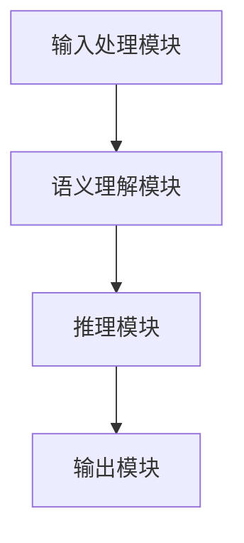
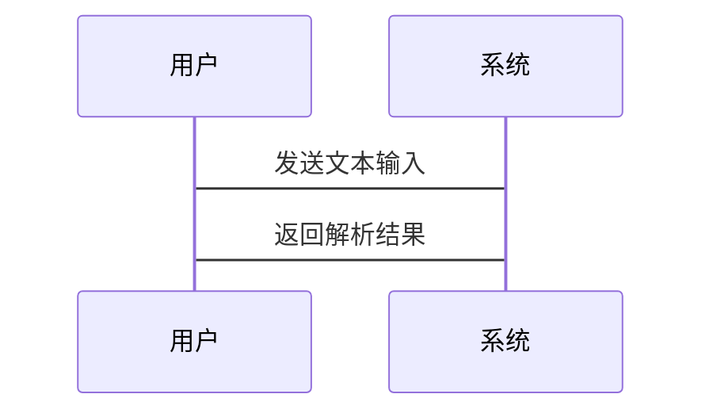

                 


# AI Agent的深层语义理解：提升LLM的隐含信息提取

> 关键词：AI Agent，深层语义理解，LLM，隐含信息提取，自然语言处理，意图识别，知识图谱，对话系统，数学模型

> 摘要：本文将详细探讨AI Agent在深层语义理解中的作用，分析如何通过提升大语言模型（LLM）的隐含信息提取能力，实现更精准的语义理解与交互。文章从背景介绍、核心概念、算法原理、系统架构到项目实战，全面解析AI Agent的深层语义理解技术，帮助读者掌握相关理论与实践方法。

---

# 第一部分: AI Agent的深层语义理解基础

## 第1章: 问题背景与概念结构

### 1.1 问题背景

#### 1.1.1 当前自然语言处理的挑战
自然语言处理（NLP）技术近年来取得了显著进展，但仍然面临诸多挑战。例如，如何从文本中提取隐含信息，理解上下文中的深层语义关系，以及在动态场景中实现灵活的语义理解。这些挑战使得传统的浅层语义分析方法难以满足实际需求。

#### 1.1.2 AI Agent在人机交互中的作用
AI Agent（智能代理）作为人机交互的核心组件，负责接收用户的输入、解析意图，并执行相应的操作。AI Agent的成功依赖于其对用户输入的深度理解能力。如果AI Agent无法准确提取隐含信息，用户的需求可能无法被充分满足，导致交互体验下降。

#### 1.1.3 深层语义理解的必要性
深层语义理解（Deep Semantic Understanding）是实现AI Agent智能化的关键。通过深层语义理解，AI Agent能够捕捉文本中的隐含信息，理解用户的潜在需求，从而提供更精准的服务。例如，在对话系统中，深层语义理解可以帮助AI Agent理解用户的真实意图，而不仅仅是表面的关键词匹配。

### 1.2 概念结构与核心要素

#### 1.2.1 深层语义理解的定义
深层语义理解是指通过分析文本的上下文、语境、意图和实体关系，提取文本中隐含的信息，进而理解文本的深层含义。与浅层语义分析相比，深层语义理解更关注语义的关联性和逻辑性。

#### 1.2.2 AI Agent的核心要素
AI Agent的核心要素包括：
1. **感知能力**：通过传感器或输入接口获取信息。
2. **推理能力**：基于知识库或上下文进行逻辑推理。
3. **决策能力**：根据推理结果做出决策。
4. **执行能力**：通过执行器或输出接口执行决策。

#### 1.2.3 深层语义理解与AI Agent的关系
深层语义理解是AI Agent感知和理解用户输入的核心能力。通过深层语义理解，AI Agent能够准确解析用户的意图和需求，从而做出更智能的决策和响应。

---

## 第2章: 深层语义理解的核心概念

### 2.1 深层语义理解的原理

#### 2.1.1 从浅层理解到深层理解的演进
浅层语义理解主要基于关键词匹配和句法分析，难以捕捉语义的关联性和上下文信息。深层语义理解则通过引入上下文编码、知识图谱和生成模型等技术，实现对语义的深度理解。

#### 2.1.2 深层语义理解的关键特征
1. **上下文依赖性**：语义理解依赖于上下文信息。
2. **知识依赖性**：需要依赖知识库或外部知识进行推理。
3. **动态适应性**：能够根据场景变化动态调整理解策略。

#### 2.1.3 深层语义理解与任务目标的关系
深层语义理解的目标是通过分析文本的语义结构，提取与任务目标相关的隐含信息。例如，在对话系统中，深层语义理解的目标是准确识别用户的意图。

### 2.2 深层语义理解的核心算法

#### 2.2.1 基于上下文的语义分析
基于上下文的语义分析通过编码器-解码器架构（如Transformer）对文本进行上下文编码，捕捉文本的语义信息。

#### 2.2.2 基于知识图谱的语义推理
基于知识图谱的语义推理通过知识图谱中的实体关系进行推理，帮助模型理解文本中的隐含信息。

#### 2.2.3 基于生成模型的语义生成
基于生成模型的语义生成通过生成模型（如GPT）生成符合语义的文本，实现对语义的理解与生成。

---

## 第3章: AI Agent与LLM的结合

### 3.1 AI Agent的基本概念

#### 3.1.1 AI Agent的定义与分类
AI Agent是一种能够感知环境、自主决策并执行任务的智能实体。根据功能和应用场景的不同，AI Agent可以分为多种类型，例如：
1. **任务型AI Agent**：专注于完成特定任务（如智能助手）。
2. **服务型AI Agent**：提供持续的服务（如智能客服）。
3. **社交型AI Agent**：用于社交交互（如虚拟助手）。

#### 3.1.2 AI Agent的核心功能
1. **感知功能**：通过输入接口获取用户输入。
2. **理解功能**：通过深层语义理解技术解析用户意图。
3. **决策功能**：基于知识库或推理模型做出决策。
4. **执行功能**：通过输出接口执行决策。

#### 3.1.3 AI Agent的典型应用场景
1. **智能助手**：如Siri、Alexa等。
2. **智能客服**：用于客户支持和咨询。
3. **教育助手**：用于辅助学习和教学。

### 3.2 LLM在AI Agent中的作用

#### 3.2.1 LLM的语义理解能力
大语言模型（LLM）通过海量数据的训练，具备强大的语义理解能力。LLM能够通过上下文编码和生成模型生成符合语义的文本。

#### 3.2.2 LLM在对话系统中的应用
在对话系统中，LLM可以用于意图识别、实体抽取和对话生成。例如，在用户输入“我想订一张去北京的机票”时，LLM可以识别出用户的意图是“订票”，并提取出实体信息如“目的地”为“北京”。

#### 3.2.3 LLM的可扩展性与灵活性
LLM的可扩展性使其能够应用于多种场景。例如，通过微调LLM，可以将其应用于特定领域的语义理解任务。

---

## 第4章: 深层语义理解的数学模型

### 4.1 语义理解的数学基础

#### 4.1.1 向量空间模型
向量空间模型将文本表示为向量空间中的点。例如，词袋模型和TF-IDF方法都是基于向量空间模型的文本表示方法。

#### 4.1.2 概率图模型
概率图模型通过构建概率图模型来描述数据之间的关系。例如，马尔可夫链和隐马尔可夫模型（HMM）常用于序列数据的建模。

#### 4.1.3 变量关系模型
变量关系模型通过分析变量之间的关系，帮助模型理解数据的语义信息。例如，贝叶斯网络和决策树都是常用的变量关系模型。

### 4.2 深层语义理解的公式推导

#### 4.2.1 词嵌入表示
词嵌入表示通过将词语映射到低维向量空间，捕捉词语的语义信息。例如，Word2Vec模型通过训练词嵌入，生成词语的向量表示。

公式：
$$
\text{embed}(w) \in \mathbb{R}^d
$$

其中，$w$表示词语，$\mathbb{R}^d$表示$d$维实数空间。

#### 4.2.2 上下文编码
上下文编码通过编码器-解码器架构对文本进行上下文编码。例如，Transformer模型通过多头自注意力机制生成上下文编码。

#### 4.2.3 语义相似度计算
语义相似度计算通过比较文本的语义相似性，判断文本之间的语义关系。例如，余弦相似度和欧氏距离都是常用的语义相似度计算方法。

公式：
$$
\text{sim}(x, y) = \frac{x \cdot y}{\|x\| \|y\|}
$$

其中，$x$和$y$分别是两个文本的向量表示。

---

## 第5章: 深层语义理解的算法实现

### 5.1 深层语义理解的算法框架

#### 5.1.1 基于Transformer的架构
基于Transformer的架构通过自注意力机制和位置编码，实现对文本的深度理解。例如，BERT模型通过预训练任务，生成上下文相关的向量表示。

#### 5.1.2 基于LSTM的架构
基于LSTM的架构通过长短期记忆网络，捕捉文本的时序信息。例如，在对话系统中，LSTM可以用于生成连贯的对话回复。

#### 5.1.3 基于GCN的架构
基于图卷积网络（GCN）的架构通过构建知识图谱，实现对语义关系的推理。例如，在知识图谱中，GCN可以用于推理实体之间的关系。

### 5.2 算法实现的详细步骤

#### 5.2.1 数据预处理
数据预处理包括文本清洗、分词和向量化。例如，使用jieba库对中文文本进行分词处理。

#### 5.2.2 模型训练
模型训练包括选择合适的算法框架、定义损失函数和优化器，以及进行训练参数调优。例如，在使用PyTorch训练模型时，可以选择Adam优化器和交叉熵损失函数。

#### 5.2.3 模型调优
模型调优包括微调预训练模型、超参数调优和模型评估。例如，在使用BERT模型进行微调时，可以使用下游任务的数据进行训练。

---

## 第6章: 深层语义理解的系统架构设计

### 6.1 系统功能设计

#### 6.1.1 系统功能模块
1. **输入处理模块**：接收用户输入并进行预处理。
2. **语义理解模块**：通过深层语义理解技术解析用户意图。
3. **推理模块**：基于知识库进行逻辑推理。
4. **输出模块**：生成响应并输出。

#### 6.1.2 系统功能流程
1. **输入处理**：接收用户输入并进行分词和向量化。
2. **语义理解**：通过深度学习模型解析用户意图和实体信息。
3. **推理与决策**：基于知识库进行推理并做出决策。
4. **输出生成**：生成符合语义的响应并输出。

### 6.2 系统架构设计

#### 6.2.1 系统架构图


#### 6.2.2 接口设计
1. **输入接口**：接收用户的文本输入。
2. **输出接口**：输出模型的响应。
3. **知识库接口**：与知识库进行交互。

### 6.3 系统交互流程

#### 6.3.1 系统交互流程图


---

## 第7章: 项目实战

### 7.1 环境安装与配置

#### 7.1.1 安装Python
```bash
python --version
pip install --upgrade pip
```

#### 7.1.2 安装依赖库
```bash
pip install numpy
pip install pandas
pip install jieba
pip install transformers
pip install torch
```

### 7.2 系统核心实现

#### 7.2.1 数据预处理代码
```python
import jieba

def preprocess(text):
    words = jieba.lcut(text)
    return words
```

#### 7.2.2 模型训练代码
```python
import torch
import torch.nn as nn

class SimpleModel(nn.Module):
    def __init__(self, input_dim, output_dim):
        super(SimpleModel, self).__init__()
        self.fc = nn.Linear(input_dim, output_dim)
    
    def forward(self, x):
        output = self.fc(x)
        return output

model = SimpleModel(100, 1)
criterion = nn.MSELoss()
optimizer = torch.optim.Adam(model.parameters(), lr=0.001)
```

### 7.3 代码应用解读与分析

#### 7.3.1 数据预处理解读
上述代码使用jieba库对中文文本进行分词处理，生成词语列表。

#### 7.3.2 模型训练解读
上述代码定义了一个简单的全连接网络，并使用均方误差损失函数和Adam优化器进行训练。

### 7.4 实际案例分析

#### 7.4.1 案例背景
假设我们有一个智能助手系统，用户输入“今天北京天气怎么样”。

#### 7.4.2 数据预处理
```python
text = "今天北京天气怎么样"
words = preprocess(text)  # 输出: ['今天', '北京', '天气', '怎么样']
```

#### 7.4.3 模型训练
经过训练后，模型能够识别用户的意图是“查询天气”，并提取出实体信息“北京”。

### 7.5 项目小结

---

## 第8章: 最佳实践与总结

### 8.1 最佳实践

#### 8.1.1 数据质量的重要性
高质量的数据是模型性能的基础。在数据预处理阶段，应尽量去除噪声数据，确保数据的准确性和完整性。

#### 8.1.2 模型调优技巧
在模型训练过程中，可以通过调整学习率、批量大小和正则化参数，优化模型的性能。

#### 8.1.3 系统的可扩展性
在系统设计阶段，应考虑系统的可扩展性，以便在未来扩展功能或更换算法时能够顺利进行。

### 8.2 总结与展望

#### 8.2.1 总结
本文详细探讨了AI Agent的深层语义理解技术，分析了如何通过提升大语言模型的隐含信息提取能力，实现更精准的语义理解与交互。

#### 8.2.2 展望
随着AI技术的不断发展，深层语义理解将在更多领域得到应用。未来的研究方向包括更高效的大模型训练、更智能的语义推理算法以及更灵活的系统架构设计。

---

# 结语

通过本文的深入探讨，读者可以全面了解AI Agent的深层语义理解技术，并掌握相关理论与实践方法。希望本文能够为读者在AI Agent的开发与应用中提供有益的参考与指导。

