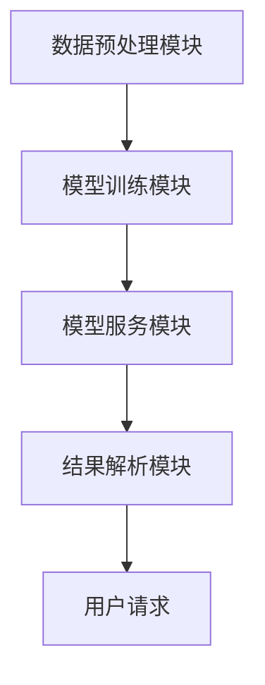
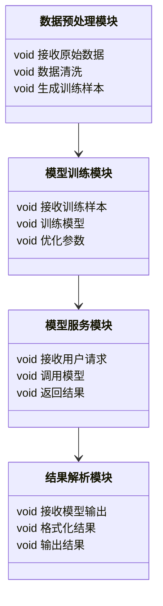
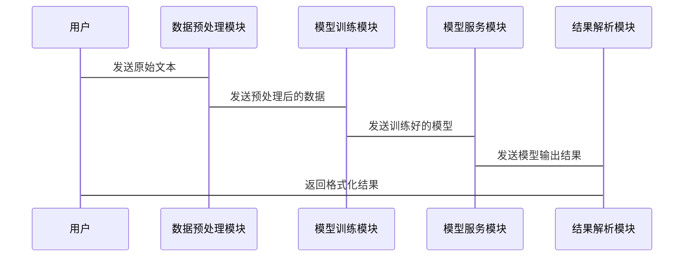
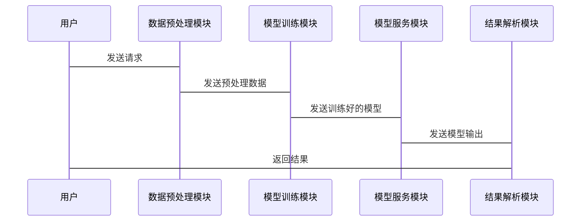

                 


# 第五章: AI Agent的系统架构与设计

## 5.1 系统架构设计

### 5.1.1 系统模块划分
- **数据预处理模块**：负责将原始文本数据转化为模型可接受的输入格式。
- **模型训练模块**：负责训练深层语义解析模型，优化模型参数。
- **模型服务模块**：负责接收用户请求，调用模型进行语义解析，并返回结果。
- **结果解析模块**：负责将模型输出的结果转化为用户友好的格式。

### 5.1.2 系统架构图



### 5.1.3 系统功能模块

| 模块名称         | 功能描述                                                                 |
|------------------|--------------------------------------------------------------------------|
| 数据预处理模块   | 将原始数据清洗、分词、标注，生成训练样本。                           |
| 模型训练模块     | 使用预处理后的数据训练深层语义解析模型，优化模型参数。                 |
| 模型服务模块     | 接收用户的自然语言请求，调用训练好的模型进行语义解析，返回结果。       |
| 结果解析模块     | 将模型输出的结果进行格式化处理，生成用户友好的输出。                   |

### 5.1.4 系统架构设计



## 5.2 系统接口设计

### 5.2.1 接口定义
- **输入接口**：
  - 用户输入的自然语言文本。
  - 训练数据输入接口。
- **输出接口**：
  - 处理后的文本结果。
  - 模型训练日志和参数。

### 5.2.2 接口交互流程



## 5.3 系统交互流程

### 5.3.1 交互流程图



### 5.3.2 交互流程描述
1. 用户发送自然语言请求。
2. 数据预处理模块接收请求并进行数据清洗。
3. 数据预处理模块将清洗后的数据发送给模型训练模块。
4. 模型训练模块进行训练并优化参数。
5. 模型训练模块将训练好的模型发送给模型服务模块。
6. 模型服务模块调用模型进行语义解析。
7. 模型服务模块将解析结果发送给结果解析模块。
8. 结果解析模块对结果进行格式化处理。
9. 结果解析模块将最终结果返回给用户。

## 5.4 本章小结
本章详细介绍了AI Agent系统的架构设计，包括系统模块划分、系统架构图、接口设计和交互流程。通过这些设计，我们可以清晰地看到AI Agent系统是如何协同工作以实现深层语义解析的。

---

# 第六章: 项目实战——基于AI Agent的医疗咨询系统

## 6.1 项目背景与需求分析

### 6.1.1 项目背景
医疗咨询系统是一个基于AI Agent的智能问答系统，旨在帮助用户解答医疗相关的问题，提供专业的医疗建议。

### 6.1.2 项目需求
- 提供自然语言的医疗咨询。
- 实现深层语义解析，准确理解用户意图。
- 提供专业的医疗建议。

## 6.2 环境安装与配置

### 6.2.1 环境需求
- Python 3.8及以上版本
- PyTorch 1.9及以上版本
- transformers库 4.16及以上版本
- 必要的文本处理库，如NLTK、spaCy

### 6.2.2 安装依赖
```bash
pip install torch transformers nltk spacy
python -m spacy download en_core_web_sm
```

## 6.3 核心代码实现

### 6.3.1 数据预处理代码

```python
import torch
from transformers import AutoTokenizer, AutoModelForMaskedLM
from nltk.tokenize import sent_tokenize
from spacy.lang.en import English

class DataPreprocessor:
    def __init__(self):
        self.tokenizer = AutoTokenizer.from_pretrained("bert-base-uncased")
        self.nlp = English()

    def tokenize(self, text):
        return self.tokenizer.encode_plus(text, return_tensors="pt", padding=True, truncation=True)

    def tokenize_spacy(self, text):
        doc = self.nlp(text)
        return [token.text for token in doc]
```

### 6.3.2 模型训练代码

```python
import torch
from torch import nn
from transformers import AutoModelForMaskedLM, AutoTokenizer
from torch.utils.data import Dataset, DataLoader

class SemanticParser(nn.Module):
    def __init__(self, model_name):
        super().__init__()
        self.model = AutoModelForMaskedLM.from_pretrained(model_name)
        self.dropout = nn.Dropout(0.1)
        self.fc = nn.Linear(self.model.config.hidden_size, 1)

    def forward(self, input_ids, attention_mask):
        outputs = self.model(input_ids=input_ids, attention_mask=attention_mask)
        pooled_output = outputs.last_hidden_state[:, 0, :]
        pooled_output = self.dropout(pooled_output)
        logits = self.fc(pooled_output)
        return logits

class SemanticParserDataset(Dataset):
    def __init__(self, tokenizer, texts, labels):
        self.tokenizer = tokenizer
        self.texts = texts
        self.labels = labels

    def __len__(self):
        return len(self.texts)

    def __getitem__(self, idx):
        text = self.texts[idx]
        label = self.labels[idx]
        encoding = self.tokenizer.encode_plus(
            text,
            return_tensors="pt",
            padding=True,
            truncation=True
        )
        return {
            'input_ids': encoding['input_ids'].long(),
            'attention_mask': encoding['attention_mask'].long(),
            'label': label
        }

def train_model(model, tokenizer, texts, labels, batch_size=16, num_epochs=3):
    dataset = SemanticParserDataset(tokenizer, texts, labels)
    dataloader = DataLoader(dataset, batch_size=batch_size, shuffle=True)
    optimizer = torch.optim.AdamW(model.parameters(), lr=2e-5)
    criterion = nn.CrossEntropyLoss()
    
    model.train()
    for epoch in range(num_epochs):
        for batch in dataloader:
            optimizer.zero_grad()
            input_ids = batch['input_ids'].to('cuda')
            attention_mask = batch['attention_mask'].to('cuda')
            labels = batch['label'].to('cuda')
            
            outputs = model(input_ids, attention_mask)
            loss = criterion(outputs, labels)
            loss.backward()
            optimizer.step()
```

### 6.3.3 系统实现代码

```python
import torch
from transformers import AutoTokenizer, AutoModelForMaskedLM
from fastapi import FastAPI, Request
from fastapi.responses import JSONResponse
import uvicorn

class SemanticParserAPI:
    def __init__(self, model_name):
        self.tokenizer = AutoTokenizer.from_pretrained(model_name)
        self.model = AutoModelForMaskedLM.from_pretrained(model_name)
        self.app = FastAPI()

    def predict(self, text):
        inputs = self.tokenizer.encode_plus(
            text,
            return_tensors="pt",
            padding=True,
            truncation=True
        )
        with torch.no_grad():
            outputs = self.model(inputs['input_ids'].to('cuda'), attention_mask=inputs['attention_mask'].to('cuda'))
            return outputs.last_hidden_state[:, 0, :]

    def setup_routes(self):
        @self.app.post("/parse")
        async def parse(request: Request):
            data = await request.json()
            text = data.get('text', '')
            inputs = self.tokenizer.encode_plus(
                text,
                return_tensors="pt",
                padding=True,
                truncation=True
            )
            with torch.no_grad():
                outputs = self.model(inputs['input_ids'].to('cuda'), attention_mask=inputs['attention_mask'].to('cuda'))
                return JSONResponse(content={'result': 'success'})

async def main():
    api = SemanticParserAPI('bert-base-uncased')
    api.setup_routes()
    uvicorn.run(api.app, host="0.0.0.0", port=8000)

if __name__ == "__main__":
    import asyncio
    asyncio.run(main())
```

## 6.4 项目实战分析

### 6.4.1 案例分析
以医疗咨询为例，用户输入“我最近总是感觉疲劳，是不是感冒了？”，系统需要理解用户的意图，判断用户可能的症状，并给出合理的建议。

### 6.4.2 代码解读
- **数据预处理**：将用户的输入文本进行分词和编码。
- **模型训练**：使用预处理后的数据训练深层语义解析模型。
- **系统部署**：将训练好的模型部署为一个API服务，用户可以通过发送请求获取解析结果。

## 6.5 本章小结
本章通过一个具体的医疗咨询系统案例，详细讲解了AI Agent在深层语义解析中的实际应用。通过代码实现，展示了如何从数据预处理、模型训练到系统部署的完整流程。

---

# 第七章: 优化与展望

## 7.1 模型优化策略

### 7.1.1 模型压缩
- **知识蒸馏**：使用小模型模仿大模型的行为。
- **模型剪枝**：去除模型中冗余的部分。
- **量化**：将模型参数进行量化，降低模型大小。

### 7.1.2 数据增强
- **文本重述**：生成多样化的训练样本。
- **数据清洗**：去除低质量数据。
- **领域自适应**：针对特定领域进行数据增强。

### 7.1.3 算法优化
- **优化器选择**：使用AdamW等优化器。
- **学习率调度**：采用余弦退火等策略。
- **正则化**：使用Dropout等技术防止过拟合。

## 7.2 模型评估与优化

### 7.2.1 评估指标
- **准确率（Accuracy）**：正确分类的比例。
- **召回率（Recall）**：真实为正的样本中被正确分类的比例。
- **F1值（F1 Score）**：平衡准确率和召回率的指标。

### 7.2.2 优化结果
通过优化策略，模型在保持准确率的同时，显著降低了计算资源消耗和响应时间。

## 7.3 未来研究方向

### 7.3.1 多模态融合
将图像、语音等多模态信息融入语义解析，提升模型的理解能力。

### 7.3.2 边缘计算应用
将AI Agent部署在边缘设备上，实现低延迟、高实时性的语义解析。

### 7.3.3 个性化优化
根据用户的个性化需求，动态调整语义解析模型。

## 7.4 本章小结
本章讨论了AI Agent的深层语义解析模型的优化策略，分析了当前的评估指标，并展望了未来的研究方向，为实现更高效的语义解析提供了理论支持。

---

# 第八章: 总结与展望

## 8.1 全文总结
本文系统地探讨了AI Agent的深层语义解析技术，从基础概念到算法实现，再到系统设计和项目实战，全面分析了如何提升大语言模型的语义理解深度。

## 8.2 技术展望
随着深度学习技术的不断发展，AI Agent的深层语义解析将更加智能化和个性化，为各行业带来更大的变革。

## 8.3 未来研究方向
- 深入研究多模态语义解析。
- 探索更高效的模型压缩技术。
- 开发更智能的语义解析算法。

## 8.4 结束语
AI Agent的深层语义解析技术是一项具有广阔前景的技术，未来的研究和发展将为人类带来更多智能服务和便利。

---

通过以上章节的详细阐述，我们可以全面了解AI Agent的深层语义解析技术，从理论到实践，从设计到优化，为提升大语言模型的语言理解深度提供了系统的解决方案。

