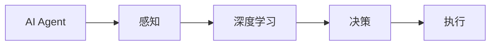

                 


# AI Agent的深度学习技术应用

> 关键词：AI Agent, 深度学习, 人工智能, 技术应用, 算法原理, 系统设计

> 摘要：本文深入探讨了AI Agent在深度学习技术中的应用，从基本概念到算法原理，再到系统设计和项目实战，全面分析了深度学习在AI Agent中的作用和实现方法。

---

## 第一部分：AI Agent的背景与基础

### 第1章：AI Agent的基本概念

#### 1.1 AI Agent的定义与特点

- **1.1.1 什么是AI Agent**
  AI Agent（人工智能代理）是指能够感知环境、自主决策并执行任务的智能实体。它可以是一个软件程序，也可以是一个物理设备，具备自主性、反应性和目标导向性。

- **1.1.2 AI Agent的核心特点**
  - **自主性**：能够在没有外部干预的情况下自主运行。
  - **反应性**：能够实时感知环境并做出响应。
  - **目标导向性**：基于目标进行决策和行动。
  - **学习能力**：通过经验或数据优化自身行为。

- **1.1.3 AI Agent的应用场景**
  - 智能客服：提供24/7的客户支持。
  - 自动驾驶：处理复杂的交通环境。
  - 智能推荐系统：根据用户行为推荐内容。

#### 1.2 深度学习与AI Agent的关系

- **1.2.1 深度学习在AI Agent中的作用**
  深度学习为AI Agent提供了强大的感知和决策能力，尤其是在处理复杂和不确定的环境中表现突出。

- **1.2.2 深度学习与传统AI Agent的区别**
  - 传统AI Agent：基于规则或逻辑推理，适用于结构化任务。
  - 深度学习AI Agent：通过数据驱动，能够处理非结构化和复杂任务。

- **1.2.3 深度学习如何提升AI Agent的智能性**
  深度学习通过神经网络结构模拟人脑，能够从大量数据中学习特征，从而实现更复杂的感知和决策。

---

## 第二部分：AI Agent的核心概念与联系

### 第2章：AI Agent的组成与功能

#### 2.1 AI Agent的组成结构

- **2.1.1 知识库**
  - 包含AI Agent所需的所有信息和知识，如规则库、经验库等。
  - 用于辅助决策和推理。

- **2.1.2 感知模块**
  - 负责从环境中获取信息，如传感器数据、用户输入等。
  - 常见的感知方式包括图像识别、语音识别和自然语言处理。

- **2.1.3 决策模块**
  - 基于感知的信息和知识库，制定行动策略。
  - 使用深度学习模型进行预测和优化。

- **2.1.4 执行模块**
  - 根据决策模块的指令执行实际操作。
  - 可以是软件操作（如发送邮件）或物理操作（如移动机器人）。

#### 2.2 AI Agent的功能分析

- **2.2.1 感知环境**
  - 通过传感器或数据接口获取环境信息。
  - 示例：自动驾驶汽车通过摄像头和雷达感知交通状况。

- **2.2.2 分析问题**
  - 将感知到的信息转化为问题，并进行分析和推理。
  - 示例：智能音箱通过语音识别理解用户的指令。

- **2.2.3 制定策略**
  - 根据分析结果，制定最优的行动策略。
  - 示例：推荐系统根据用户行为预测推荐内容。

- **2.2.4 执行动作**
  - 根据策略执行实际操作。
  - 示例：智能助手根据用户的日程安排自动发送提醒。

### 第3章：AI Agent与深度学习的结合

#### 3.1 深度学习在AI Agent中的应用

- **3.1.1 神经网络在感知中的应用**
  - 使用卷积神经网络（CNN）进行图像识别。
  - 使用循环神经网络（RNN）进行时间序列分析。

- **3.1.2 深度学习在决策中的应用**
  - 使用深度强化学习（DRL）进行策略优化。
  - 示例：在游戏《星际争霸》中，AI Agent通过深度强化学习掌握高级策略。

- **3.1.3 深度学习在优化中的应用**
  - 使用自动微分技术优化神经网络参数。
  - 示例：在自然语言处理中，使用Transformer架构优化文本生成。

#### 3.2 AI Agent与深度学习的关系图



---

## 第三部分：深度学习技术在AI Agent中的算法原理

### 第4章：深度学习算法基础

#### 4.1 常见的深度学习算法

- **4.1.1 卷积神经网络（CNN）**
  - 用于图像识别和分类。
  - 示例：使用CNN识别图像中的物体。

- **4.1.2 循环神经网络（RNN）**
  - 用于时间序列数据的处理。
  - 示例：使用RNN进行语音识别和机器翻译。

- **4.1.3 Transformer架构**
  - 用于自然语言处理任务。
  - 示例：使用Transformer进行文本生成和翻译。

#### 4.2 深度学习算法的数学模型

- **4.2.1 神经网络的数学表示**
  $$ y = f(Wx + b) $$
  其中，\( W \) 是权重矩阵，\( x \) 是输入向量，\( b \) 是偏置项，\( f \) 是激活函数。

- **4.2.2 损失函数的计算**
  $$ L = \frac{1}{n}\sum_{i=1}^{n}(y_i - \hat{y_i})^2 $$
  其中，\( y_i \) 是真实值，\( \hat{y_i} \) 是预测值，\( n \) 是样本数量。

### 第5章：深度学习算法在AI Agent中的应用

#### 5.1 感知模块的深度学习实现

- **5.1.1 图像识别中的深度学习应用**
  - 使用CNN进行图像分类，如识别道路上的交通标志。

- **5.1.2 自然语言处理中的深度学习应用**
  - 使用Transformer进行文本生成，如智能客服的对话生成。

- **5.1.3 状态识别**
  - 使用RNN进行时间序列分析，如识别用户的情感状态。

---

## 第四部分：系统分析与架构设计

### 第6章：AI Agent系统的架构设计

#### 6.1 项目背景

- AI Agent系统旨在通过深度学习技术实现智能感知和决策，解决传统系统在复杂环境下的不足。

#### 6.2 系统功能设计

- **6.2.1 领域模型类图**
  ```mermaid
  classDiagram
  class AI_Agent {
    KnowledgeBase
    Perception_Module
    Decision_Module
    Execution_Module
  }
  ```

- **6.2.2 系统架构设计**
  ```mermaid
  rectangle KnowledgeBase {
    Database
    Knowledge_Database
  }
  rectangle Perception_Module {
    Image_Recognition
    NLP_Processing
  }
  rectangle Decision_Module {
    DRL_Model
    Policy_Optimization
  }
  rectangle Execution_Module {
    Action_API
    Interaction_API
  }
  AI_Agent --> KnowledgeBase
  AI_Agent --> Perception_Module
  AI_Agent --> Decision_Module
  AI_Agent --> Execution_Module
  ```

- **6.2.3 系统接口设计**
  - 输入接口：传感器数据、用户输入。
  - 输出接口：执行动作、反馈信息。

- **6.2.4 系统交互流程**
  ```mermaid
  sequenceDiagram
  participant User
  participant AI_Agent
  participant Environment
  User -> AI_Agent: 发出请求
  AI_Agent -> Environment: 感知环境
  AI_Agent -> AI_Agent: 决策
  AI_Agent -> Environment: 执行动作
  Environment -> User: 返回反馈
  ```

---

## 第五部分：项目实战

### 第7章：AI Agent项目的实现

#### 7.1 环境安装

- 安装Python和深度学习框架（如TensorFlow或PyTorch）。
- 示例代码：
  ```python
  import tensorflow as tf
  model = tf.keras.Sequential([
      tf.keras.layers.Conv2D(32, (3,3), activation='relu', input_shape=(28,28,1)),
      tf.keras.layers.MaxPooling2D((2,2)),
      tf.keras.layers.Flatten(),
      tf.keras.layers.Dense(10, activation='softmax')
  ])
  model.compile(optimizer='adam', loss='sparse_categorical_crossentropy', metrics=['accuracy'])
  ```

#### 7.2 核心代码实现

- 使用CNN进行图像识别：
  ```python
  (X_train, y_train), (X_test, y_test) = tf.keras.datasets.mnist.load_data()
  X_train = X_train.reshape(-1, 28, 28, 1).astype('float32') / 255.0
  model.fit(X_train, y_train, epochs=5, batch_size=32, validation_data=(X_test, y_test))
  ```

#### 7.3 案例分析

- 案例：智能安防系统中的人脸识别。
  - 使用深度学习模型训练人脸识别模型。
  - 在实际场景中部署模型，进行实时识别。

#### 7.4 项目总结

- 通过项目实战，掌握了深度学习在AI Agent中的具体实现。
- 强调了数据预处理和模型调参的重要性。

---

## 第六部分：最佳实践与扩展

### 第8章：深度学习在AI Agent中的最佳实践

#### 8.1 小结

- 深度学习为AI Agent提供了强大的感知和决策能力。
- 在实际应用中，需要结合具体场景选择合适的算法和模型。

#### 8.2 注意事项

- 数据质量：确保数据的多样性和代表性。
- 模型选择：根据任务需求选择合适的深度学习模型。
- 持续优化：通过反馈机制不断优化模型性能。

#### 8.3 拓展阅读

- 《深度学习》—— Ian Goodfellow
- 《神经网络与深度学习》—— 李航
- 《强化学习》—— Sutton 和 Barto

---

# 结语

通过本文的深入探讨，读者可以全面了解AI Agent的深度学习技术应用，从理论到实践，掌握如何利用深度学习提升AI Agent的智能性和实用性。希望本文能为相关领域的研究和实践提供有价值的参考和启示。

