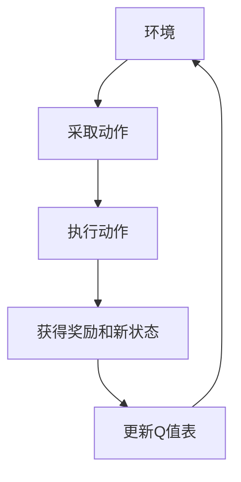
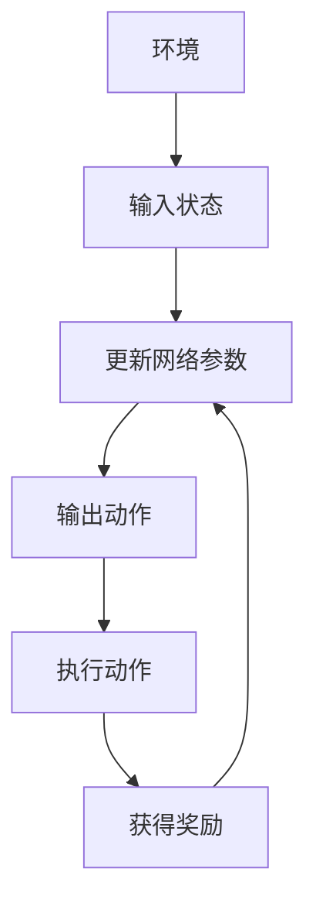
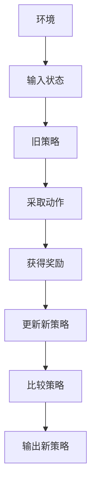
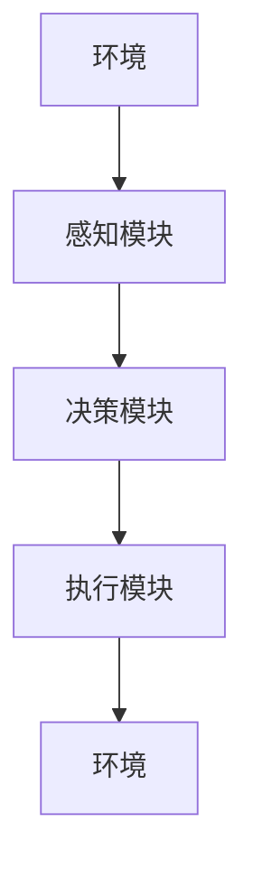

                 


# AI Agent的深度强化学习实现策略

> 关键词：AI Agent，深度强化学习，强化学习算法，系统架构设计，项目实战

> 摘要：本文将深入探讨AI Agent在深度强化学习中的实现策略，从基本概念到算法原理，再到系统架构设计和项目实战，全面解析AI Agent的深度强化学习实现方法。通过详细分析Q-learning、DQN、PPO等算法，结合实际案例，帮助读者理解并掌握AI Agent的深度强化学习技术。

---

## 第一章: AI Agent的定义与背景

### 1.1 AI Agent的基本概念

#### 1.1.1 什么是AI Agent

AI Agent（人工智能代理）是指在计算机系统中，能够感知环境并采取行动以实现目标的智能实体。AI Agent可以是软件程序、机器人或其他智能系统，其核心目标是通过与环境交互，优化自身行为以达到设定的目标。

#### 1.1.2 AI Agent的分类与特点

AI Agent可以根据功能和应用场景分为多种类型，以下是常见的分类和特点：

- **反应式AI Agent**：基于当前感知做出反应，没有内部状态，适用于实时交互任务。
- **认知式AI Agent**：具有复杂的内部状态和推理能力，能够处理复杂任务。
- **协作式AI Agent**：能够与其他AI Agent或人类协作完成任务。
- **学习型AI Agent**：通过学习优化自身行为，适应新环境。

AI Agent的特点包括：
- **自主性**：能够在没有外部干预的情况下自主决策。
- **反应性**：能够感知环境并实时调整行为。
- **目标导向**：所有行为都以实现目标为导向。
- **适应性**：能够通过学习适应新环境。

#### 1.1.3 AI Agent的应用场景

AI Agent广泛应用于多个领域，包括：
- **游戏AI**：如策略游戏中的智能对手。
- **机器人控制**：如工业机器人或服务机器人。
- **推荐系统**：如电商平台的个性化推荐。
- **自动驾驶**：如自动驾驶汽车的决策系统。
- **智能助手**：如Siri、Alexa等。

---

### 1.2 深度强化学习的背景与意义

#### 1.2.1 强化学习的基本概念

强化学习（Reinforcement Learning，RL）是一种机器学习范式，通过智能体与环境的交互，智能体通过试错方式学习策略，以最大化累积奖励。

- **状态（State）**：环境的当前情况。
- **动作（Action）**：智能体采取的行为。
- **奖励（Reward）**：智能体行为的反馈，用于指导学习。
- **策略（Policy）**：智能体选择动作的概率分布。
- **价值函数（Value Function）**：预测当前状态下的预期奖励。

#### 1.2.2 深度强化学习的引入

深度强化学习（Deep Reinforcement Learning，DRL）是将深度学习与强化学习结合的产物，利用深度神经网络近似策略或价值函数，解决了传统强化学习在高维状态空间中的计算难题。

#### 1.2.3 深度强化学习的优势

- **高维状态处理**：深度神经网络能够处理复杂的高维状态空间。
- **非线性关系捕捉**：深度强化学习能够捕捉复杂的非线性关系。
- **端到端学习**：可以直接从输入到输出进行端到端优化。

---

## 第二章: AI Agent与深度强化学习的核心概念

### 2.1 AI Agent的核心要素

#### 2.1.1 状态空间

状态空间是AI Agent所处环境的所有可能状态的集合。状态空间可以是连续的或离散的，例如在迷宫中，每个格子的位置就是一个状态。

#### 2.1.2 行动空间

行动空间是AI Agent在每个状态下可以采取的所有动作的集合。例如，在游戏中，可能的动作包括移动、攻击、使用物品等。

#### 2.1.3 奖励机制

奖励机制是AI Agent行为的反馈机制，通过奖励值指导智能体优化策略。奖励可以是正数、负数或零。

### 2.2 深度强化学习的基本原理

#### 2.2.1 策略网络

策略网络（Policy Network）直接输出动作的概率分布，策略网络的目标是最化累积奖励。

- **策略网络的数学模型**：策略网络输出每个动作的概率，$P(a|s)$ 表示在状态 $s$ 下采取动作 $a$ 的概率。

#### 2.2.2 价值函数

价值函数（Value Function）预测当前状态下采取某策略的预期累积奖励。

- **Q-learning算法**：通过更新Q值表，找到最优策略。

#### 2.2.3 探索与利用的平衡

探索（Exploration）：尝试新动作以发现更好的策略。

利用（Exploitation）：利用已知的好策略以获得更高奖励。

平衡探索与利用是强化学习的核心挑战。

---

## 第三章: 深度强化学习的算法原理

### 3.1 基础算法

#### 3.1.1 Q-learning算法

Q-learning是一种经典的强化学习算法，通过更新Q值表找到最优策略。

- **Q值更新公式**：
  $$ Q(s, a) = Q(s, a) + \alpha (r + \gamma \max Q(s', a') - Q(s, a)) $$
  其中，$\alpha$是学习率，$\gamma$是折扣因子。

- **Q-learning流程图**：



#### 3.1.2 Deep Q-Network (DQN)

DQN通过深度神经网络近似Q值函数，解决了高维状态空间的计算难题。

- **DQN流程图**：



### 3.2 高级算法

#### 3.2.1 Policy Gradient方法

Policy Gradient直接优化策略，通过梯度上升方法最大化累积奖励。

- **策略梯度更新公式**：
  $$ \theta = \theta + \alpha \nabla_\theta J(\theta) $$
  其中，$J(\theta)$是目标函数。

#### 3.2.2 Proximal Policy Optimization (PPO)

PPO是一种策略梯度方法，通过限制策略更新的幅度，确保策略的稳定性。

- **PPO算法流程图**：



---

## 第四章: 深度强化学习的数学模型

### 4.1 Q-learning的数学模型

Q-learning的数学模型包括状态转移概率和奖励函数。

- **状态转移概率**：
  $$ P(s' | s, a) $$
  表示在状态$s$下采取动作$a$，转移到状态$s'$的概率。

- **奖励函数**：
  $$ r(s, a, s') $$
  表示在状态$s$下采取动作$a$，转移到状态$s'$时获得的奖励。

### 4.2 深度神经网络在强化学习中的应用

- **神经网络结构**：常用的结构包括卷积神经网络（CNN）和长短时记忆网络（LSTM）。
- **损失函数**：通常使用均方误差（MSE）或交叉熵损失。
- **优化算法**：常用的优化算法包括随机梯度下降（SGD）和Adam优化器。

---

## 第五章: AI Agent的系统架构与设计

### 5.1 系统功能设计

AI Agent的系统功能设计包括以下几个方面：

- **感知模块**：负责感知环境状态。
- **决策模块**：负责根据感知信息做出决策。
- **执行模块**：负责执行决策的动作。

### 5.2 系统架构设计

- **分层架构**：将系统分为感知层、决策层和执行层。
- **分布式架构**：适用于多智能体协作的场景。

### 5.3 接口设计

- **输入接口**：接收环境状态。
- **输出接口**：输出决策动作。

### 5.4 交互流程

- **交互流程图**：



---

## 第六章: 项目实战

### 6.1 环境安装

- **安装Python和必要的库**：如NumPy、TensorFlow、Keras等。

### 6.2 核心代码实现

#### 6.2.1 Q-learning实现

```python
import numpy as np

class QLearning:
    def __init__(self, state_space, action_space, alpha=0.1, gamma=0.9):
        self.q_table = np.zeros((state_space, action_space))
        self.alpha = alpha
        self.gamma = gamma

    def take_action(self, state):
        return np.argmax(self.q_table[state])

    def update_q_table(self, state, action, reward, next_state):
        self.q_table[state, action] += self.alpha * (reward + self.gamma * np.max(self.q_table[next_state]) - self.q_table[state, action])
```

#### 6.2.2 DQN实现

```python
import tensorflow as tf
from tensorflow.keras import layers

class DQN:
    def __init__(self, state_space, action_space, learning_rate=0.001):
        self.model = self.build_model(state_space, action_space)
        self.optimizer = tf.keras.optimizers.Adam(learning_rate=learning_rate)
        self.memory = []

    def build_model(self, state_space, action_space):
        model = tf.keras.Sequential([
            layers.Dense(32, activation='relu', input_dim=state_space),
            layers.Dense(32, activation='relu'),
            layers.Dense(action_space, activation='linear')
        ])
        return model

    def take_action(self, state):
        state = tf.convert_to_tensor([state], dtype=tf.float32)
        prediction = self.model(state)
        action = tf.argmax(prediction, axis=1).numpy()[0]
        return action

    def update_model(self, state, action, reward, next_state):
        state = tf.convert_to_tensor([state], dtype=tf.float32)
        next_state = tf.convert_to_tensor([next_state], dtype=tf.float32)
        target = reward + self.gamma * tf.reduce_max(self.model(next_state), axis=1)
        target = tf.stop_gradient(target)
        loss = tf.keras.losses.mean_squared_error(target, self.model(state))
        self.optimizer.minimize(loss, self.model.trainable_variables)
```

### 6.3 代码解读与分析

- **Q-learning实现**：通过Q值表记录状态-动作对的奖励值，逐步更新Q值表。
- **DQN实现**：使用神经网络近似Q值函数，通过经验回放和目标网络优化。

### 6.4 实际案例分析

- **迷宫导航问题**：通过Q-learning或DQN算法，训练AI Agent在迷宫中找到出口。
- **游戏AI**：训练AI Agent在游戏环境中实现最优策略。

---

## 第七章: 高级主题与未来趋势

### 7.1 多智能体协作

多智能体协作是当前研究的热点，通过多个AI Agent的协作，实现更复杂的任务。

### 7.2 分布式强化学习

分布式强化学习通过多台设备协作，提升训练效率和模型性能。

### 7.3 模型压缩与轻量化

模型压缩和轻量化技术在资源受限的环境中尤为重要。

---

## 第八章: 总结与展望

### 8.1 总结

本文详细介绍了AI Agent的深度强化学习实现策略，从基本概念到算法原理，再到系统架构设计和项目实战，全面解析了AI Agent的深度强化学习技术。

### 8.2 展望

未来，随着深度强化学习技术的不断发展，AI Agent将在更多领域得到广泛应用，如自动驾驶、智能机器人、智能助手等。

---

## 参考文献

- [1] Sutton, R. S., & Barto, A. G. (2018). Introduction to reinforcement learning.
- [2] Mnih, V., et al. (2015). Human-level control through deep reinforcement learning.
- [3] Lillicrap, T. P., et al. (2016). Continuous control with deep reinforcement learning.

---

## 附录

### 附录A: 工具与资源

- **深度强化学习框架**：TensorFlow、Keras、PyTorch。
- **学习资源**：《深度学习》（Ian Goodfellow），《强化学习》（Sutton & Barto）。

### 附录B: 常见问题解答

- **Q: 什么是强化学习？**
  - A: 强化学习是一种通过试错方式学习策略的机器学习范式。

- **Q: 深度强化学习和传统强化学习有什么区别？**
  - A: 深度强化学习利用深度神经网络近似策略或价值函数，能够处理高维状态空间。

---

# 结语

通过本文的详细介绍，读者可以系统地掌握AI Agent的深度强化学习实现策略，从理论到实践，逐步理解并掌握相关技术。希望本文能够为读者提供有价值的参考和启发，帮助他们在实际项目中更好地应用深度强化学习技术。

